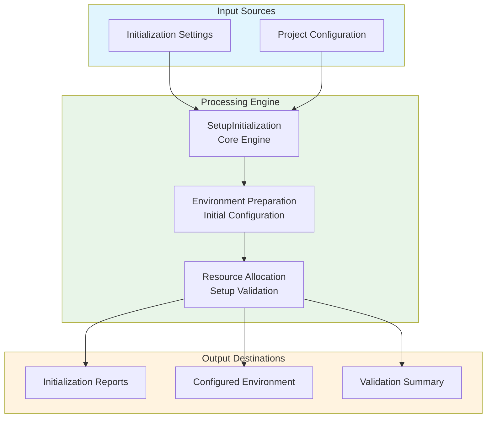
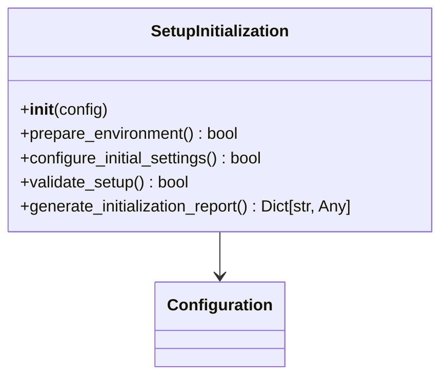
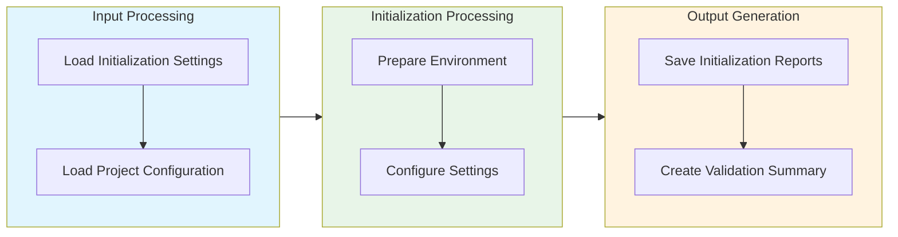

# Setup Initialization Module Documentation

## Level 1: Executive Overview

### Module Purpose and Functionality
The `setup_initialization` module provides a comprehensive system for initializing project setups within the AutoProjectManagement framework. It focuses on preparing project environments, configuring initial settings, and ensuring proper project initialization.

### Business Value
This module enables organizations to efficiently initialize project setups, ensuring consistent environments and proper configuration from the start. By providing robust initialization capabilities, it helps teams establish solid foundations for project development.

---

## Level 2: Technical Architecture

### System Integration Architecture


### Class Hierarchy and Relationships


### Data Flow Architecture


---

## Level 3: Detailed Implementation

### Core Class: SetupInitialization
The `SetupInitialization` class serves as the central coordinator for project setup initialization, providing comprehensive functionality for preparing environments and configuring initial settings.

### Initialization Algorithm
The initialization process follows a systematic approach:

1. **Environment Preparation**: Set up the project environment based on specifications
2. **Configuration Setup**: Apply initial configuration settings
3. **Resource Allocation**: Allocate necessary resources for the project
4. **Validation**: Verify that the setup meets requirements

### Data Structures and Schemas

#### Initialization Schema
```json
{
  "project_initialization": {
    "environment": "development",
    "settings": {
      "database": {
        "type": "mysql",
        "host": "localhost",
        "port": 3306
      },
      "cache": {
        "type": "redis",
        "host": "localhost",
        "port": 6379
      }
    }
  }
}
```

#### Initialization Report Schema
```json
{
  "initialization_summary": {
    "environment_prepared": true,
    "settings_configured": true,
    "resources_allocated": 3,
    "validation_passed": true,
    "initialization_time": "ISO8601 timestamp"
  }
}
```

---

## Usage Examples

### Enterprise Deployment Pattern
The module supports enterprise-grade deployment with configuration management, error handling, and comprehensive logging capabilities.

### Development Environment Setup
Development configurations focus on testing and validation with custom storage paths and enhanced debugging capabilities.

### Error Handling and Recovery
Comprehensive error handling includes validation errors, storage issues, and runtime exceptions with detailed logging and recovery mechanisms.

---

## Performance Characteristics

### Time Complexity Analysis
| Operation | Complexity | Description |
|-----------|------------|-------------|
| Environment Preparation | O(n) | Linear with environment complexity |
| Configuration Setup | O(m) | Linear with number of configuration settings |

### Space Complexity Analysis
| Component | Complexity | Description |
|-----------|------------|-------------|
