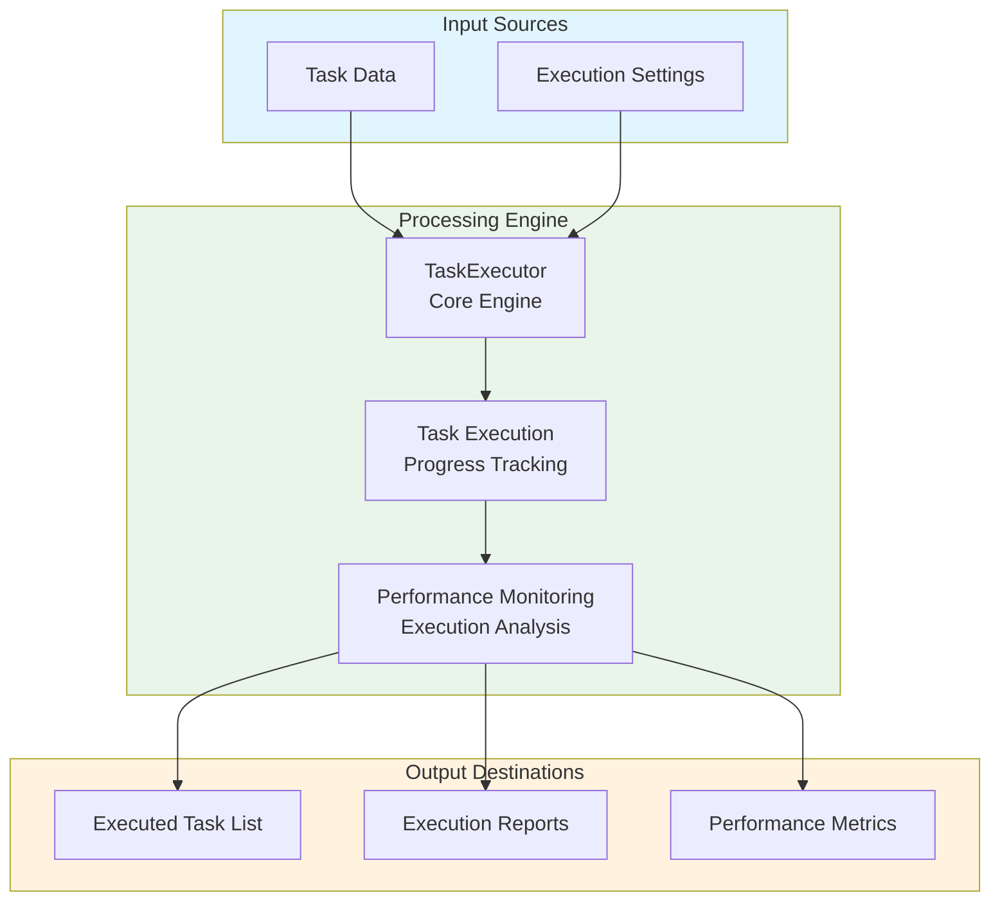
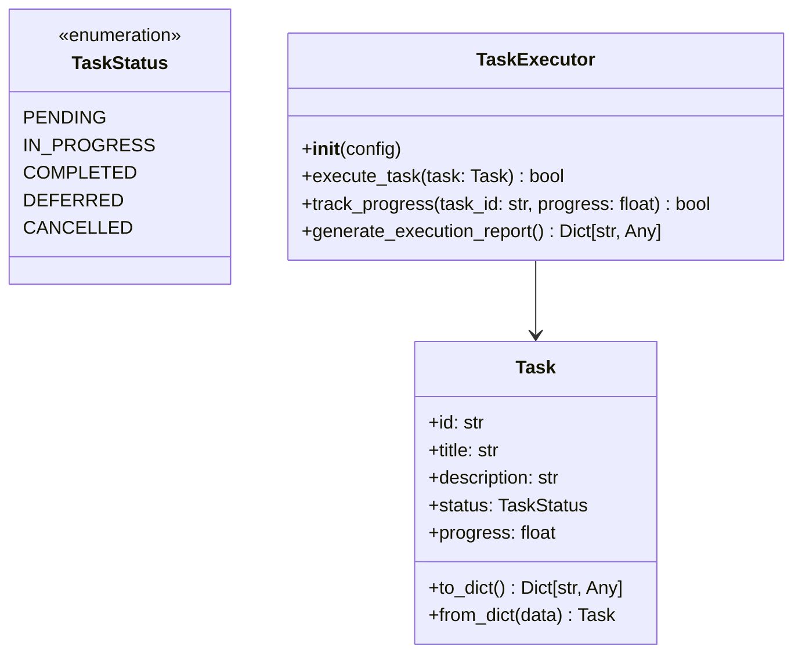
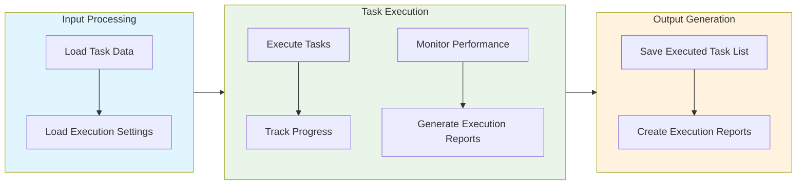

# Task Executor Module Documentation

## Level 1: Executive Overview

### Module Purpose and Functionality
The `task_executor` module provides a comprehensive system for executing tasks within the AutoProjectManagement framework. It focuses on task execution, progress tracking, and performance monitoring to ensure efficient task completion.

### Business Value
This module enables organizations to effectively execute tasks, track progress, and monitor performance. By providing robust execution capabilities, it helps teams complete tasks efficiently and achieve project goals.

---

## Level 2: Technical Architecture

### System Integration Architecture


### Class Hierarchy and Relationships


### Data Flow Architecture


---

## Level 3: Detailed Implementation

### Core Class: TaskExecutor
The `TaskExecutor` class serves as the central coordinator for task execution, providing comprehensive functionality for executing tasks, tracking progress, and monitoring performance.

### Execution Algorithm
The execution process follows a systematic approach:

1. **Task Validation**: Verify task parameters and constraints
2. **Execution Planning**: Plan execution sequence and resource allocation
3. **Progress Tracking**: Monitor and update task progress
4. **Performance Monitoring**: Track execution performance and metrics

### Data Structures and Schemas

#### Task Schema
```json
{
  "tasks": [
    {
      "id": "uuid-string",
      "title": "Task Title",
      "description": "Task Description",
      "status": "in_progress",
      "progress": 50.0
    }
  ]
}
```

#### Execution Report Schema
```json
{
  "execution_summary": {
    "total_tasks": 10,
    "completed_tasks": 5,
    "in_progress_tasks": 3,
    "pending_tasks": 2,
    "average_progress": 60.0
  }
}
```

---

## Usage Examples

### Enterprise Deployment Pattern
The module supports enterprise-grade deployment with configuration management, error handling, and comprehensive logging capabilities.

### Development Environment Setup
Development configurations focus on testing and validation with custom storage paths and enhanced debugging capabilities.

### Error Handling and Recovery
