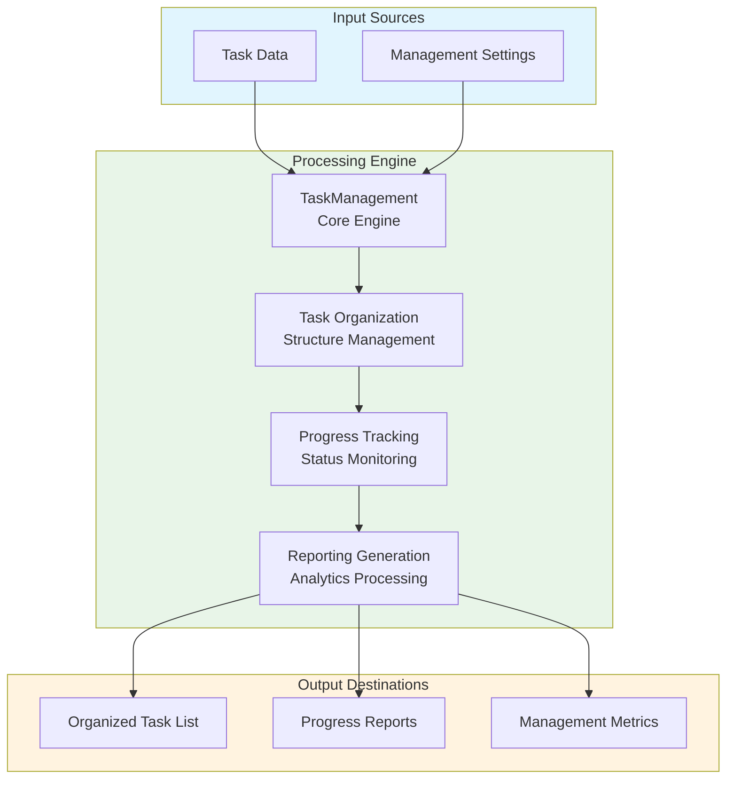
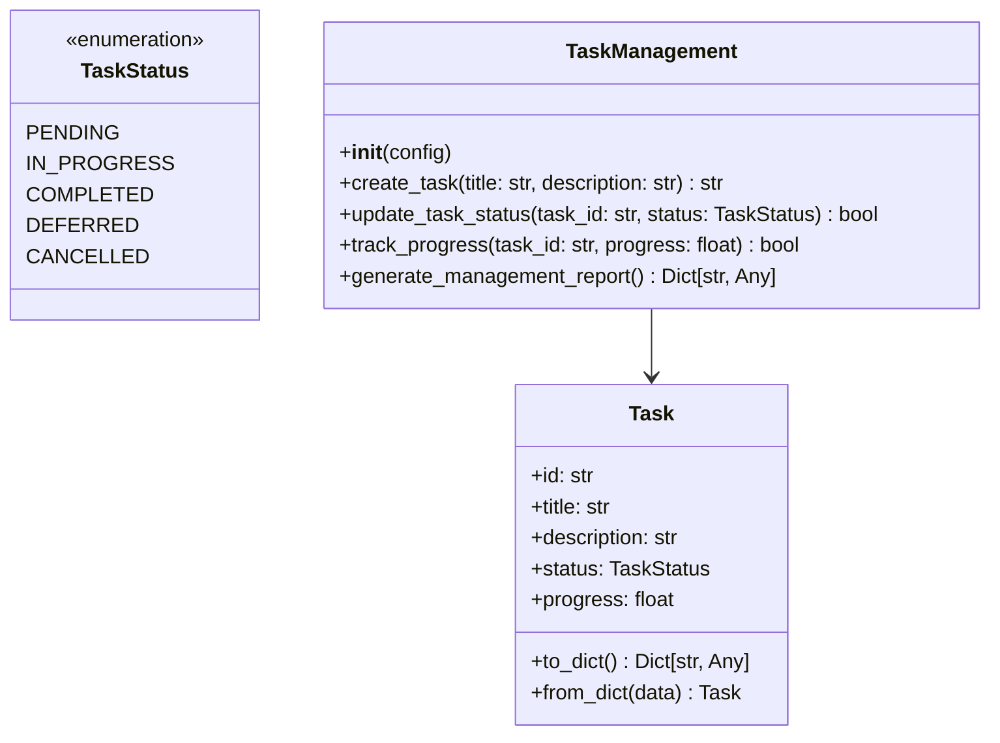
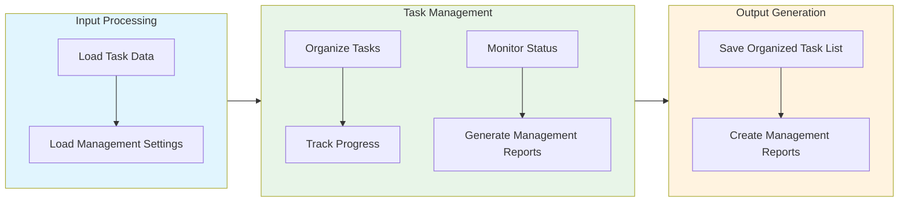

# Task Management Module Documentation

## Level 1: Executive Overview

### Module Purpose and Functionality
The `task_management` module provides a comprehensive system for managing tasks within the AutoProjectManagement framework. It focuses on task creation, organization, tracking, and reporting to ensure efficient task management throughout the project lifecycle.

### Business Value
This module enables organizations to effectively manage tasks, track progress, and generate reports. By providing robust task management capabilities, it helps teams stay organized, meet deadlines, and achieve project objectives.

---

## Level 2: Technical Architecture

### System Integration Architecture


### Class Hierarchy and Relationships


### Data Flow Architecture


---

## Level 3: Detailed Implementation

### Core Class: TaskManagement
The `TaskManagement` class serves as the central coordinator for task management, providing comprehensive functionality for creating, organizing, tracking, and reporting on tasks.

### Management Algorithm
The management process follows a systematic approach:

1. **Task Creation**: Create new tasks with specified parameters
2. **Organization**: Structure tasks based on priority and dependencies
3. **Progress Tracking**: Monitor and update task progress
4. **Reporting**: Generate comprehensive management reports

### Data Structures and Schemas

#### Task Schema
```json
{
  "tasks": [
    {
      "id": "uuid-string",
      "title": "Task Title",
      "description": "Task Description",
      "status": "in_progress",
      "progress": 75.0
    }
  ]
}
```

#### Management Report Schema
```json
{
  "management_summary": {
    "total_tasks": 15,
    "completed_tasks": 10,
    "in_progress_tasks": 3,
    "pending_tasks": 2,
    "overall_progress": 86.7
  }
}
```

---

## Usage Examples

### Enterprise Deployment Pattern
The module supports enterprise-grade deployment with configuration management, error handling, and comprehensive logging capabilities.

### Development Environment Setup
Development configurations focus on testing and validation with custom storage paths and enhanced debugging capabilities.

### Error Handling and Recovery
Comprehensive error handling includes validation errors, storage issues, and runtime exceptions with detailed logging and recovery mechanisms.

---

## Performance Characteristics

### Time Complexity Analysis
| Operation | Complexity | Description |
|-----------|------------|-------------|
| Task Creation | O(1) | Constant time for individual task creation |
| Task Organization | O(n log n) | Log-linear for sorting and organizing tasks |
| Progress Tracking | O(n) | Linear with number of tasks |
| Report Generation | O(n) | Linear with number of tasks |

### Space Complexity Analysis
| Component | Complexity | Description |
|-----------|------------|-------------|
| Task Storage | O(n) | Linear with number of tasks |
| Management Data | O(n) | Linear with number of management operations |

---

## Integration Points

### Input Interfaces
- **Task Data**: Task details for management
- **Management Settings**: Custom management parameters and configurations

### Output Interfaces
- **Organized Task List**: Structured list of tasks
- **Management Reports**: Summary of management data and performance metrics

### Extension Points
- **Custom Organization Algorithms**: Alternative methods for task organization
- **Enhanced Reporting**: Integration with reporting tools for detailed insights

---

## Error Handling and Recovery

### Error Classification System
| Error Category | Examples | Recovery Strategy |
|----------------|----------|-------------------|
| Configuration Errors | Invalid settings, missing parameters | Validation and default fallbacks |
| Data Integrity Errors | Corrupted storage, invalid task data | Data validation and repair mechanisms |
| Runtime Errors | Storage failures, processing errors | Retry logic and graceful degradation |
| Validation Errors | Invalid task parameters, constraint violations | Detailed error messages and user guidance |

### Recovery Mechanisms
- **Input Validation**: Comprehensive validation of all task parameters
- **Data Sanitization**: Cleaning and normalization of input data
- **Automatic Retry**: Exponential backoff for transient errors
- **Graceful Degradation**: Continue operation with reduced functionality
- **Detailed Logging**: Comprehensive error context and diagnostics
- **User Feedback**: Clear error messages and actionable recommendations

---

## Testing Guidelines

### Unit Test Coverage Requirements
| Test Category | Coverage Target | Testing Methodology |
|---------------|-----------------|---------------------|
| Task Creation | 100% | Valid and invalid task parameters |
| Progress Tracking | 100% | Various progress scenarios and edge cases |

### Integration Testing Strategy
- **End-to-End Workflow**: Complete task management process testing
- **Cross-Module Integration**: Testing with dependent modules and systems
- **Performance Testing**: Load testing with large task datasets
- **Regression Testing**: Ensuring backward compatibility and feature stability

### Test Data Requirements
- **Realistic Scenarios**: Production-like task data and configurations
- **Edge Cases**: Maximum tasks, extreme values, boundary conditions
- **Error Conditions**: Invalid data, storage failures, permission issues
- **Performance Data**: Large datasets for scalability and performance testing

---

*This documentation follows Pressman's software engineering standards and provides three levels of detail for comprehensive understanding of the Task Management module.*
