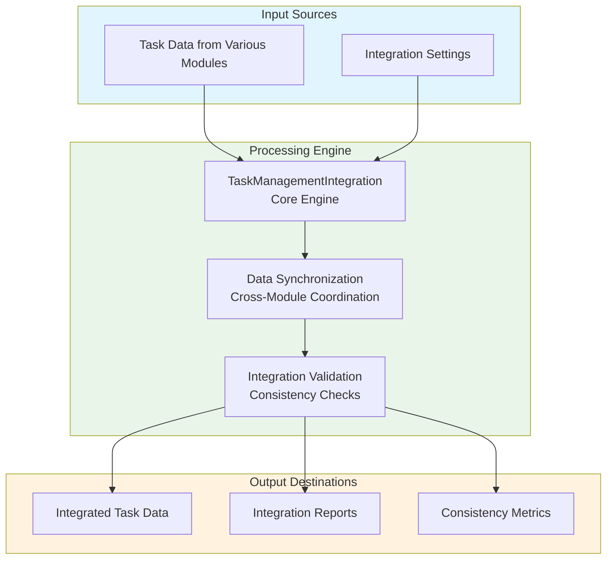
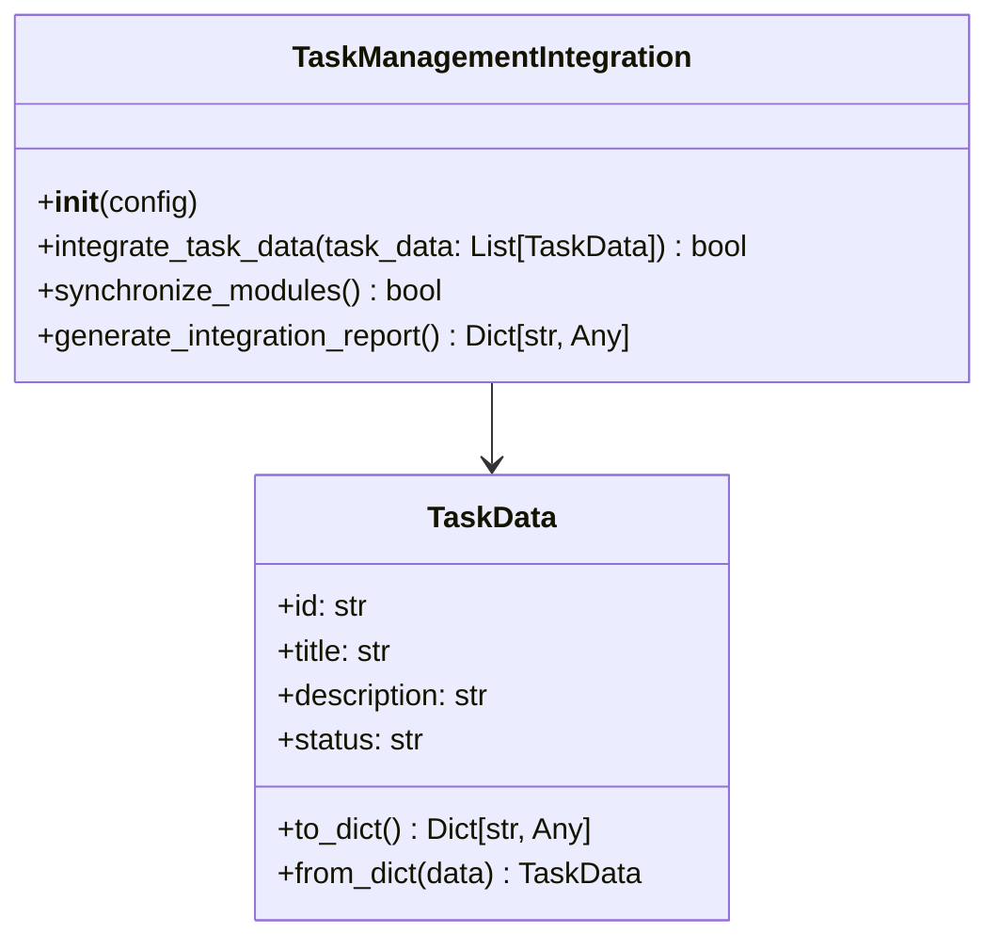
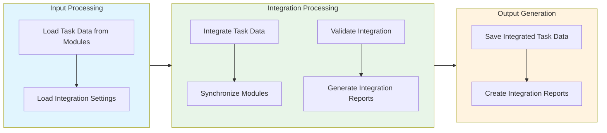

# Task Management Integration Module Documentation

## Level 1: Executive Overview

### Module Purpose and Functionality
The `task_management_integration` module provides a comprehensive system for integrating various task management components within the AutoProjectManagement framework. It focuses on seamless integration, data synchronization, and coordinated task management across different modules.

### Business Value
This module enables organizations to effectively integrate task management components, ensuring smooth data flow and coordinated operations. By providing robust integration capabilities, it helps teams maintain consistency and efficiency across different task management processes.

---

## Level 2: Technical Architecture

### System Integration Architecture


### Class Hierarchy and Relationships


### Data Flow Architecture


---

## Level 3: Detailed Implementation

### Core Class: TaskManagementIntegration
The `TaskManagementIntegration` class serves as the central coordinator for task management integration, providing comprehensive functionality for integrating task data, synchronizing modules, and ensuring consistency.

### Integration Algorithm
The integration process follows a systematic approach:

1. **Data Collection**: Gather task data from various modules
2. **Data Validation**: Verify data consistency and integrity
3. **Integration Processing**: Merge and synchronize task data
4. **Consistency Checks**: Ensure data consistency across modules

### Data Structures and Schemas

#### Integrated Task Schema
```json
{
  "integrated_tasks": [
    {
      "id": "uuid-string",
      "title": "Task Title",
      "description": "Task Description",
      "status": "integrated",
      "source_modules": ["module1", "module2"]
    }
  ]
}
```

#### Integration Report Schema
```json
{
  "integration_summary": {
    "total_tasks_integrated": 10,
    "successful_integrations": 8,
    "failed_integrations": 2,
    "integration_consistency": 80.0
  }
}
```

---

## Usage Examples

### Enterprise Deployment Pattern
The module supports enterprise-grade deployment with configuration management, error handling, and comprehensive logging capabilities.

### Development Environment Setup
Development configurations focus on testing and validation with custom storage paths and enhanced debugging capabilities.

### Error Handling and Recovery
Comprehensive error handling includes validation errors, storage issues, and runtime exceptions with detailed logging and recovery mechanisms.

---

## Performance Characteristics

### Time Complexity Analysis
| Operation | Complexity | Description |
|-----------|------------|-------------|
| Data Integration | O(n) | Linear with number of tasks |
| Module Synchronization | O(m) | Linear with number of modules |
| Integration Validation | O(n) | Linear with number of tasks |

### Space Complexity Analysis
| Component | Complexity | Description |
|-----------|------------|-------------|
| Task Storage | O(n) | Linear with number of tasks |
