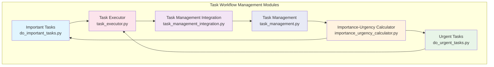
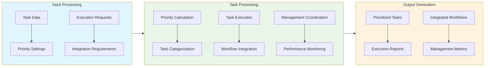

# Task Workflow Management Folder Documentation

## Module Relationships and Integration

### Overview
The Task Workflow Management folder contains modules that work together to provide comprehensive task management capabilities within the AutoProjectManagement framework. These modules handle task prioritization, execution, integration, and overall workflow management.

### Module Relationships

### Integration Flow

### Data Exchange Patterns
| Module | Input Data | Output Data | Dependencies |
|--------|------------|-------------|-------------|
| Important Tasks | Task configurations, Priority settings | Important task lists, Strategic insights | Importance-Urgency Calculator |
| Urgent Tasks | Task data, Urgency settings | Urgent task lists, Execution priorities | Importance-Urgency Calculator |
| Importance-Urgency Calculator | Task features, Weight settings | Priority scores, Evaluation reports | Task Management |
| Task Executor | Execution requests, Task data | Execution reports, Performance metrics | Important Tasks, Urgent Tasks |
| Task Management Integration | Integration requirements, Task data | Integrated workflows, Consistency reports | Task Executor |
| Task Management | Management settings, Task data | Managed task lists, Overall metrics | All other modules |

### Integration Points
- **Priority Coordination**: Unified priority calculation across all task types
- **Execution Management**: Coordinated task execution and tracking
- **Workflow Integration**: Seamless integration of different task workflows
- **Data Consistency**: Ensures consistent task data across all modules

### Performance Considerations
- **Scalability**: Handles large task datasets efficiently
- **Response Time**: Optimized for real-time task processing
- **Integration Efficiency**: Efficient data exchange between workflow components

### Extension Points
- **Custom Task Types**: Support for additional task categories
- **Advanced Prioritization**: Enhanced priority calculation algorithms
- **Workflow Automation**: Automated workflow generation and optimization
- **Integration Hooks**: API endpoints for external system integration

---

*This documentation provides an overview of the relationships and integration between modules within the Task Workflow Management folder.*
