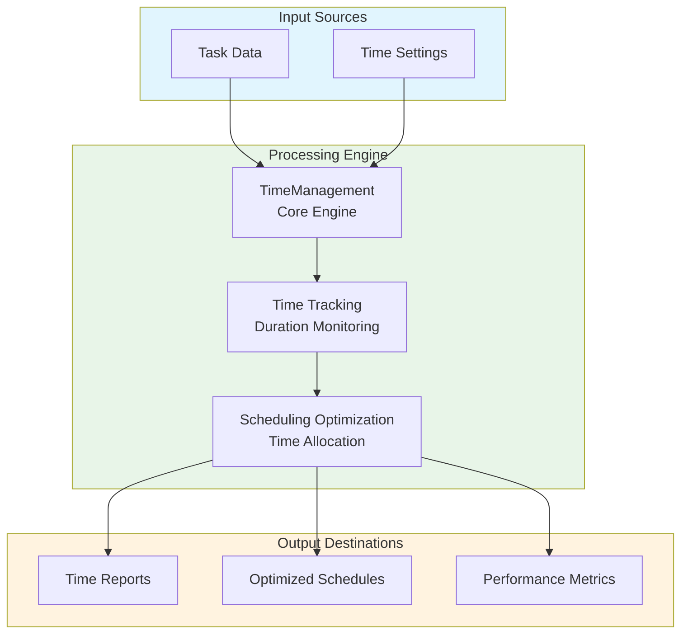
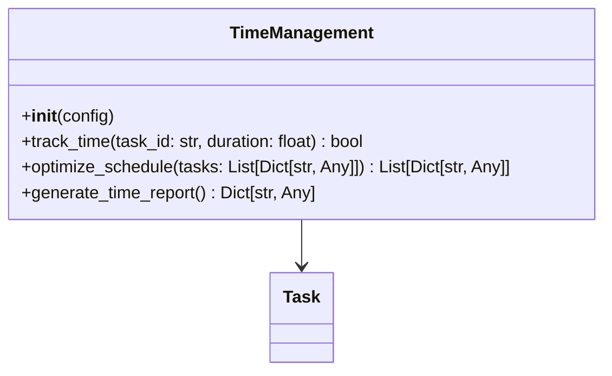
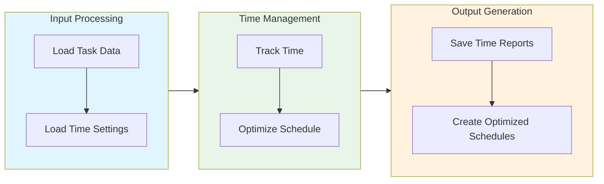

# Time Management Module Documentation

## Level 1: Executive Overview

### Module Purpose and Functionality
The `time_management` module provides a comprehensive system for managing time-related aspects within the AutoProjectManagement framework. It focuses on tracking time, scheduling tasks, and optimizing time utilization for efficient project execution.

### Business Value
This module enables organizations to effectively manage time resources, track task durations, and optimize scheduling. By providing robust time management capabilities, it helps teams meet deadlines and improve overall project efficiency.

---

## Level 2: Technical Architecture

### System Integration Architecture


### Class Hierarchy and Relationships


### Data Flow Architecture


---

## Level 3: Detailed Implementation

### Core Class: TimeManagement
The `TimeManagement` class serves as the central coordinator for time management, providing comprehensive functionality for tracking time, optimizing schedules, and generating reports.

### Time Management Algorithm
The time management process follows a systematic approach:

1. **Time Tracking**: Monitor and record time spent on tasks
2. **Schedule Optimization**: Create optimal task sequences based on time constraints
3. **Reporting**: Generate comprehensive time management reports

### Data Structures and Schemas

#### Time Tracking Schema
```json
{
  "time_tracking": [
    {
      "task_id": "uuid-string",
      "duration": 4.5,
      "timestamp": "ISO8601 timestamp"
    }
  ]
}
```

#### Time Report Schema
```json
{
  "time_summary": {
    "total_tasks_tracked": 10,
    "total_time_spent": 45.5,
    "average_time_per_task": 4.55,
    "time_efficiency": 85.0
  }
}
```

---

## Usage Examples

### Enterprise Deployment Pattern
The module supports enterprise-grade deployment with configuration management, error handling, and comprehensive logging capabilities.

### Development Environment Setup
Development configurations focus on testing and validation with custom storage paths and enhanced debugging capabilities.

### Error Handling and Recovery
Comprehensive error handling includes validation errors, storage issues, and runtime exceptions with detailed logging and recovery mechanisms.

---

## Performance Characteristics

### Time Complexity Analysis
| Operation | Complexity | Description |
|-----------|------------|-------------|
| Time Tracking | O(1) | Constant time for individual time entries |
| Schedule Optimization | O(n log n) | Log-linear for sorting and optimizing schedules |
| Report Generation | O(n) | Linear with number of time entries |

### Space Complexity Analysis
| Component | Complexity | Description |
|-----------|------------|-------------|
| Time Storage | O(n) | Linear with number of time entries |
| Schedule Data | O(m) | Linear with scheduling information |

---

## Integration Points

### Input Interfaces
- **Task Data**: Information about tasks for time tracking
- **Time Settings**: Custom parameters for time management

### Output Interfaces
- **Time Reports**: Summary of time tracking data and performance metrics
- **Optimized Schedules**: Task sequences optimized for time efficiency

### Extension Points
- **Custom Time Algorithms**: Alternative methods for time management
- **Enhanced Reporting**: Integration with reporting tools for detailed insights

---

## Error Handling and Recovery

### Error Classification System
| Error Category | Examples | Recovery Strategy |
|----------------|----------|-------------------|
| Configuration Errors | Invalid settings, missing parameters | Validation and default fallbacks |
| Data Integrity Errors | Corrupted storage, invalid time data | Data validation and repair mechanisms |
| Runtime Errors | Storage failures, processing errors | Retry logic and graceful degradation |
| Validation Errors | Invalid time parameters, constraint violations | Detailed error messages and user guidance |

### Recovery Mechanisms
- **Input Validation**: Comprehensive validation of all time parameters
- **Data Sanitization**: Cleaning and normalization of input data
- **Automatic Retry**: Exponential backoff for transient errors
- **Graceful Degradation**: Continue operation with reduced functionality
- **Detailed Logging**: Comprehensive error context and diagnostics
- **User Feedback**: Clear error messages and actionable recommendations

---

## Testing Guidelines

### Unit Test Coverage Requirements
| Test Category | Coverage Target | Testing Methodology |
|---------------|-----------------|---------------------|
| Time Tracking | 100% | Valid and invalid time parameters |
| Schedule Optimization | 100% | Various scheduling scenarios and edge cases |

### Integration Testing Strategy
- **End-to-End Workflow**: Complete time management process testing
- **Cross-Module Integration**: Testing with dependent modules and systems
- **Performance Testing**: Load testing with large time datasets
- **Regression Testing**: Ensuring backward compatibility and feature stability

### Test Data Requirements
- **Realistic Scenarios**: Production-like time data and configurations
- **Edge Cases**: Maximum time entries, extreme values, boundary conditions
- **Error Conditions**: Invalid data, storage failures, permission issues
- **Performance Data**: Large datasets for scalability and performance testing

---

*This documentation follows Pressman's software engineering standards and provides three levels of detail for comprehensive understanding of the Time Management module.*
