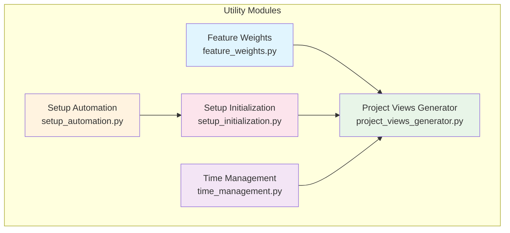
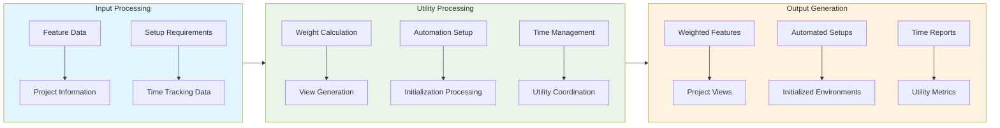

# Utility Modules Folder Documentation

## Module Relationships and Integration

### Overview
The Utility Modules folder contains modules that provide essential utility functions and support services within the AutoProjectManagement framework. These modules handle feature weighting, project visualization, setup automation, initialization, and time management.

### Module Relationships

### Integration Flow

### Data Exchange Patterns
| Module | Input Data | Output Data | Dependencies |
|--------|------------|-------------|-------------|
| Feature Weights | Feature data, Weight settings | Weighted features, Priority scores | Project Views Generator |
| Project Views Generator | Project data, View configurations | Generated views, Visualization reports | Feature Weights, Setup Initialization, Time Management |
| Setup Automation | Automation requirements, Configuration data | Automated setups, Process reports | Setup Initialization |
| Setup Initialization | Initialization settings, Environment data | Initialized environments, Setup reports | Setup Automation, Project Views Generator |
| Time Management | Time data, Tracking settings | Time reports, Scheduling metrics | Project Views Generator |

### Integration Points
- **Weight Application**: Feature weights used in project visualization
- **Setup Coordination**: Automated setup and initialization work together
- **Time Integration**: Time management data integrated into project views
- **Utility Services**: Common utility functions shared across modules

### Performance Considerations
- **Efficiency**: Optimized utility functions for minimal resource usage
- **Scalability**: Handles utility operations across large datasets
- **Integration**: Smooth data exchange between utility services

### Extension Points
- **Custom Utilities**: Additional utility functions and services
- **Enhanced Visualization**: Advanced project view generation
- **Automation Extensions**: Expanded setup automation capabilities
- **Time Management Enhancements**: Advanced time tracking and reporting

---

*This documentation provides an overview of the relationships and integration between modules within the Utility Modules folder.*
