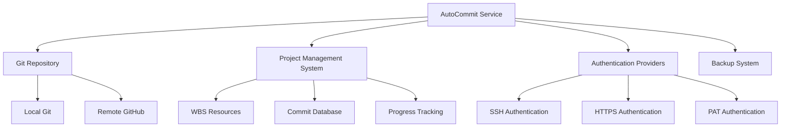
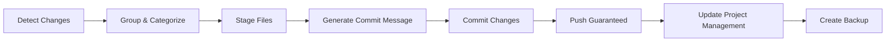
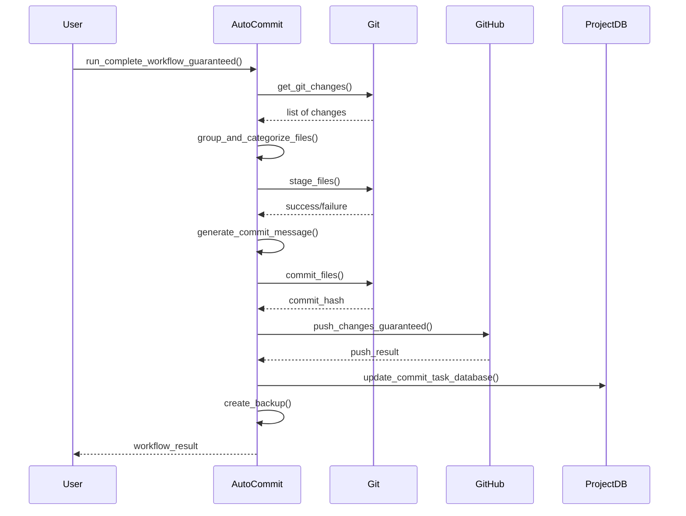
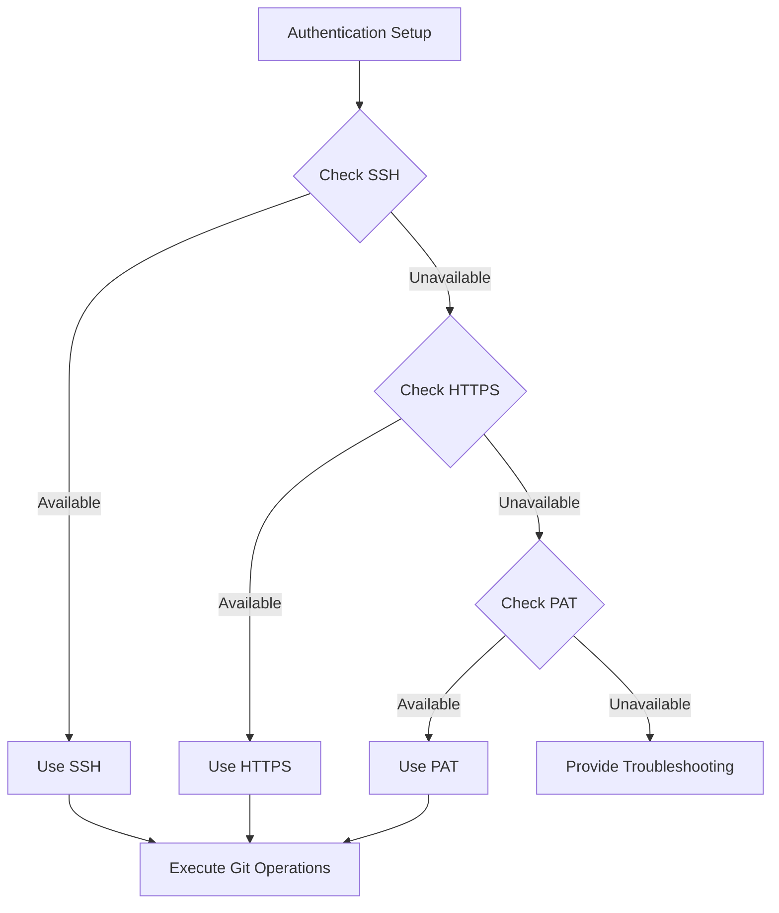
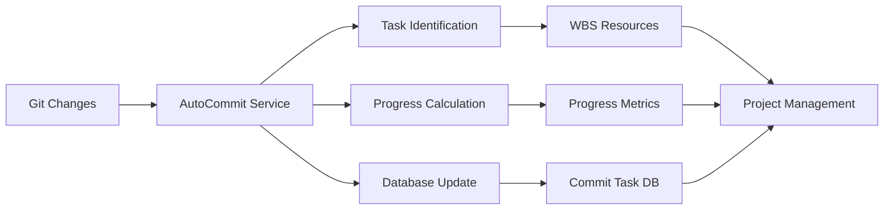
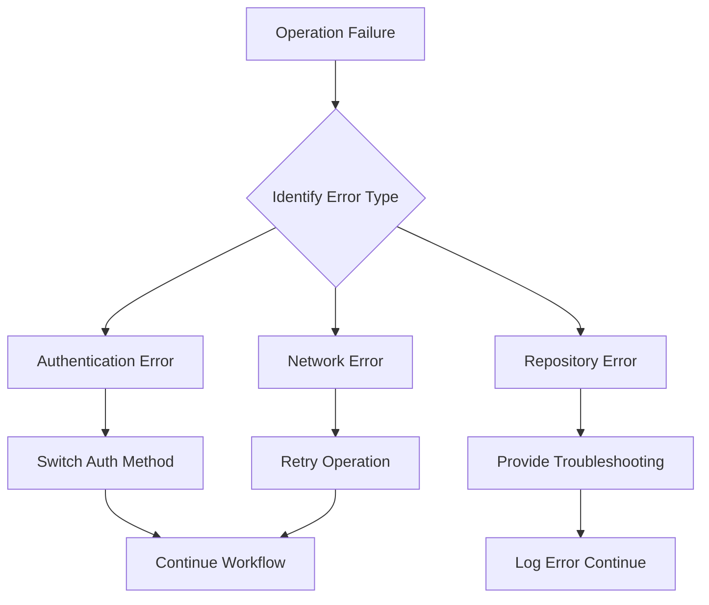

# AutoCommit Service Documentation

*Last updated: 2025-08-14*
*Version: 5.0.0*

## Overview

The `UnifiedAutoCommit` service provides automated Git commit functionality with enhanced authentication, guaranteed push execution, and comprehensive project management integration. This unified service combines the best features from previous implementations to ensure reliable version control operations.

## Table of Contents

1. [Architecture Overview](#architecture-overview)
2. [Core Functionality](#core-functionality)
3. [Authentication System](#authentication-system)
4. [Project Management Integration](#project-management-integration)
5. [Error Handling & Recovery](#error-handling--recovery)
6. [Performance Characteristics](#performance-characteristics)
7. [Usage Examples](#usage-examples)
8. [API Reference](#api-reference)
9. [Troubleshooting Guide](#troubleshooting-guide)

## Architecture Overview

### System Context Diagram



### Component Architecture

```mermaid
classDiagram
    class UnifiedAutoCommit {
        -logger: Logger
        -has_ssh: bool
        -has_https: bool
        -has_pat: bool
        +__init__()
        +run_git_command(args, cwd, use_https)
        +get_git_changes()
        +stage_files(files)
        +commit_files(message)
        +push_changes_guaranteed(remote, branch)
        +commit_and_push_all_guaranteed(remote, branch)
        +run_complete_workflow_guaranteed(remote, branch)
        +load_linked_wbs_resources(filepath)
        +update_commit_task_database(commit_hash, task_id, file_path, commit_message, workflow_stage, progress_change, importance_change, priority_change, db_path)
        +write_commit_progress_to_json(file_path)
    }
    
    class GitConfigManager {
        +configure_git_automatically()
    }
    
    UnifiedAutoCommit --> GitConfigManager : uses
    UnifiedAutoCommit --> "Git Commands" : executes
    UnifiedAutoCommit --> "JSON Database" : interacts with
```

## Core Functionality

### Workflow Process



### Detailed Process Flow



## Authentication System

### Authentication Flow



### Authentication Methods

| Method | Priority | Reliability | Setup Complexity |
|--------|----------|-------------|------------------|
| SSH | 1 | High | Medium |
| HTTPS | 2 | High | Low |
| PAT | 3 | High | High |

## Project Management Integration

### Data Flow Diagram



### Progress Calculation Algorithm

```
Progress = Σ(Stage_Weight × Commit_Count) / Total_Commits

Where:
- Stage_Weight: Predefined weight for each workflow stage
- Commit_Count: Number of commits in the stage
- Total_Commits: Total commits across all stages
```

#### Mathematical Formula

$$ \text{Progress} = \sum_{i=1}^{n} \left( w_i \times \frac{c_i}{C} \right) $$

Where:
- $w_i$ = weight of stage $i$
- $c_i$ = commit count in stage $i$  
- $C$ = total commit count
- $n$ = number of stages

### Importance Calculation

$$ \text{Importance} = \text{Base} + \text{Dependency Factor} + \text{Progress Factor} + \text{Delay Factor} $$

Where:
- $\text{Base} = \text{Stage Weight}$
- $\text{Dependency Factor} = \min(\text{Dependency Count} \times 0.05, 0.3)$
- $\text{Progress Factor} = \max(0, 1 - \text{Progress})$
- $\text{Delay Factor} = \min(\text{Delays} \times 0.1, 0.3)$

### Urgency Calculation

$$ \text{Urgency} = \text{Time Factor} + \text{Delay Factor} + \text{Progress Factor} $$

Where:
- $\text{Time Factor} = \max\left(0, \min\left(1, \frac{30 - \text{Remaining Days}}{30}\right)\right)$
- $\text{Delay Factor} = \min(\text{Delays} \times 0.1, 0.5)$
- $\text{Progress Factor} = \max(0, 1 - \text{Progress})$

## Error Handling & Recovery

### Error Recovery Strategy



### Push Guarantee Mechanism

The guaranteed push system implements a multi-strategy approach:

1. **Force Push with Lease** - Safest force push method
2. **Regular Push** - Standard push operation  
3. **Push with Upstream** - Establish tracking if needed
4. **Force Push** - Last resort, local changes take priority
5. **HTTPS Fallback** - Alternative authentication method

## Performance Characteristics

### Time Complexity

| Operation | Best Case | Worst Case | Average Case |
|-----------|-----------|------------|--------------|
| Change Detection | O(1) | O(n) | O(n) |
| File Grouping | O(n) | O(n log n) | O(n) |
| Authentication Check | O(1) | O(1) | O(1) |
| Push Operation | O(1) | O(n) | O(1) |

### Space Complexity

- **Memory**: O(n) where n is number of changed files
- **Storage**: O(1) for operations, O(n) for backups

## Usage Examples

### Basic Usage

```python
from autoprojectmanagement.services.automation_services.auto_commit import UnifiedAutoCommit

# Initialize the service
auto_commit = UnifiedAutoCommit()

# Run complete workflow
success = auto_commit.run_complete_workflow_guaranteed()

if success:
    print("Workflow completed successfully")
else:
    print("Workflow completed with warnings")
```

### Custom Configuration

```python
auto_commit = UnifiedAutoCommit()

# Custom remote and branch
success = auto_commit.commit_and_push_all_guaranteed(
    remote="origin", 
    branch="development"
)

# Manual change detection and processing
changes = auto_commit.get_git_changes()
grouped = auto_commit.group_and_categorize_files(changes)
```

## API Reference

### Class: UnifiedAutoCommit

#### Constructor
```python
__init__() -> None
```
Initializes the auto commit service with automatic Git configuration and authentication setup.

#### Methods

##### run_git_command
```python
run_git_command(args: List[str], cwd: str = None, use_https: bool = False) -> Tuple[bool, str]
```
Executes Git commands with memory optimization and authentication handling.

**Parameters:**
- `args`: List of Git command arguments
- `cwd`: Working directory (optional)
- `use_https`: Force HTTPS authentication (optional)

**Returns:** Tuple of (success, output)

##### get_git_changes
```python
get_git_changes() -> List[str]
```
Retrieves list of changed files from Git status.

**Returns:** List of changed file paths

##### stage_files  
```python
stage_files(files: List[str]) -> bool
```
Stages specified files for commit.

**Parameters:**
- `files`: List of file paths to stage

**Returns:** Success status

##### commit_files
```python
commit_files(message: str) -> bool
```
Commits staged files with provided message.

**Parameters:**
- `message`: Commit message

**Returns:** Success status

##### push_changes_guaranteed
```python
push_changes_guaranteed(remote: str = "origin", branch: str = "main") -> bool
```
Executes guaranteed push with multiple fallback strategies.

**Parameters:**
- `remote`: Remote repository name
- `branch`: Branch name

**Returns:** Success status

##### commit_and_push_all_guaranteed
```python
commit_and_push_all_guaranteed(remote: str = "origin", branch: str = "main") -> bool
```
Complete commit and push workflow with guaranteed execution.

**Parameters:**
- `remote`: Remote repository name  
- `branch`: Branch name

**Returns:** Success status

##### run_complete_workflow_guaranteed
```python
run_complete_workflow_guaranteed(remote: str = "origin", branch: str = "main") -> bool
```
Runs complete backup, commit, and push workflow.

**Parameters:**
- `remote`: Remote repository name
- `branch`: Branch name

**Returns:** Success status

##### load_linked_wbs_resources
```python
load_linked_wbs_resources(filepath: str = "JSonDataBase/Inputs/UserInputs/linked_wbs_resources.json") -> List[Dict]
```
Loads linked WBS resources from JSON file.

**Parameters:**
- `filepath`: Path to WBS resources file

**Returns:** List of WBS resources

##### update_commit_task_database
```python
update_commit_task_database(commit_hash: str, task_id: str, file_path: str, commit_message: str, 
                          workflow_stage: Optional[str] = None, progress_change: float = 0.0, 
                          importance_change: float = 0, priority_change: float = 0,
                          db_path: str = "JSonDataBase/OutPuts/commit_task_database.json") -> None
```
Updates commit task database with commit information.

**Parameters:**
- `commit_hash`: Git commit hash
- `task_id`: Associated task ID
- `file_path`: File path from commit
- `commit_message`: Commit message
- `workflow_stage`: Workflow stage (optional)
- `progress_change`: Progress change (optional)
- `importance_change`: Importance change (optional) 
- `priority_change`: Priority change (optional)
- `db_path`: Database file path

##### write_commit_progress_to_json
```python
write_commit_progress_to_json(file_path: str = "JSonDataBase/OutPuts/commit_progress.json") -> None
```
Writes commit progress data to JSON file.

**Parameters:**
- `file_path`: Output file path

## Troubleshooting Guide

### Common Issues

#### Authentication Failures
**Symptoms:** Permission denied, authentication failed errors
**Solutions:**
1. Run `./fix_git_auth.sh` to configure authentication
2. Check SSH key setup: `cat ~/.ssh/id_ed25519.pub`
3. Verify GitHub PAT configuration

#### Push Failures  
**Symptoms:** Push rejected, non-fast-forward errors
**Solutions:**
1. Service automatically tries multiple push strategies
2. Local changes are preserved regardless of push success
3. Check network connectivity

#### File Staging Issues
**Symptoms:** Files not staged, "does not exist" errors
**Solutions:**
1. Verify file paths exist
2. Check Git ignore rules
3. Ensure proper file permissions

### Debug Mode

Enable debug logging by setting environment variable:
```bash
export LOG_LEVEL=DEBUG
```

### Performance Optimization

For large repositories:
```bash
export GIT_MMAP_LIMIT=2g
export GIT_ALLOC_LIMIT=2g
```

## Compliance & Standards

### Pressman's Software Engineering Standards
- **Modularity**: Service follows single responsibility principle
- **Maintainability**: Comprehensive documentation and error handling
- **Reliability**: Multiple fallback strategies and guaranteed execution
- **Testability**: Well-defined interfaces and mockable components

### Security Considerations
- No sensitive data stored in plain text
- Authentication handled through standard Git mechanisms
- Error messages sanitized to prevent information leakage

## Version History

- **v5.0.0**: Unified implementation with guaranteed push and project management integration
- **v4.0.0**: Enhanced authentication and error recovery
- **v3.0.0**: Project management integration features
- **v2.0.0**: Basic auto-commit functionality
- **v1.0.0**: Initial implementation

## Related Documentation

- [Git Configuration Manager](./git_config_manager_docs.md)
- [Project Management System](../main_modules_doc/project_management_system_docs.md)
- [API Documentation](../../SystemDesign/API_Modules/)
- [Authentication Guide](../../SystemDesign/Guides/authentication_guide.md)

---
*Documentation maintained by AutoProjectManagement Team*
*Last reviewed: 2025-08-14*
