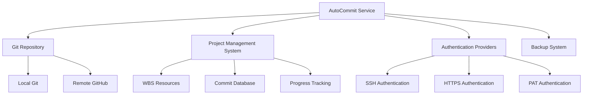
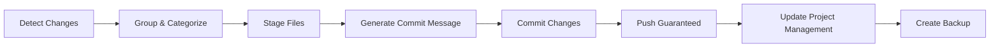

# AutoCommit Service Documentation

*Last updated: 2025-08-14*
*Version: 5.0.0*

## Overview

The `UnifiedAutoCommit` service provides automated Git commit functionality with enhanced authentication, guaranteed push execution, and comprehensive project management integration. This unified service combines the best features from previous implementations to ensure reliable version control operations.

## Table of Contents

- [AutoCommit Service Documentation](#autocommit-service-documentation)
  - [Overview](#overview)
  - [Table of Contents](#table-of-contents)
  - [Architecture Overview](#architecture-overview)
    - [System Context Diagram](#system-context-diagram)
    - [Component Architecture](#component-architecture)
  - [Core Functionality](#core-functionality)
    - [Workflow Process](#workflow-process)
    - [Detailed Process Flow](#detailed-process-flow)

## Architecture Overview

### System Context Diagram



### Component Architecture

```mermaid
classDiagram
    class UnifiedAutoCommit {
        -logger: Logger
        -has_ssh: bool
        -has_https: bool
        -has_pat: bool
        +__init__()
        +run_git_command(args, cwd, use_https)
        +get_git_changes()
        +stage_files(files)
        +commit_files(message)
        +push_changes_guaranteed(remote, branch)
        +commit_and_push_all_guaranteed(remote, branch)
        +run_complete_workflow_guaranteed(remote, branch)
        +load_linked_wbs_resources(filepath)
        +update_commit_task_database(commit_hash, task_id, file_path, commit_message, workflow_stage, progress_change, importance_change, priority_change, db_path)
        +write_commit_progress_to_json(file_path)
    }
    
    class GitConfigManager {
        +configure_git_automatically()
    }
    
    UnifiedAutoCommit --> GitConfigManager : uses
    UnifiedAutoCommit --> "Git Commands" : executes
    UnifiedAutoCommit --> "JSON Database" : interacts with
```

## Core Functionality

### Workflow Process



### Detailed Process Flow

```mermaid
sequenceDiagram
    participant User
    participant AutoCommit
    participant Git
    participant GitHub
    participant ProjectDB
    
    User->>AutoCommit: run_complete_workflow_guaranteed()
    AutoCommit->>Git: get_git_changes()
    Git-->>AutoCommit: list of changes
    AutoCommit->>AutoCommit: group_and_categorize_files()
    AutoCommit->>Git: stage_files()
    Git-->>AutoCommit: success/failure
    AutoCommit->>AutoCommit: generate_commit_message()
    AutoCommit->>Git: commit_files()
    Git-->>AutoCommit: commit_hash
