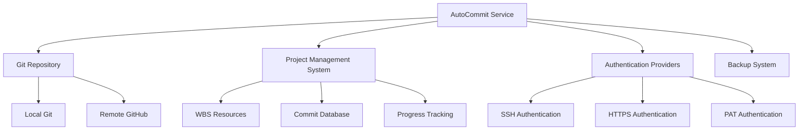

# AutoCommit Service Documentation

*Last updated: 2025-08-14*
*Version: 5.0.0*

## Overview

The `UnifiedAutoCommit` service provides automated Git commit functionality with enhanced authentication, guaranteed push execution, and comprehensive project management integration. This unified service combines the best features from previous implementations to ensure reliable version control operations.

## Table of Contents

1. [Architecture Overview](#architecture-overview)
2. [Core Functionality](#core-functionality)
3. [Authentication System](#authentication-system)
4. [Project Management Integration](#project-management-integration)
5. [Error Handling & Recovery](#error-handling--recovery)
6. [Performance Characteristics](#performance-characteristics)
7. [Usage Examples](#usage-examples)
8. [API Reference](#api-reference)
9. [Troubleshooting Guide](#troubleshooting-guide)

## Architecture Overview

### System Context Diagram



### Component Architecture

```mermaid
classDiagram
    class UnifiedAutoCommit {
        -logger: Logger
        -has_ssh: bool
        -has_https: bool
        -has_pat: bool
        +__init__()
        +run_git_command(args, cwd, use_https)
        +get_git_changes()
        +stage_files(files)
        +commit_files(message)
        +push_changes_guaranteed(remote, branch)
        +commit_and_push_all_guaranteed(remote, branch)
        +run_complete_workflow_guaranteed(remote, branch)
        +load_linked_wbs_resources(filepath)
