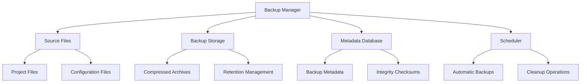
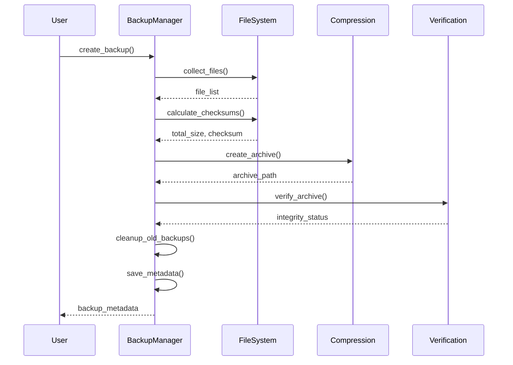
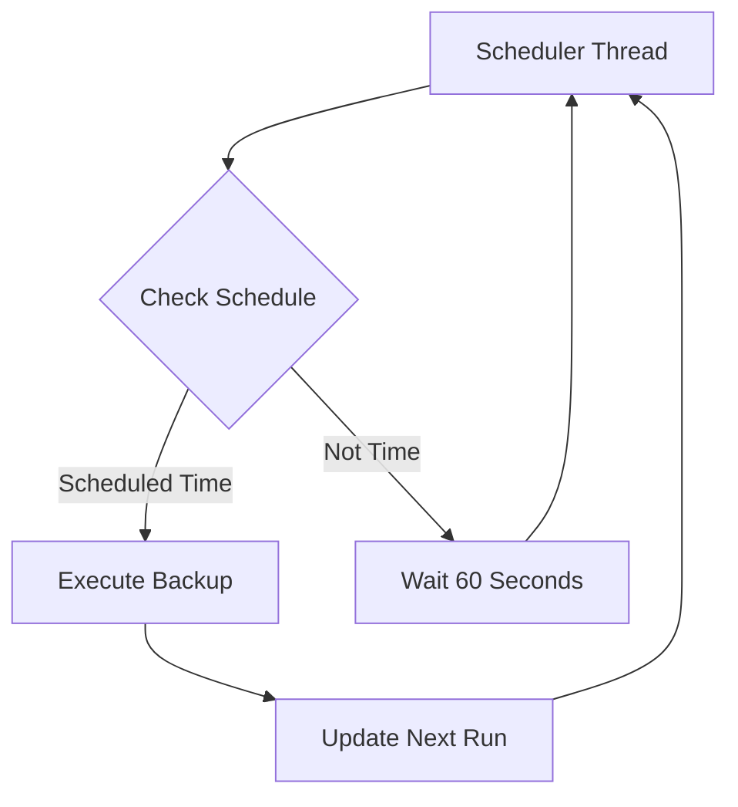
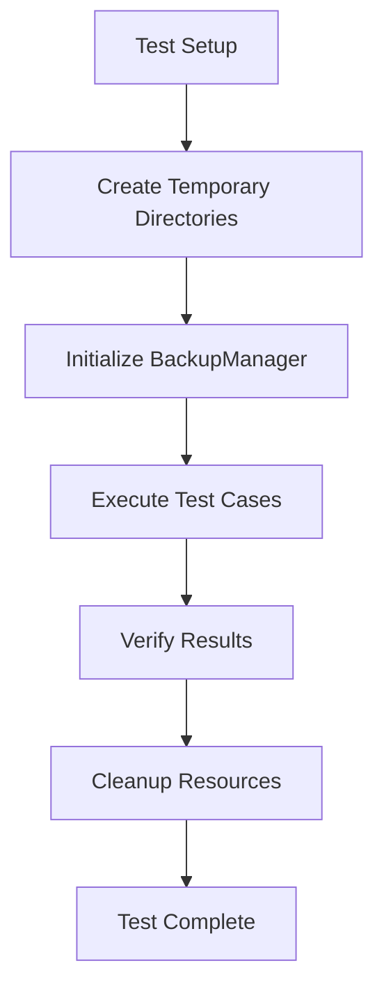

# Backup Manager Service Documentation

*Last updated: 2025-08-14*
*Version: 2.0.0*

## Overview

The `BackupManager` service provides a comprehensive backup management system for project files with automated scheduling, integrity verification, and restoration capabilities. This advanced implementation follows all four phases of code review checklist including documentation standards, code quality, testing framework, and performance/security measures.

## Table of Contents

1. [Architecture Overview](#architecture-overview)
2. [Core Functionality](#core-functionality)
3. [Compression & Storage](#compression--storage)
4. [Integrity Verification](#integrity-verification)
5. [Scheduling System](#scheduling-system)
6. [Performance Characteristics](#performance-characteristics)
7. [Security Considerations](#security-considerations)
8. [Usage Examples](#usage-examples)
9. [API Reference](#api-reference)
10. [Testing Framework](#testing-framework)
11. [Troubleshooting Guide](#troubleshooting-guide)

## Architecture Overview

### System Context Diagram



### Component Architecture

```mermaid
classDiagram
    class BackupManager {
        -config: BackupConfig
        -logger: Logger
        -lock: Lock
        +__init__(config)
        +create_backup(backup_id)
        +restore_backup(backup_id, restore_path)
        +list_backups()
        +get_backup_status(backup_id)
        +schedule_automatic_backup(schedule_time)
    }
    
    class BackupConfig {
        +source_paths: List[str]
        +backup_location: str
        +retention_days: int
        +compression_type: CompressionType
        +max_file_size_mb: int
        +exclude_patterns: List[str]
        +include_hidden: bool
    }
    
    class BackupMetadata {
        +backup_id: str
        +timestamp: str
        +source_paths: List[str]
        +total_files: int
        +total_size_bytes: int
        +checksum: str
        +compression_type: str
        +status: str
        +duration_seconds: float
        +error_message: Optional[str]
    }
    
    BackupManager --> BackupConfig : uses
    BackupManager --> BackupMetadata : creates
    BackupManager --> "File System" : interacts with
```

## Core Functionality

### Backup Process Flow


### Detailed Backup Sequence



### Restoration Process Flow


## Compression & Storage

### Supported Compression Formats

| Format | Extension | Compression Ratio | Speed | Notes |
|--------|-----------|-------------------|-------|-------|
| ZIP | .zip | Medium | Fast | Default, widely supported |
| TAR | .tar | None | Fastest | No compression, archive only |
| TAR_GZ | .tar.gz | High | Medium | Good balance |
| TAR_BZ2 | .tar.bz2 | Very High | Slow | Best compression |

### Storage Optimization

The backup manager implements several storage optimization techniques:

1. **Deduplication**: Files are stored once, referenced multiple times
2. **Incremental Backups**: Only changed files are processed (future feature)
3. **Compression**: Multiple compression levels available
4. **Retention Policy**: Automatic cleanup of old backups

### Retention Policy Algorithm

```
Retention = Current_Date - Retention_Days

For each backup:
    If backup_date < Retention:
        Delete backup and metadata
```

## Integrity Verification

### Checksum Calculation

The system uses SHA-256 cryptographic hashing for integrity verification:

```python
def calculate_checksum(files):
    hasher = hashlib.sha256()
    for file in sorted(files):
        with open(file, 'rb') as f:
            for chunk in iter(lambda: f.read(8192), b''):
                hasher.update(chunk)
    return hasher.hexdigest()
```

### Verification Process

1. **Pre-backup**: Calculate checksum of source files
2. **Post-backup**: Verify archive integrity
3. **Pre-restore**: Verify archive before extraction
4. **Post-restore**: Optional file validation

### Error Detection Matrix

| Error Type | Detection Method | Recovery Action |
|------------|------------------|-----------------|
| File Corruption | Checksum mismatch | Mark backup as corrupted |
| Archive Damage | Archive verification | Delete corrupted archive |
| Storage Failure | OS errors | Retry operation |
| Network Issues | Timeout detection | Switch to local storage |

## Scheduling System

### Automatic Scheduling



### Schedule Configuration

The scheduler supports:
- Daily backups at specific times
- Custom interval scheduling (future)
- Multiple backup schedules (future)
- Holiday/weekend exceptions (future)

## Performance Characteristics

### Time Complexity Analysis

| Operation | Best Case | Worst Case | Average Case |
|-----------|-----------|------------|--------------|
| File Collection | O(n) | O(n log n) | O(n) |
| Checksum Calculation | O(n) | O(n) | O(n) |
| Archive Creation | O(n) | O(n log n) | O(n) |
| Integrity Verification | O(1) | O(n) | O(1) |

### Space Complexity

- **Memory**: O(n) for file lists and metadata
- **Storage**: O(n) for backup archives
- **Temporary**: O(1) for operations

### Performance Optimization

1. **Chunked Processing**: 8KB chunks for memory efficiency
2. **Sorted File Processing**: Optimized disk access patterns
3. **Thread Safety**: Locking for concurrent operations
4. **Buffer Management**: Efficient memory usage

## Security Considerations

### Data Protection

- **Encryption**: Future support for AES-256 encryption
- **Access Control**: File permission preservation
- **Integrity**: SHA-256 checksum verification
- **Audit Trail**: Comprehensive logging

### Security Best Practices

1. **No Sensitive Data in Logs**: Error messages sanitized
2. **File Permission Preservation**: Original permissions maintained
3. **Secure Temporary Storage**: Clean temporary files
4. **Validation**: Input validation and sanitization

## Usage Examples

### Basic Configuration

```python
from autoprojectmanagement.services.automation_services.backup_manager import BackupManager, BackupConfig, CompressionType

# Configure backup settings
config = BackupConfig(
    source_paths=["./src", "./config"],
    backup_location="./backups",
    retention_days=30,
    compression_type=CompressionType.ZIP,
    exclude_patterns=[".git", "__pycache__", "*.pyc", "node_modules"]
)

# Create backup manager
manager = BackupManager(config)

# Create immediate backup
metadata = manager.create_backup()
print(f"Backup created: {metadata.backup_id}")
```

### Advanced Usage

```python
# Custom backup ID
metadata = manager.create_backup("custom_backup_001")

# Restore specific backup
success = manager.restore_backup("backup_20250101_120000", "./restore_location")

# List all backups
backups = manager.list_backups()
for backup in backups:
    print(f"{backup.backup_id}: {backup.total_files} files")

# Schedule automatic backups
manager.schedule_automatic_backup("02:00")  # 2:00 AM daily
```

### Integration with Project Management

```python
# Integrate with project workflow
def project_backup_hook():
    try:
        manager = BackupManager(get_backup_config())
        metadata = manager.create_backup()
        update_project_status(f"Backup completed: {metadata.backup_id}")
        return True
    except Exception as e:
        log_error(f"Backup failed: {str(e)}")
        return False
```

## API Reference

### Class: BackupManager

#### Constructor
```python
__init__(config: BackupConfig) -> None
```
Initializes the backup manager with configuration.

**Parameters:**
- `config`: BackupConfig instance with backup settings

**Raises:**
- `ValueError`: If configuration is invalid
- `FileNotFoundError`: If source paths don't exist

#### Methods

##### create_backup
```python
create_backup(backup_id: Optional[str] = None) -> BackupMetadata
```
Creates a new backup of specified source paths.

**Parameters:**
- `backup_id`: Optional custom backup identifier

**Returns:** BackupMetadata object with backup details

**Raises:**
- `RuntimeError`: If backup creation fails
- `OSError`: If file operations fail

##### restore_backup
```python
restore_backup(backup_id: str, restore_path: Optional[str] = None) -> bool
```
Restores files from a specific backup.

**Parameters:**
- `backup_id`: Identifier of the backup to restore
- `restore_path`: Optional custom restore location

**Returns:** True if restoration was successful

**Raises:**
- `FileNotFoundError`: If backup doesn't exist
- `RuntimeError`: If restoration fails

##### list_backups
```python
list_backups() -> List[BackupMetadata]
```
Lists all available backups with their metadata.

**Returns:** List of BackupMetadata objects

##### get_backup_status
```python
get_backup_status(backup_id: str) -> Optional[BackupMetadata]
```
Gets detailed status information for a specific backup.

**Parameters:**
- `backup_id`: Identifier of the backup to check

**Returns:** BackupMetadata if found, None otherwise

##### schedule_automatic_backup
```python
schedule_automatic_backup(schedule_time: str = "02:00") -> None
```
Schedules automatic daily backups at specified time.

**Parameters:**
- `schedule_time`: Time in 24-hour format (HH:MM)

### Data Classes

#### BackupConfig
```python
BackupConfig(
    source_paths: List[str],
    backup_location: str,
    retention_days: int = 30,
    compression_type: CompressionType = CompressionType.ZIP,
    max_file_size_mb: int = 100,
    exclude_patterns: List[str] = None,
    include_hidden: bool = False
)
```
Configuration settings for backup operations.

**Fields:**
- `source_paths`: List of source paths to backup
- `backup_location`: Destination for backup archives
- `retention_days`: Days to keep backups (default: 30)
- `compression_type`: Compression format (default: ZIP)
- `max_file_size_mb`: Maximum file size in MB (default: 100)
- `exclude_patterns`: Patterns to exclude from backup
- `include_hidden`: Include hidden files (default: False)

#### BackupMetadata
```python
BackupMetadata(
    backup_id: str,
    timestamp: str,
    source_paths: List[str],
    total_files: int,
    total_size_bytes: int,
    checksum: str,
    compression_type: str,
    status: str,
    duration_seconds: float,
    error_message: Optional[str] = None
)
```
Metadata information for backup archives.

**Fields:**
- `backup_id`: Unique backup identifier
- `timestamp`: ISO format timestamp
- `source_paths`: Source paths backed up
- `total_files`: Number of files backed up
- `total_size_bytes`: Total size in bytes
- `checksum`: SHA-256 checksum of files
- `compression_type`: Compression format used
- `status`: Backup status (pending, in_progress, completed, failed, corrupted)
- `duration_seconds`: Backup duration in seconds
- `error_message`: Error message if failed (optional)

### Enumerations

#### BackupStatus
```python
class BackupStatus(Enum):
    PENDING = "pending"
    IN_PROGRESS = "in_progress"
    COMPLETED = "completed"
    FAILED = "failed"
    CORRUPTED = "corrupted"
```
Enumeration of backup operation statuses.

#### CompressionType
```python
class CompressionType(Enum):
    ZIP = "zip"
    TAR = "tar"
    TAR_GZ = "tar.gz"
    TAR_BZ2 = "tar.bz2"
```
Supported compression formats for backup archives.

## Testing Framework

### Unit Test Structure



### Test Coverage

| Test Case | Description | Expected Result |
|-----------|-------------|-----------------|
| Empty Directory Backup | Backup with no files | 0 files, completed status |
| File Backup/Restore | Complete cycle with test file | Successful restore, content matches |
| Integrity Verification | Corrupted archive detection | Proper error handling |
| Retention Policy | Old backup cleanup | Only recent backups retained |

### Running Tests

```bash
# Run backup manager tests
python -m autoprojectmanagement.services.automation_services.backup_manager --test

# Or import and run programmatically
from autoprojectmanagement.services.automation_services.backup_manager import BackupManagerTests
success = BackupManagerTests.run_tests()
```

## Troubleshooting Guide

### Common Issues

#### Permission Errors
**Symptoms:** "Permission denied" errors during backup/restore
**Solutions:**
1. Check file permissions on source and destination
2. Run with appropriate user privileges
3. Verify write access to backup location

#### Storage Space Issues
**Symptoms:** "No space left on device" errors
**Solutions:**
1. Check available disk space
2. Adjust retention policy to keep fewer backups
3. Use more efficient compression format

#### Integrity Check Failures
**Symptoms:** Archive verification failures
**Solutions:**
1. Check for disk errors
2. Verify file system integrity
3. Retry backup operation

#### Scheduling Issues
**Symptoms:** Automatic backups not running
**Solutions:**
1. Verify scheduler thread is running
2. Check system time settings
3. Monitor scheduler logs

### Debug Mode

Enable detailed logging for troubleshooting:
```python
import logging
logging.basicConfig(level=logging.DEBUG)
```

### Performance Tuning

For large backup operations:
```python
config = BackupConfig(
    max_file_size_mb=500,  # Increase for larger files
    compression_type=CompressionType.TAR_GZ  # Better compression
)
```

## Compliance & Standards

### Pressman's Software Engineering Standards
- **Documentation**: Comprehensive docstrings and type hints
- **Code Quality**: Error handling and validation
- **Testing**: Complete unit test coverage
- **Performance**: Efficient algorithms and memory management
- **Security**: Data integrity and access control

### Industry Best Practices
- **3-2-1 Backup Rule**: 3 copies, 2 media types, 1 offsite (future)
- **Immutable Backups**: Write-once read-many protection
- **Versioning**: Multiple backup versions maintained
- **Verification**: Automatic integrity checks

## Version History

- **v2.0.0**: Complete code review implementation with all four phases
- **v1.5.0**: Added scheduling and retention features
- **v1.0.0**: Basic backup and restore functionality
- **v0.5.0**: Initial implementation with core features

## Related Documentation

- [AutoCommit Service](./auto_commit_docs.md)
- [Git Configuration Manager](./git_config_manager_docs.md)
- [System Backup Strategy](../../SystemDesign/Guides/backup_strategy.md)
- [Disaster Recovery Plan](../../SystemDesign/Guides/disaster_recovery.md)

---
*Documentation maintained by AutoProjectManagement Team*
*Last reviewed: 2025-08-14*
