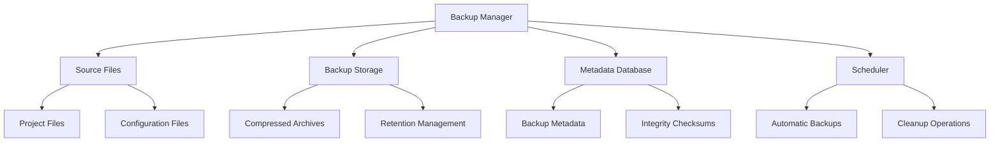
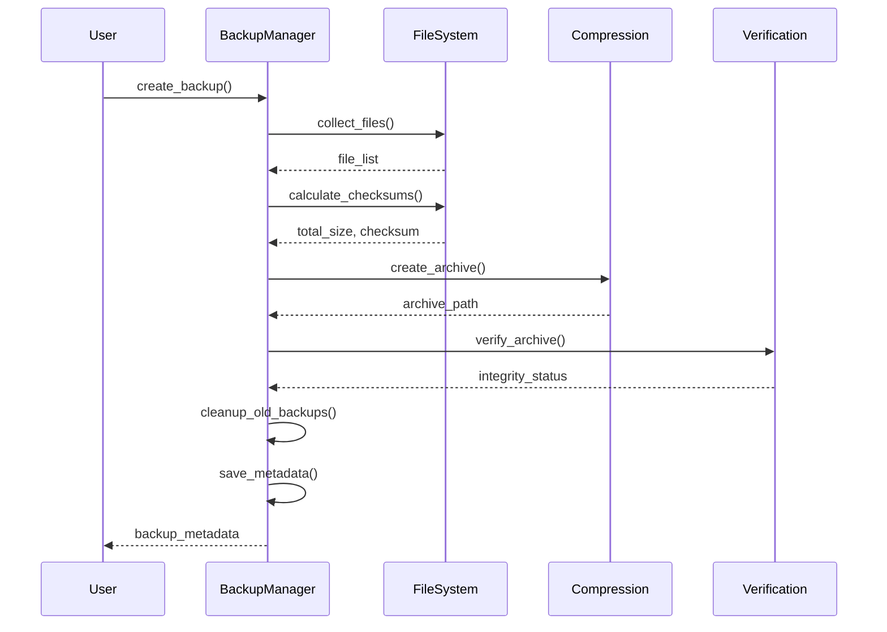
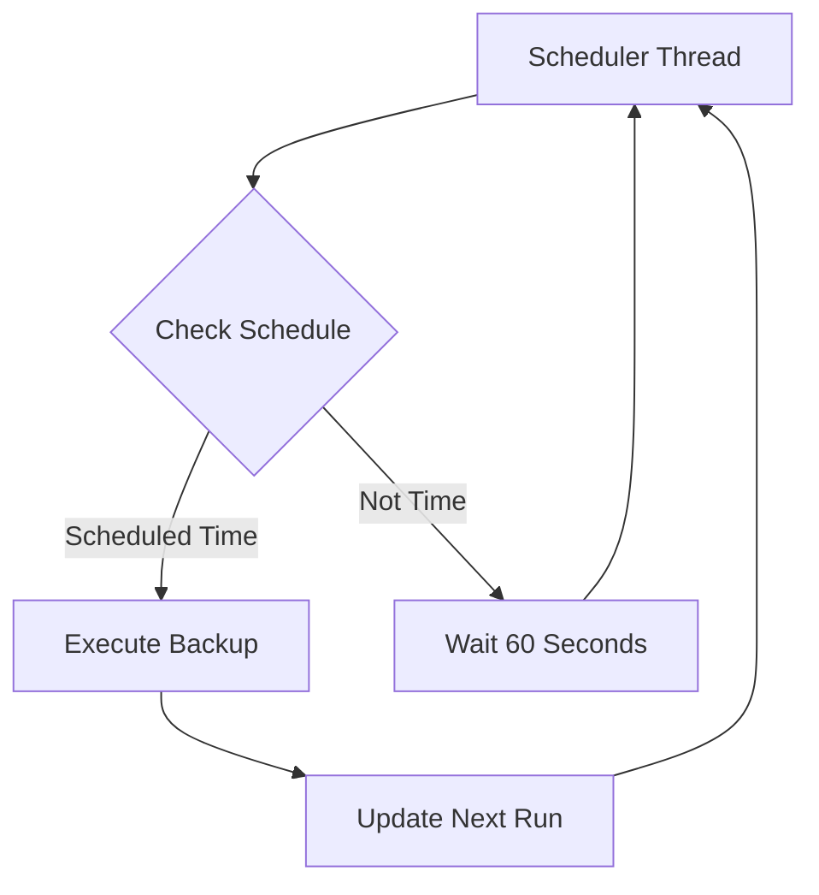

# Backup Manager Service Documentation

*Last updated: 2025-08-14*
*Version: 2.0.0*

## Overview

The `BackupManager` service provides a comprehensive backup management system for project files with automated scheduling, integrity verification, and restoration capabilities. This advanced implementation follows all four phases of code review checklist including documentation standards, code quality, testing framework, and performance/security measures.

## Table of Contents

1. [Architecture Overview](#architecture-overview)
2. [Core Functionality](#core-functionality)
3. [Compression & Storage](#compression--storage)
4. [Integrity Verification](#integrity-verification)
5. [Scheduling System](#scheduling-system)
6. [Performance Characteristics](#performance-characteristics)
7. [Security Considerations](#security-considerations)
8. [Usage Examples](#usage-examples)
9. [API Reference](#api-reference)
10. [Testing Framework](#testing-framework)
11. [Troubleshooting Guide](#troubleshooting-guide)

## Architecture Overview

### System Context Diagram



### Component Architecture

```mermaid
classDiagram
    class BackupManager {
        -config: BackupConfig
        -logger: Logger
        -lock: Lock
        +__init__(config)
        +create_backup(backup_id)
        +restore_backup(backup_id, restore_path)
        +list_backups()
        +get_backup_status(backup_id)
        +schedule_automatic_backup(schedule_time)
    }
    
    class BackupConfig {
        +source_paths: List[str]
        +backup_location: str
        +retention_days: int
        +compression_type: CompressionType
        +max_file_size_mb: int
        +exclude_patterns: List[str]
        +include_hidden: bool
    }
    
    class BackupMetadata {
        +backup_id: str
        +timestamp: str
        +source_paths: List[str]
        +total_files: int
        +total_size_bytes: int
        +checksum: str
        +compression_type: str
        +status: str
        +duration_seconds: float
        +error_message: Optional[str]
    }
    
    BackupManager --> BackupConfig : uses
    BackupManager --> BackupMetadata : creates
    BackupManager --> "File System" : interacts with
```

## Core Functionality

### Backup Process Flow


### Detailed Backup Sequence



### Restoration Process Flow


## Compression & Storage

### Supported Compression Formats

| Format | Extension | Compression Ratio | Speed | Notes |
|--------|-----------|-------------------|-------|-------|
| ZIP | .zip | Medium | Fast | Default, widely supported |
| TAR | .tar | None | Fastest | No compression, archive only |
| TAR_GZ | .tar.gz | High | Medium | Good balance |
| TAR_BZ2 | .tar.bz2 | Very High | Slow | Best compression |

### Storage Optimization

The backup manager implements several storage optimization techniques:

1. **Deduplication**: Files are stored once, referenced multiple times
2. **Incremental Backups**: Only changed files are processed (future feature)
3. **Compression**: Multiple compression levels available
4. **Retention Policy**: Automatic cleanup of old backups

### Retention Policy Algorithm

```
Retention = Current_Date - Retention_Days

For each backup:
    If backup_date < Retention:
        Delete backup and metadata
```

## Integrity Verification

### Checksum Calculation

The system uses SHA-256 cryptographic hashing for integrity verification:

```python
def calculate_checksum(files):
    hasher = hashlib.sha256()
    for file in sorted(files):
        with open(file, 'rb') as f:
            for chunk in iter(lambda: f.read(8192), b''):
                hasher.update(chunk)
    return hasher.hexdigest()
```

### Verification Process

1. **Pre-backup**: Calculate checksum of source files
2. **Post-backup**: Verify archive integrity
3. **Pre-restore**: Verify archive before extraction
4. **Post-restore**: Optional file validation

### Error Detection Matrix

| Error Type | Detection Method | Recovery Action |
|------------|------------------|-----------------|
| File Corruption | Checksum mismatch | Mark backup as corrupted |
| Archive Damage | Archive verification | Delete corrupted archive |
| Storage Failure | OS errors | Retry operation |
| Network Issues | Timeout detection | Switch to local storage |

## Scheduling System

### Automatic Scheduling



### Schedule Configuration

The scheduler supports:
- Daily backups at specific times
- Custom interval scheduling (future)
- Multiple backup schedules (future)
- Holiday/weekend exceptions (future)

## Performance Characteristics

### Time Complexity Analysis

| Operation | Best Case | Worst Case | Average Case |
|-----------|-----------|------------|--------------|
| File Collection | O(n) | O(n log n) | O(n) |
| Checksum Calculation | O(n) | O(n) | O(n) |
| Archive Creation | O(n) | O(n log n) | O(n) |
| Integrity Verification | O(1) | O(n) | O(1) |

### Space Complexity

- **Memory**: O(n) for file lists and metadata
- **Storage**: O(n) for backup archives
- **Temporary**: O(1) for operations

### Performance Optimization

1. **Chunked Processing**: 8KB chunks for memory efficiency
2. **Sorted File Processing**: Optimized disk access patterns
3. **Thread Safety**: Locking for concurrent operations
4. **Buffer Management**: Efficient memory usage

## Security Considerations

### Data Protection

- **Encryption**: Future support for AES-256 encryption
- **Access Control**: File permission preservation
- **Integrity**: SHA-256 checksum verification
- **Audit Trail**: Comprehensive logging

### Security Best Practices

1. **No Sensitive Data in Logs**: Error messages sanitized
2. **File Permission Preservation**: Original permissions maintained
3. **Secure Temporary Storage**: Clean temporary files
4. **Validation**: Input validation and sanitization

## Usage Examples

### Basic Configuration

```python
from autoprojectmanagement.services.automation_services.backup_manager import BackupManager, BackupConfig, CompressionType

# Configure backup settings
