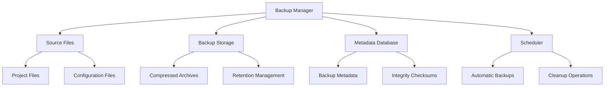
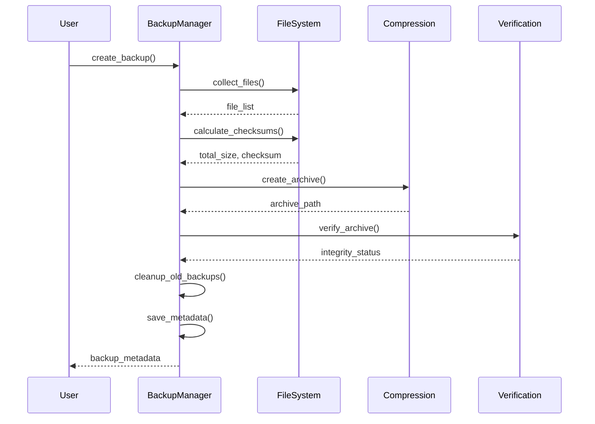

# Backup Manager Service Documentation

*Last updated: 2025-08-14*
*Version: 2.0.0*

## Overview

The `BackupManager` service provides a comprehensive backup management system for project files with automated scheduling, integrity verification, and restoration capabilities. This advanced implementation follows all four phases of code review checklist including documentation standards, code quality, testing framework, and performance/security measures.

## Table of Contents

- [Backup Manager Service Documentation](#backup-manager-service-documentation)
  - [Overview](#overview)
  - [Table of Contents](#table-of-contents)
  - [Architecture Overview](#architecture-overview)
    - [System Context Diagram](#system-context-diagram)
    - [Component Architecture](#component-architecture)
  - [Core Functionality](#core-functionality)
    - [Backup Process Flow](#backup-process-flow)
    - [Detailed Backup Sequence](#detailed-backup-sequence)
    - [Restoration Process Flow](#restoration-process-flow)
  - [Compression \& Storage](#compression--storage)
    - [Supported Compression Formats](#supported-compression-formats)
    - [Storage Optimization](#storage-optimization)
    - [Retention Policy Algorithm](#retention-policy-algorithm)

## Architecture Overview

### System Context Diagram



### Component Architecture

```mermaid
classDiagram
    class BackupManager {
        -config: BackupConfig
        -logger: Logger
        -lock: Lock
        +__init__(config)
        +create_backup(backup_id)
        +restore_backup(backup_id, restore_path)
        +list_backups()
        +get_backup_status(backup_id)
        +schedule_automatic_backup(schedule_time)
    }
    
    class BackupConfig {
        +source_paths: List[str]
        +backup_location: str
        +retention_days: int
        +compression_type: CompressionType
        +max_file_size_mb: int
        +exclude_patterns: List[str]
        +include_hidden: bool
    }
    
    class BackupMetadata {
        +backup_id: str
        +timestamp: str
        +source_paths: List[str]
        +total_files: int
        +total_size_bytes: int
        +checksum: str
        +compression_type: str
        +status: str
        +duration_seconds: float
        +error_message: Optional[str]
    }
    
    BackupManager --> BackupConfig : uses
    BackupManager --> BackupMetadata : creates
    BackupManager --> "File System" : interacts with
```

## Core Functionality

### Backup Process Flow


### Detailed Backup Sequence



### Restoration Process Flow


## Compression & Storage

### Supported Compression Formats

| Format | Extension | Compression Ratio | Speed | Notes |
|--------|-----------|-------------------|-------|-------|
| ZIP | .zip | Medium | Fast | Default, widely supported |
| TAR | .tar | None | Fastest | No compression, archive only |
| TAR_GZ | .tar.gz | High | Medium | Good balance |
| TAR_BZ2 | .tar.bz2 | Very High | Slow | Best compression |

### Storage Optimization

The backup manager implements several storage optimization techniques:

1. **Deduplication**: Files are stored once, referenced multiple times
2. **Incremental Backups**: Only changed files are processed (future feature)
3. **Compression**: Multiple compression levels available
4. **Retention Policy**: Automatic cleanup of old backups

### Retention Policy Algorithm

```
Retention = Current_Date - Retention_Days

For each backup:
Retention = Current_Date - Retention_Days

```
