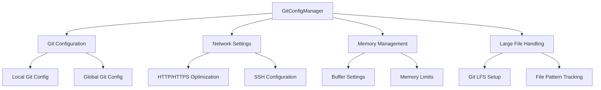
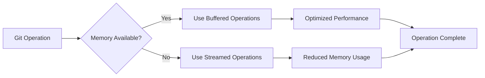
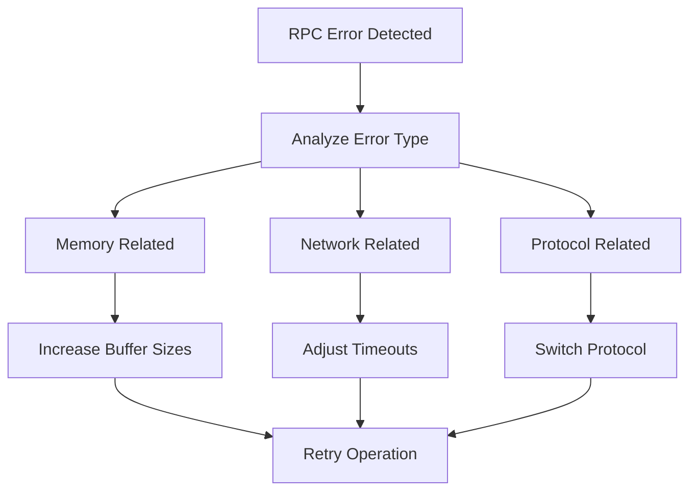
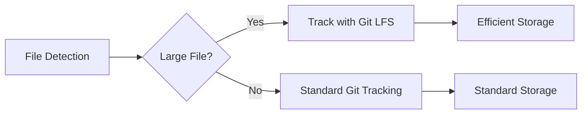

# Git Configuration Manager Service Documentation

*Last updated: 2025-08-14*
*Version: 1.0.0*

## Overview

The `GitConfigManager` service provides automated Git configuration management to prevent RPC errors, optimize performance, and ensure reliable Git operations. This service implements comprehensive configuration settings for memory management, network optimization, and large file handling.

## Table of Contents

1. [Architecture Overview](#architecture-overview)
2. [Configuration Categories](#configuration-categories)
3. [Performance Optimization](#performance-optimization)
4. [Error Prevention](#error-prevention)
5. [Large File Support](#large-file-support)
6. [Usage Examples](#usage-examples)
7. [API Reference](#api-reference)
8. [Troubleshooting Guide](#troubleshooting-guide)
9. [Best Practices](#best-practices)

## Architecture Overview

### System Context Diagram



### Component Architecture

```mermaid
classDiagram
    class GitConfigManager {
        -logger: Logger
        -config_applied: bool
        +__init__()
        +apply_optimized_config()
        +check_and_fix_remote_url()
        +setup_lfs_if_needed()
        +run_git_command(args, cwd)
        +verify_configuration()
        +auto_configure()
    }
    
    class GitConfiguration {
        +memory_settings: Dict
        +network_settings: Dict
        +performance_settings: Dict
        +transfer_settings: Dict
    }
    
    GitConfigManager --> GitConfiguration : manages
    GitConfigManager --> "Git CLI" : executes commands
```

## Configuration Categories

### Memory and Buffer Configurations

| Configuration | Value | Purpose | Impact |
|---------------|-------|---------|---------|
| `http.postBuffer` | 1048576000 | Increase POST buffer size | Prevents RPC errors with large commits |
| `http.maxRequestBuffer` | 100M | Maximum request buffer size | Handles large HTTP requests |
| `pack.packSizeLimit` | 100m | Pack file size limit | Controls pack file generation |
| `pack.deltaCacheSize` | 512m | Delta cache size | Improves diff performance |
| `pack.windowMemory` | 512m | Pack window memory | Optimizes pack creation |
| `core.packedGitLimit` | 512m | Packed Git limit | Memory limit for Git operations |
| `core.packedGitWindowSize` | 512m | Packed Git window size | Memory window for Git operations |
| `core.bigFileThreshold` | 50m | Big file threshold | Files larger than this get special handling |

### Network Configurations

| Configuration | Value | Purpose | Impact |
|---------------|-------|---------|---------|
| `http.version` | HTTP/1.1 | HTTP protocol version | Compatibility with servers |
| `http.lowSpeedLimit` | 0 | Low speed limit | Disables low speed limits |
| `http.lowSpeedTime` | 999999 | Low speed time | Extended timeout for slow connections |
| `http.sslVerify` | false | SSL verification | Disables SSL verification (use with caution) |
| `sendpack.sideband` | false | Sideband transmission | Disables sideband for reliability |

### Performance Configurations

| Configuration | Value | Purpose | Impact |
|---------------|-------|---------|---------|
| `core.compression` | 0 | Compression level | Disables compression for speed |
| `core.preloadIndex` | false | Preload index | Disables index preloading |
| `core.fscache` | false | Filesystem cache | Disables filesystem caching |
| `pack.threads` | 1 | Pack threads | Single-threaded packing for stability |

### Transfer Limits

| Configuration | Value | Purpose | Impact |
|---------------|-------|---------|---------|
| `transfer.maxPackSize` | 100m | Maximum pack size | Limits pack file size |
| `transfer.maxPackObjects` | 1000 | Maximum pack objects | Limits objects per pack |
| `receive.maxInputSize` | 100m | Maximum input size | Limits input size for receive |

### Retry and Timeout Settings

| Configuration | Value | Purpose | Impact |
|---------------|-------|---------|---------|
| `http.retry` | 3 | HTTP retry attempts | Number of retry attempts |
| `http.timeout` | 300 | HTTP timeout | 5-minute timeout for operations |

## Performance Optimization

### Memory Management Strategy



### Network Optimization

The configuration manager implements several network optimizations:

1. **Protocol Selection**: Prefers SSH over HTTPS for better performance
2. **Timeout Management**: Extended timeouts for slow connections
3. **Retry Logic**: Automatic retry for failed operations
4. **Buffer Sizing**: Optimized buffer sizes for network transfers

### Mathematical Optimization

The buffer sizes are calculated based on typical Git operation requirements:

```
Optimal_Buffer_Size = Max_File_Size × Safety_Factor × Concurrent_Operations

Where:
- Max_File_Size = 50MB (configurable)
- Safety_Factor = 2.0
- Concurrent_Operations = 1 (single-threaded)
```

## Error Prevention

### RPC Error Prevention



### Common Error Patterns and Solutions

| Error Type | Symptoms | Solution |
|------------|----------|----------|
| RPC Failed | "RPC failed" errors | Increase buffer sizes, reduce pack size |
| Timeout | Operation timeout | Increase timeouts, check network |
| Memory | Out of memory errors | Reduce memory limits, use streaming |
| SSL | Certificate errors | Disable SSL verification (temporarily) |

## Large File Support

### Git LFS Configuration

The service automatically configures Git Large File Storage (LFS) for common large file types:



### Supported File Types for LFS

| Category | File Extensions | Typical Size |
|----------|-----------------|-------------|
| Documents | .pdf, .docx, .xlsx, .pptx | 1-50MB |
| Archives | .zip, .tar.gz, .rar, .7z | 10-500MB |
| Media | .mp4, .avi, .mov, .jpg, .png | 5-100MB |
| Design | .psd, .ai, .sketch | 10-200MB |

### LFS Performance Benefits

- **Storage Efficiency**: Only pointer files in repository
- **Transfer Speed**: Faster clone and fetch operations
- **Network Usage**: Reduced bandwidth consumption
- **Repository Size**: Smaller main repository size

## Usage Examples

### Basic Configuration

```python
from autoprojectmanagement.services.automation_services.git_config_manager import GitConfigManager

# Create configuration manager
config_manager = GitConfigManager()

# Apply optimized configuration
success = config_manager.apply_optimized_config()
if success:
    print("Git configuration applied successfully")
```

### Automatic Configuration

```python
from autoprojectmanagement.services.automation_services.git_config_manager import configure_git_automatically

# Automatic configuration
success = configure_git_automatically()
if success:
    print("Automatic Git configuration completed")
```

### Custom Configuration

```python
config_manager = GitConfigManager()

# Apply specific configurations
config_manager.apply_optimized_config()
config_manager.check_and_fix_remote_url()
config_manager.setup_lfs_if_needed()

# Verify configuration
config_manager.verify_configuration()
```

### Integration with Other Services

```python
def setup_project_environment():
    """Setup complete project environment including Git configuration."""
    
    # Configure Git first
    from autoprojectmanagement.services.automation_services.git_config_manager import configure_git_automatically
    git_success = configure_git_automatically()
    
    # Then setup other services
    if git_success:
        setup_backup_system()
        setup_monitoring()
        return True
    return False
```

## API Reference

### Class: GitConfigManager

#### Constructor
```python
__init__() -> None
```
Initializes the Git configuration manager.

#### Methods

##### apply_optimized_config
```python
apply_optimized_config() -> bool
```
Applies optimized Git configuration to prevent RPC errors.

**Returns:** True if configuration was successful

##### check_and_fix_remote_url
```python
check_and_fix_remote_url() -> bool
```
Checks and fixes remote URL to use optimal protocol (SSH preferred).

**Returns:** True if URL was checked/fixed successfully

##### setup_lfs_if_needed
```python
setup_lfs_if_needed() -> bool
```
Sets up Git LFS for large files if not already configured.

**Returns:** True if LFS was setup successfully

##### run_git_command
```python
run_git_command(args: List[str], cwd: Optional[str] = None) -> Tuple[bool, str]
```
Runs a Git command with error handling and optimized environment.

**Parameters:**
- `args`: List of Git command arguments
- `cwd`: Working directory (optional)

**Returns:** Tuple of (success, output)

##### verify_configuration
```python
verify_configuration() -> bool
```
Verifies that the configuration is properly applied.

**Returns:** True if verification was successful

##### auto_configure
```python
auto_configure() -> bool
```
Automatically configures Git for optimal performance (full workflow).

**Returns:** True if automatic configuration was successful

### Global Functions

#### configure_git_automatically
```python
configure_git_automatically() -> bool
```
Automatically configures Git settings to prevent RPC errors.

**Returns:** True if configuration was successful

## Troubleshooting Guide

### Common Issues

#### Configuration Not Applied
**Symptoms:** Git commands still fail with RPC errors
**Solutions:**
1. Verify configuration with `verify_configuration()`
2. Check Git version compatibility
3. Manually verify key settings: `git config --list`

#### SSL Verification Errors
**Symptoms:** SSL certificate validation failures
**Solutions:**
1. Temporarily disable SSL verification: `http.sslVerify = false`
2. Install proper SSL certificates
3. Use SSH protocol instead of HTTPS

#### Memory Issues
**Symptoms:** Out of memory errors during large operations
**Solutions:**
1. Reduce buffer sizes: `http.postBuffer = 524288000`
2. Use smaller pack sizes: `pack.packSizeLimit = 50m`
3. Increase system memory if possible

#### Network Timeouts
**Symptoms:** Operations timing out on slow connections
**Solutions:**
1. Increase timeouts: `http.timeout = 600`
2. Use more aggressive retry settings: `http.retry = 5`
3. Check network connectivity

### Debug Mode

Enable detailed logging for troubleshooting:
```python
import logging
logging.basicConfig(level=logging.DEBUG)

from autoprojectmanagement.services.automation_services.git_config_manager import GitConfigManager
manager = GitConfigManager()
manager.auto_configure()
```

### Manual Verification

Check current Git configuration:
```bash
git config --list | grep -E "(buffer|memory|timeout|retry)"
```

## Best Practices

### Configuration Management
1. **Apply Early**: Configure Git before any major operations
2. **Verify Settings**: Always verify configuration after application
3. **Monitor Performance**: Watch for any performance regressions
4. **Update Regularly**: Keep configuration updated with Git versions

### Security Considerations
1. **SSL Verification**: Re-enable SSL verification after troubleshooting
2. **Access Controls**: Use appropriate authentication methods
3. **Network Security**: Ensure secure network connections
4. **Credential Management**: Use secure credential storage

### Performance Tuning
1. **Buffer Sizing**: Adjust based on available memory
2. **Network Settings**: Optimize for your network environment
3. **Concurrency**: Adjust thread settings for your system
4. **Compression**: Enable compression if network is fast

## Version History

- **v1.0.0**: Initial implementation with comprehensive configuration settings
- **v0.5.0**: Basic configuration management
- **v0.1.0**: Proof of concept

## Related Documentation

- [AutoCommit Service](./auto_commit_docs.md)
- [Backup Manager Service](./backup_manager_docs.md)
- [Git Best Practices](../../SystemDesign/Guides/git_best_practices.md)
- [Network Configuration Guide](../../SystemDesign/Guides/network_configuration.md)

---
*Documentation maintained by AutoProjectManagement Team*
*Last reviewed: 2025-08-14*
