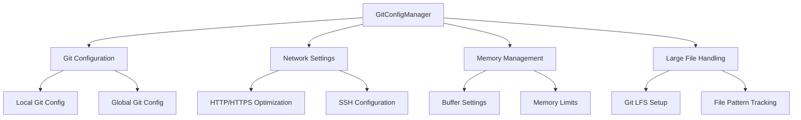

# Git Configuration Manager Service Documentation

*Last updated: 2025-08-14*
*Version: 1.0.0*

## Overview

The `GitConfigManager` service provides automated Git configuration management to prevent RPC errors, optimize performance, and ensure reliable Git operations. This service implements comprehensive configuration settings for memory management, network optimization, and large file handling.

## Table of Contents

1. [Architecture Overview](#architecture-overview)
2. [Configuration Categories](#configuration-categories)
3. [Performance Optimization](#performance-optimization)
4. [Error Prevention](#error-prevention)
5. [Large File Support](#large-file-support)
6. [Usage Examples](#usage-examples)
7. [API Reference](#api-reference)
8. [Troubleshooting Guide](#troubleshooting-guide)
9. [Best Practices](#best-practices)

## Architecture Overview

### System Context Diagram



### Component Architecture

```mermaid
classDiagram
    class GitConfigManager {
        -logger: Logger
        -config_applied: bool
        +__init__()
        +apply_optimized_config()
        +check_and_fix_remote_url()
        +setup_lfs_if_needed()
        +run_git_command(args, cwd)
        +verify_configuration()
        +auto_configure()
    }
    
    class GitConfiguration {
        +memory_settings: Dict
        +network_settings: Dict
        +performance_settings: Dict
        +transfer_settings: Dict
    }
    
    GitConfigManager --> GitConfiguration : manages
