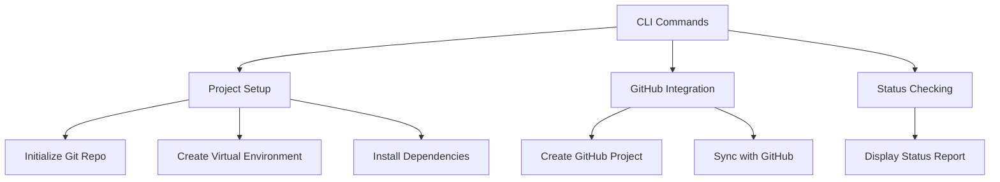
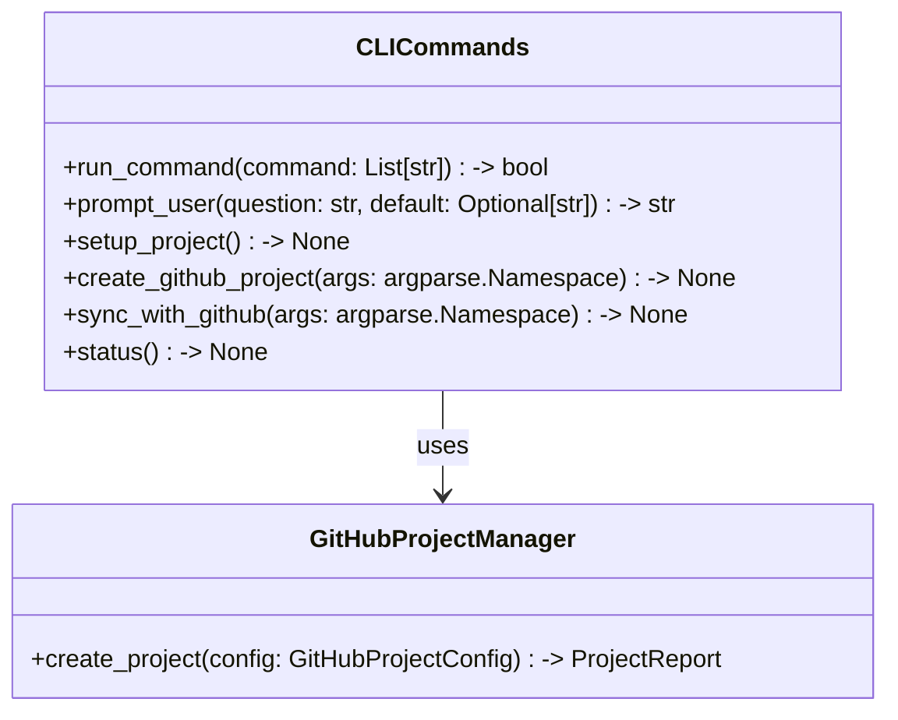

# CLI Commands Documentation

*Last updated: 2025-08-14*
*Version: 2.0.0*

## Overview

The `cli_commands` module provides a command-line interface (CLI) for project setup, GitHub integration, and status checking within the AutoProjectManagement system. This module facilitates user interaction with the system through various commands, enabling efficient project management and configuration.

## Table of Contents

1. [Architecture Overview](#architecture-overview)
2. [Core Functionality](#core-functionality)
3. [Command Structure](#command-structure)
4. [Error Handling](#error-handling)
5. [Usage Examples](#usage-examples)
6. [API Reference](#api-reference)
7. [Performance Optimization](#performance-optimization)
8. [Troubleshooting Guide](#troubleshooting-guide)

## Architecture Overview

### System Context Diagram



### Component Architecture



## Core Functionality

### Project Setup

The `setup_project` function initializes the project environment by performing the following tasks:

1. **Remove Obsolete Directories**: Cleans up any previous project directories.
2. **Initialize Git Repository**: Sets up a new Git repository.
3. **Create Virtual Environment**: Establishes a virtual environment for dependency management.
4. **Install Dependencies**: Installs required packages from `requirements.txt`.
5. **Create Necessary Directories**: Sets up the directory structure for project inputs and outputs.

### GitHub Integration

The `create_github_project` function creates a new GitHub project based on user input or command-line arguments. It utilizes the `GitHubProjectManager` to handle the API interactions.

### Status Checking

The `status` function provides a comprehensive report on the current state of the project setup, including:

- Git repository status
- Virtual environment status
- Dependency management status
- Directory structure status

## Command Structure

### Command Reference

#### Setup Command
```bash
python -m autoprojectmanagement.services.configuration_cli.cli_commands setup
```
- Initializes the project environment.

#### Create GitHub Project Command
```bash
python -m autoprojectmanagement.services.configuration_cli.cli_commands create-github \
  --project_name "my-project" \
  --description "Project description" \
  --github_username "your-username"
```
- Creates a new GitHub project.

#### Sync with GitHub Command
```bash
python -m autoprojectmanagement.services.configuration_cli.cli_commands sync-github \
  project.json your-username
```
- Syncs an existing project with GitHub.

#### Status Command
```bash
python -m autoprojectmanagement.services.configuration_cli.cli_commands status
```
- Displays the current status of the project setup.

### Exit Codes

| Code | Meaning | Description |
|------|---------|-------------|
| 0 | Success | Operation completed successfully |
| 1 | Error | Operation failed with error |
| 2 | Usage Error | Invalid command or arguments |

## Error Handling

### Error Handling Strategy

The module employs robust error handling to manage exceptions during command execution. Key strategies include:

- Logging errors with detailed messages.
- Raising custom exceptions for specific error types.
- Providing user feedback for corrective actions.

### Custom Exceptions

```python
class CLICommandError(Exception):
    """Base exception for CLI command errors."""
    pass
```

## Usage Examples

### Basic CLI Usage

```bash
# Setup the project environment
python -m autoprojectmanagement.services.configuration_cli.cli_commands setup

# Create a new GitHub project
python -m autoprojectmanagement.services.configuration_cli.cli_commands create-github \
  --project_name "my-awesome-project" \
  --description "An awesome project" \
  --github_username "your-username"

# Sync an existing project with GitHub
python -m autoprojectmanagement.services.configuration_cli.cli_commands sync-github \
  project.json your-username

# Check the current status of the project
python -m autoprojectmanagement.services.configuration_cli.cli_commands status
```

## API Reference

### Functions

#### run_command
```python
run_command(command: List[str]) -> bool
```
Executes a shell command with error handling.

**Parameters:**
- `command`: List of command arguments

**Returns:** bool: True if command executed successfully, False otherwise

#### prompt_user
```python
prompt_user(question: str, default: Optional[str] = None) -> str
```
Prompts user for input with an optional default value.

**Parameters:**
- `question`: The question to ask the user
- `default`: Optional default value

**Returns:** str: User input or default value

#### setup_project
```python
setup_project() -> None
```
Completes project setup including Git initialization, virtual environment creation, and directory structure preparation.

#### create_github_project
```python
create_github_project(args: argparse.Namespace) -> None
```
Creates a new GitHub project with full integration.

**Parameters:**
- `args`: Command line arguments containing project details

#### sync_with_github
```python
sync_with_github(args: argparse.Namespace) -> None
```
Syncs an existing project with GitHub.

**Parameters:**
- `args`: Command line arguments containing project JSON path and GitHub username

#### status
```python
status() -> None
```
Displays comprehensive status report of the project setup.

## Performance Optimization

### Command Execution

The module optimizes command execution by using subprocesses for shell commands, allowing for efficient error handling and logging.

### Resource Management

The CLI commands manage resources effectively by ensuring that temporary files and directories are cleaned up after use.

## Troubleshooting Guide

### Common Issues

#### Command Execution Failures
**Symptoms:** Errors when executing commands
**Solutions:**
1. Check command syntax and arguments.
2. Verify that required files exist.
3. Ensure that the environment is properly configured.

#### GitHub Integration Issues
**Symptoms:** Errors when creating or syncing projects
**Solutions:**
1. Verify GitHub token validity and permissions.
2. Check for network connectivity issues.
3. Ensure that the repository names and configurations are correct.

### Debug Mode

Enable debug logging for detailed troubleshooting:

```python
import logging
logging.basicConfig(level=logging.DEBUG)

# Run CLI commands with debug output
python -m autoprojectmanagement.services.configuration_cli.cli_commands setup --debug
```

## Compliance & Standards

### Security Standards
- **Token Security**: Ensure secure handling of GitHub tokens.
- **Input Validation**: Validate all user inputs to prevent injection attacks.

## Version History

- **v2.0.0**: Enhanced CLI functionality and error handling.
- **v1.0.0**: Initial implementation with basic command support.
- **v0.5.0**: Proof of concept.

## Related Documentation

- [GitHub Project Manager](../integration_services/github_project_manager_docs.md)
- [GitHub Integration Service](../integration_services/github_integration_docs.md)
- [Configuration Management](./config_and_token_management_docs.md)

---
*Documentation maintained by AutoProjectManagement Team*
*Last reviewed: 2025-08-14*
