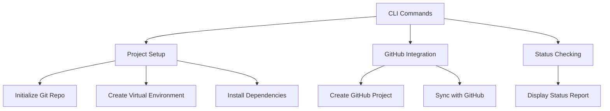
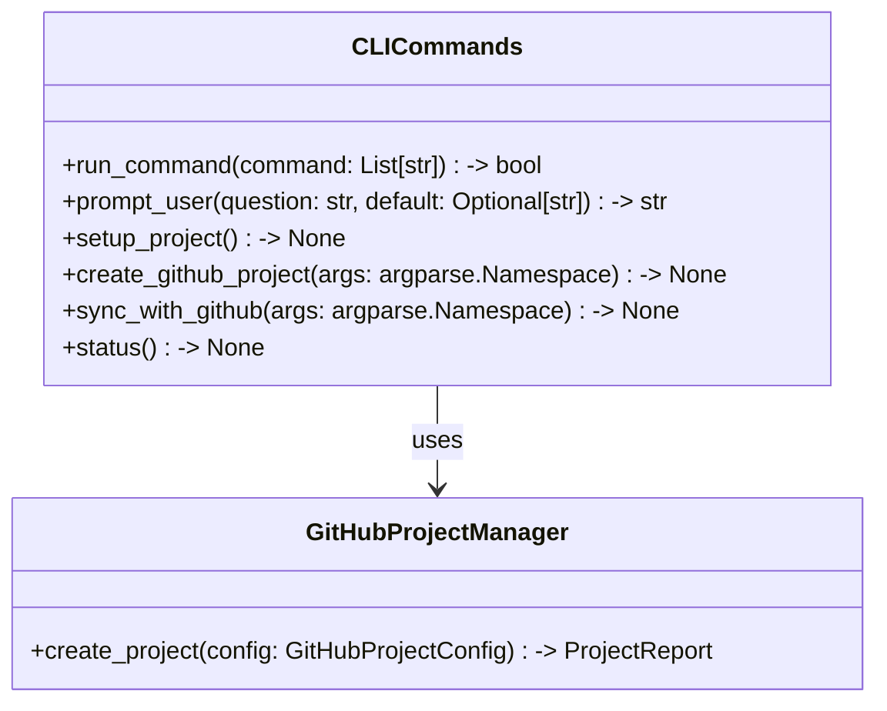

# CLI Commands Documentation

*Last updated: 2025-08-14*
*Version: 2.0.0*

## Overview

The `cli_commands` module provides a command-line interface (CLI) for project setup, GitHub integration, and status checking within the AutoProjectManagement system. This module facilitates user interaction with the system through various commands, enabling efficient project management and configuration.

## Table of Contents

1. [Architecture Overview](#architecture-overview)
2. [Core Functionality](#core-functionality)
3. [Command Structure](#command-structure)
4. [Error Handling](#error-handling)
5. [Usage Examples](#usage-examples)
6. [API Reference](#api-reference)
7. [Performance Optimization](#performance-optimization)
8. [Troubleshooting Guide](#troubleshooting-guide)

## Architecture Overview

### System Context Diagram

### Component Architecture

## Core Functionality

### Project Setup

The `setup_project` function initializes the project environment by performing the following tasks:

1. **Remove Obsolete Directories**: Cleans up any previous project directories.
2. **Initialize Git Repository**: Sets up a new Git repository.
3. **Create Virtual Environment**: Establishes a virtual environment for dependency management.
4. **Install Dependencies**: Installs required packages from `requirements.txt`.
5. **Create Necessary Directories**: Sets up the directory structure for project inputs and outputs.

### GitHub Integration

