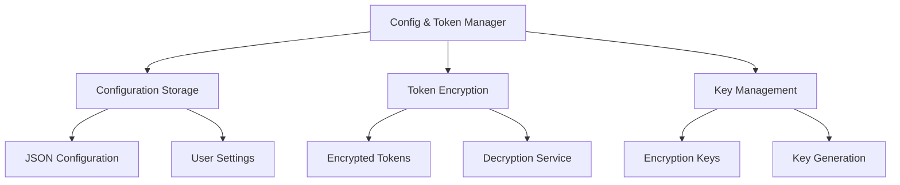
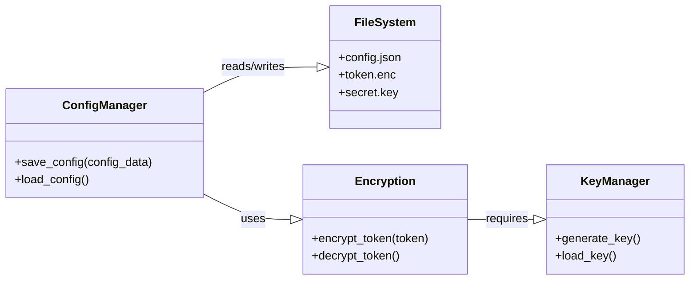
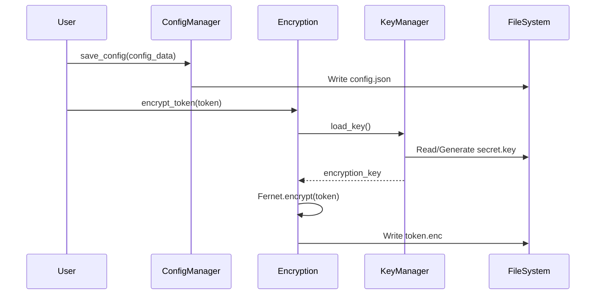
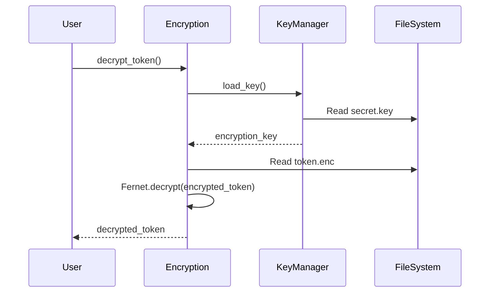

# Configuration and Token Management Service Documentation

*Last updated: 2025-08-14*
*Version: 1.0.0*

## Overview

The `config_and_token_management` service provides secure storage and management of configuration data and authentication tokens using encryption. This service ensures sensitive information like API tokens and configuration settings are stored securely using Fernet symmetric encryption.

## Table of Contents

1. [Architecture Overview](#architecture-overview)
2. [Security Implementation](#security-implementation)
3. [Encryption Scheme](#encryption-scheme)
4. [File Structure](#file-structure)
5. [Usage Examples](#usage-examples)
6. [API Reference](#api-reference)
7. [Security Best Practices](#security-best-practices)
8. [Troubleshooting Guide](#troubleshooting-guide)

## Architecture Overview

### System Context Diagram



### Component Architecture



## Security Implementation

### Encryption Flow



### Decryption Flow



## Encryption Scheme

### Fernet Symmetric Encryption

The service uses Fernet symmetric encryption from the cryptography library:

```
Fernet Encryption Process:
1. Generate 32-byte URL-safe base64-encoded key
2. Encrypt data using AES-128 in CBC mode
3. Use HMAC-SHA256 for authentication
4. Include timestamp for replay protection
```

### Key Characteristics

| Aspect | Specification | Security Level |
|--------|---------------|----------------|
| Algorithm | AES-128-CBC | 128-bit security |
| Key Size | 32 bytes (256 bits) | Strong |
| Authentication | HMAC-SHA256 | Cryptographic strength |
| Mode | CBC with PKCS7 padding | Secure |
| IV | Random 16 bytes | Unique per encryption |

### Security Properties

1. **Confidentiality**: AES-128 encryption protects token data
2. **Integrity**: HMAC-SHA256 prevents tampering
3. **Authenticity**: Verified decryption ensures data authenticity
4. **Freshness**: Timestamp prevents replay attacks

## File Structure

### Configuration File (`config.json`)

```json
{
    "github_repo": "user/repository",
    "user_name": "username",
    "api_endpoint": "https://api.example.com",
    "timeout": 30,
    "retry_attempts": 3
}
```

### Encrypted Token File (`token.enc`)

- Binary format containing encrypted token
- Base64 encoded ciphertext with metadata
- Includes timestamp and HMAC signature

### Key File (`secret.key`)

- 32-byte encryption key
- Base64 encoded format
- Should be kept secure (not in version control)

### File Permissions

| File | Recommended Permissions | Purpose |
|------|-------------------------|---------|
| `config.json` | 644 (rw-r--r--) | Non-sensitive configuration |
| `token.enc` | 600 (rw-------) | Encrypted sensitive data |
| `secret.key` | 600 (rw-------) | Encryption key (highly sensitive) |

## Usage Examples

### Basic Configuration Setup

```python
from autoprojectmanagement.services.configuration_cli.config_and_token_management import (
    save_config, encrypt_token, load_config, decrypt_token
)

# Save configuration settings
config_data = {
    "github_repo": "Shakour-Data/AutoProjectManagement",
    "user_name": "automation-bot",
    "api_timeout": 30,
    "max_retries": 5
}
save_config(config_data)

# Encrypt and store API token
github_token = "ghp_your_github_token_here"
encrypt_token(github_token)

print("Configuration and token saved securely")
```

### Retrieving Configuration and Tokens

```python
from autoprojectmanagement.services.configuration_cli.config_and_token_management import (
    load_config, decrypt_token
)

# Load configuration
config = load_config()
print(f"Repository: {config.get('github_repo')}")
print(f"Username: {config.get('user_name')}")

# Decrypt and use token
token = decrypt_token()
if token:
    print(f"Token available: {token[:10]}...")  # Show first 10 chars only
else:
    print("No token found")
```

### Integration with GitHub API

```python
import requests
from autoprojectmanagement.services.configuration_cli.config_and_token_management import (
    load_config, decrypt_token
)

def make_github_api_request(endpoint):
    """Make authenticated GitHub API request."""
    config = load_config()
    token = decrypt_token()
    
    if not token:
        raise ValueError("GitHub token not configured")
    
    headers = {
        "Authorization": f"token {token}",
        "Accept": "application/vnd.github.v3+json"
    }
    
    url = f"https://api.github.com/{endpoint}"
    response = requests.get(url, headers=headers, timeout=30)
    response.raise_for_status()
    
    return response.json()

# Example usage
try:
    user_info = make_github_api_request("user")
    print(f"Authenticated as: {user_info['login']}")
except Exception as e:
    print(f"API request failed: {e}")
```

### Error Handling and Validation

```python
from autoprojectmanagement.services.configuration_cli.config_and_token_management import (
    load_config, decrypt_token
)
import os

def get_secure_config():
    """Get configuration with proper error handling."""
    try:
        config = load_config()
        token = decrypt_token()
        
        # Validate required configuration
        required_keys = ['github_repo', 'user_name']
        for key in required_keys:
            if key not in config:
                raise ValueError(f"Missing required config: {key}")
        
        if not token:
            raise ValueError("Authentication token not configured")
        
        return config, token
        
    except FileNotFoundError:
        print("Configuration files not found. Please run setup first.")
        return None, None
    except Exception as e:
        print(f"Configuration error: {e}")
        return None, None
```

## API Reference

### Functions

#### generate_key
```python
generate_key() -> bytes
```
Generates a new encryption key and saves it to `secret.key`.

**Returns:** Generated encryption key as bytes

**Raises:**
- `IOError`: If key file cannot be written

#### load_key
```python
load_key() -> bytes
```
Loads the encryption key from `secret.key`, generating a new one if it doesn't exist.

**Returns:** Encryption key as bytes

**Raises:**
- `IOError`: If key file cannot be read/written

#### encrypt_token
```python
encrypt_token(token: str) -> None
```
Encrypts a token and saves it to `token.enc`.

**Parameters:**
- `token`: Plain text token to encrypt

**Raises:**
- `ValueError`: If token is empty or invalid
- `IOError`: If token file cannot be written
- `cryptography.fernet.InvalidToken`: If encryption fails

#### decrypt_token
```python
decrypt_token() -> Optional[str]
```
Decrypts and returns the token from `token.enc`.

**Returns:** Decrypted token string, or None if no token exists

**Raises:**
- `IOError`: If token file cannot be read
- `cryptography.fernet.InvalidToken`: If decryption fails (tampered data)

#### save_config
```python
save_config(config_data: dict) -> None
```
