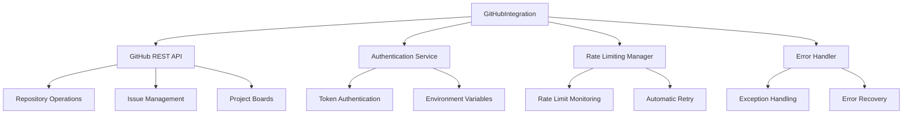
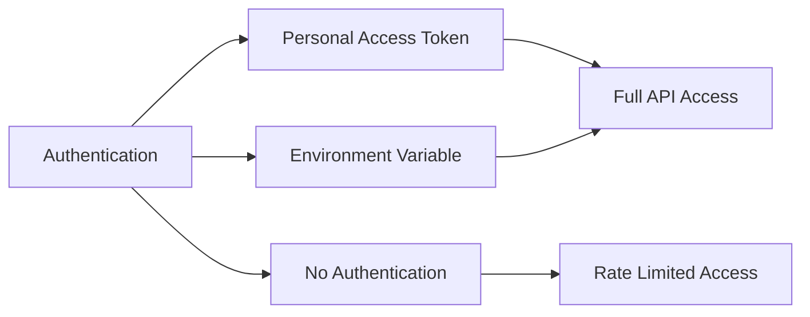
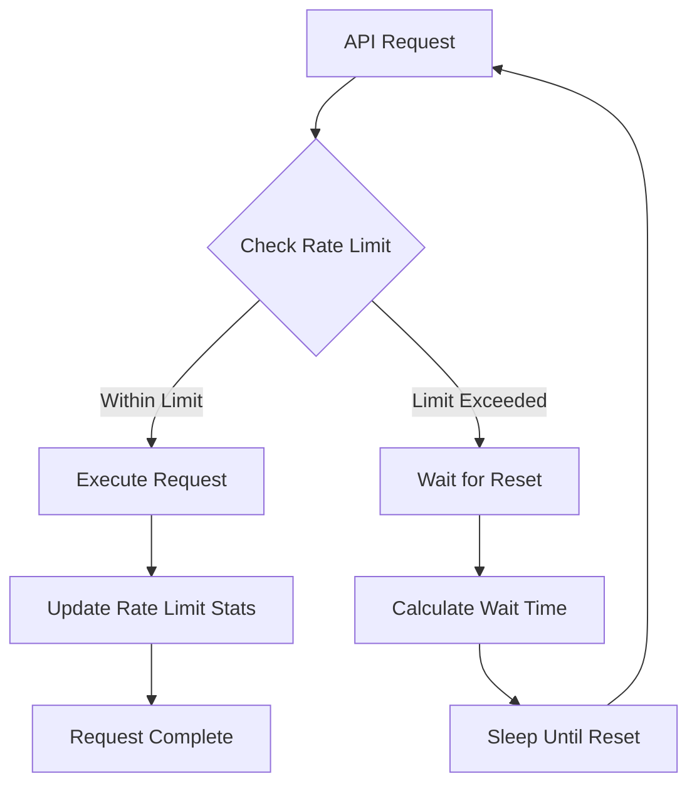
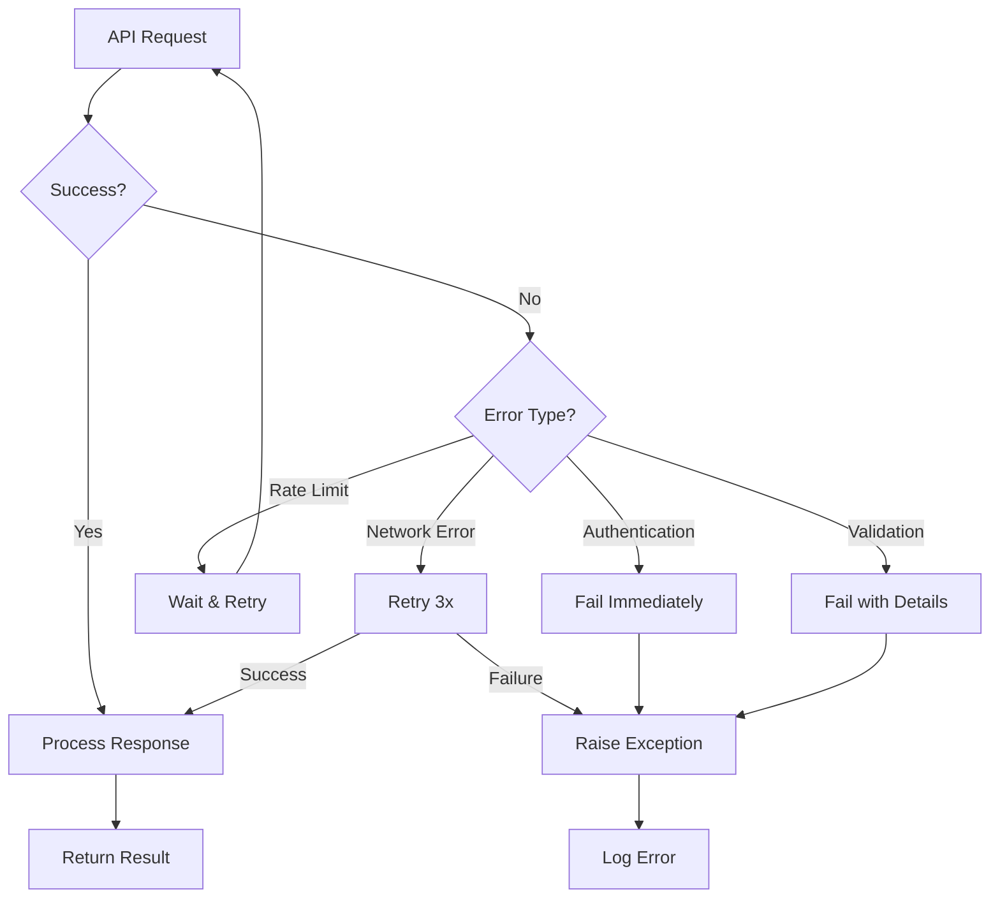

# GitHub Integration Service Documentation

*Last updated: 2025-08-14*
*Version: 2.0.0*

## Overview

The `GitHubIntegration` service provides comprehensive integration with GitHub's REST API for project management operations. This service enables automated interaction with GitHub repositories, issues, pull requests, and project boards with robust error handling, rate limiting management, and secure authentication.

## Table of Contents

1. [Architecture Overview](#architecture-overview)
2. [Authentication & Security](#authentication--security)
3. [API Endpoints](#api-endpoints)
4. [Rate Limiting Management](#rate-limiting-management)
5. [Error Handling](#error-handling)
6. [Usage Examples](#usage-examples)
7. [API Reference](#api-reference)
8. [Performance Optimization](#performance-optimization)
9. [Troubleshooting Guide](#troubleshooting-guide)

## Architecture Overview

### System Context Diagram



### Component Architecture

```mermaid
classDiagram
    class GitHubIntegration {
        -owner: str
        -repo: str
        -token: str
        -api_url: str
        -session: Session
        +__init__(owner, repo, token)
        +get_issues(state, labels)
        +create_issue(title, body, labels)
        +_make_request(method, endpoint, params, data, json_data)
        +_get_headers()
        +close()
    }
    
    class GitHubAPI {
        +base_url: str
        +endpoints: dict
    }
    
    class RateLimiter {
        +remaining: int
        +reset_time: int
        +check_limit()
        +wait_for_reset()
    }
    
    GitHubIntegration --> GitHubAPI : uses
    GitHubIntegration --> RateLimiter : manages
    GitHubIntegration --> "requests.Session" : maintains
```

## Authentication & Security

### Authentication Methods



### Token Requirements

| Permission Scope | Required For | Security Level |
|------------------|-------------|----------------|
| `repo` | Full repository access | High |
| `public_repo` | Public repositories only | Medium |
| `read:org` | Organization access | Medium |
| `user` | User information | Low |

### Security Best Practices

1. **Token Storage**: Use environment variables or secure config
2. **Least Privilege**: Grant minimal required permissions
3. **Rotation**: Regularly rotate access tokens
4. **Monitoring**: Monitor API usage for anomalies

## API Endpoints

### Supported GitHub API Endpoints

| Endpoint | Method | Description | Rate Limit |
|----------|--------|-------------|------------|
| `/repos/{owner}/{repo}/issues` | GET | List repository issues | 60 req/hour (unauth) |
| `/repos/{owner}/{repo}/issues` | POST | Create new issue | 5000 req/hour (auth) |
| `/repos/{owner}/{repo}/issues/{number}` | GET | Get specific issue | 60 req/hour (unauth) |
| `/repos/{owner}/{repo}/labels` | GET | List labels | 60 req/hour (unauth) |

### Endpoint Configuration

```python
GITHUB_API_BASE = "https://api.github.com"
API_ENDPOINTS = {
    "issues": "/repos/{owner}/{repo}/issues",
    "issue": "/repos/{owner}/{repo}/issues/{number}",
    "labels": "/repos/{owner}/{repo}/labels",
    "projects": "/repos/{owner}/{repo}/projects"
}
```

## Rate Limiting Management

### Rate Limit Strategy



### Rate Limit Headers

| Header | Description | Example Value |
|--------|-------------|---------------|
| `X-RateLimit-Limit` | Total requests allowed | `5000` |
| `X-RateLimit-Remaining` | Requests remaining | `4999` |
| `X-RateLimit-Reset` | Reset timestamp | `1633046400` |
| `X-RateLimit-Used` | Requests used | `1` |

### Rate Limit Tiers

| Authentication | Limit | Reset Period | Notes |
|----------------|-------|--------------|-------|
| Unauthenticated | 60 | 1 hour | IP-based limiting |
| Personal Token | 5000 | 1 hour | User-based limiting |
| GitHub App | 5000 | 1 hour | App-based limiting |
| Enterprise | Custom | Custom | Organization setting |

## Error Handling

### Error Handling Strategy



### Error Types and Handling

| Error Type | Status Code | Retry | Action |
|------------|-------------|-------|---------|
| Network Error | N/A | Yes (3x) | Wait 1s between retries |
| Rate Limit | 403 | Yes | Wait until reset |
| Not Found | 404 | No | Raise exception |
| Authentication | 401 | No | Raise exception |
| Validation | 422 | No | Raise with details |
| Server Error | 5xx | Yes (3x) | Wait 1s between retries |

### Custom Exceptions

```python
class GitHubIntegrationError(Exception):
    """Base exception for GitHub integration errors."""
    pass

class RateLimitError(GitHubIntegrationError):
    """Raised when rate limit is exceeded."""
    pass

class AuthenticationError(GitHubIntegrationError):
    """Raised for authentication failures."""
    pass

class ValidationError(GitHubIntegrationError):
    """Raised for API validation errors."""
    pass
```

## Usage Examples

### Basic Integration Setup

```python
from autoprojectmanagement.services.integration_services.github_integration import GitHubIntegration

# Initialize with owner and repository
github = GitHubIntegration(
    owner="Shakour-Data",
    repo="AutoProjectManagement",
    token="ghp_your_token_here"  # or use GITHUB_TOKEN env var
)

# Use context manager for automatic cleanup
with GitHubIntegration("Shakour-Data", "AutoProjectManagement") as github:
    issues = github.get_issues(state="open")
    print(f"Found {len(issues)} open issues")
```

### Issue Management

```python
# Get all open issues
open_issues = github.get_issues(state="open")

# Get issues with specific labels
bug_issues = github.get_issues(state="open", labels=["bug", "high-priority"])

# Create a new issue
new_issue = github.create_issue(
    title="Feature Request: Enhanced API",
    body="Please add support for pagination in the API endpoints.",
    labels=["enhancement", "api"]
)

print(f"Created issue #{new_issue['number']}: {new_issue['html_url']}")
```

### Advanced Error Handling

```python
try:
    with GitHubIntegration("Shakour-Data", "AutoProjectManagement") as github:
        # This might fail due to rate limiting or authentication
        issues = github.get_issues()
        
except GitHubIntegrationError as e:
    if "rate limit" in str(e).lower():
        print("Rate limit exceeded. Please try again later.")
    elif "authentication" in str(e).lower():
        print("Authentication failed. Check your token.")
    else:
        print(f"GitHub API error: {e}")
        
except Exception as e:
    print(f"Unexpected error: {e}")
```

### Integration with Configuration Management

```python
from autoprojectmanagement.services.configuration_cli.config_and_token_management import decrypt_token
from autoprojectmanagement.services.integration_services.github_integration import GitHubIntegration

def get_github_integration():
    """Get configured GitHub integration with secure token."""
    token = decrypt_token()
    if not token:
        raise ValueError("GitHub token not configured")
    
    # Load configuration from secure storage
    config = load_config()
    
    return GitHubIntegration(
        owner=config.get("github_owner"),
        repo=config.get("github_repo"),
        token=token
    )

# Usage
try:
    github = get_github_integration()
    issues = github.get_issues()
    print(f"Repository: {github.owner}/{github.repo}")
    print(f"Open issues: {len(issues)}")
    
except Exception as e:
    print(f"Failed to initialize GitHub integration: {e}")
```

## API Reference

### Class: GitHubIntegration

#### Constructor
```python
__init__(owner: str, repo: str, token: Optional[str] = None) -> None
```
Initializes GitHub integration with repository details.

**Parameters:**
- `owner`: Repository owner or organization name
- `repo`: Repository name  
- `token`: GitHub personal access token (optional, uses GITHUB_TOKEN env var)

**Raises:**
- `ValueError`: If owner or repo parameters are empty
- `GitHubIntegrationError`: If token is required but not provided

#### Methods

##### get_issues
```python
get_issues(state: str = "open", labels: Optional[List[str]] = None) -> List[Dict[str, Any]]
```
Retrieves issues from the repository with filtering options.

**Parameters:**
- `state`: Issue state (open, closed, all)
- `labels`: List of label names to filter by

**Returns:** List of issue dictionaries with issue details

**Raises:**
- `GitHubIntegrationError`: If API request fails

##### create_issue
```python
create_issue(title: str, body: str = "", labels: Optional[List[str]] = None) -> Dict[str, Any]
```
Creates a new issue in the repository.

**Parameters:**
- `title`: Issue title (required)
- `body`: Issue description/body
- `labels`: List of label names to apply

**Returns:** Dictionary containing created issue details

**Raises:**
- `ValueError`: If title is empty
- `GitHubIntegrationError`: If issue creation fails

##### close
```python
close() -> None
```
Closes the requests session to clean up resources.

##### _make_request (Protected)
```python
_make_request(method: str, endpoint: str, params: Optional[Dict[str, Any]] = None,
             data: Optional[Dict[str, Any]] = None, json_data: Optional[Dict[str, Any]] = None) -> requests.Response
```
Makes authenticated request to GitHub API with retry logic.

**Parameters:**
- `method`: HTTP method (GET, POST, PUT, DELETE)
- `endpoint`: API endpoint relative to base URL
- `params`: Query parameters
- `data`: Form data for POST/PUT requests
- `json_data`: JSON data for POST/PUT requests

**Returns:** Response object from successful request

**Raises:**
- `GitHubIntegrationError`: For API errors or rate limiting
- `RequestException`: For network-related errors

##### _get_headers (Protected)
```python
_get_headers() -> Dict[str, str]
```
Generates headers for GitHub API requests.

**Returns:** Dictionary containing request headers including authorization

### Context Manager Support

The class supports context manager usage for automatic resource cleanup:

```python
with GitHubIntegration(owner, repo, token) as github:
    # Use github instance
    issues = github.get_issues()
# Session automatically closed here
```

## Performance Optimization

### Connection Pooling

The service uses `requests.Session` for connection pooling:

```python
# Session maintains persistent connections
session = requests.Session()
session.headers.update(headers)
```

### Request Optimization

1. **Timeout Management**: 30-second timeout for all requests
2. **Retry Strategy**: 3 retries for transient errors
3. **Connection Reuse**: Persistent connections for multiple requests
4. **Header Caching**: Pre-computed headers for efficiency

### Memory Management

```python
# Context manager ensures proper cleanup
with GitHubIntegration(...) as github:
    # Resources automatically managed
    pass
```

## Troubleshooting Guide

### Common Issues

#### Authentication Failures
**Symptoms:** 401 Unauthorized errors
**Solutions:**
1. Verify token validity and permissions
2. Check token format (should start with `ghp_`)
3. Ensure token has required repository access

#### Rate Limiting
**Symptoms:** 403 Forbidden with "rate limit" message
**Solutions:**
1. Wait for rate limit reset (automatic in service)
2. Use authenticated requests for higher limits
3. Implement request caching

#### Network Issues
**Symptoms:** Timeout or connection errors
**Solutions:**
1. Check internet connectivity
2. Verify GitHub API status
3. Increase timeout settings if needed

#### Repository Access
**Symptoms:** 404 Not Found errors
**Solutions:**
1. Verify repository exists and is accessible
2. Check spelling of owner and repository names
3. Ensure token has access to private repositories

### Debug Mode

Enable debug logging for detailed troubleshooting:

```python
import logging
import http.client

# Enable verbose logging
logging.basicConfig(level=logging.DEBUG)
http.client.HTTPConnection.debuglevel = 1

# Create integration with debug info
github = GitHubIntegration("owner", "repo")
```

### Performance Monitoring

Monitor API usage and performance:

```python
# Check rate limit status
response = github._make_request("GET", "rate_limit")
limit_info = response.json()
print(f"Remaining requests: {limit_info['resources']['core']['remaining']}")
```

## Compliance & Standards

### API Compliance
- **GitHub REST API v3**: Full compliance with GitHub API specifications
- **HTTP Standards**: Proper use of HTTP methods and status codes
- **JSON API**: Standard JSON request/response format

### Security Standards
- **TLS 1.2+**: Secure HTTPS connections
- **Token Security**: Secure token handling and storage
- **Data Validation**: Input validation and sanitization

## Version History

- **v2.0.0**: Enhanced error handling, rate limiting, and context manager support
- **v1.0.0**: Basic GitHub API integration functionality
- **v0.5.0**: Initial implementation with issue management

## Related Documentation

- [Configuration & Token Management](../configuration_cli/config_and_token_management_docs.md)
- [GitHub Project Manager](./github_project_manager_docs.md)
- [API Integration Guidelines](../../SystemDesign/Guides/api_integration.md)
- [Rate Limiting Best Practices](../../SystemDesign/Guides/rate_limiting.md)

---
*Documentation maintained by AutoProjectManagement Team*
*Last reviewed: 2025-08-14*
