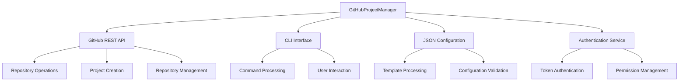
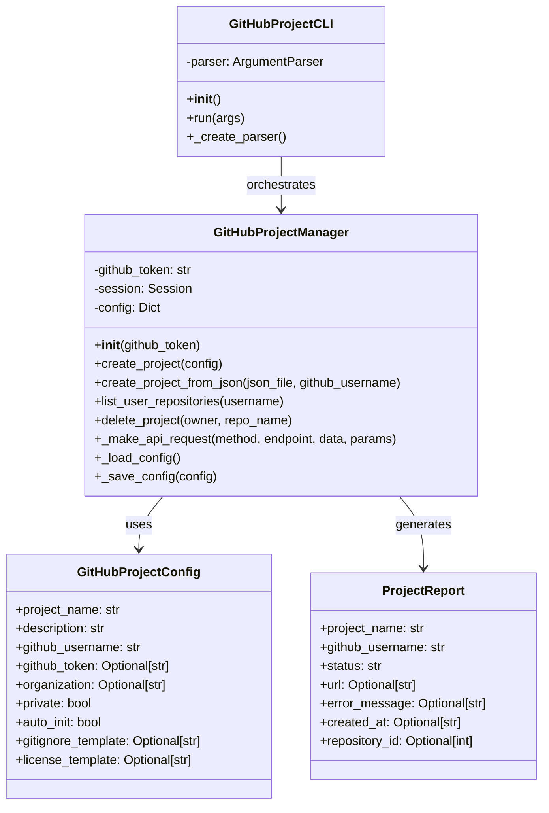
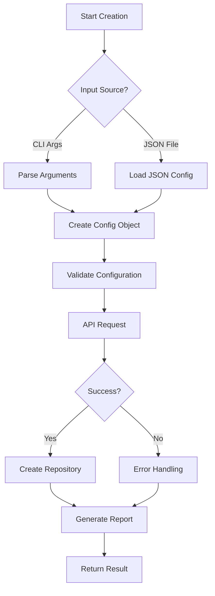
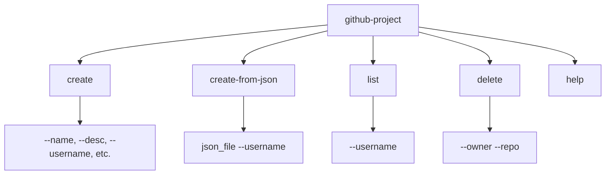
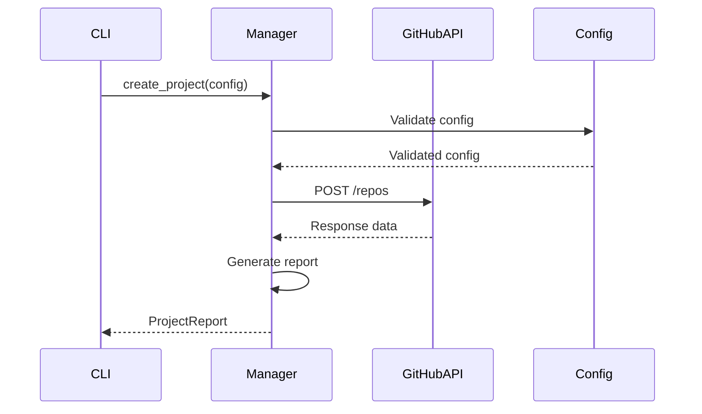

# GitHub Project Manager Service Documentation

*Last updated: 2025-08-14*
*Version: 2.0.0*

## Overview

The `GitHubProjectManager` service provides comprehensive GitHub repository management with both CLI and programmatic interfaces. This service enables automated creation, configuration, and management of GitHub repositories with support for JSON templates, error handling, and batch operations.

## Table of Contents

1. [Architecture Overview](#architecture-overview)
2. [Core Functionality](#core-functionality)
3. [CLI Interface](#cli-interface)
4. [JSON Configuration](#json-configuration)
5. [API Integration](#api-integration)
6. [Error Handling](#error-handling)
7. [Usage Examples](#usage-examples)
8. [API Reference](#api-reference)
9. [Performance Optimization](#performance-optimization)
10. [Troubleshooting Guide](#troubleshooting-guide)

## Architecture Overview

### System Context Diagram



### Component Architecture



## Core Functionality

### Repository Creation Process



### Supported Operations

| Operation | API Endpoint | Method | Description |
|-----------|-------------|--------|-------------|
| Create Repository | `/user/repos` or `/orgs/{org}/repos` | POST | Create new repository |
| List Repositories | `/users/{username}/repos` | GET | List user repositories |
| Delete Repository | `/repos/{owner}/{repo}` | DELETE | Delete repository |
| Get Repository | `/repos/{owner}/{repo}` | GET | Get repository details |

## CLI Interface

### Command Structure



### Command Reference

#### create command
```bash
github-project create \
  --name "project-name" \
  --desc "Project description" \
  --username "github-user" \
  [--org "organization"] \
  [--public] \
  [--no-init] \
  [--gitignore "template"] \
  [--license "license-type"]
```

#### create-from-json command
```bash
github-project create-from-json config.json --username "github-user"
```

#### list command
```bash
github-project list --username "github-user"
```

#### delete command
```bash
github-project delete --owner "owner" --repo "repository-name"
```

### Exit Codes

| Code | Meaning | Description |
|------|---------|-------------|
| 0 | Success | Operation completed successfully |
| 1 | Error | Operation failed with error |
| 2 | Usage Error | Invalid command or arguments |

## JSON Configuration

### Configuration Schema

```json
{
  "project_name": "string (required)",
  "description": "string (required)",
  "private": "boolean (default: true)",
  "auto_init": "boolean (default: true)",
  "gitignore_template": "string (optional)",
  "license_template": "string (optional)"
}
```

### Supported Gitignore Templates

| Template | Description | Use Case |
|----------|-------------|----------|
| `Python` | Python-specific ignores | Python projects |
| `Node` | Node.js ignores | JavaScript/Node projects |
| `Java` | Java ignores | Java projects |
| `C++` | C++ ignores | C++ projects |
| `Go` | Go ignores | Go projects |

### Supported License Templates

| License | Description | Use Case |
|---------|-------------|----------|
| `MIT` | MIT License | Permissive open source |
| `Apache-2.0` | Apache 2.0 | Enterprise open source |
| `GPL-3.0` | GPL v3 | Copyleft license |
| `BSD-3-Clause` | BSD 3-Clause | Permissive license |

### Example JSON Configuration

```json
{
  "project_name": "awesome-project",
  "description": "An awesome project with automated setup",
  "private": false,
  "auto_init": true,
  "gitignore_template": "Python",
  "license_template": "MIT"
}
```

## API Integration

### GitHub API Endpoints

| Endpoint | Purpose | Authentication | Rate Limit |
|----------|---------|----------------|------------|
| `POST /user/repos` | Create user repository | Token required | 5000/hr |
| `POST /orgs/{org}/repos` | Create org repository | Token + permissions | 5000/hr |
| `GET /users/{user}/repos` | List user repositories | Optional | 60/hr (unauth) |
| `DELETE /repos/{owner}/{repo}` | Delete repository | Token + permissions | 5000/hr |

### Request Flow



### Response Handling

```python
# Successful response structure
{
