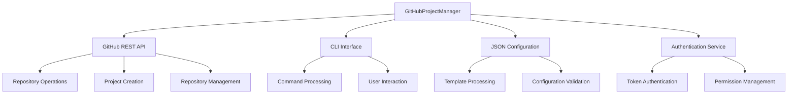
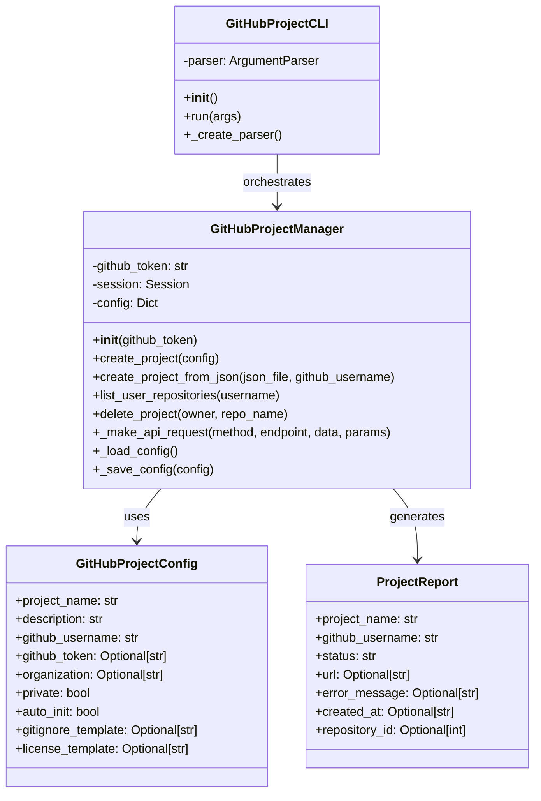
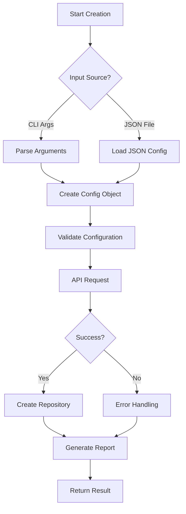
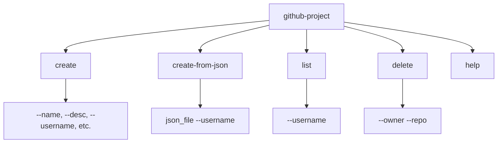
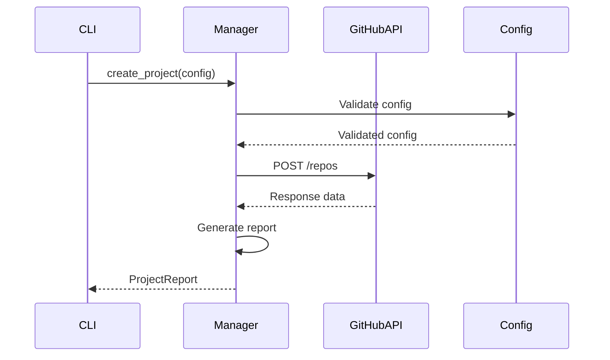
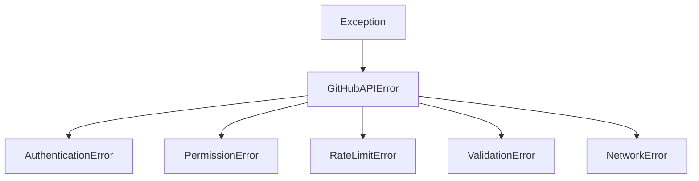

# GitHub Project Manager Service Documentation

*Last updated: 2025-08-14*
*Version: 2.0.0*

## Overview

The `GitHubProjectManager` service provides comprehensive GitHub repository management with both CLI and programmatic interfaces. This service enables automated creation, configuration, and management of GitHub repositories with support for JSON templates, error handling, and batch operations.

## Table of Contents

1. [Architecture Overview](#architecture-overview)
2. [Core Functionality](#core-functionality)
3. [CLI Interface](#cli-interface)
4. [JSON Configuration](#json-configuration)
5. [API Integration](#api-integration)
6. [Error Handling](#error-handling)
7. [Usage Examples](#usage-examples)
8. [API Reference](#api-reference)
9. [Performance Optimization](#performance-optimization)
10. [Troubleshooting Guide](#troubleshooting-guide)

## Architecture Overview

### System Context Diagram



### Component Architecture



## Core Functionality

### Repository Creation Process



### Supported Operations

| Operation | API Endpoint | Method | Description |
|-----------|-------------|--------|-------------|
| Create Repository | `/user/repos` or `/orgs/{org}/repos` | POST | Create new repository |
| List Repositories | `/users/{username}/repos` | GET | List user repositories |
| Delete Repository | `/repos/{owner}/{repo}` | DELETE | Delete repository |
| Get Repository | `/repos/{owner}/{repo}` | GET | Get repository details |

## CLI Interface

### Command Structure



### Command Reference

#### create command
```bash
github-project create \
  --name "project-name" \
  --desc "Project description" \
  --username "github-user" \
  [--org "organization"] \
  [--public] \
  [--no-init] \
  [--gitignore "template"] \
  [--license "license-type"]
```

#### create-from-json command
```bash
github-project create-from-json config.json --username "github-user"
```

#### list command
```bash
github-project list --username "github-user"
```

#### delete command
```bash
github-project delete --owner "owner" --repo "repository-name"
```

### Exit Codes

| Code | Meaning | Description |
|------|---------|-------------|
| 0 | Success | Operation completed successfully |
| 1 | Error | Operation failed with error |
| 2 | Usage Error | Invalid command or arguments |

## JSON Configuration

### Configuration Schema

```json
{
  "project_name": "string (required)",
  "description": "string (required)",
  "private": "boolean (default: true)",
  "auto_init": "boolean (default: true)",
  "gitignore_template": "string (optional)",
  "license_template": "string (optional)"
}
```

### Supported Gitignore Templates

| Template | Description | Use Case |
|----------|-------------|----------|
| `Python` | Python-specific ignores | Python projects |
| `Node` | Node.js ignores | JavaScript/Node projects |
| `Java` | Java ignores | Java projects |
| `C++` | C++ ignores | C++ projects |
| `Go` | Go ignores | Go projects |

### Supported License Templates

| License | Description | Use Case |
|---------|-------------|----------|
| `MIT` | MIT License | Permissive open source |
| `Apache-2.0` | Apache 2.0 | Enterprise open source |
| `GPL-3.0` | GPL v3 | Copyleft license |
| `BSD-3-Clause` | BSD 3-Clause | Permissive license |

### Example JSON Configuration

```json
{
  "project_name": "awesome-project",
  "description": "An awesome project with automated setup",
  "private": false,
  "auto_init": true,
  "gitignore_template": "Python",
  "license_template": "MIT"
}
```

## API Integration

### GitHub API Endpoints

| Endpoint | Purpose | Authentication | Rate Limit |
|----------|---------|----------------|------------|
| `POST /user/repos` | Create user repository | Token required | 5000/hr |
| `POST /orgs/{org}/repos` | Create org repository | Token + permissions | 5000/hr |
| `GET /users/{user}/repos` | List user repositories | Optional | 60/hr (unauth) |
| `DELETE /repos/{owner}/{repo}` | Delete repository | Token + permissions | 5000/hr |

### Request Flow



### Response Handling

```python
# Successful response structure
{
    "id": 123456789,
    "name": "project-name",
    "full_name": "owner/project-name",
    "html_url": "https://github.com/owner/project-name",
    "description": "Project description",
    "private": true,
    "created_at": "2023-01-01T00:00:00Z"
}
```

## Error Handling

### Error Hierarchy



### Error Types and Handling

| Error Type | Status Code | Retry | Action |
|------------|-------------|-------|---------|
| `401 Unauthorized` | 401 | No | Check token validity |
| `403 Forbidden` | 403 | No | Check permissions/rate limits |
| `404 Not Found` | 404 | No | Verify resource exists |
| `422 Validation` | 422 | No | Fix request data |
| `5xx Server Error` | 500-599 | Yes (3x) | Retry with backoff |
| Network Error | N/A | Yes (3x) | Retry with backoff |

### Retry Strategy

```python
MAX_RETRIES = 3
RETRY_DELAY = 1  # second

for attempt in range(MAX_RETRIES):
    try:
        # Make request
        break
    except (ConnectionError, Timeout):
        if attempt == MAX_RETRIES - 1:
            raise
        time.sleep(RETRY_DELAY * (attempt + 1))
```

## Usage Examples

### Basic Programmatic Usage

```python
from autoprojectmanagement.services.integration_services.github_project_manager import (
    GitHubProjectManager, GitHubProjectConfig
)

# Initialize manager
manager = GitHubProjectManager("ghp_your_token_here")

# Create project configuration
config = GitHubProjectConfig(
    project_name="my-awesome-project",
    description="A project managed by AutoProjectManagement",
    github_username="your-username",
    private=True,
    auto_init=True,
    gitignore_template="Python",
    license_template="MIT"
)

# Create project
report = manager.create_project(config)

if report.status == "created":
    print(f"Project created: {report.url}")
else:
    print(f"Failed: {report.error_message}")
```

### CLI Usage Examples

```bash
# Create a public Python project
github-project create \
  --name "python-app" \
  --desc "A Python application" \
  --username "your-username" \
  --public \
  --gitignore "Python" \
  --license "MIT"

# Create from JSON configuration
github-project create-from-json project-config.json --username "your-username"

# List user repositories
github-project list --username "your-username"

# Delete a repository (use with caution!)
github-project delete --owner "your-username" --repo "old-project"
```

### JSON Configuration File

Create `project-config.json`:
```json
{
  "project_name": "automated-project",
  "description": "Project created from JSON configuration",
  "private": false,
  "auto_init": true,
  "gitignore_template": "Node",
  "license_template": "Apache-2.0"
}
```

### Integration with Other Services

```python
from autoprojectmanagement.services.configuration_cli.config_and_token_management import decrypt_token
from autoprojectmanagement.services.integration_services.github_project_manager import GitHubProjectManager

def create_github_project(project_name, description):
    """Create GitHub project with secure token management."""
    token = decrypt_token()
    if not token:
        raise ValueError("GitHub token not configured")
    
    manager = GitHubProjectManager(token)
    
    config = GitHubProjectConfig(
        project_name=project_name,
        description=description,
        github_username="automation-bot",
        private=True,
        auto_init=True
    )
    
    return manager.create_project(config)

# Usage
report = create_github_project("new-project", "Description here")
```

## API Reference

### Class: GitHubProjectManager

#### Constructor
```python
__init__(github_token: Optional[str] = None) -> None
```
Initializes the GitHub Project Manager with authentication.

**Parameters:**
- `github_token`: GitHub personal access token (uses GITHUB_TOKEN env var if not provided)

**Raises:**
- `GitHubAPIError`: If no GitHub token is available

#### Methods

##### create_project
```python
create_project(config: GitHubProjectConfig) -> ProjectReport
```
Creates a new GitHub repository project.

**Parameters:**
- `config`: GitHubProjectConfig instance with project details

**Returns:** ProjectReport with creation results

**Raises:**
- `GitHubAPIError`: If project creation fails

##### create_project_from_json
```python
create_project_from_json(json_file: str, github_username: str) -> ProjectReport
```
Creates a GitHub project from JSON configuration file.

**Parameters:**
- `json_file`: Path to JSON configuration file
- `github_username`: GitHub username for the project

**Returns:** ProjectReport with creation results

**Raises:**
- `GitHubAPIError`: If JSON file is invalid or creation fails
- `FileNotFoundError`: If JSON file doesn't exist

##### list_user_repositories
```python
list_user_repositories(username: str) -> List[Dict[str, Any]]
```
Lists all repositories for a given user.

**Parameters:**
- `username`: GitHub username to list repositories for

**Returns:** List of repository dictionaries

**Raises:**
- `GitHubAPIError`: If API request fails

##### delete_project
```python
delete_project(owner: str, repo_name: str) -> bool
```
Deletes a GitHub repository.

**Parameters:**
- `owner`: Repository owner (username or organization)
- `repo_name`: Repository name to delete

**Returns:** True if deletion was successful

**Raises:**
- `GitHubAPIError`: If deletion fails

### Data Classes

#### GitHubProjectConfig
```python
@dataclass
class GitHubProjectConfig:
    project_name: str
    description: str
    github_username: str
    github_token: Optional[str] = None
    organization: Optional[str] = None
    private: bool = True
    auto_init: bool = True
    gitignore_template: Optional[str] = None
    license_template: Optional[str] = None
```
Configuration for GitHub project creation.

#### ProjectReport
```python
@dataclass
class ProjectReport:
    project_name: str
    github_username: str
    status: str
    url: Optional[str] = None
    error_message: Optional[str] = None
    created_at: Optional[str] = None
    repository_id: Optional[int] = None
```
Report structure for project creation results.

### CLI Class: GitHubProjectCLI

#### run
```python
run(args: Optional[List[str]] = None) -> int
```
Runs the CLI with provided arguments.

**Parameters:**
- `args`: Command line arguments (defaults to sys.argv[1:])

**Returns:** Exit code (0 for success, 1 for error)

## Performance Optimization

### Connection Management

```python
# Session reuse for connection pooling
self.session = requests.Session()
self.session.headers.update(headers)
```

### Request Optimization

1. **Timeout Management**: 30-second timeout for all requests
2. **Retry Strategy**: 3 retries for network errors
3. **Connection Pooling**: Reuse connections for multiple requests
4. **Header Caching**: Pre-computed headers for efficiency

### Memory Management

```python
# Context-based resource management
def create_project(self, config):
    # Resources automatically managed
    pass
```

## Troubleshooting Guide

### Common Issues

#### Authentication Failures
**Symptoms:** 401 Unauthorized errors
**Solutions:**
1. Verify token validity and permissions
2. Check token format (should start with `ghp_`)
3. Ensure token has `repo` scope

#### Permission Errors
**Symptoms:** 403 Forbidden errors
**Solutions:**
1. Check repository permissions
2. Verify organization access
3. Check rate limit status

#### Rate Limiting
**Symptoms:** 403 with "rate limit" message
**Solutions:**
1. Wait for rate limit reset
2. Use authenticated requests
3. Implement request caching

#### JSON Configuration Errors
**Symptoms:** Validation errors or file issues
**Solutions:**
1. Validate JSON syntax
2. Check required fields
3. Verify file permissions

### Debug Mode

Enable debug logging for detailed troubleshooting:

```bash
# Set debug environment variable
export DEBUG=1

# Run with verbose output
github-project create --name test --desc test --username user -v
```

### Error Recovery

```python
try:
    report = manager.create_project(config)
    if report.status == "failed":
        # Handle specific error types
        if "name already exists" in report.error_message:
            print("Project name already taken")
        elif "permission" in report.error_message:
            print("Check your permissions")
except GitHubAPIError as e:
    print(f"API Error: {e}")
```

## Compliance & Standards

### API Compliance
- **GitHub REST API v3**: Full compliance with API specifications
- **HTTP Standards**: Proper HTTP methods and status codes
- **JSON API**: Standard request/response format

### Security Standards
- **Token Security**: Secure token handling
- **TLS 1.2+**: Encrypted connections
- **Input Validation**: Comprehensive input sanitization

## Version History

- **v2.0.0**: Enhanced CLI, JSON support, and error handling
- **v1.0.0**: Basic repository management functionality
- **v0.5.0**: Initial implementation with core features

## Related Documentation

- [GitHub Integration Service](./github_integration_docs.md)
- [Configuration & Token Management](../configuration_cli/config_and_token_management_docs.md)
- [CLI Design Guidelines](../../SystemDesign/Guides/cli_design.md)
- [API Integration Best Practices](../../SystemDesign/Guides/api_integration.md)

---
*Documentation maintained by AutoProjectManagement Team*
*Last reviewed: 2025-08-14*
