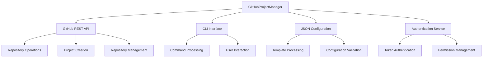
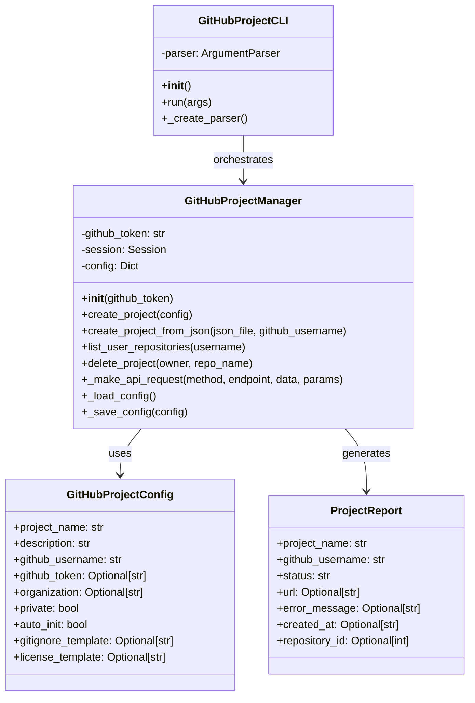

# GitHub Project Manager Service Documentation

*Last updated: 2025-08-14*
*Version: 2.0.0*

## Overview

The `GitHubProjectManager` service provides comprehensive GitHub repository management with both CLI and programmatic interfaces. This service enables automated creation, configuration, and management of GitHub repositories with support for JSON templates, error handling, and batch operations.

## Table of Contents

1. [Architecture Overview](#architecture-overview)
2. [Core Functionality](#core-functionality)
3. [CLI Interface](#cli-interface)
4. [JSON Configuration](#json-configuration)
5. [API Integration](#api-integration)
6. [Error Handling](#error-handling)
7. [Usage Examples](#usage-examples)
8. [API Reference](#api-reference)
9. [Performance Optimization](#performance-optimization)
10. [Troubleshooting Guide](#troubleshooting-guide)

## Architecture Overview

### System Context Diagram



### Component Architecture



## Core Functionality

### Repository Creation Process

```mermaid
flowchart TD
    A[Start Creation] --> B{Input Source?}
    B -->|CLI Args| C[Parse Arguments]
    B -->|JSON File| D[Load JSON Config]
    
    C --> E[Create Config Object]
    D --> E
    
    E --> F[Validate Configuration]
    F --> G[API Request]
