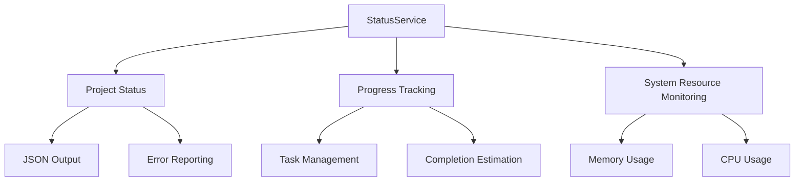
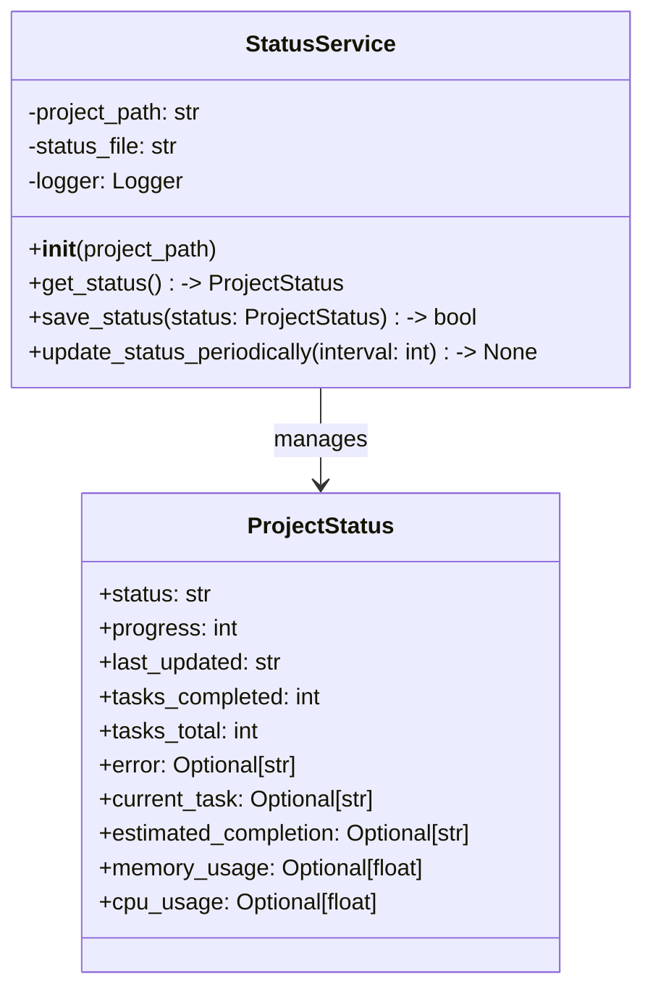
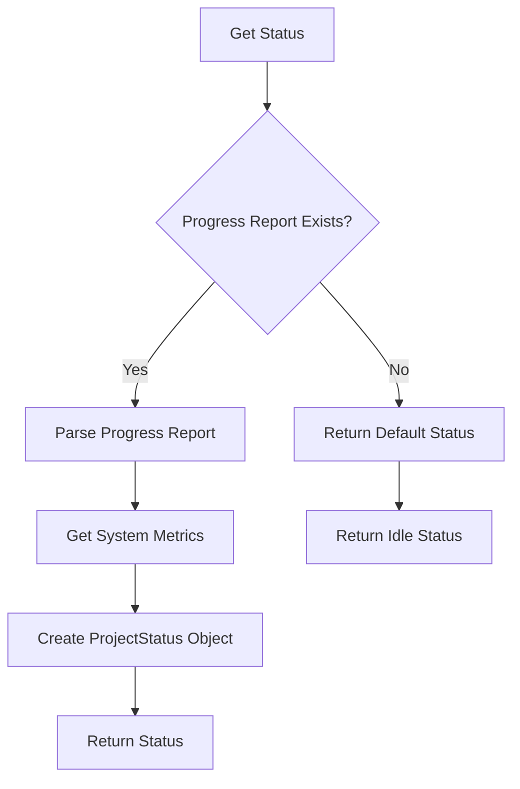
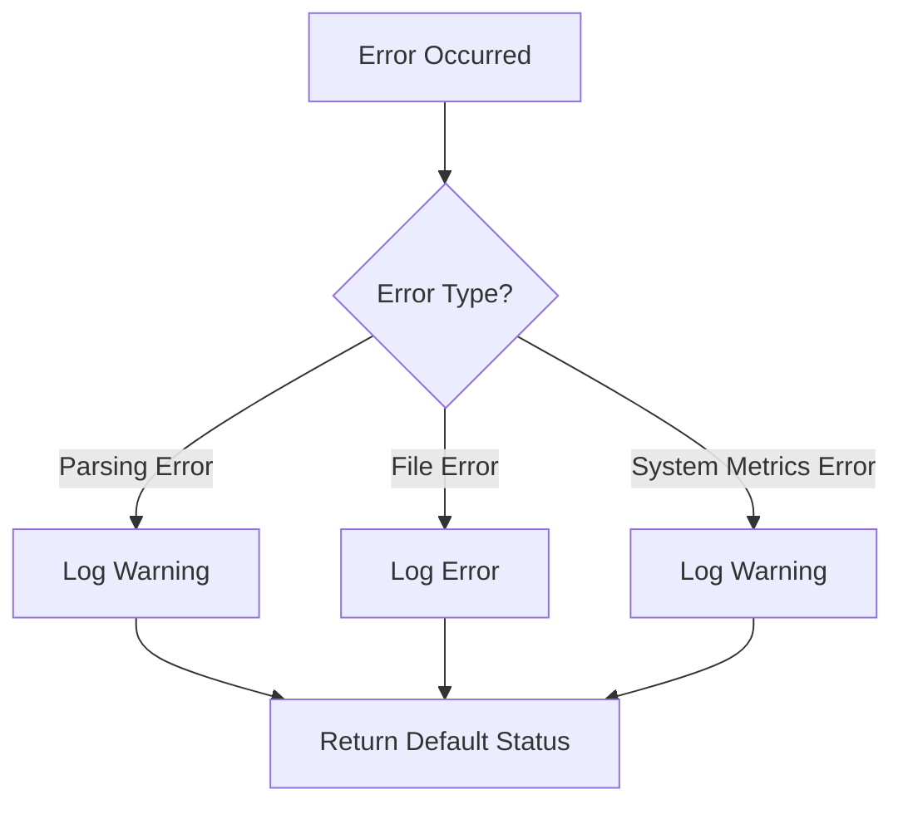

# Status Service Documentation

*Last updated: 2025-08-14*
*Version: 2.0.0*

## Overview

The `StatusService` provides real-time status updates for the AutoProjectManagement system, including project progress tracking, error handling, and system resource monitoring. This service is designed to integrate seamlessly with both the VS Code extension and web interfaces.

## Table of Contents

1. [Architecture Overview](#architecture-overview)
2. [Project Status Data Class](#project-status-data-class)
3. [Core Functionality](#core-functionality)
4. [Error Handling](#error-handling)
5. [Usage Examples](#usage-examples)
6. [API Reference](#api-reference)
7. [Performance Optimization](#performance-optimization)
8. [Troubleshooting Guide](#troubleshooting-guide)

## Architecture Overview

### System Context Diagram



### Component Architecture



## Project Status Data Class

### ProjectStatus
```python
@dataclass
class ProjectStatus:
    status: str  # running, complete, idle, error
    progress: int  # 0-100 percentage
    last_updated: str  # ISO format timestamp
    tasks_completed: int
    tasks_total: int
    error: Optional[str] = None
    current_task: Optional[str] = None
    estimated_completion: Optional[str] = None
    memory_usage: Optional[float] = None
    cpu_usage: Optional[float] = None
```
The `ProjectStatus` class encapsulates all relevant information about the project's current status, including progress, task completion, and system resource usage.

## Core Functionality

### Status Retrieval Process



### System Resource Monitoring

The service monitors system resources using the `psutil` library:

```python
def _get_system_metrics() -> Dict[str, float]:
    """Get system resource usage metrics."""
    import psutil
    return {
        'memory_usage': psutil.virtual_memory().percent,
        'cpu_usage': psutil.cpu_percent(interval=1)
    }
```

### Status Saving

The service saves the current status to a JSON file for persistence:

```python
def save_status(self, status: ProjectStatus) -> bool:
    """Save status information to JSON file."""
    with open(self.status_file, 'w', encoding='utf-8') as f:
        json.dump(asdict(status), f, indent=2, ensure_ascii=False)
```

## Error Handling

### Error Handling Strategy



### Custom Exceptions

```python
class StatusServiceError(Exception):
    """Base exception for status service errors."""
    pass
```

## Usage Examples

### Basic Usage

```python
from autoprojectmanagement.services.monitoring_services.status_service import StatusService

# Initialize the status service
status_service = StatusService()

# Get current project status
current_status = status_service.get_status()
print(f"Current Status: {current_status.status}, Progress: {current_status.progress}%")
```

### Periodic Status Updates

```python
# Start periodic status updates every 30 seconds
status_service.update_status_periodically(interval=30)
```

### Saving Status

```python
# Save current status to file
if status_service.save_status(current_status):
    print("Status saved successfully")
else:
    print("Failed to save status")
```

## API Reference

### Class: StatusService

#### Constructor
```python
__init__(project_path: Optional[str] = None) -> None
```
Initializes the Status Service.

**Parameters:**
- `project_path`: Path to the project directory (defaults to current directory)

#### Methods

##### get_status
```python
get_status() -> ProjectStatus
```
Gets comprehensive current project status.

**Returns:** ProjectStatus: Complete status information

**Raises:** Exception: If status retrieval fails

##### save_status
```python
save_status(status: ProjectStatus) -> bool
```
Saves status information to JSON file.

**Parameters:**
- `status`: ProjectStatus object to save

**Returns:** bool: True if save was successful, False otherwise

##### update_status_periodically
```python
update_status_periodically(interval: int = 30) -> None
```
Continuously updates status at regular intervals.

**Parameters:**
- `interval`: Update interval in seconds (default: 30)

##### get_status_json
```python
get_status_json() -> str
```
Gets current status as JSON string.

**Returns:** str: JSON formatted status information

##### clear_status
```python
clear_status() -> bool
```
Clears the status file and resets to idle state.

**Returns:** bool: True if cleared successfully, False otherwise

## Performance Optimization

### Memory Management

The service uses efficient data structures and minimizes memory usage by only loading necessary data.

### Status Updates

```python
# Periodic updates to ensure real-time status
self.update_status_periodically(interval=30)
```

## Troubleshooting Guide

### Common Issues

#### Status Retrieval Failures
**Symptoms:** Errors when retrieving status
**Solutions:**
1. Check if the progress report file exists
2. Verify file permissions
3. Ensure the correct project path is set

#### JSON Saving Issues
**Symptoms:** Errors when saving status
**Solutions:**
1. Check if the status file path is writable
2. Verify disk space availability
3. Ensure the JSON structure is valid

### Debug Mode

Enable debug logging for detailed troubleshooting:

```python
import logging
logging.basicConfig(level=logging.DEBUG)

# Create status service instance
service = StatusService()
```

## Compliance & Standards

### Security Standards
- **Data Protection**: Ensure sensitive data is handled securely
- **Input Validation**: Validate all inputs to prevent injection attacks

## Version History

- **v2.0.0**: Enhanced status monitoring and error handling
- **v1.0.0**: Initial implementation with basic status tracking
- **v0.5.0**: Proof of concept

## Related Documentation

- [GitHub Project Manager](./github_project_manager_docs.md)
- [GitHub Integration Service](./github_integration_docs.md)
- [Configuration Management](../configuration_cli/config_and_token_management_docs.md)

---
*Documentation maintained by AutoProjectManagement Team*
*Last reviewed: 2025-08-14*
