# Prototype Development Documentation

This document provides comprehensive documentation for the prototype development phase within the AutoProjectManagement system. It outlines the structured approach to developing prototypes based on design specifications and serves as a guide for implementing the prototype development workflow.

## System Architecture Diagrams

### 1. High-Level Architecture Overview
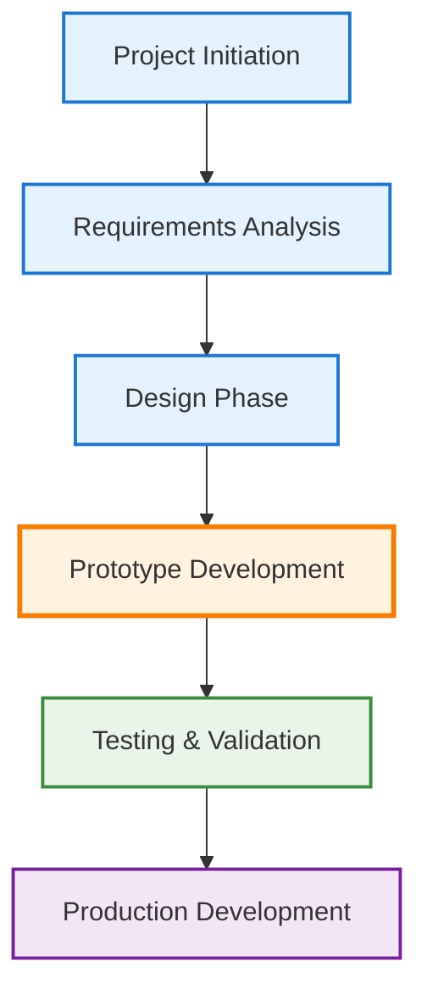

### 1.1 Prototype Development Phase Details
```mermaid
flowchart LR
    D[Prototype Development] --> D1[Environment Setup]
    D1 --> D2[Feature Development]
    D2 --> D3[Component Integration]
    D3 --> D4[Testing Framework]
    D4 --> D5[Documentation]
    
    style D fill:#fff3e0,stroke:#f57c00,stroke-width:3px
    style D1 fill:#ffecb3,stroke:#ffa000,stroke-width:2px
    style D2 fill:#ffecb3,stroke:#ffa000,stroke-width:2px
    style D3 fill:#ffecb3,stroke:#ffa000,stroke-width:2px
    style D4 fill:#ffecb3,stroke:#ffa000,stroke-width:2px
    style D5 fill:#ffecb3,stroke:#ffa000,stroke-width:2px
```

### 2. Prototype Development Workflow
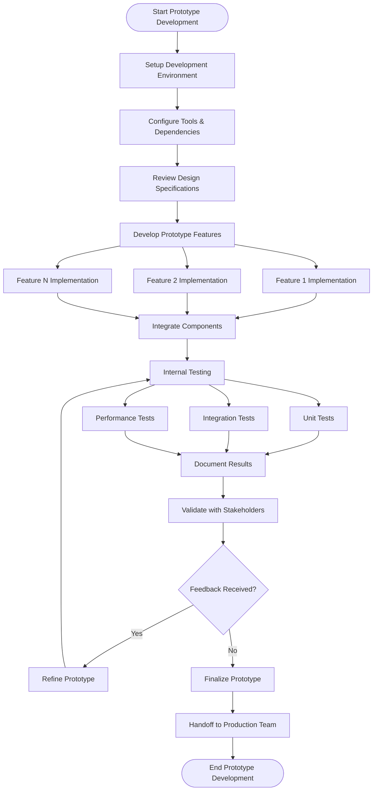

### 3. Component Architecture
```mermaid
flowchart TD
    PM[Project Management Core] --> ES[Environment Setup Service]
    PM --> FD[Feature Development Module]
    PM --> CI[Component Integration]
    PM --> TF[Testing Framework]
    PM --> DG[Documentation Generator]
    
    ES --> VSCode[VS Code Extension]
    ES --> Dependencies[Dependencies Manager]
    ES --> Config[Configuration Manager]
    
    FD --> UI[UI Components]
    FD --> Backend[Backend Services]
    FD --> Database[Database Layer]
    
    CI --> WBS[WBS Aggregator]
    CI --> Workflow[Workflow Manager]
    CI --> DataFlow[Data Flow Controller]
    
    TF --> UnitTests[Unit Testing]
    TF --> IntegrationTests[Integration Testing]
    TF --> PerformanceTests[Performance Testing]
    
    DG --> AutoDocs[Auto Documentation]
    DG --> Reports[Report Generator]
    DG --> GitIntegration[Git Integration]
    
    style PM fill:#e3f2fd,stroke:#1976d2,stroke-width:3px
    style ES fill:#fff3e0,stroke:#f57c00,stroke-width:2px
    style FD fill:#fff3e0,stroke:#f57c00,stroke-width:2px
    style CI fill:#fff3e0,stroke:#f57c00,stroke-width:2px
    style TF fill:#fff3e0,stroke:#f57c00,stroke-width:2px
    style DG fill:#fff3e0,stroke:#f57c00,stroke-width:2px
```

### 3.1 Component Details
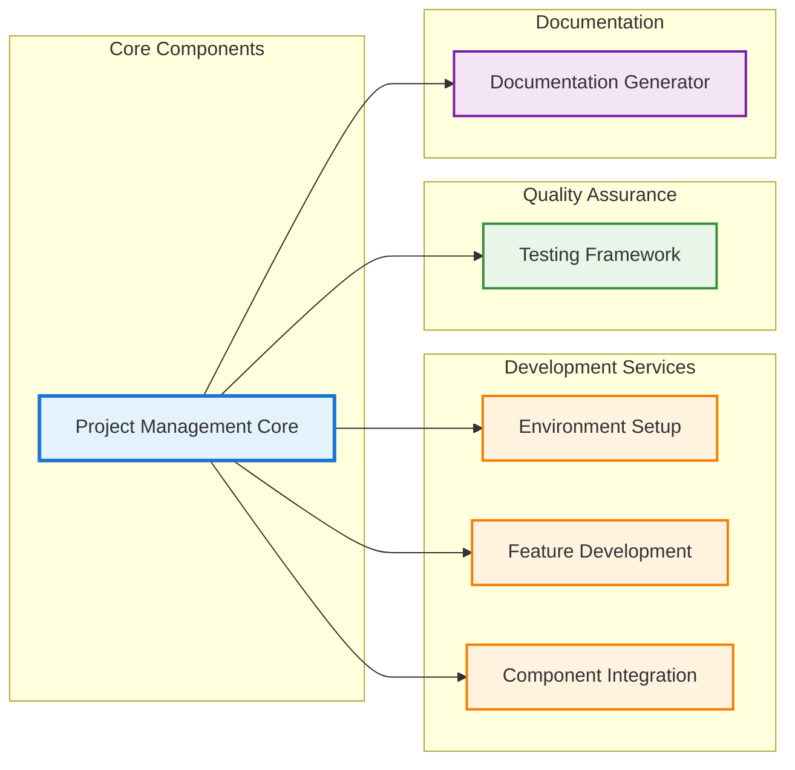

### 4. Data Flow Architecture
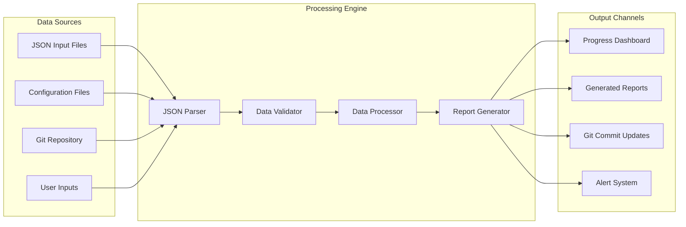

### 5. Testing Architecture
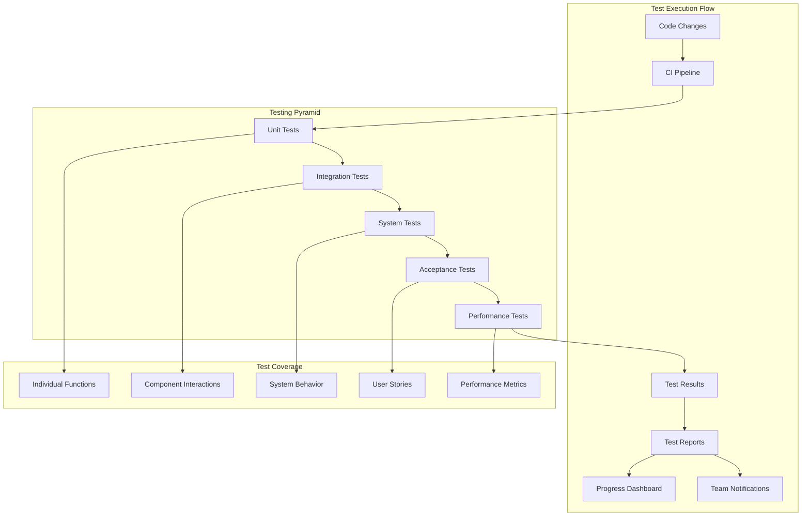

### 6. Environment Setup Architecture
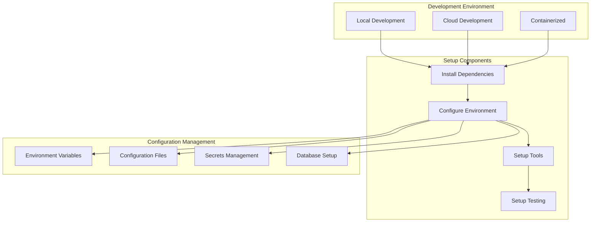

### 7. Integration Points Diagram
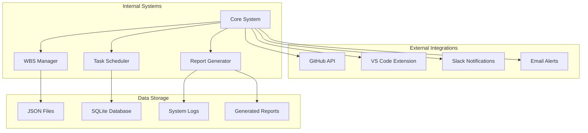

### 8. Prototype Lifecycle
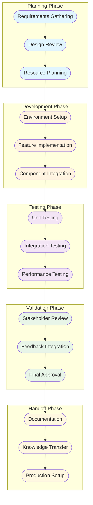

### 9. Error Handling Architecture
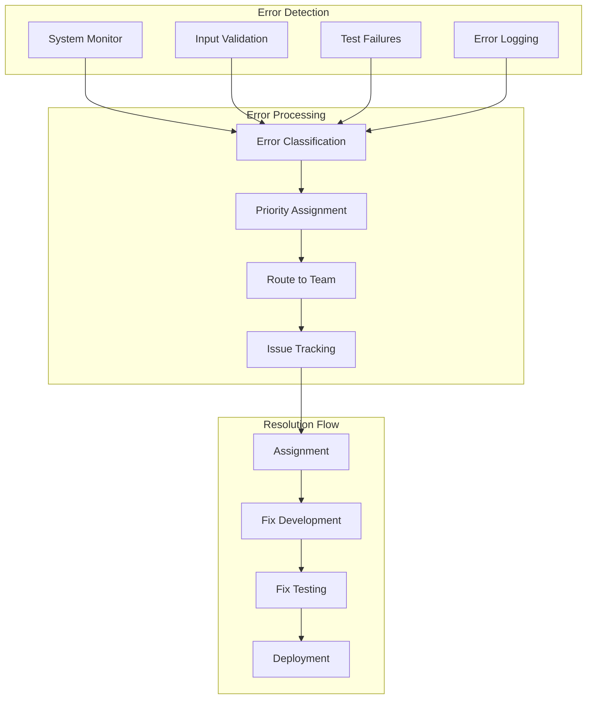

### 10. Performance Monitoring
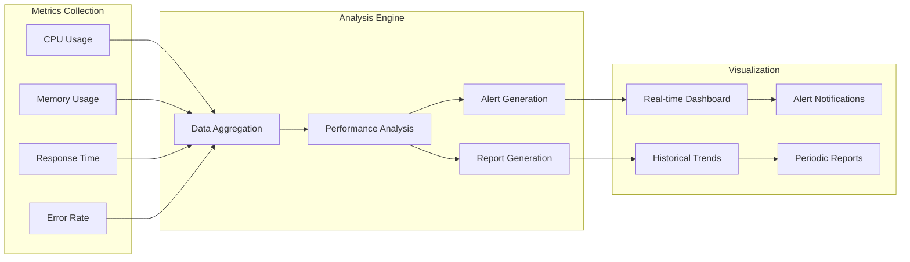

# Prototype Development Documentation

This document provides comprehensive documentation for the prototype development phase within the AutoProjectManagement system. It outlines the structured approach to developing prototypes based on design specifications and serves as a guide for implementing the prototype development workflow.

## Overview

The prototype development phase is a critical component of the modeling process, focusing on creating functional prototypes that validate design concepts and demonstrate key features before full-scale development. This phase ensures early identification of potential issues and provides stakeholders with tangible demonstrations of proposed solutions.

## Architecture and Structure

### WBS Integration
The prototype development is integrated into the Work Breakdown Structure (WBS) as follows:
- **WBS ID**: WBS-Modeling-4.2
- **Phase**: Modeling
- **Category**: Prototyping
- **Level**: 4 (with extensibility to 7 levels)

### JSON Schema Structure
```json
{
  "id": "WBS-Modeling-4.2",
  "name": "Prototype Development",
  "description": "Develop initial prototypes based on design specifications",
  "level_0": "Software Project",
  "level_1": "Modeling",
  "level_2": "Prototyping",
  "level_3": "Prototype Development",
  "subtasks": [...]
}
```

## Core Components

### 1. Development Environment Setup
**Purpose**: Establish the technical foundation for prototype development
**Tasks**:
- Configure development environments (local/cloud)
- Set up version control integration
- Install required dependencies and tools
- Configure IDE settings and extensions
- Establish development standards and conventions

**Implementation Details**:
- Automated environment setup through `setup_initialization.py`
- Integration with VS Code extensions via `vscode_extension.py`
- Dependency management through `requirements.txt` and `setup_env.sh`

### 2. Prototype Feature Development
**Purpose**: Implement core prototype features based on design specifications
**Tasks**:
- Develop individual prototype components
- Implement user interface mockups
- Create functional demonstrations
- Establish data flow and state management
- Implement basic business logic

**Implementation Details**:
- Modular component development approach
- Integration with existing project management modules
- Utilization of established design patterns and conventions

### 3. Component Integration
**Purpose**: Combine individual prototype components into cohesive systems
**Tasks**:
- Establish inter-component communication
- Implement data sharing mechanisms
- Create unified user experience
- Ensure consistent styling and behavior
- Validate component compatibility

**Implementation Details**:
- Integration with `wbs_aggregator.py` for component management
- Utilization of `workflow_data_collector.py` for data flow
- Testing through `integration_manager.py`

### 4. Internal Testing Framework
**Purpose**: Validate prototype functionality and identify issues
**Tasks**:
- Develop unit tests for individual components
- Create integration tests for component interactions
- Implement automated testing pipelines
- Establish performance benchmarks
- Document test results and findings

**Implementation Details**:
- Integration with comprehensive testing framework
- Automated test execution via `run_tests.py`
- Test documentation through `test_docs/`
- Performance testing via `PerformanceTests/`

### 5. Documentation and Knowledge Transfer
**Purpose**: Create comprehensive documentation for prototype development
**Tasks**:
- Document prototype architecture and design decisions
- Create user guides and technical documentation
- Establish knowledge transfer mechanisms
- Prepare handoff documentation for development teams
- Maintain change logs and version history

**Implementation Details**:
- Automated documentation generation via `documentation_automation.py`
- Integration with `ModuleDocs/` for technical documentation
- Version control integration through `git_progress_updater.py`

## Implementation Workflow

### Phase 1: Planning and Setup
1. **Environment Analysis**: Assess current development environment
2. **Resource Allocation**: Determine required resources and tools
3. **Timeline Establishment**: Set realistic development milestones
4. **Risk Assessment**: Identify potential development risks

### Phase 2: Development Execution
1. **Component Development**: Build individual prototype features
2. **Integration Testing**: Continuously test component interactions
3. **Iterative Refinement**: Refine based on feedback and testing
4. **Performance Optimization**: Optimize for usability and performance

### Phase 3: Validation and Handoff
1. **Comprehensive Testing**: Execute full test suite
2. **Stakeholder Review**: Present prototypes to stakeholders
3. **Feedback Integration**: Incorporate stakeholder feedback
4. **Documentation Finalization**: Complete all documentation
5. **Production Handoff**: Prepare for full development phase

## Technical Specifications

### Supported Technologies
- **Frontend**: HTML5, CSS3, JavaScript (ES6+)
- **Backend**: Python 3.8+, Flask/FastAPI
- **Database**: SQLite, PostgreSQL, MongoDB
- **Testing**: pytest, Selenium, Jest
- **Documentation**: Markdown, Sphinx, JSDoc

### Integration Points
- **Project Management**: Full integration with existing WBS structure
- **Version Control**: Git integration with automated commit tracking
- **CI/CD**: GitHub Actions integration for automated testing
- **Documentation**: Automated documentation generation and updates

### Extensibility Framework
The prototype development system is designed for extensibility:
- **Level 5-7 Customization**: Project-specific extensions
- **Plugin Architecture**: Support for custom prototype types
- **Template System**: Reusable prototype templates
- **Configuration Management**: Environment-specific configurations

## Quality Assurance

### Testing Standards
- **Unit Test Coverage**: Minimum 80% code coverage
- **Integration Testing**: All component interactions tested
- **Performance Testing**: Load testing for user-facing features
- **Security Testing**: Vulnerability assessment and remediation
- **Usability Testing**: User experience validation

### Documentation Standards
- **Code Documentation**: All public APIs documented
- **User Documentation**: Step-by-step usage guides
- **Technical Documentation**: Architecture and design decisions
- **Change Documentation**: Version history and migration guides

## Monitoring and Reporting

### Progress Tracking
- **Automated Progress Updates**: Real-time progress tracking
- **Dashboard Integration**: Visual progress indicators
- **Report Generation**: Automated progress and status reports
- **Alert System**: Notifications for milestones and issues

### Metrics Collection
- **Development Velocity**: Feature completion rates
- **Quality Metrics**: Bug discovery and resolution rates
- **Performance Metrics**: Response times and resource utilization
- **User Feedback**: Stakeholder satisfaction scores

## Best Practices

### Development Guidelines
- **Code Quality**: Follow established coding standards
- **Documentation**: Maintain comprehensive documentation
- **Testing**: Implement test-driven development
- **Version Control**: Use meaningful commit messages
- **Review Process**: Implement peer review for all changes

### Security Considerations
- **Data Protection**: Implement appropriate security measures
- **Access Control**: Implement role-based access control
- **Audit Trail**: Maintain comprehensive audit logs
- **Compliance**: Ensure compliance with relevant standards

## Troubleshooting Guide

### Common Issues
- **Environment Setup**: Check dependency versions and configurations
- **Integration Failures**: Verify component compatibility
- **Performance Issues**: Analyze resource utilization
- **Documentation Gaps**: Ensure all features are documented

### Support Resources
- **Documentation**: Comprehensive guides and references
- **Community**: Access to development community
- **Support Channels**: Dedicated support for technical issues
- **Knowledge Base**: Searchable repository of solutions

## Future Enhancements

### Planned Features
- **AI-Assisted Development**: Integration with AI development tools
- **Advanced Analytics**: Enhanced metrics and reporting
- **Collaboration Tools**: Real-time collaboration features
- **Mobile Support**: Mobile-optimized prototype development

### Scalability Improvements
- **Cloud Integration**: Enhanced cloud deployment options
- **Microservices Architecture**: Scalable service architecture
- **Performance Optimization**: Enhanced performance capabilities
- **Global Deployment**: Multi-region deployment support

---

This documentation serves as the comprehensive guide for prototype development within the AutoProjectManagement system. It provides the technical foundation, implementation guidelines, and best practices for successful prototype development and validation.
