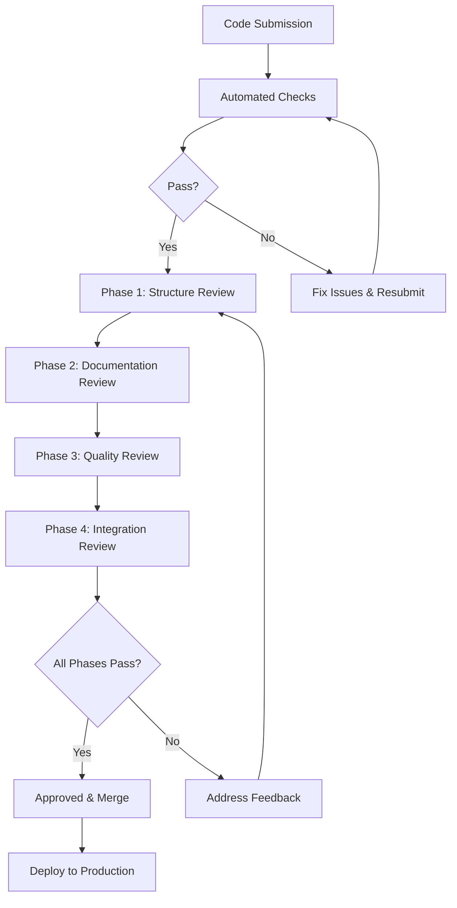
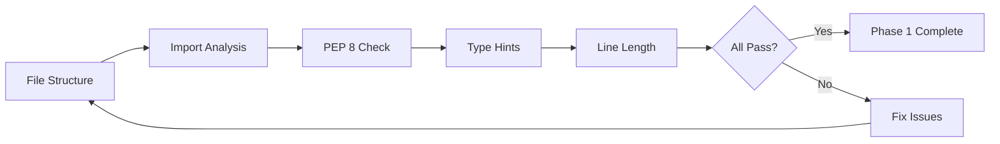
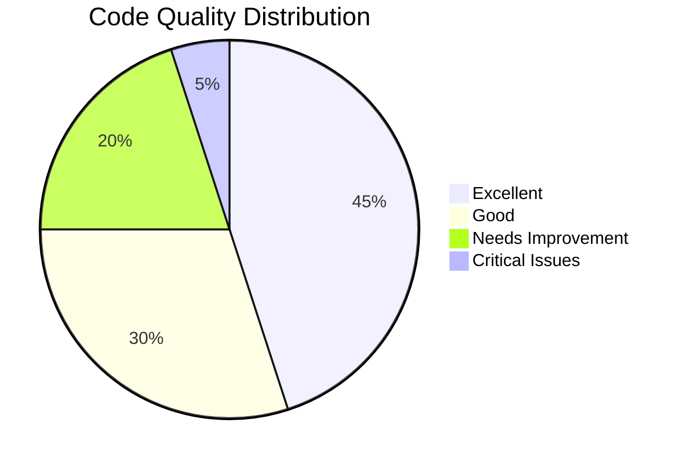
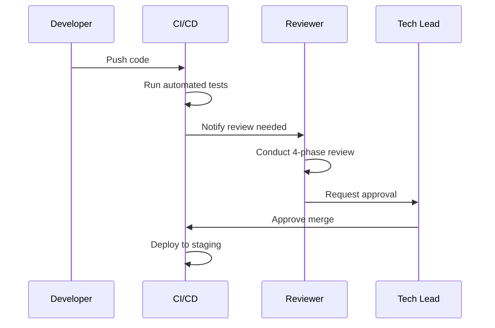
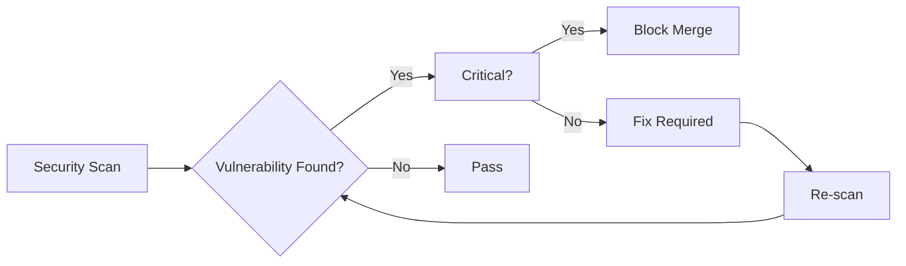
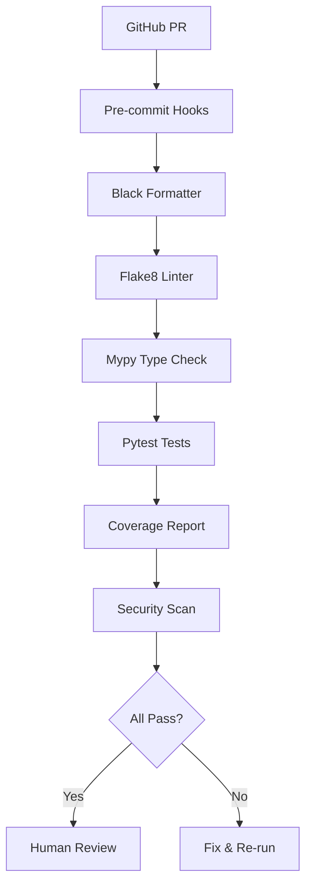
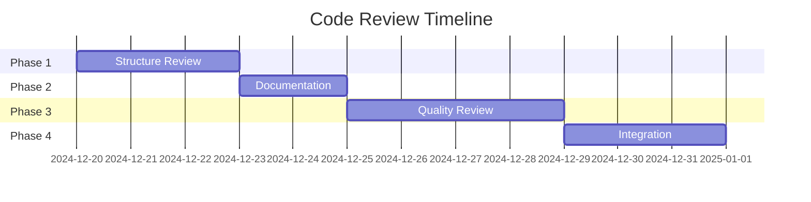
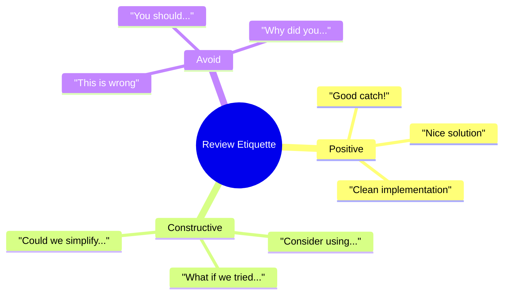

# Code Review Guidelines - AutoProjectManagement

## 📋 Table of Contents
1. [Executive Summary](#executive-summary)
2. [Code Review Process Overview](#code-review-process-overview)
3. [Review Phases & Checklists](#review-phases--checklists)
4. [Quality Standards](#quality-standards)
5. [Review Tools & Automation](#review-tools--automation)
6. [Metrics & Reporting](#metrics--reporting)
7. [Common Issues & Solutions](#common-issues--solutions)
8. [Best Practices](#best-practices)
9. [Templates & Forms](#templates--forms)

---

## 🎯 Executive Summary

This document establishes comprehensive code review guidelines for the AutoProjectManagement system, ensuring consistent code quality, maintainability, and adherence to industry standards across all 57 project files.

### Key Objectives
- **Quality Assurance**: Maintain 85%+ code coverage and 100% PEP 8 compliance
- **Documentation**: Ensure 100% public API documentation coverage
- **Security**: Zero critical vulnerabilities in production code
- **Performance**: Meet defined performance benchmarks
- **Maintainability**: Reduce technical debt by 20% quarterly

---

## 🔄 Code Review Process Overview

### Process Flow Diagram



### Review Roles & Responsibilities

| Role | Responsibilities | Required Skills |
|------|------------------|-----------------|
| **Author** | Submit clean code, respond to feedback, fix issues | Python expertise, project knowledge |
| **Reviewer** | Conduct thorough review, provide actionable feedback | Code review experience, domain knowledge |
| **Tech Lead** | Final approval, conflict resolution | Architecture understanding, leadership |
| **Automation** | Run tests, style checks, security scans | CI/CD expertise |

---

## 📊 Review Phases & Checklists

### Phase 1: Structure & Standards Review

#### Checklist Matrix

| Category | Check Item | Priority | Example | Auto-Check |
|----------|------------|----------|---------|------------|
| **Imports** | No unused imports | High | `import os` (unused) | ✅ |
| **Structure** | Logical file organization | Medium | Separate concerns | ✅ |
| **Standards** | PEP 8 compliance | High | `snake_case` naming | ✅ |
| **Types** | Complete type hints | High | `def func(x: int) -> str` | ✅ |
| **Length** | ≤79 characters/line | Medium | Line wrapping needed | ✅ |

#### Structure Review Flow



### Phase 2: Documentation Review

#### Documentation Standards Table

| Element | Required | Format | Example |
|---------|----------|--------|---------|
| **Module Docstring** | ✅ | Google Style | `"""Module for..."""` |
| **Class Docstring** | ✅ | Args/Returns | See template below |
| **Method Docstring** | ✅ | Parameters | See template below |
| **Inline Comments** | Medium complexity | Clear & concise | `# Process user input` |
| **README Updates** | ✅ | Usage examples | See template section |

#### Documentation Template

```python
"""
[Module/Class/Function] for [specific purpose].

This [module/class/function] provides [brief description of functionality].
It handles [list of responsibilities] and integrates with [related components].

Args:
    param1 (type): Description of parameter 1
    param2 (type): Description of parameter 2

Returns:
    return_type: Description of return value

Raises:
    ValueError: When [specific condition]
    TypeError: When [specific condition]

Example:
    >>> from module import ClassName
    >>> instance = ClassName(param1, param2)
    >>> result = instance.method()
    >>> print(result)
"""

class ExampleClass:
    """Example class demonstrating documentation standards."""
    
    def example_method(self, param: str) -> bool:
        """Process input parameter and return boolean result."""
        # Implementation here
        return True
```

### Phase 3: Code Quality Review

#### Quality Metrics Dashboard



#### Quality Checklist Categories

| Category | Metric | Target | Tool | Auto-Check |
|----------|--------|--------|------|------------|
| **Complexity** | Cyclomatic complexity | ≤10 | Radon | ✅ |
| **Duplication** | Code duplication | ≤5% | Pylint | ✅ |
| **Maintainability** | Maintainability index | ≥70 | Radon | ✅ |
| **Security** | Security issues | 0 | Bandit | ✅ |

#### Common Quality Issues & Solutions

| Issue Type | Example | Solution | Prevention |
|------------|---------|----------|------------|
| **Magic Numbers** | `if x > 42:` | Use constants | Define at module level |
| **Deep Nesting** | 4+ levels | Extract methods | Early returns |
| **Long Methods** | >50 lines | Split functions | Single responsibility |
| **Resource Leaks** | Open files | Use context managers | Always use `with` |

### Phase 4: Integration Review

#### Integration Test Matrix

| Component | Unit Tests | Integration Tests | Mock Tests | Coverage |
|-----------|------------|-------------------|------------|----------|
| **Core Files** | ✅ | ✅ | ✅ | 85%+ |
| **API Layer** | ✅ | ✅ | ✅ | 90%+ |
| **Main Modules** | ✅ | ✅ | ✅ | 80%+ |
| **Services** | ✅ | ✅ | ✅ | 85%+ |

#### Integration Review Process



---

## 📏 Quality Standards

### Python Code Quality Standards

#### PEP 8 Compliance Checklist

| Rule Category | Examples | Auto-Fix Available |
|---------------|----------|-------------------|
| **Naming** | `snake_case`, `PascalCase` | ✅ |
| **Indentation** | 4 spaces, no tabs | ✅ |
| **Line Length** | ≤79 characters | ✅ |
| **Imports** | Standard, third-party, local | ✅ |
| **Whitespace** | Around operators | ✅ |

#### Type Hint Standards

```python
from typing import List, Dict, Optional, Union, Any

# Function with complete type hints
def process_data(
    items: List[Dict[str, Any]],
    threshold: Optional[float] = None,
    *,
    strict: bool = True
) -> Union[List[str], Dict[str, int]]:
    """Process data items with optional threshold."""
    # Implementation
    return []
```

### Security Standards

#### Security Scan Results



#### Security Checklist

| Security Aspect | Check | Tool | Severity |
|-----------------|--------|------|----------|
| **SQL Injection** | Parameterized queries | Bandit | High |
| **XSS** | Input validation | Bandit | High |
| **Code Injection** | Safe eval usage | Bandit | Critical |
| **Hardcoded Secrets** | No secrets in code | Bandit | Critical |

---

## 🛠️ Review Tools & Automation

### Automated Review Pipeline



### Tool Configuration

#### Pre-commit Configuration
```yaml
# .pre-commit-config.yaml
repos:
  - repo: https://github.com/psf/black
    rev: 23.1.0
    hooks:
      - id: black
        language_version: python3.9
        
  - repo: https://github.com/pycqa/flake8
    rev: 6.0.0
    hooks:
      - id: flake8
        args: [--max-line-length=79]
        
  - repo: https://github.com/pre-commit/mirrors-mypy
    rev: v1.0.1
    hooks:
      - id: mypy
        additional_dependencies: [types-all]
```

#### GitHub Actions Workflow
```yaml
# .github/workflows/code-review.yml
name: Code Quality Review
on: [pull_request]

jobs:
  quality-check:
    runs-on: ubuntu-latest
    steps:
      - uses: actions/checkout@v3
      
      - name: Set up Python
        uses: actions/setup-python@v4
        with:
          python-version: '3.9'
          
      - name: Install dependencies
        run: |
          pip install -r requirements-dev.txt
          
      - name: Run Black
        run: black --check .
        
      - name: Run Flake8
        run: flake8 .
        
      - name: Run MyPy
        run: mypy .
        
      - name: Run Tests
        run: pytest --cov=autoprojectmanagement tests/
        
      - name: Security Scan
        run: bandit -r autoprojectmanagement/
```

---

## 📊 Metrics & Reporting

### Review Metrics Dashboard



### Quality Metrics Table

| Metric | Current | Target | Tool | Frequency |
|--------|---------|--------|------|-----------|
| **Code Coverage** | 0% | 85% | Coverage.py | Every PR |
| **Cyclomatic Complexity** | TBD | ≤10 | Radon | Weekly |
| **Maintainability Index** | TBD | ≥70 | Radon | Weekly |
| **Security Issues** | TBD | 0 | Bandit | Every PR |
| **Style Violations** | TBD | 0 | Flake8 | Every PR |

### Review Report Template

```markdown
## Code Review Report - [File Name]

### Summary
- **File**: [path/to/file.py]
- **Reviewer**: [Name]
- **Date**: [YYYY-MM-DD]
- **Status**: [Approved/Needs Changes]

### Phase Results
| Phase | Status | Issues Found | Notes |
|-------|--------|--------------|--------|
| 1. Structure | ✅/❌ | [Count] | [Details] |
| 2. Documentation | ✅/❌ | [Count] | [Details] |
| 3. Quality | ✅/❌ | [Count] | [Details] |
| 4. Integration | ✅/❌ | [Count] | [Details] |

### Critical Issues
1. [Issue 1 - Priority: High]
2. [Issue 2 - Priority: Medium]

### Recommendations
- [Recommendation 1]
- [Recommendation 2]

### Next Steps
- [ ] Fix identified issues
- [ ] Re-review after fixes
- [ ] Merge when approved
```

---

## 🔍 Common Issues & Solutions

### Issue Categories & Resolution

#### Category 1: Style & Formatting

| Issue | Example | Solution | Prevention |
|-------|---------|----------|------------|
| **Line too long** | `very_long_variable_name = some_really_long_function_call_with_many_parameters()` | Break into multiple lines | Use IDE auto-format |
| **Import order** | `import local_module\nimport sys` | Follow PEP 8 order | Pre-commit hooks |
| **Naming** | `CamelCase` for functions | Use `snake_case` | Linting tools |

#### Category 2: Documentation

| Issue | Example | Solution | Prevention |
|-------|---------|----------|------------|
| **Missing docstring** | `def process(): pass` | Add comprehensive docstring | Pre-commit hooks |
| **Outdated docs** | Function changed, docs not updated | Update with changes | Review checklist |
| **Poor examples** | `>>> process()` | Add realistic examples | Code review |

#### Category 3: Code Quality

| Issue | Example | Solution | Prevention |
|-------|---------|----------|------------|
| **Deep nesting** | 4+ if/for levels | Extract methods | Early returns |
| **Long functions** | >50 lines | Split into smaller functions | Complexity limits |
| **Magic numbers** | `if x > 42:` | Use named constants | Code review |

---

## ✅ Best Practices

### Review Best Practices

#### For Authors
1. **Self-review first**: Check your code before submitting
2. **Small PRs**: Keep changes focused and manageable
3. **Clear descriptions**: Explain what and why in PR description
4. **Test thoroughly**: Ensure all tests pass locally

#### For Reviewers
1. **Be constructive**: Focus on the code, not the person
2. **Ask questions**: Clarify intent when unclear
3. **Suggest improvements**: Provide specific solutions
4. **Prioritize issues**: Focus on critical issues first

#### Review Etiquette



---

## 📋 Templates & Forms

### Review Request Template

```markdown
## Code Review Request

### PR Details
- **Title**: [Brief description]
- **Files Changed**: [List of files]
- **Type**: [Bug fix/Feature/Refactoring]

### Testing
- [ ] Unit tests added/updated
- [ ] Integration tests pass
- [ ] Manual testing completed

### Checklist
- [ ] Code follows style guidelines
- [ ] Self-review completed
- [ ] Documentation updated
- [ ] No breaking changes

### Additional Notes
[Any special considerations]
```

### Review Response Template

```markdown
## Review Response

### Reviewer: [Name]
### Date: [YYYY-MM-DD]

### Overall Assessment
- **Quality**: [Excellent/Good/Needs Work]
- **Complexity**: [Simple/Moderate/Complex]
- **Risk**: [Low/Medium/High]

### Detailed Feedback

#### Phase 1: Structure
- ✅ All imports are necessary
- ✅ PEP 8 compliant
- ❌ Missing type hints in 3 functions

#### Phase 2: Documentation
- ✅ Good module docstring
- ❌ Missing method docstrings
- ❌ No usage examples

#### Phase 3: Quality
- ✅ Good error handling
- ❌ Magic number on line 45
- ❌ Function too long (80 lines)

#### Phase 4: Integration
- ✅ Tests pass
- ❌ Missing edge case tests
- ✅ No breaking changes

### Required Changes
1. Add type hints to all public methods
2. Extract long function into smaller ones
3. Add comprehensive tests

### Approval Status
- [ ] Approved
- [ ] Approved with minor changes
- [ ] Request changes
- [ ] Needs discussion
```

---

## 📚 Additional Resources

### Quick Reference Cards

#### PEP 8 Quick Reference
```python
# ✅ Good
def calculate_total(items: List[float]) -> float:
    """Calculate total of numeric items."""
    return sum(items)

# ❌ Bad
def CalculateTotal(items):
    return sum(items)
```

#### Type Hints Quick Reference
```python
from typing import List, Dict, Optional, Union, Any, Callable

# Basic types
def process(name: str, age: int) -> bool:
    ...

# Complex types
def handle_data(
    items: List[Dict[str, Any]],
    callback: Optional[Callable[[str], None]] = None
) -> Union[str, int]:
    ...
```

### Useful Commands

```bash
# Run all quality checks
make quality-check

# Format code
black .

# Check types
mypy autoprojectmanagement/

# Run tests with coverage
pytest --cov=autoprojectmanagement tests/

# Security scan
bandit -r autoprojectmanagement/

# Complexity analysis
radon cc autoprojectmanagement/ -a
```

---

## 🔄 Maintenance & Updates

### Version History
| Version | Date | Changes | Author |
|---------|------|---------|--------|
| 1.0.0 | 2024-12-20 | Initial comprehensive guidelines | BLACKBOXAI |
| 1.1.0 | TBD | Add performance benchmarks | TBD |
| 1.2.0 | TBD | Update security guidelines | TBD |

### Review Schedule
- **Monthly**: Update tools and dependencies
- **Quarterly**: Review and refine guidelines
- **Annually**: Complete guideline overhaul

---

## 📞 Support & Contact

For questions or suggestions regarding these guidelines:
- **Create GitHub Issue**: Use `code-review-guidelines` label
- **Documentation Updates**: Submit PR with `docs-update` label
- **Tool Issues**: Contact DevOps team

---

*This document is a living guide that evolves with the project. Last updated: December 20, 2024*
