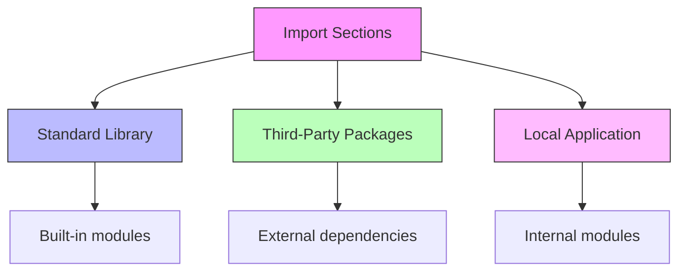
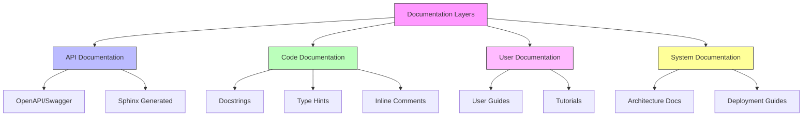
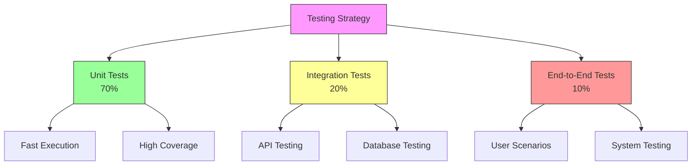
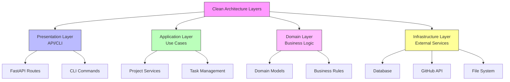
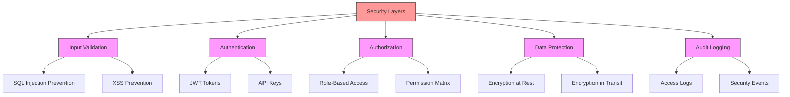
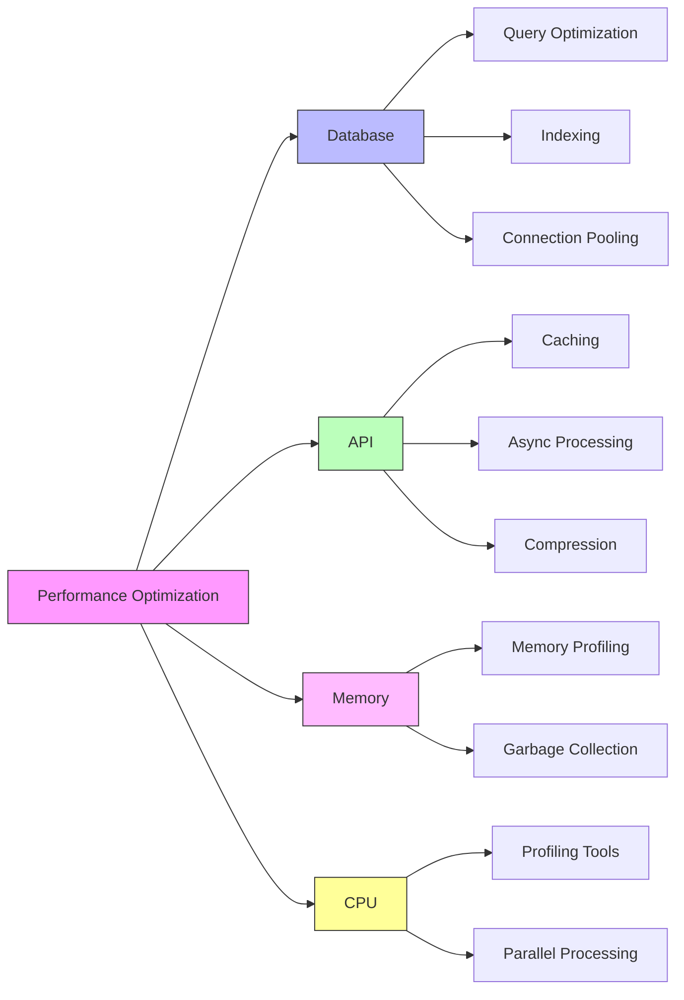
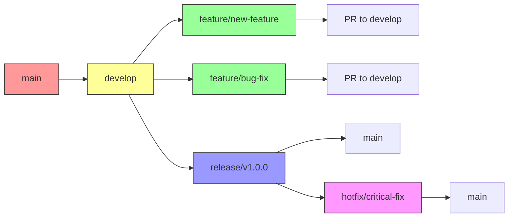
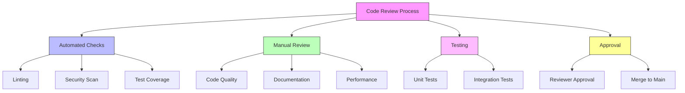

# Coding Standards Document

## Table of Contents
1. [Introduction](#introduction)
2. [Code Style Guidelines](#code-style-guidelines)
3. [Naming Conventions](#naming-conventions)
4. [Documentation Standards](#documentation-standards)
5. [Testing Standards](#testing-standards)
6. [Architecture Patterns](#architecture-patterns)
7. [Security Guidelines](#security-guidelines)
8. [Performance Standards](#performance-standards)
9. [Git Workflow](#git-workflow)
10. [Code Review Process](#code-review-process)
11. [Quality Metrics](#quality-metrics)

---

## Introduction

This document establishes comprehensive coding standards for the AutoProjectManagement system. These standards ensure consistency, maintainability, and quality across all codebase components. All team members must adhere to these guidelines to maintain code quality and facilitate collaboration.

### Purpose
- Ensure consistent code style across the project
- Improve code readability and maintainability
- Reduce bugs and technical debt
- Facilitate onboarding of new team members
- Enable automated code quality checks

### Scope
These standards apply to:
- All Python source code
- API implementations
- Database schemas
- Configuration files
- Documentation
- Tests

---

## Code Style Guidelines

### Python Style Guide

We follow **PEP 8** with the following project-specific extensions:

#### Line Length and Formatting
- **Maximum line length**: 88 characters (Black formatter default)
- **Indentation**: 4 spaces (no tabs)
- **Continuation lines**: Use implicit line continuation with parentheses

#### Imports Organization
```python
# Standard library imports
import os
import sys
from typing import Dict, List, Optional

# Third-party imports
import requests
from fastapi import FastAPI, HTTPException

# Local application imports
from autoprojectmanagement.models import Project
from autoprojectmanagement.services.github_integration import GitHubService
```

#### Import Order Diagram


#### Code Structure Standards

| Element | Standard | Example |
|---------|----------|---------|
| Class definitions | One class per file (unless tightly coupled) | `class ProjectManager:` |
| Method ordering | Public → Protected → Private | `def public_method()` → `def _protected_method()` → `def __private_method()` |
| Constants | UPPER_CASE at module level | `MAX_RETRY_COUNT = 3` |
| Type hints | Required for all public APIs | `def process_data(data: List[str]) -> Dict[str, Any]:` |

---

## Naming Conventions

### Naming Convention Matrix

| Entity | Convention | Pattern | Examples |
|--------|------------|---------|----------|
| Packages | lowercase | `lowercase` | `autoprojectmanagement` |
| Modules | lowercase with underscores | `snake_case` | `project_manager.py` |
| Classes | PascalCase | `PascalCase` | `ProjectManager` |
| Functions | snake_case | `snake_case` | `calculate_velocity()` |
| Variables | snake_case | `snake_case` | `total_tasks` |
| Constants | UPPER_CASE | `UPPER_CASE` | `DEFAULT_TIMEOUT` |
| Private members | leading underscore | `_private_var` | `_internal_cache` |

### Naming Convention Flowchart
```mermaid
flowchart TD
    A[Entity Type] --> B{What is it?}
    
    B -->|Package| C[Use lowercase<br/>autoprojectmanagement]
    B -->|Module| D[Use snake_case<br/>project_manager.py]
    B -->|Class| E[Use PascalCase<br/>ProjectManager]
    B -->|Function| F[Use snake_case<br/>calculate_velocity]
    B -->|Variable| G[Use snake_case<br/>total_tasks]
    B -->|Constant| H[Use UPPER_CASE<br/>DEFAULT_TIMEOUT]
    
    C --> I[✓ Valid package name]
    D --> J[✓ Valid module name]
    E --> K[✓ Valid class name]
    F --> L[✓ Valid function name
    G --> M[✓ Valid variable name]
    H --> N[✓ Valid constant name]
    
    style A fill:#f9f,stroke:#333
    style B fill:#bbf,stroke:#333
    style C fill:#9f9,stroke:#333
    style D fill:#9f9,stroke:#333
    style E fill:#9f9,stroke:#333
    style F fill:#9f9,stroke:#333
    style G fill:#9f9,stroke:#333
    style H fill:#9f9,stroke:#333
```

---

## Documentation Standards

### Docstring Standards

We use **Google-style docstrings** for all public classes, methods, and functions.

#### Function Documentation Template
```python
def process_project_data(
    project_id: str,
    include_history: bool = False,
    max_depth: int = 3
) -> Dict[str, Any]:
    """
    Process and analyze project data for reporting.
    
    This function aggregates project information, calculates metrics,
    and prepares data for visualization and reporting purposes.
    
    Args:
        project_id: Unique identifier for the project
        include_history: Whether to include historical data in analysis
        max_depth: Maximum depth for nested data retrieval
        
    Returns:
        Dictionary containing processed project data with the following structure:
        {
            'metrics': Dict[str, float],
            'timeline': List[Dict],
            'resources': Dict[str, Any]
        }
        
    Raises:
        ValueError: If project_id is invalid or not found
        PermissionError: If user lacks access to project data
        
    Example:
        >>> data = process_project_data("PROJ-123", include_history=True)
        >>> print(data['metrics']['completion_rate'])
        0.85
    """
```

### Documentation Coverage Requirements

| Component | Minimum Coverage | Tools |
|-----------|------------------|--------|
| Public APIs | 100% | Sphinx, pydocstyle |
| Classes | 100% | Sphinx |
| Methods | 90% | Coverage.py |
| Complex algorithms | 100% | Inline comments |
| Configuration | 100% | README files |

### Documentation Architecture


---

## Testing Standards

### Testing Pyramid Structure



### Test Coverage Requirements

| Test Type | Minimum Coverage | Target Coverage | Tools |
|-----------|------------------|-----------------|--------|
| Unit Tests | 80% | 90% | pytest, pytest-cov |
| Integration Tests | 70% | 85% | pytest, requests-mock |
| E2E Tests | 60% | 75% | pytest-bdd, selenium |
| Security Tests | 100% critical paths | 100% | bandit, safety |

### Test Structure Standards

```python
# tests/test_project_manager.py
import pytest
from unittest.mock import Mock, patch
from autoprojectmanagement.main_modules.project_management_system import ProjectManager

class TestProjectManager:
    """Test suite for ProjectManager class."""
    
    @pytest.fixture
    def project_manager(self):
        """Create a ProjectManager instance for testing."""
        return ProjectManager()
    
    @pytest.fixture
    def sample_project_data(self):
        """Provide sample project data for tests."""
        return {
            'id': 'PROJ-123',
            'name': 'Test Project',
            'status': 'active'
        }
    
    def test_create_project_success(self, project_manager, sample_project_data):
        """Test successful project creation."""
        # Arrange
        project_data = sample_project_data
        
        # Act
        result = project_manager.create_project(project_data)
        
        # Assert
        assert result['id'] == project_data['id']
        assert result['status'] == 'created'
```

---

## Architecture Patterns

### Clean Architecture Implementation



### Design Patterns Usage

| Pattern | Usage Context | Implementation Example |
|---------|---------------|------------------------|
| Repository | Data access abstraction | `ProjectRepository` |
| Factory | Object creation | `TaskFactory.create_task()` |
| Strategy | Algorithm selection | `ReportGeneratorStrategy` |
| Observer | Event handling | `ProgressUpdateObserver` |
| Adapter | External service integration | `GitHubAPIAdapter` |

---

## Security Guidelines

### Security Checklist



### Security Standards Table

| Security Aspect | Standard | Implementation |
|-----------------|----------|----------------|
| Input validation | Always validate and sanitize | Use pydantic models |
| Authentication | JWT tokens with refresh | 15min access, 7day refresh |
| Authorization | Role-based access control | RBAC with scopes |
| Data encryption | AES-256 for sensitive data | Fernet encryption |
| API rate limiting | 100 requests per minute | Redis-based throttling |
| Secrets management | Environment variables | Never hardcode secrets |

---

## Performance Standards

### Performance Metrics Matrix

| Metric | Target | Measurement Tool | Alert Threshold |
|--------|--------|------------------|-----------------|
| API Response Time | < 200ms | Prometheus | > 500ms |
| Database Query Time | < 100ms | SQLAlchemy events | > 300ms |
| Memory Usage | < 500MB | psutil | > 1GB |
| CPU Usage | < 70% | system monitoring | > 85% |
| Test Execution | < 5 minutes | pytest timing | > 10 minutes |

### Performance Optimization Guidelines



---

## Git Workflow

### Git Branching Strategy



### Git Commit Standards

| Element | Standard | Example |
|---------|----------|---------|
| Commit message format | Conventional Commits | `feat: add new project creation endpoint` |
| Commit types | feat, fix, docs, style, refactor, test, chore | `docs: update API documentation` |
| Commit scope | module/feature | `feat(api): add project endpoints` |
| Commit body | Detailed description | `Add comprehensive project creation with validation` |

---

## Code Review Process

### Code Review Checklist



### Review Criteria Table

| Category | Criteria | Check |
|----------|----------|-------|
| Code Quality | Follows style guide | ✅ |
| Functionality | Meets requirements | ✅ |
| Testing | Adequate test coverage | ✅ |
| Documentation | Updated docs/comments | ✅ |
| Security | No security issues | ✅ |
| Performance | No performance regressions | ✅ |

---

## Quality Metrics

### Quality Gates

| Metric | Threshold | Tool | Action |
|--------|-----------|------|--------|
| Code Coverage | ≥ 80% | pytest-cov | Block merge |
| Complexity | ≤ 10 | radon | Review required |
| Duplication | ≤ 3% | sonar | Refactor needed |
| Security Issues | 0 critical | bandit | Fix immediately |
| Lint Errors | 0 | flake8 | Fix before merge |

### Quality Dashboard

```mermaid
graph TD
    A[Quality Dashboard] --> B[Code Coverage]
    A --> C[Complexity]
    A --> D[Security
    A --> E[Performance
    A --> F[Maintainability
    
    B --> G[80% Target]
    C --> H[Low Complexity]
    D --> I[No Issues]
    E --> J[Fast Response]
    F --> K[Clean Code]
    
    style A fill:#f9f,stroke:#333
    style B fill:#9f9,stroke:#333
    style C fill:#ff9,stroke:#333
    style D fill:#f99,stroke:#333
    style E fill:#99f,stroke:#333
    style F fill:#fbf,stroke:#333
```

---

## Appendix

### Tools and Configuration

#### Required Tools
- **Black**: Code formatter
- **isort**: Import sorting
- **flake8**: Linting
- **mypy**: Type checking
- **pytest**: Testing framework
- **pre-commit**: Git hooks

#### Configuration Files
- `pyproject.toml`: Project configuration
- `.pre-commit-config.yaml`: Pre-commit hooks
- `setup.cfg`: Tool configurations
- `.flake8`: Flake8 settings

### Quick Reference Card

| Task | Command |
|------|---------|
| Format code | `black .` |
| Sort imports | `isort .` |
| Run linting | `flake8` |
| Run tests | `pytest` |
| Type check | `mypy` |
| Security scan | `bandit -r .` |

---

## Version History

| Version | Date | Changes |
|---------|------|---------|
| 1.0.0 | 2025-08-16 | Initial comprehensive coding standards document |
| 1.1.0 | TBD | Future updates based on team feedback |

---

## Contact Information

For questions or suggestions regarding these coding standards, please contact:
- **Team Lead**: AutoProjectManagement Team
- **Email**: team@autoprojectmanagement.com
- **GitHub**: https://github.com/AutoProjectManagement/AutoProjectManagement

---

*This document is maintained by the AutoProjectManagement team and is subject to continuous improvement based on team feedback and industry best practices.*
