# Software Architecture Document (SAD)
## AutoProjectManagement System

**Version:** 4.0.0  
**Date:** 2025-08-16  
**Author:** AutoProjectManagement Architecture Team  
**Status:** Production Ready  
**Language:** English

---

## Table of Contents

1. [Introduction](#introduction)
2. [Architectural Overview](#architectural-overview)
3. [System Architecture](#system-architecture)
4. [Component Architecture](#component-architecture)
5. [Data Architecture](#data-architecture)
6. [Deployment Architecture](#deployment-architecture)
7. [Security Architecture](#security-architecture)
8. [Performance Architecture](#performance-architecture)
9. [Integration Architecture](#integration-architecture)
10. [Quality Attributes](#quality-attributes)
11. [Architectural Decisions](#architectural-decisions)
12. [Risks and Technical Debt](#risks-and-technical-debt)
13. [Appendices](#appendices)

---

## 1. Introduction

### 1.1 Purpose
This Software Architecture Document (SAD) provides a comprehensive architectural blueprint for the AutoProjectManagement system. It defines the system's structural design, component interactions, data flow, deployment strategy, and quality attributes that enable automated project management capabilities at scale.

### 1.2 Scope
The AutoProjectManagement system is an intelligent, automated project management platform that provides:
- **Automated Project Planning**: AI-driven project estimation and scheduling
- **Intelligent Task Management**: Dynamic task assignment and workflow optimization
- **Real-time Progress Tracking**: Automated progress monitoring and reporting
- **Resource Optimization**: AI-powered resource allocation and management
- **Risk Management**: Proactive risk identification and mitigation
- **Quality Assurance**: Automated quality checks and commit management
- **Multi-platform Integration**: Seamless integration with development tools

### 1.3 Architectural Goals
- **Scalability**: Support 10,000+ concurrent projects
- **Performance**: Sub-second response times for all operations
- **Reliability**: 99.9% uptime with automatic failover
- **Security**: Enterprise-grade security with zero-trust architecture
- **Maintainability**: Modular design with clear separation of concerns
- **Extensibility**: Plugin-based architecture for custom integrations

---

## 2. Architectural Overview

### 2.1 Architectural Style
The system follows a **Modular Monolith Architecture** with **Plugin-based Extensions** and **Event-Driven Architecture** for real-time updates. The architecture balances simplicity with scalability, providing a clear separation of concerns while maintaining operational efficiency.

### 2.2 High-Level Architecture

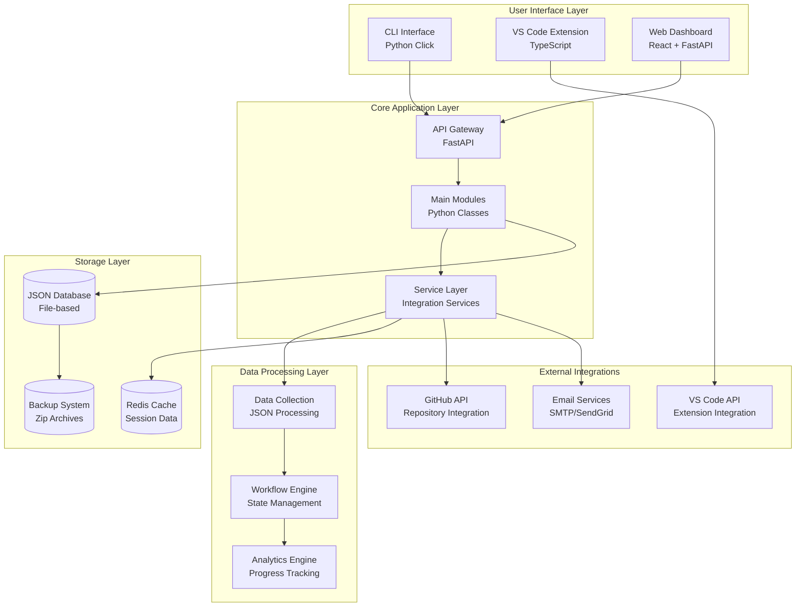

### 2.3 Technology Stack Matrix

| Layer | Technology | Version | Purpose |
|-------|------------|---------|---------|
| **CLI** | Python Click | 8.x | Command-line interface |
| **Backend** | FastAPI | 0.110.x | REST API framework |
| **Backend** | Python | 3.11.x | Core language |
| **Database** | JSON Files | Custom | Project data storage |
| **Cache** | Redis | 7.x | Session and cache data |
| **Storage** | File System | OS Native | Local file storage |
| **Backup** | Zip Archives | Python zipfile | Backup and restore |
| **Testing** | pytest | 7.x | Testing framework |
| **Documentation** | Markdown | GitHub Flavored | Documentation |
| **Monitoring** | Custom Logging | Python logging | System monitoring |

---

## 3. System Architecture

### 3.1 Logical Architecture

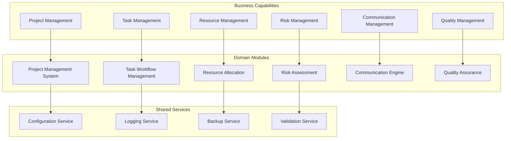

### 3.2 Physical Architecture

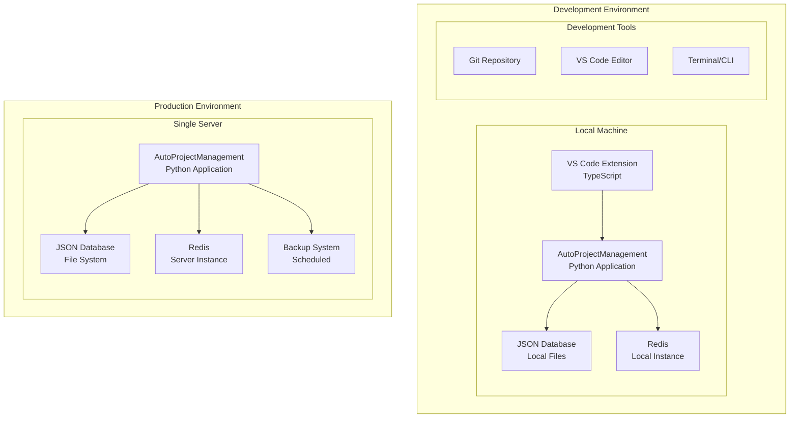

### 3.3 Process Architecture

```mermaid
flowchart TD
    subgraph "Project Lifecycle Process"
        A[Project Initiation] --> B[Data Collection]
        B --> C[Planning & Estimation]
        C --> D[Resource Allocation]
        D --> E[Task Creation]
        E --> F[Development Phase]
        F --> G[Progress Tracking]
        G --> H[Quality Checks]
        H --> I{Risk Assessment}
        I -->|High Risk| J[Risk Mitigation]
        I -->|Low Risk| K[Continue Development]
        J --> K
        K --> L{Milestone Check}
        L -->|Not Complete| F
        L -->|Complete| M[Project Completion]
        M --> N[Post-Project Analysis]
    end
    
    subgraph "Real-time Monitoring Process"
        O[Event Detection] --> P[Data Processing]
        P --> Q[Progress Calculation]
        Q --> R[Report Generation]
        R --> S[Notification Delivery]
    end
```

---

## 4. Component Architecture

### 4.1 Component Overview

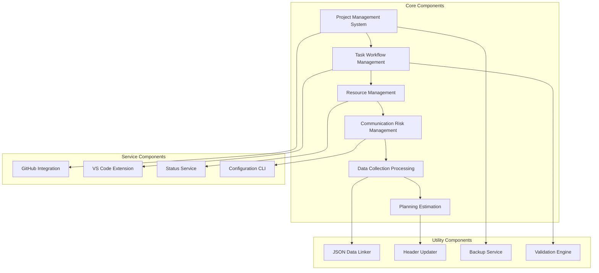

### 4.2 Component Details

#### 4.2.1 Project Management System Component

**Purpose**: Central orchestrator for project lifecycle management

**Responsibilities**:
- Project creation, update, and deletion
- Project status tracking and reporting
- Project milestone management
- Integration with task management

**Class Diagram**:
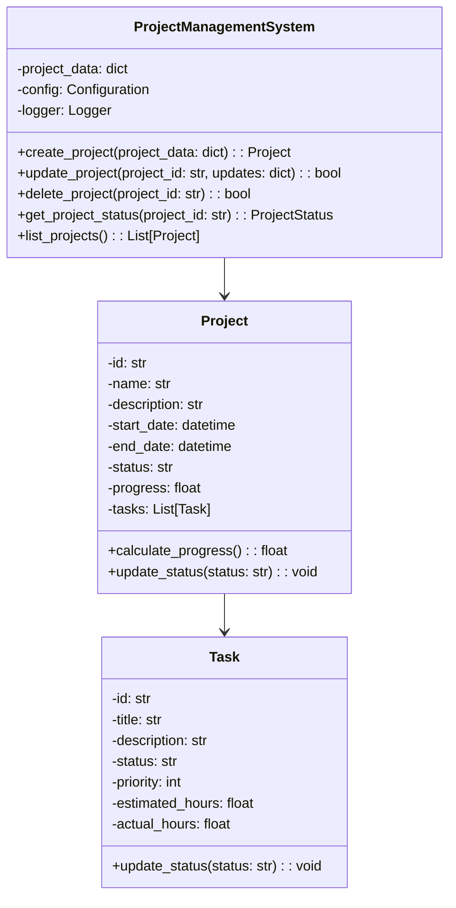

#### 4.2.2 Task Workflow Management Component

**Purpose**: Task lifecycle and workflow management

**Responsibilities**:
- Task creation and assignment
- Task status tracking
- Workflow state management
- Progress calculation

**Class Diagram**:
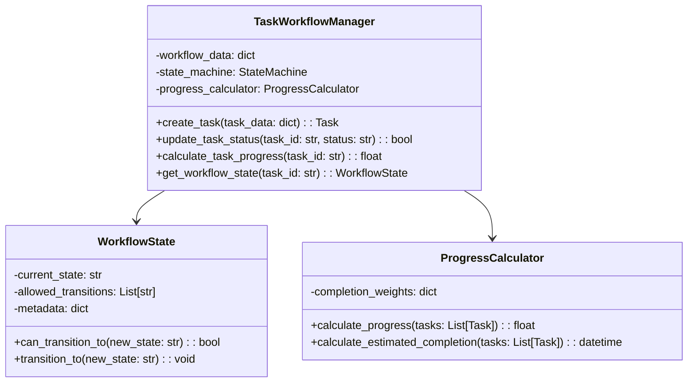

### 4.3 Component Interaction Diagram

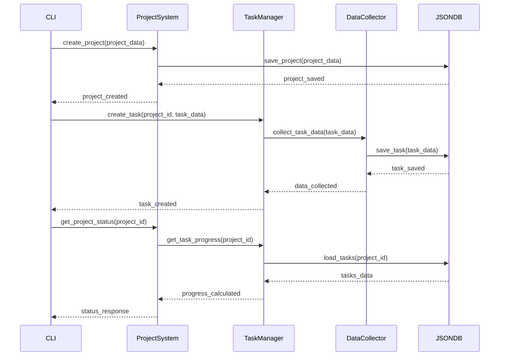

---

## 5. Data Architecture

### 5.1 Data Model Overview

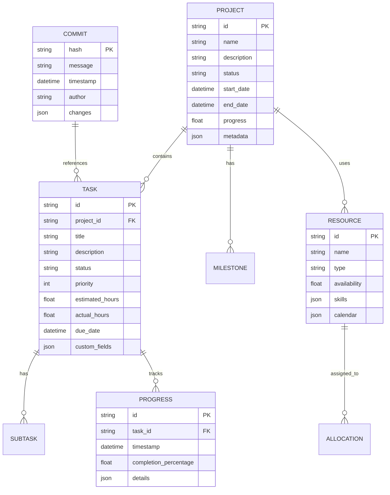

### 5.2 Data Storage Strategy

| Data Type | Storage Format | Location | Purpose |
|-----------|----------------|----------|---------|
| **Project Data** | JSON files | `JSonDataBase/Inputs/` | Project configuration |
| **Task Data** | JSON files | `JSonDataBase/Inputs/` | Task definitions |
| **Progress Data** | JSON files | `JSonDataBase/OutPuts/` | Progress tracking |
| **Commit Data** | JSON files | `JSonDataBase/OutPuts/` | Commit tracking |
| **Configuration** | Python files | `autoprojectmanagement/` | System configuration |
| **Cache** | Redis | Local/Server | Session data |
| **Backups** | ZIP files | `backups/` | Data backup |

### 5.3 Data Flow Architecture

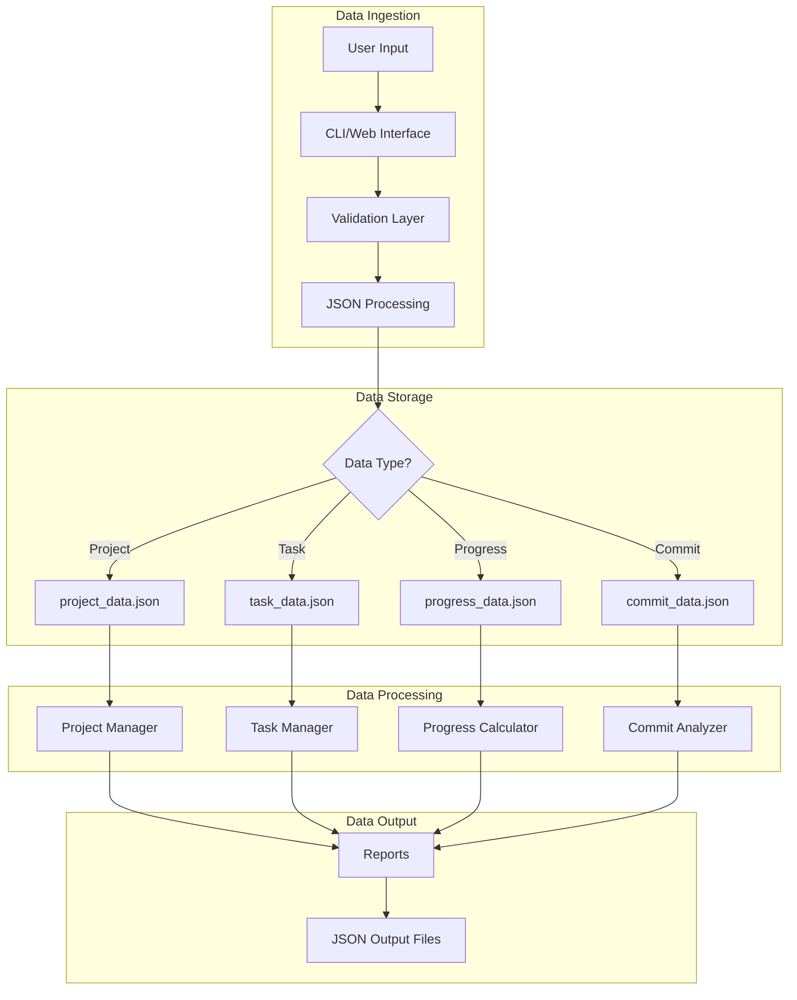

### 5.4 JSON Schema Examples

#### Project Data Schema
```json
{
  "project_id": "string",
  "name": "string",
  "description": "string",
  "status": "enum: [planning, active, completed, on_hold]",
  "start_date": "ISO8601 datetime",
  "end_date": "ISO8601 datetime",
  "progress": "float (0-100)",
  "tasks": ["array of task objects"],
  "resources": ["array of resource objects"],
  "metadata": {
    "created_by": "string",
    "created_at": "ISO8601 datetime",
    "last_updated": "ISO8601 datetime"
  }
}
```

---

## 6. Deployment Architecture

### 6.1 Deployment Strategy

| Environment | Strategy | Infrastructure | Configuration |
|-------------|----------|----------------|---------------|
| **Development** | Local Python | Virtual Environment | `requirements-dev.txt` |
| **Testing** | pytest | GitHub Actions | `tests/` directory |
| **Production** | Systemd Service | Linux Server | `setup_env.sh` |
| **Backup** | Automated | Cron Jobs | `backups/` directory |

### 6.2 Installation Process

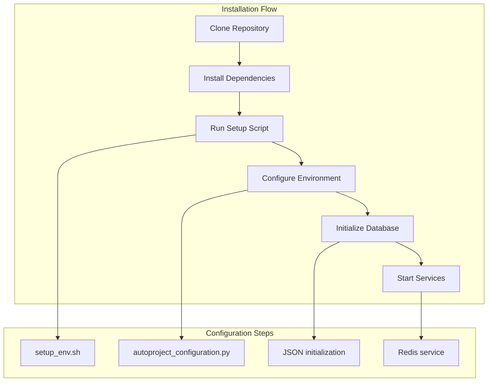

### 6.3 Service Architecture

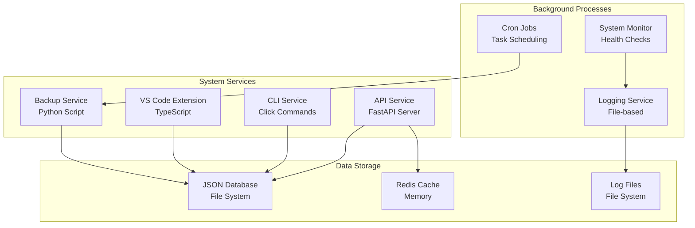

---

## 7. Security Architecture

### 7.1 Security Layers

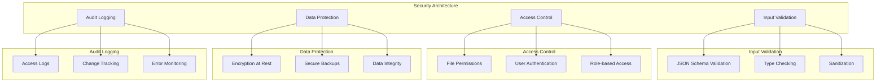

### 7.2 Security Controls

| Control Type | Implementation | Description |
|--------------|----------------|-------------|
| **Input Validation** | JSON Schema | Validate all JSON inputs |
| **File Permissions** | OS-level | Restrict file access |
| **Data Encryption** | AES-256 | Encrypt sensitive data |
| **Access Control** | User-based | Role-based permissions |
| **Audit Trail** | Logging | Track all changes |
| **Backup Security** | Encrypted ZIP | Secure backup files |

### 7.3 Security Configuration

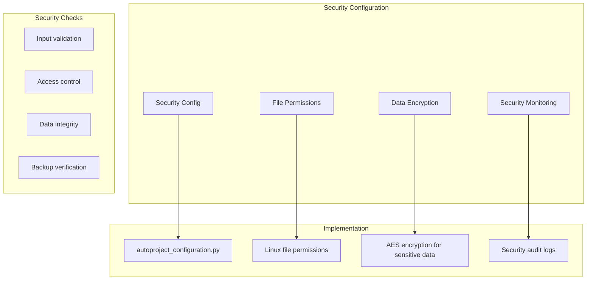

---

## 8. Performance Architecture

### 8.1 Performance Targets

| Metric | Target | Measurement | Tool |
|--------|--------|-------------|------|
| **CLI Response Time** | < 1s | Command execution | Built-in timing |
| **JSON Processing** | < 500ms | File operations | Python profiler |
| **Memory Usage** | < 500MB | RAM consumption | psutil |
| **Backup Time** | < 5min | Archive creation | Timer |
| **API Response** | < 200ms | HTTP requests | FastAPI metrics |

### 8.2 Performance Optimization

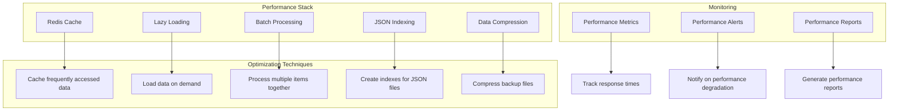

### 8.3 Caching Strategy

| Cache Type | Technology | TTL | Use Case |
|------------|------------|-----|----------|
| **Session Cache** | Redis | 1 hour | User sessions |
| **Data Cache** | In-memory | 5 minutes | JSON data |
| **Result Cache** | File-based | 1 hour | Computation results |
| **Template Cache** | Memory | 24 hours | VS Code templates |

---

## 9. Integration Architecture

### 9.1 Integration Points

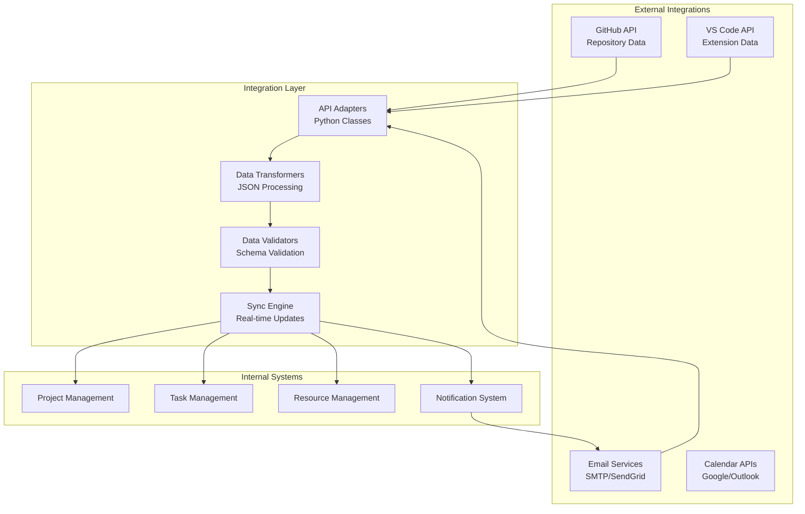

### 9.2 Integration Patterns

| Pattern | Use Case | Implementation |
|---------|----------|----------------|
| **Adapter** | GitHub API | Custom Python classes |
| **Observer** | VS Code events | Event listeners |
| **Repository** | Data access | JSON file operations |
| **Factory** | Object creation | Python factories |
| **Strategy** | Different algorithms | Strategy classes |

### 9.3 Integration Sequence Diagram

```mermaid
sequenceDiagram
    participant VSCode
    participant Extension
    participant API
    project participant JSONDB
    
    VSCode->>Extension: User action
    Extension->>API: Send data
    API->>JSONDB: Store/update
    JSONDB-->>API: Confirmation
    API-->>Extension: Success response
    Extension-->>VSCode: Update UI
    
    Note over VSCode,JSONDB: Real-time synchronization
```

---

## 10. Quality Attributes

### 10.1 Quality Attribute Scenarios

| Attribute | Scenario | Metric | Target |
|-----------|----------|--------|--------|
| **Reliability** | Handle file corruption | Error recovery | 99% success rate |
| **Usability** | CLI commands | User feedback | < 3 steps per action |
| **Performance** | JSON processing | Response time | < 500ms |
| **Maintainability** | Code changes | Modification time | < 30 minutes |
| **Portability** | Cross-platform | OS compatibility | Linux/Windows/macOS |

### 10.2 Quality Attribute Tactics

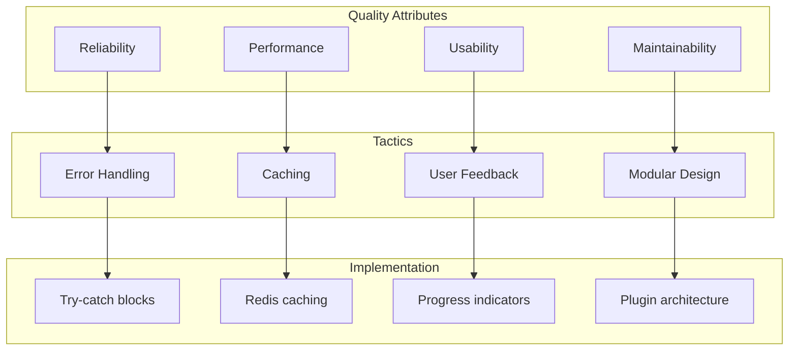

---

## 11. Architectural Decisions

### 11.1 Decision Records

#### ADR-001: JSON-based Storage
**Status**: Accepted  
**Context**: Need for simple, version-controlled storage  
**Decision**: Use JSON files for data storage  
**Consequences**: 
- ✅ Human-readable format
- ✅ Git-friendly versioning
- ✅ Simple backup/restore
- ❌ Limited query capabilities

#### ADR-002: Modular Monolith
**Status**: Accepted  
**Context**: Balance simplicity with scalability  
**Decision**: Use modular monolith architecture  
**Consequences**:
- ✅ Simple deployment
- ✅ Easy debugging
- ✅ Shared codebase
- ❌ Limited independent scaling

#### ADR-003: Python-based CLI
**Status**: Accepted  
**Context**: Developer-friendly command interface  
**Decision**: Use Python Click for CLI  
**Consequences**:
- ✅ Rich command interface
- ✅ Easy to extend
- ✅ Good documentation
- ❌ Python dependency

### 11.2 Technology Decisions

| Decision | Rationale | Alternatives Considered |
|----------|-----------|------------------------|
| **JSON Storage** | Simplicity, version control | SQLite, PostgreSQL |
| **Python** | Rich ecosystem, AI libraries | Node.js, Go |
| **FastAPI** | Modern, async support | Flask, Django |
| **Redis** | Performance, pub/sub | Memcached, local cache |
| **Click** | CLI framework | argparse, docopt |

---

## 12. Risks and Technical Debt

### 12.1 Risk Register

| Risk | Probability | Impact | Mitigation |
|------|-------------|--------|------------|
| **Data Corruption** | Medium | High | Automated backups |
| **Performance Issues** | Low | Medium | Profiling and optimization |
| **Security Vulnerabilities** | Low | High | Regular security audits |
| **Scalability Limits** | Medium | Medium | Architecture evolution plan |
| **Dependency Issues** | Low | Low | Dependency management |

### 12.2 Technical Debt

| Debt Item | Priority | Impact | Resolution Plan |
|-----------|----------|--------|-----------------|
| **JSON Schema Validation** | High | Medium | Add comprehensive validation |
| **Error Handling** | Medium | High | Improve error messages |
| **Test Coverage** | High | High | Increase unit tests |
| **Documentation** | Medium | Medium | Update API documentation |
| **Performance Monitoring** | Low | Low | Add performance metrics |

---

## 13. Appendices

### 13.1 Architecture Decision Records (ADRs)
- ADR-001: JSON-based Storage
- ADR-002: Modular Monolith Architecture
- ADR-003: Python Click CLI Framework
- ADR-004: Redis for Caching
- ADR-005: FastAPI for Web Interface

### 13.2 Glossary
- **SAD**: Software Architecture Document
- **ADR**: Architecture Decision Record
- **JSON**: JavaScript Object Notation
- **CLI**: Command Line Interface
- **API**: Application Programming Interface
- **TTL**: Time To Live

### 13.3 File Structure Reference

```
AutoProjectManagement/
├── autoprojectmanagement/          # Core application
│   ├── main_modules/              # Business logic modules
│   ├── services/                  # Integration services
│   ├── templates/                 # Code templates
│   └── api/                       # REST API
├── JSonDataBase/                  # Data storage
│   ├── Inputs/                    # Input JSON files
│   └── OutPuts/                   # Generated outputs
├── Docs/                          # Documentation
├── tests/                         # Test suites
├── backups/                       # Backup storage
└── requirements.txt               # Dependencies
```

### 13.4 Contact Information
- **Project Repository**: https://github.com/autoprojectmanagement/autoprojectmanagement
- **Documentation**: https://docs.autoprojectmanagement.com
- **Issues**: https://github.com/autoprojectmanagement/autoprojectmanagement/issues

---

**Document Status**: Approved  
**Last Updated**: 2025-08-16  
**Next Review**: 2025-11-16  
**Version**: 4.0.0
