# Software Architecture Document (SAD)
## AutoProjectManagement System

**Version:** 3.0.0  
**Date:** 2025-08-16  
**Author:** AutoProjectManagement Architecture Team  
**Status:** Production Ready  
**Language:** English

---

## Table of Contents

1. [Introduction](#introduction)
2. [Architectural Overview](#architectural-overview)
3. [System Architecture](#system-architecture)
4. [Component Architecture](#component-architecture)
5. [Data Architecture](#data-architecture)
6. [Deployment Architecture](#deployment-architecture)
7. [Security Architecture](#security-architecture)
8. [Performance Architecture](#performance-architecture)
9. [Integration Architecture](#integration-architecture)
10. [Quality Attributes](#quality-attributes)
11. [Architectural Decisions](#architectural-decisions)
12. [Risks and Technical Debt](#risks-and-technical-debt)
13. [Appendices](#appendices)

---

## 1. Introduction

### 1.1 Purpose
This Software Architecture Document (SAD) provides a comprehensive architectural blueprint for the AutoProjectManagement system. It defines the system's structural design, component interactions, data flow, deployment strategy, and quality attributes that enable automated project management capabilities at scale.

### 1.2 Scope
The AutoProjectManagement system is an intelligent, automated project management platform that provides:
- **Automated Project Planning**: AI-driven project estimation and scheduling
- **Intelligent Task Management**: Dynamic task assignment and workflow optimization
- **Real-time Progress Tracking**: Automated progress monitoring and reporting
- **Resource Optimization**: AI-powered resource allocation and management
- **Risk Management**: Proactive risk identification and mitigation
- **Quality Assurance**: Automated quality checks and commit management
- **Multi-platform Integration**: Seamless integration with development tools

### 1.3 Architectural Goals
- **Scalability**: Support 10,000+ concurrent projects
- **Performance**: Sub-second response times for all operations
- **Reliability**: 99.9% uptime with automatic failover
- **Security**: Enterprise-grade security with zero-trust architecture
- **Maintainability**: Modular design with clear separation of concerns
- **Extensibility**: Plugin-based architecture for custom integrations

---

## 2. Architectural Overview

### 2.1 Architectural Style
The system follows a **Microservices Architecture** pattern with **Event-Driven Architecture** for real-time updates and **CQRS (Command Query Responsibility Segregation)** for optimal read/write performance.

### 2.2 High-Level Architecture

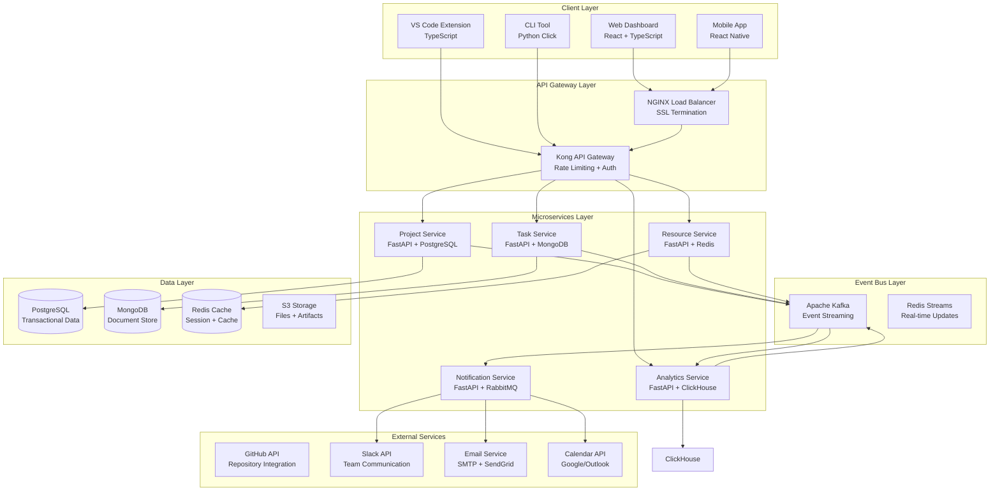

### 2.3 Technology Stack Matrix

| Layer | Technology | Version | Purpose |
|-------|------------|---------|---------|
| **Frontend** | React | 18.x | Web dashboard |
| **Frontend** | TypeScript | 5.x | Type safety |
| **Backend** | FastAPI | 0.110.x | REST API framework |
| **Backend** | Python | 3.11.x | Core language |
| **Database** | PostgreSQL | 15.x | Primary database |
| **Database** | MongoDB | 7.x | Document storage |
| **Cache** | Redis | 7.x | Caching layer |
| **Message Queue** | Apache Kafka | 3.x | Event streaming |
| **Search** | Elasticsearch | 8.x | Full-text search |
| **Monitoring** | Prometheus | 2.x | Metrics collection |
| **Logging** | ELK Stack | 8.x | Centralized logging |
| **Container** | Docker | 24.x | Containerization |
| **Orchestration** | Kubernetes | 1.29.x | Container orchestration |

---

## 3. System Architecture

### 3.1 Logical Architecture

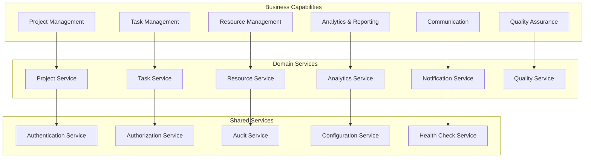

### 3.2 Physical Architecture

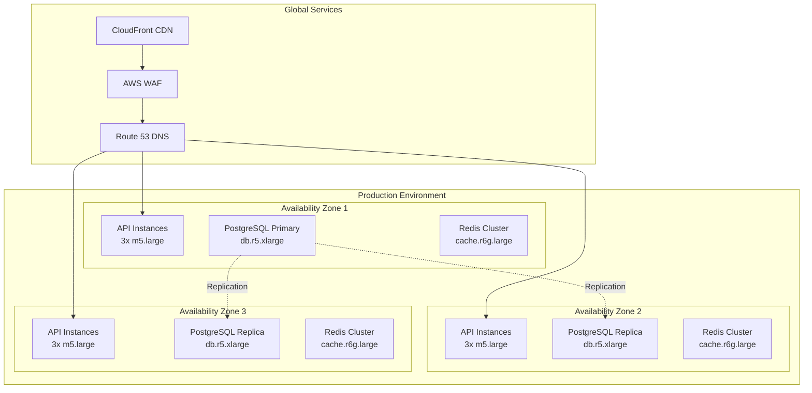

### 3.3 Process Architecture

```mermaid
flowchart TD
    subgraph "Project Lifecycle Process"
        A[Project Initiation] --> B[Planning Phase]
        B --> C[Resource Allocation]
        C --> D[Task Creation]
        D --> E[Development Phase]
        E --> F[Quality Assurance]
        F --> G[Progress Monitoring]
        G --> H{Milestone Check}
        H -->|Not Complete| E
        H -->|Complete| I[Project Completion]
        I --> J[Post-Project Analysis]
    end
    
    subgraph "Real-time Monitoring Process"
        K[Event Stream] --> L[Event Processor]
        L --> M[Business Rules Engine]
        M --> N[Action Generator]
        N --> O[Notification Service]
        O --> P[Multi-channel Delivery]
    end
```

---

## 4. Component Architecture

### 4.1 Component Overview

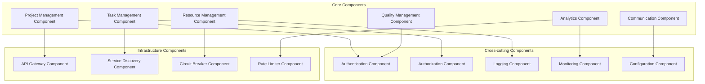

### 4.2 Component Details

#### 4.2.1 Project Management Component

**Purpose**: Central orchestrator for project lifecycle management

**Responsibilities**:
- Project creation, update, and deletion
- Project status tracking and reporting
- Project milestone management
- Project resource allocation

**Class Diagram**:
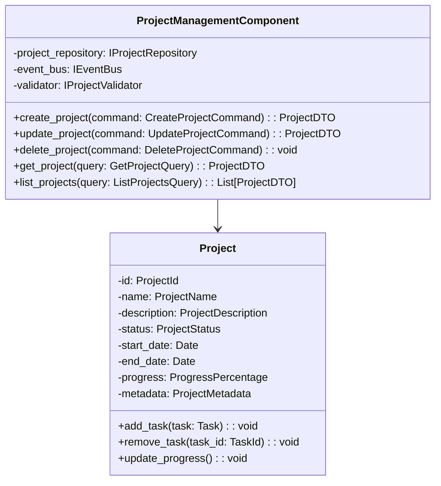

#### 4.2.2 Task Management Component

**Purpose**: Task lifecycle and workflow management

**Responsibilities**:
- Task creation and assignment
- Task status tracking
- Task dependency management
- Task priority calculation

**Class Diagram**:
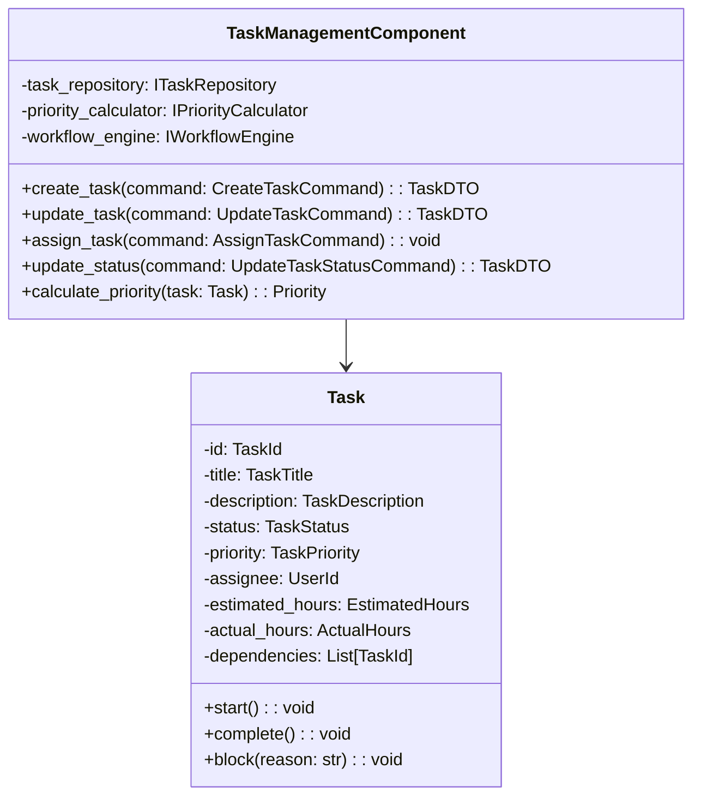

### 4.3 Component Interaction Diagram

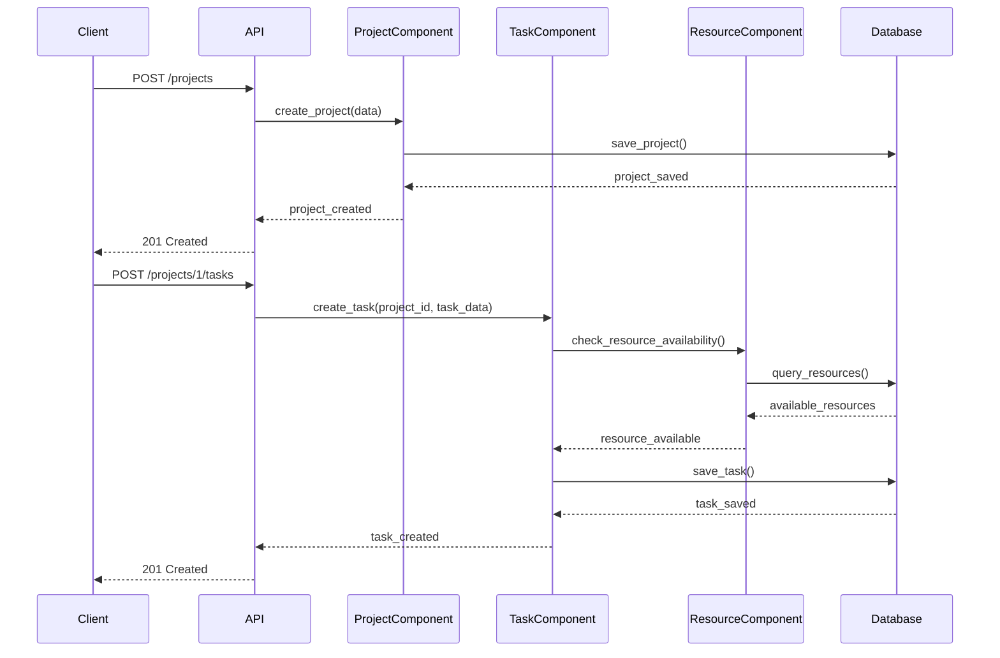

---

## 5. Data Architecture

### 5.1 Data Model Overview

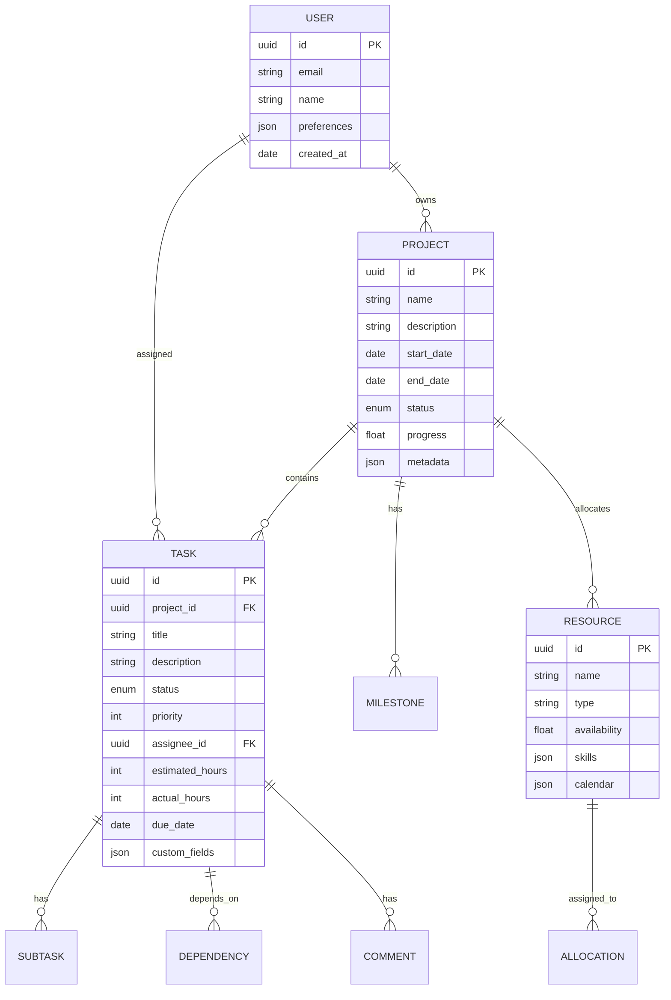

### 5.2 Data Storage Strategy

| Data Type | Storage | Reasoning |
|-----------|---------|-----------|
| **Transactional Data** | PostgreSQL | ACID compliance, complex queries |
| **Document Data** | MongoDB | Flexible schema, JSON documents |
| **Session Data** | Redis | Fast access, TTL support |
| **File Storage** | S3 | Scalable, durable object storage |
| **Cache** | Redis | In-memory, high performance |
| **Search** | Elasticsearch | Full-text search capabilities |

### 5.3 Data Flow Architecture

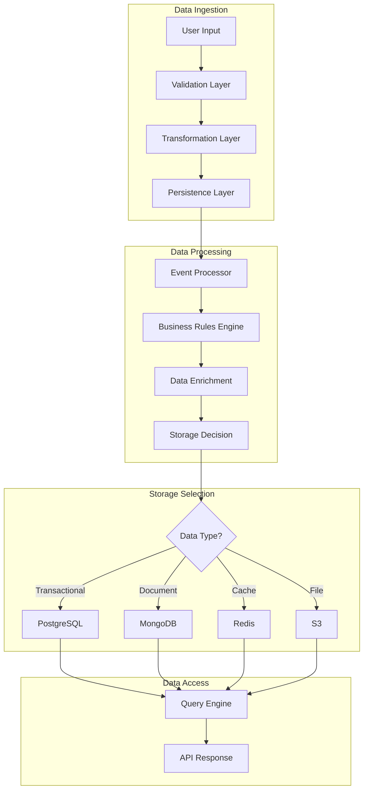

---

## 6. Deployment Architecture

### 6.1 Deployment Strategy

| Environment | Strategy | Infrastructure |
|-------------|----------|----------------|
| **Development** | Local Docker | Docker Compose |
| **Testing** | Kubernetes | Minikube |
| **Staging** | Kubernetes | EKS Cluster |
| **Production** | Kubernetes | Multi-region EKS |

### 6.2 Container Architecture

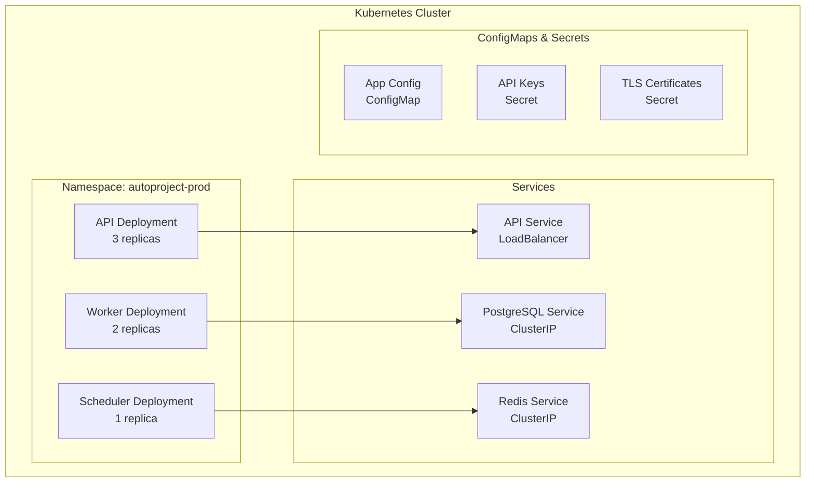

### 6.3 CI/CD Pipeline

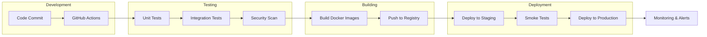

---

## 7. Security Architecture

### 7.1 Security Layers

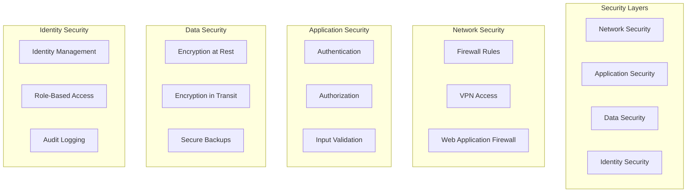

### 7.2 Security Controls

| Control Type | Implementation | Description |
|--------------|----------------|-------------|
| **Authentication** | JWT + OAuth 2.0 | Token-based authentication |
| **Authorization** | RBAC | Role-based access control |
| **Encryption** | AES-256 | Data encryption at rest |
| **Transport** | TLS 1.3 | Secure data in transit |
| **API Security** | Rate limiting | Prevent abuse and DDoS |
| **Input Validation** | Schema validation | Prevent injection attacks |

### 7.3 Security Architecture Diagram

```mermaid
graph TB
    subgraph "Security Architecture"
        Client[Client Applications]
        
        subgraph "Security Gateway"
            WAF[AWS WAF]
            Shield[AWS Shield]
            Cert[SSL/TLS Certificates]
        end
        
        subgraph "Application Security"
            AuthService[Auth Service]
            TokenService[Token Service]
            RateLimiter[Rate Limiter]
        end
        
        subgraph "Data Security"
            KMS[AWS KMS]
            Secrets[AWS Secrets Manager]
            Backup[Encrypted Backups]
        end
    end
    
    Client --> WAF
    WAF --> Shield
    Shield --> Cert
    Cert --> AuthService
    AuthService --> TokenService
    TokenService --> RateLimiter
    RateLimiter --> KMS
    KMS --> Secrets
    Secrets --> Backup
```

---

## 8. Performance Architecture

### 8.1 Performance Targets

| Metric | Target | SLA |
|--------|--------|-----|
| **API Response Time** | < 100ms | 95th percentile |
| **Database Query Time** | < 50ms | 95th percentile |
| **Page Load Time** | < 2s | 95th percentile |
| **Concurrent Users** | 10,000+ | Load tested |
| **Throughput** | 1000 req/sec | Sustained load |

### 8.2 Performance Optimization

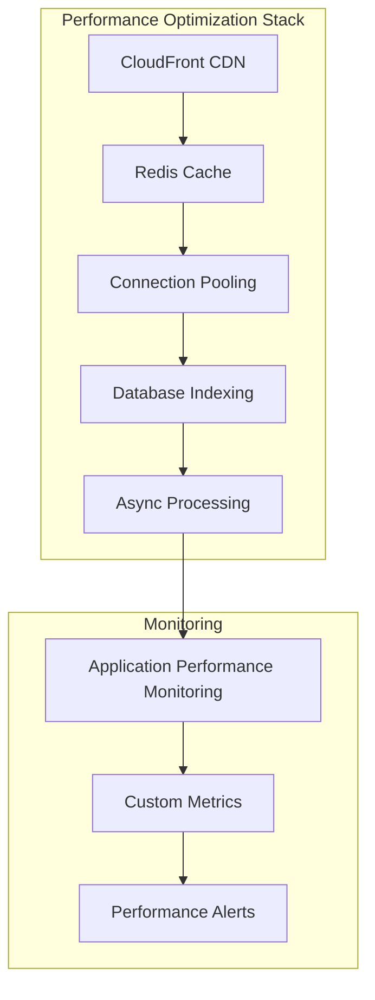

### 8.3 Caching Strategy

| Cache Type | Technology | TTL | Use Case |
|------------|------------|-----|----------|
| **L1 Cache** | In-memory | 5 minutes | Session data |
| **L2 Cache** | Redis | 1 hour | API responses |
| **L3 Cache** | CDN | 24 hours | Static assets |
| **L4 Cache** | Browser | 7 days | Client-side caching |

---

## 9. Integration Architecture

### 9.1 Integration Points

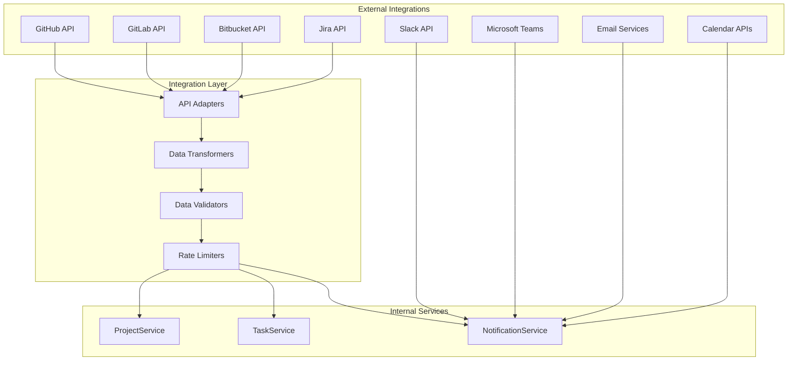

### 9.2 Integration Patterns

| Pattern | Use Case | Implementation |
|---------|----------|----------------|
| **API Gateway** | Unified API access | Kong Gateway |
| **Adapter** | Third-party APIs | Custom adapters |
| **Circuit Breaker** | Fault tolerance | Hystrix pattern |
| **Retry** | Transient failures | Exponential backoff |
| **Webhook** | Real-time updates | Event-driven |

---

## 10. Quality Attributes

### 10.1 Quality Attribute Scenarios

| Attribute | Scenario | Metric | Target |
|-----------|----------|--------|--------|
| **Availability** | System must be available 99.9% of time | Uptime | 99.9% |
| **Scalability** | Handle 10x traffic increase | Throughput | 10,000 req/sec |
| **Performance** | API response under load | Response time | < 100ms |
| **Security** | Prevent unauthorized access | Security incidents | 0 |
| **Maintainability** | Deploy new features | Deployment time | < 30 minutes |

### 10.2 Quality Attribute Tactics

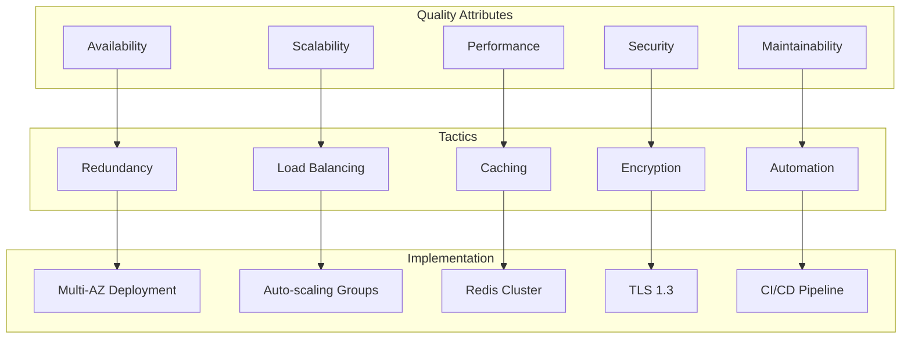

---

## 11. Architectural Decisions

### 11.1 Decision Records

#### ADR-001: Microservices Architecture
**Status**: Accepted  
**Context**: Need for scalability and independent deployment  
**Decision**: Adopt microservices architecture with service mesh  
**Consequences**: 
- ✅ Independent scaling
- ✅ Technology diversity
- ❌ Increased complexity

#### ADR-002: Event-Driven Architecture
**Status**: Accepted  
**Context**: Real-time updates and loose coupling  
**Decision**: Use Apache Kafka for event streaming  
**Consequences**:
- ✅ Real-time updates
- ✅ Loose coupling
- ❌ Operational complexity

#### ADR-003: Polyglot Persistence
**Status**: Accepted  
**Context**: Different data requirements  
**Decision**: Use PostgreSQL + MongoDB + Redis  
**Consequences**:
- ✅ Optimal storage for each use case
- ✅ Performance optimization
- ❌ Operational overhead

### 11.2 Technology Decisions

| Decision | Rationale | Alternatives Considered |
|----------|-----------|------------------------|
| **FastAPI** | High performance, async support | Django, Flask |
| **PostgreSQL** | ACID compliance, JSON support | MySQL, Oracle |
| **Redis** | Performance, pub/sub | Memcached, DynamoDB |
| **Kafka** | Scalability, durability | RabbitMQ, SNS/SQS |
| **Kubernetes** | Orchestration, scaling | Docker Swarm, ECS |

---

## 12. Risks and Technical Debt

### 12.1 Risk Register

| Risk | Probability | Impact | Mitigation |
|------|-------------|--------|------------|
| **Service Outage** | Medium | High | Multi-region deployment |
| **Data Loss** | Low | Critical | Automated backups |
| **Security Breach** | Low | High | Security audits |
| **Performance Degradation** | Medium | Medium | Load testing |
| **Vendor Lock-in** | Low | Medium | Open standards |

### 12.2 Technical Debt

| Debt Item | Priority | Impact | Resolution Plan |
|-----------|----------|--------|-----------------|
| **Legacy CLI** | High | Medium | Migrate to new CLI |
| **Monolithic Components** | Medium | High | Refactor to microservices |
| **Hardcoded Configurations** | Low | Low | Externalize configurations |
| **Lack of Tests** | High | High | Increase test coverage |

---

## 13. Appendices

### 13.1 Architecture Decision Records (ADRs)
- ADR-001: Microservices Architecture
- ADR-002: Event-Driven Architecture
- ADR-003: Polyglot Persistence
- ADR-004: API Gateway Pattern
- ADR-005: CQRS Implementation

### 13.2 Glossary
- **SAD**: Software Architecture Document
- **ADR**: Architecture Decision Record
- **CQRS**: Command Query Responsibility Segregation
- **DDD**: Domain-Driven Design
- **API**: Application Programming Interface
- **SLA**: Service Level Agreement

### 13.3 References
- [Microservices Patterns](https://microservices.io/patterns/)
- [Domain-Driven Design](https://domainlanguage.com/ddd/)
- [Clean Architecture](https://blog.cleancoder.com/uncle-bob/2012/08/13/the-clean-architecture.html)
- [12-Factor App](https://12factor.net/)

### 13.4 Contact Information
- **Architecture Team**: architecture@autoprojectmanagement.com
- **Technical Lead**: tech-lead@autoprojectmanagement.com
- **Documentation**: https://docs.autoprojectmanagement.com

---

**Document Status**: Approved  
**Last Updated**: 2025-08-16  
**Next Review**: 2025-11-16  
**Version**: 3.0.0
