# Software Design Description (SDD)
## AutoProjectManagement System

**Version:** 2.0.0  
**Date:** 2025-08-14  
**Author:** AutoProjectManagement Team  
**Status:** Production Ready

---

## Table of Contents

1. [Introduction](#introduction)
2. [System Overview](#system-overview)
3. [Architectural Design](#architectural-design)
4. [Component Design](#component-design)
5. [Data Design](#data-design)
6. [Interface Design](#interface-design)
7. [Detailed Design](#detailed-design)
8. [Design Patterns](#design-patterns)
9. [Security Design](#security-design)
10. [Performance Considerations](#performance-considerations)
11. [Deployment Design](#deployment-design)
12. [Appendices](#appendices)

---

## 1. Introduction

### 1.1 Purpose
This Software Design Description (SDD) document provides a comprehensive technical specification for the AutoProjectManagement system. It describes the system's architecture, components, interfaces, and design decisions that enable automated project management capabilities.

### 1.2 Scope
The AutoProjectManagement system is an intelligent project management platform that automates:
- Project planning and estimation
- Task workflow management
- Progress tracking and reporting
- Resource allocation and management
- Risk assessment and communication
- Quality assurance and commit management

### 1.3 Intended Audience
- Software architects and developers
- System integrators
- DevOps engineers
- Technical project managers
- Quality assurance teams

### 1.4 Definitions and Acronyms

| Term | Definition |
|------|------------|
| PMS | Project Management System |
| WBS | Work Breakdown Structure |
| API | Application Programming Interface |
| CLI | Command Line Interface |
| CI/CD | Continuous Integration/Continuous Deployment |
| JSON | JavaScript Object Notation |

---

## 2. System Overview

### 2.1 System Context

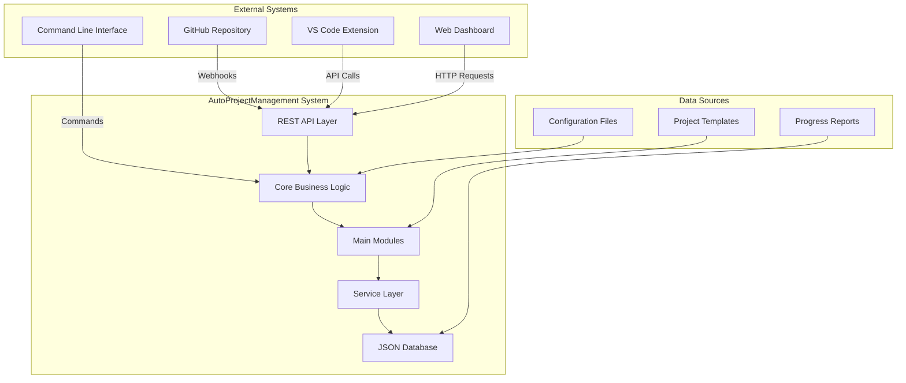

### 2.2 High-Level Architecture

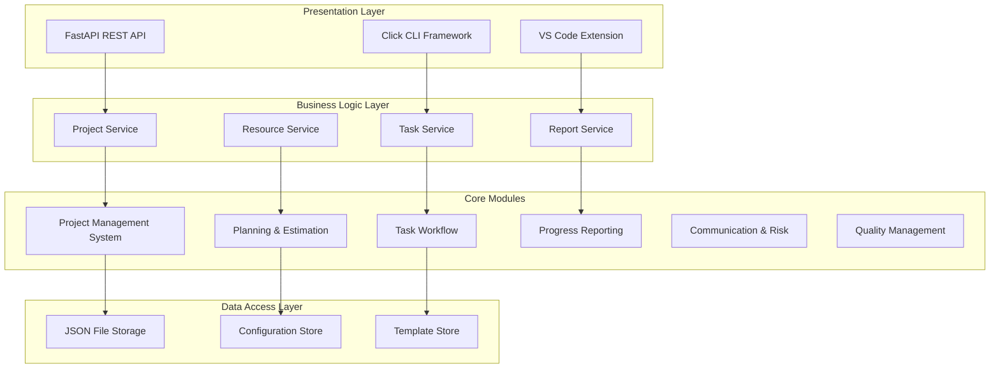

---

## 3. Architectural Design

### 3.1 Architectural Style
The system follows a **Layered Architecture** pattern with clear separation of concerns:

1. **Presentation Layer**: REST API, CLI, VS Code Extension
2. **Business Logic Layer**: Services and core modules
3. **Data Access Layer**: JSON file storage and configuration management

### 3.2 Design Principles

| Principle | Implementation |
|-----------|----------------|
| **SOLID** | Single responsibility classes, Open for extension, Liskov substitution, Interface segregation, Dependency inversion |
| **DRY** | Reusable components and shared utilities |
| **KISS** | Simple, focused methods and classes |
| **YAGNI** | Minimal viable features with extensibility |
| **SoC** | Clear separation between presentation, business logic, and data layers |

### 3.3 Technology Stack

| Layer | Technology | Purpose |
|-------|------------|---------|
| **API** | FastAPI | RESTful web service |
| **CLI** | Click | Command-line interface |
| **Extension** | VS Code API | IDE integration |
| **Language** | Python 3.8+ | Core implementation |
| **Storage** | JSON files | Data persistence |
| **Testing** | pytest | Unit and integration testing |
| **Documentation** | Sphinx | API documentation |

---

## 4. Component Design

### 4.1 Component Overview

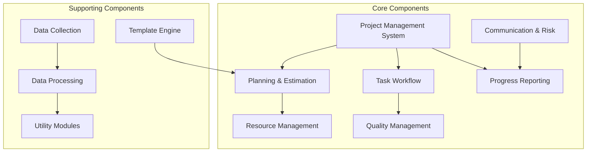

### 4.2 Component Details

#### 4.2.1 Project Management System (PMS)
**Purpose**: Central orchestrator for all project operations
**Responsibilities**:
- Project lifecycle management
- Task creation and assignment
- Progress tracking
- Resource allocation

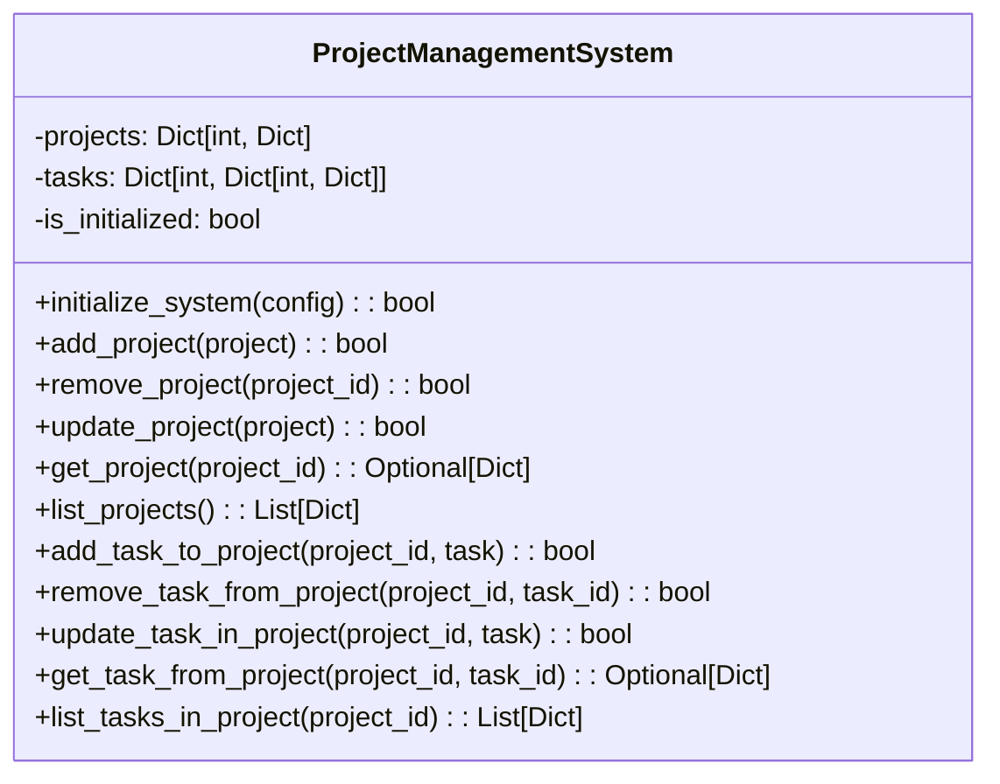

#### 4.2.2 Planning & Estimation Module
**Purpose**: Project planning and effort estimation
**Key Classes**:
- `EstimationManager`: Handles project estimation
- `Scheduler`: Creates project schedules
- `WBSParser`: Parses Work Breakdown Structure

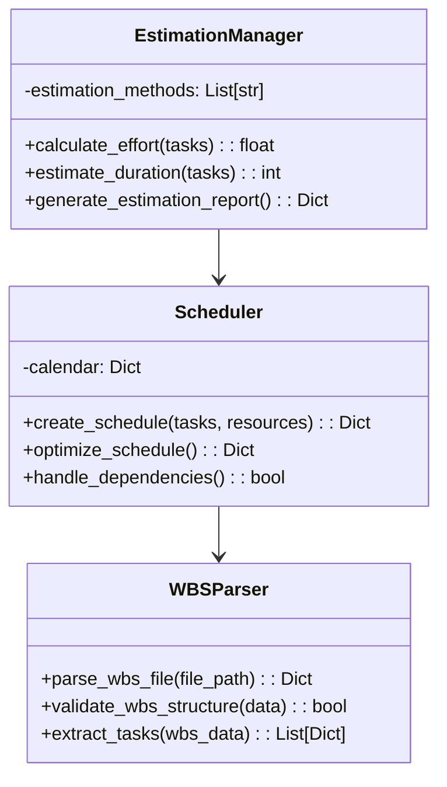

#### 4.2.3 Task Workflow Management
**Purpose**: Task execution and workflow automation
**Key Classes**:
- `TaskExecutor`: Executes tasks based on priority
- `ImportanceUrgencyCalculator`: Calculates task priority
- `TaskManagement`: Core task operations

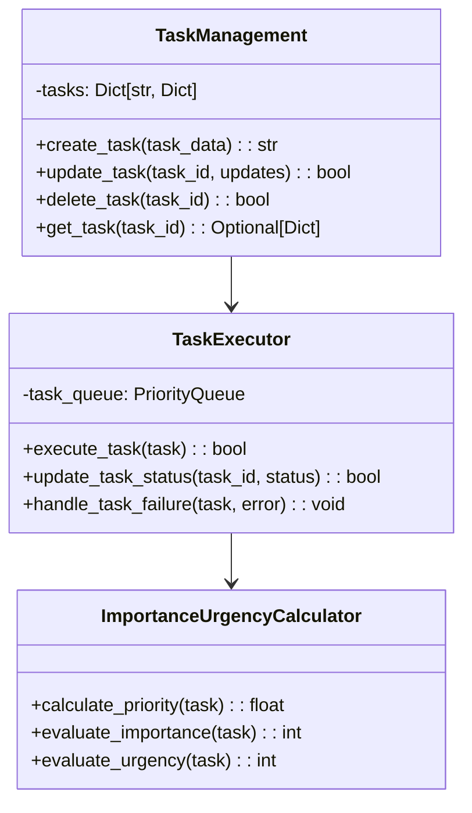

---

## 5. Data Design

### 5.1 Data Model Overview

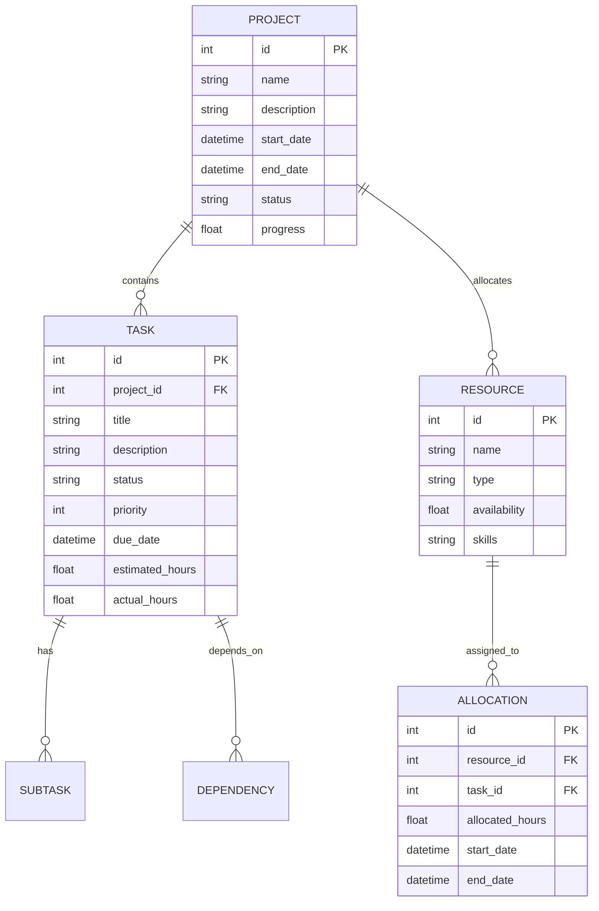

### 5.2 JSON Schema Design

#### 5.2.1 Project Schema
```json
{
  "$schema": "http://json-schema.org/draft-07/schema#",
  "type": "object",
  "properties": {
    "id": {"type": "integer"},
    "name": {"type": "string", "maxLength": 100},
    "description": {"type": "string", "maxLength": 500},
    "start_date": {"type": "string", "format": "date-time"},
    "end_date": {"type": "string", "format": "date-time"},
    "status": {
      "type": "string",
      "enum": ["not_started", "in_progress", "completed", "on_hold", "cancelled"]
    },
    "priority": {"type": "integer", "minimum": 1, "maximum": 5},
    "tags": {"type": "array", "items": {"type": "string"}},
    "metadata": {"type": "object"}
  },
  "required": ["id", "name", "status"]
}
```

#### 5.2.2 Task Schema
```json
{
  "$schema": "http://json-schema.org/draft-07/schema#",
  "type": "object",
  "properties": {
    "id": {"type": "integer"},
    "project_id": {"type": "integer"},
    "title": {"type": "string", "maxLength": 200},
    "description": {"type": "string", "maxLength": 1000},
    "status": {
      "type": "string",
      "enum": ["todo", "in_progress", "review", "done", "blocked"]
    },
    "priority": {"type": "integer", "minimum": 1, "maximum": 5},
    "estimated_hours": {"type": "number", "minimum": 0},
    "actual_hours": {"type": "number", "minimum": 0},
    "assignee": {"type": "string"},
    "dependencies": {"type": "array", "items": {"type": "integer"}},
    "tags": {"type": "array", "items": {"type": "string"}},
    "created_at": {"type": "string", "format": "date-time"},
    "updated_at": {"type": "string", "format": "date-time"}
  },
  "required": ["id", "project_id", "title", "status"]
}
```

### 5.3 File Structure

```
JSonDataBase/
├── Inputs/
│   ├── SystemGeneratorInputs/
│   │   ├── commit_progress.json
│   │   └── detailed_wbs.json
│   └── UserInputs/
│       ├── commit_task_database.json
│       ├── linked_wbs_resources.json
│       ├── task_resource_allocation.json
│       └── wbs_parts/
└── OutPuts/
    ├── commit_progress.json
    ├── commit_task_database.json
    └── progress_report.md
```

---

## 6. Interface Design

### 6.1 REST API Design

#### 6.1.1 API Endpoints Overview

| Method | Endpoint | Description | Request Body | Response |
|--------|----------|-------------|--------------|----------|
| GET | /api/v1/projects | List all projects | - | Project list |
| POST | /api/v1/projects | Create new project | ProjectCreate | Created project |
| GET | /api/v1/projects/{id} | Get project details | - | Project details |
| PUT | /api/v1/projects/{id} | Update project | ProjectUpdate | Updated project |
| DELETE | /api/v1/projects/{id} | Delete project | - | Confirmation |
| GET | /api/v1/projects/{id}/status | Get project status | - | Status report |
| POST | /api/v1/projects/{id}/tasks | Add task to project | TaskCreate | Created task |
| GET | /api/v1/projects/{id}/tasks | List project tasks | - | Task list |

#### 6.1.2 API Response Format

```json
{
  "success": true,
  "data": {
    "project": {
      "id": 1,
      "name": "Sample Project",
      "status": "in_progress",
      "progress": 75.5
    }
  },
  "meta": {
    "timestamp": "2025-08-14T10:30:00Z",
    "version": "1.0.0"
  }
}
```

### 6.2 CLI Interface Design

#### 6.2.1 Command Structure

```bash
# Project management
autoproject project create --name "New Project" --description "Project description"
autoproject project list
autoproject project status --id 1

# Task management
autoproject task add --project-id 1 --title "Implement feature" --priority 3
autoproject task update --id 101 --status "in_progress"
autoproject task list --project-id 1

# Progress tracking
autoproject progress report --project-id 1 --format markdown
autoproject dashboard show --project-id 1

# System operations
autoproject system health
autoproject system info
```

### 6.3 VS Code Extension Interface

#### 6.3.1 Extension Commands

| Command | Description | Keyboard Shortcut |
|---------|-------------|------------------|
| `AutoProject: Create Project` | Create new project | `Ctrl+Shift+P` |
| `AutoProject: Show Status` | Display project status | `Ctrl+Shift+S` |
| `AutoProject: Add Task` | Add new task | `Ctrl+Shift+T` |
| `AutoProject: Commit Progress` | Commit current progress | `Ctrl+Shift+C` |

---

## 7. Detailed Design

### 7.1 Sequence Diagrams

#### 7.1.1 Project Creation Flow

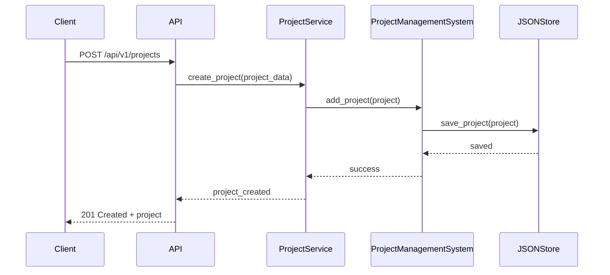

#### 7.1.2 Task Status Update Flow

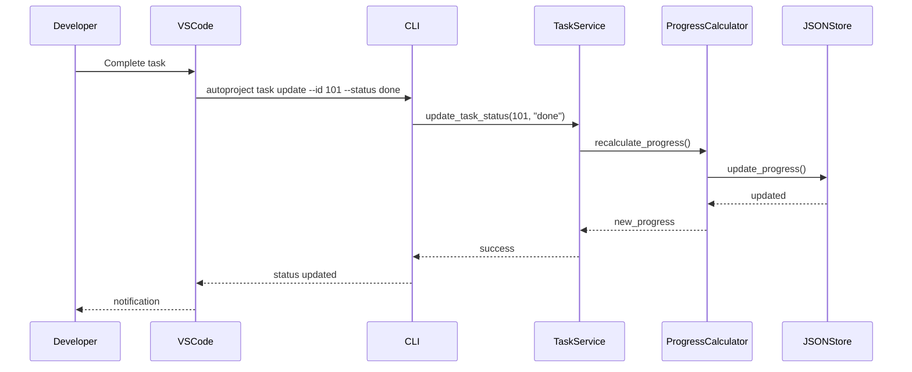

### 7.2 State Machine Diagrams

#### 7.2.1 Task State Machine

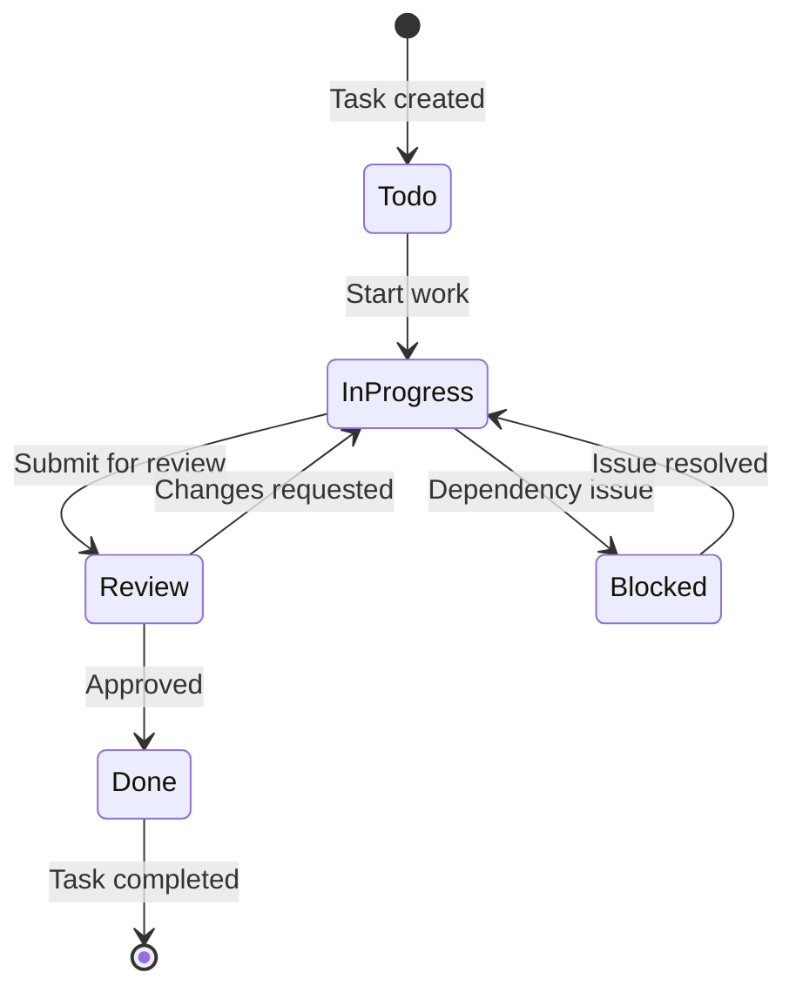

#### 7.2.2 Project State Machine

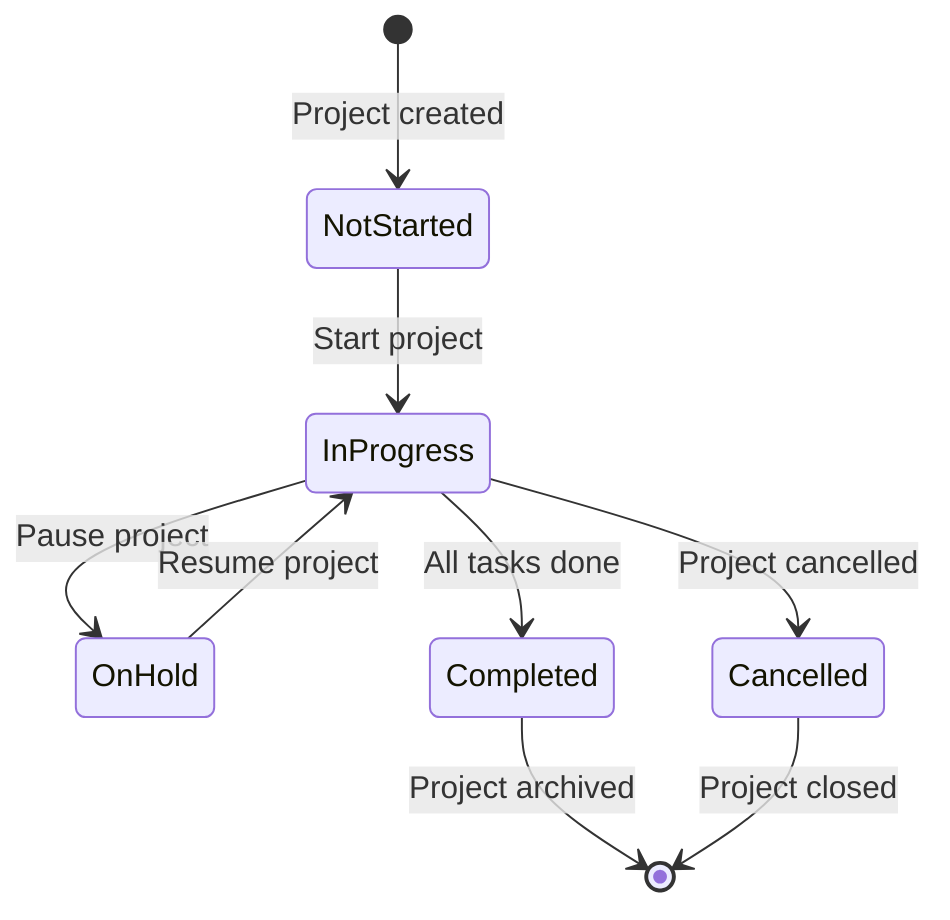

### 7.3 Activity Diagrams

#### 7.3.1 Daily Progress Update

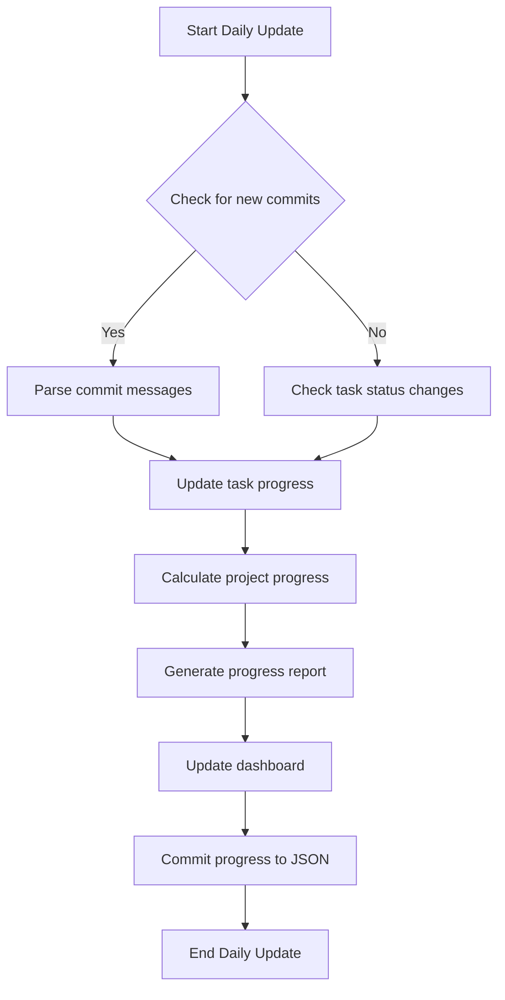

---

## 8. Design Patterns

### 8.1 Creational Patterns

#### 8.1.1 Singleton Pattern
Used for service instances to ensure single point of access:

```python
class ProjectService:
    _instance = None
    
    def __new__(cls):
        if cls._instance is None:
            cls._instance = super().__new__(cls)
        return cls._instance
```

#### 8.1.2 Factory Pattern
Used for creating different types of tasks:

```python
class TaskFactory:
    @staticmethod
    def create_task(task_type: str, **kwargs) -> BaseTask:
        if task_type == "development":
            return DevelopmentTask(**kwargs)
        elif task_type == "testing":
            return TestingTask(**kwargs)
        # ... other task types
```

### 8.2 Structural Patterns

#### 8.2.1 Adapter Pattern
Used for integrating different data sources:

```python
class DataAdapter:
    def adapt_json_data(self, json_data: Dict) -> Project:
        # Transform JSON data to Project object
        pass
    
    def adapt_database_data(self, db_data: Dict) -> Project:
        # Transform database data to Project object
        pass
```

#### 8.2.2 Facade Pattern
Simplified interface for complex operations:

```python
class ProjectFacade:
    def create_project_with_defaults(self, name: str) -> Project:
        # Handles all setup complexity internally
        project = Project(name=name)
        self._setup_default_tasks(project)
        self._assign_default_resources(project)
        return project
```

### 8.3 Behavioral Patterns

#### 8.3.1 Observer Pattern
Used for progress notifications:

```python
class ProgressObserver:
    def update(self, project_id: str, progress: float):
        # Notify all registered observers
        pass

class DashboardObserver(ProgressObserver):
    def update(self, project_id: str, progress: float):
        # Update dashboard display
        pass
```

#### 8.3.2 Strategy Pattern
Used for different estimation algorithms:

```python
class EstimationStrategy(ABC):
    @abstractmethod
    def estimate(self, tasks: List[Task]) -> float:
        pass

class SimpleEstimationStrategy(EstimationStrategy):
    def estimate(self, tasks: List[Task]) -> float:
        return sum(task.estimated_hours for task in tasks)

class ComplexEstimationStrategy(EstimationStrategy):
    def estimate(self, tasks: List[Task]) -> float:
        # Consider complexity, dependencies, etc.
        pass
```

---

## 9. Security Design

### 9.1 Security Requirements

| Requirement | Implementation |
|-------------|----------------|
| **Authentication** | API key-based authentication |
| **Authorization** | Role-based access control |
| **Data Encryption** | File-level encryption for sensitive data |
| **Input Validation** | Comprehensive input sanitization |
| **Audit Logging** | All operations logged with timestamps |

### 9.2 Security Measures

#### 9.2.1 API Security
```python
from fastapi.security import HTTPBearer, HTTPAuthorizationCredentials

security = HTTPBearer()

async def verify_token(credentials: HTTPAuthorizationCredentials = Depends(security)):
    # Verify JWT token or API key
    pass
```

#### 9.2.2 Data Protection
```python
class SecureDataHandler:
    def encrypt_sensitive_data(self, data: Dict) -> str:
        # Encrypt sensitive project information
        pass
    
    def decrypt_sensitive_data(self, encrypted_data: str) -> Dict:
        # Decrypt sensitive project information
        pass
```

---

## 10. Performance Considerations

### 10.1 Performance Metrics

| Metric | Target | Measurement |
|--------|--------|-------------|
| **API Response Time** | < 200ms | Average response time |
| **CLI Command Execution** | < 1s | Command completion time |
| **Memory Usage** | < 100MB | Peak memory consumption |
| **Concurrent Users** | 100+ | Load testing |

### 10.2 Optimization Strategies

#### 10.2.1 Caching Strategy
```python
from functools import lru_cache

class CacheManager:
    @lru_cache(maxsize=128)
    def get_project_status(self, project_id: str) -> Dict:
        # Cache frequently accessed data
        pass
    
    def invalidate_cache(self, project_id: str):
        # Clear cache when data changes
        pass
```

#### 10.2.2 Lazy Loading
```python
class LazyProjectLoader:
    def __init__(self, project_id: str):
        self.project_id = project_id
        self._project = None
    
    @property
    def project(self):
        if self._project is None:
            self._project = self._load_project()
        return self._project
```

---

## 11. Deployment Design

### 11.1 Deployment Architecture

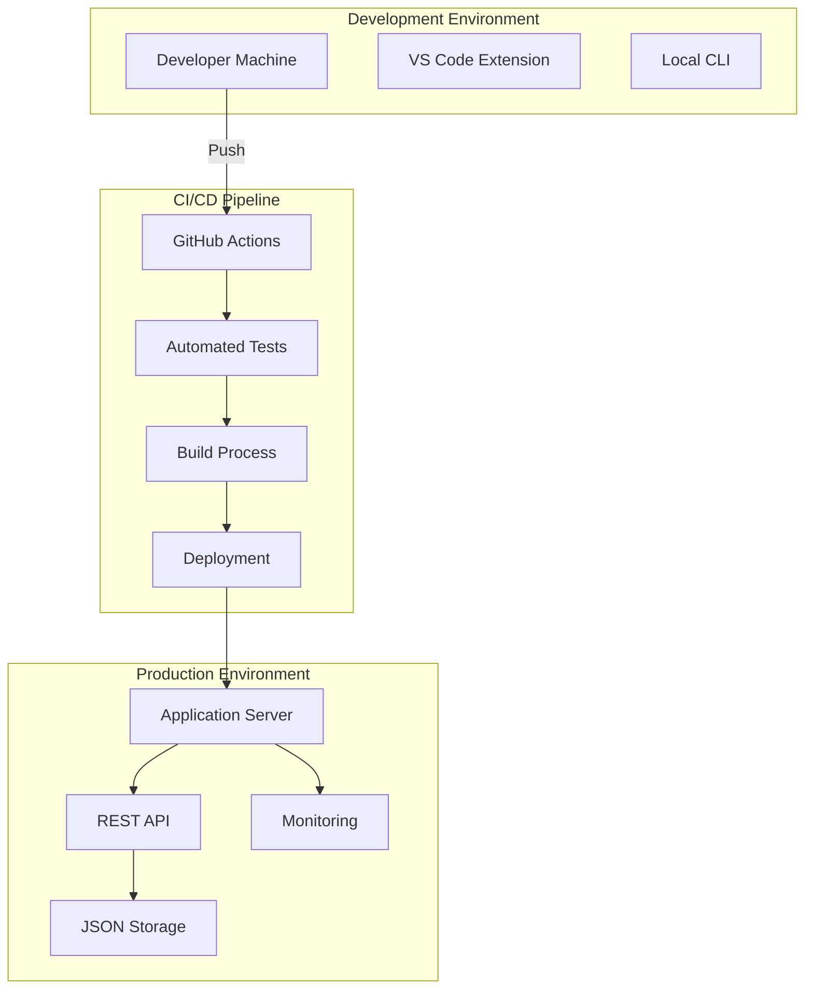

### 11.2 Deployment Configuration

#### 11.2.1 Docker Configuration
```dockerfile
FROM python:3.8-slim

WORKDIR /app

COPY requirements.txt .
RUN pip install -r requirements.txt

COPY . .

EXPOSE 8000

CMD ["uvicorn", "autoprojectmanagement.api.app:app", "--host", "0.0.0.0", "--port", "8000"]
```

#### 11.2.2 Environment Variables
```bash
# Application Configuration
AUTO_PROJECT_ENV=production
AUTO_PROJECT_LOG_LEVEL=INFO
AUTO_PROJECT_DB_PATH=/app/data

# API Configuration
API_HOST=0.0.0.0
API_PORT=8000
API_WORKERS=4

# Security
API_SECRET_KEY=your-secret-key
API_ALGORITHM=HS256
```

---

## 12. Appendices

### 12.1 Glossary

| Term | Definition |
|------|------------|
| **WBS** | Work Breakdown Structure - hierarchical decomposition of project deliverables |
| **Sprint** | Time-boxed iteration for completing work |
| **Story Point** | Relative measure of task complexity |
| **Velocity** | Measure of work completed per iteration |
| **Burndown** | Chart showing remaining work over time |

### 12.2 References

1. **FastAPI Documentation**: https://fastapi.tiangolo.com/
2. **Python Design Patterns**: https://python-patterns.guide/
3. **RESTful API Design**: https://restfulapi.net/
4. **JSON Schema**: https://json-schema.org/
5. **Mermaid Documentation**: https://mermaid-js.github.io/

### 12.3 Change Log

| Version | Date | Changes |
|---------|------|---------|
| 1.0.0 | 2024-01-01 | Initial SDD creation |
| 1.1.0 | 2024-06-15 | Added security design section |
| 2.0.0 | 2025-08-14 | Complete architecture redesign with FastAPI |

### 12.4 Contact Information

- **Project Repository**: https://github.com/AutoProjectManagement/AutoProjectManagement
- **Documentation**: https://autoprojectmanagement.readthedocs.io/
- **Support**: team@autoprojectmanagement.com
- **Issues**: https://github.com/AutoProjectManagement/AutoProjectManagement/issues

---

**Document Status**: Approved  
**Last Review**: 2025-08-14  
**Next Review**: 2025-11-14
