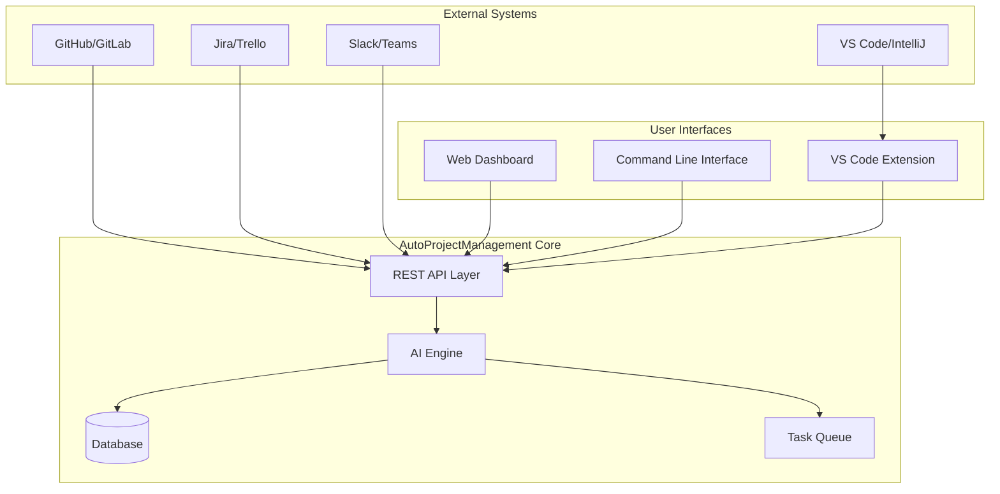
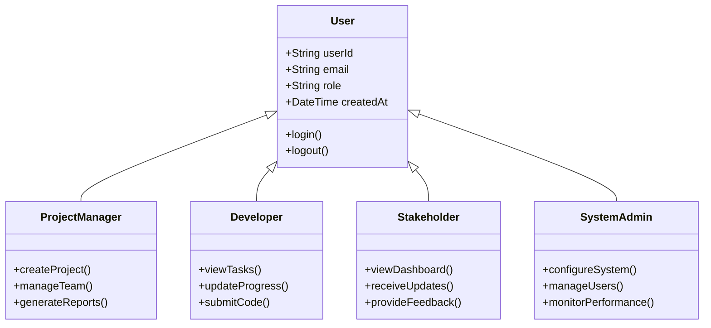
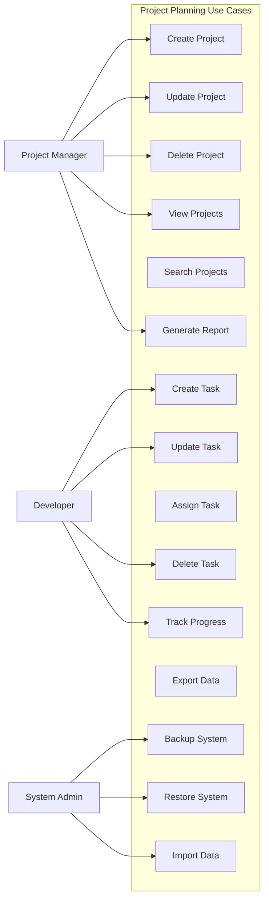

# Software Requirements Specification (SRS)
## AutoProjectManagement System

**Version:** 1.0  
**Date:** January 2025  
**Status:** Final  
**Authors:** AutoProjectManagement Development Team

---

## Table of Contents

1. [Introduction](#1-introduction)
2. [Overall Description](#2-overall-description)
3. [System Features](#3-system-features)
4. [External Interface Requirements](#4-external-interface-requirements)
5. [System Requirements](#5-system-requirements)
6. [Performance Requirements](#6-performance-requirements)
7. [Design Constraints](#7-design-constraints)
8. [Other Requirements](#8-other-requirements)
9. [Appendices](#9-appendices)

---

## 1. Introduction

### 1.1 Purpose
This Software Requirements Specification (SRS) document describes the functional and non-functional requirements for the AutoProjectManagement system - an intelligent automated project management solution designed to streamline software development workflows through AI-driven automation.

### 1.2 Scope
The AutoProjectManagement system provides:
- **Automated project planning** with AI-powered task estimation
- **Intelligent resource allocation** based on team capabilities and availability
- **Real-time progress tracking** with predictive analytics
- **Risk assessment and mitigation** through machine learning models
- **Seamless Git integration and version control**
- **Comprehensive reporting and analytics**
- **API-driven architecture for extensibility**

### 1.3 Definitions, Acronyms, and Abbreviations

| Term | Definition |
|------|------------|
| **AutoProjectManagement** | The complete automated project management system |
| **PMS** | Project Management System |
| **AutoRunner** | Continuous automation engine |
| **WBS** | Work Breakdown Structure |
| **API** | Application Programming Interface |
| **CI/CD** | Continuous Integration/Continuous Deployment |
| **ML** | Machine Learning |
| **NLP** | Natural Language Processing |
| **SaaS** | Software as a Service |
| **SLA** | Service Level Agreement |

### 1.4 References
- IEEE 830-1998: IEEE Recommended Practice for Software Requirements Specifications
- ISO/IEC 25010:2011 - Systems and software Quality Requirements and Evaluation (SQuaRE)
- Project Management Institute (PMI) Standards
- OWASP Top 10 Security Guidelines

---

## 2. Overall Description

### 2.1 Product Perspective
The AutoProjectManagement system is a standalone SaaS platform that integrates with existing development tools and workflows. It acts as an intelligent orchestrator that:



### 2.2 Product Functions
The system provides the following major functional areas:

| Function Area | Description | Priority |
|---------------|-------------|----------|
| **Project Planning** | AI-driven project planning with automatic WBS generation | High |
| **Resource Management** | Intelligent resource allocation and capacity planning | High |
| **Progress Tracking** | Real-time progress monitoring with predictive analytics | High |
| **Risk Management** | Proactive risk identification and mitigation strategies | High |
| **Communication** | Automated communication workflows and status updates | Medium |
| **Quality Management** | Automated quality gates and compliance checking | Medium |
| **Reporting** | Comprehensive project analytics and insights | Medium |

### 2.3 User Classes and Characteristics



### 2.4 Operating Environment

| Component | Requirement | Details |
|-----------|-------------|---------|
| **Operating System** | Linux (Ubuntu 20.04+), macOS (10.15+), Windows 10+ | Cross-platform support |
| **Python Runtime** | Python 3.8+ | Compatibility with libraries |
| **Database** | PostgreSQL 13+, Redis 6+ | Data storage and caching |
| **Web Server** | Nginx, Gunicorn | HTTP server and application server |
| **Container Platform** | Docker, Kubernetes | Container orchestration |
| **Cloud Platform** | AWS, Azure, GCP | Cloud deployment options |

---

## 3. System Features

### 3.1 Project Planning and Estimation

#### 3.1.1 Description
AI-powered project planning system that automatically generates work breakdown structures and provides accurate effort estimation.

#### 3.1.2 Functional Requirements

| ID | Requirement | Priority | Acceptance Criteria |
|----|-------------|----------|---------------------|
| FR-PP-001 | System shall parse project requirements and automatically generate WBS | High | Project created with unique ID |
| FR-PP-002 | System shall provide effort estimation using ML models trained on historical data | High | Changes reflected immediately |
| FR-PP-003 | System shall support multiple estimation techniques (analogous, parametric, bottom-up) | Medium | Soft delete with confirmation |
| FR-PP-004 | System shall allow manual adjustment of AI-generated estimates | Medium | Returns complete project list |
| FR-PP-005 | System shall search projects | Medium | Filter by name, status, date |

#### 3.1.3 Use Case Diagram



### 3.2 Resource Management

#### 3.2.1 Description
Intelligent resource allocation system that matches tasks with optimal team members based on skills, availability, and workload.

#### 3.2.2 Functional Requirements

| ID | Requirement | Priority | Acceptance Criteria |
|----|-------------|----------|---------------------|
| FR-RM-001 | System shall maintain skill matrix for all team members | High | Skill matrix updated in real-time |
| FR-RM-002 | System shall calculate resource capacity based on availability | High | Capacity calculated accurately |
| FR-RM-003 | System shall suggest optimal resource allocation for tasks | High | Optimal allocation provided |
| FR-RM-004 | System shall detect resource conflicts and provide resolution options | Medium | Conflicts detected and resolved |
| FR-RM-005 | System shall track actual vs planned resource utilization | Medium | Utilization tracked accurately |

### 3.3 Progress Tracking and Reporting

#### 3.3.1 Description
Real-time progress monitoring with predictive analytics to identify potential delays before they occur.

#### 3.3.2 Functional Requirements

| ID | Requirement | Priority | Acceptance Criteria |
|----|-------------|----------|---------------------|
| FR-PT-001 | System shall track task progress at granular level | High | Progress tracked accurately |
| FR-PT-002 | System shall provide real-time project dashboards | High | Dashboards updated in real-time |
| FR-PT-003 | System shall predict project completion dates using ML | High | Predictions provided accurately |
| FR-PT-004 | System shall generate automated progress reports | Medium | Reports generated automatically |
| FR-PT-005 | System shall send alerts for potential delays | Medium | Alerts sent for potential delays |

---

## 4. External Interface Requirements

### 4.1 User Interfaces

#### 4.1.1 Web Dashboard
- **Technology:** React.js with Material-UI
- **Features:** Real-time updates, interactive charts, drag-and-drop planning
- **Responsive Design:** Mobile, tablet, desktop support

#### 4.1.2 Command Line Interface
- **Technology:** Python Click framework
- **Features:** Full system control via terminal commands
- **Use Case:** Automation scripts, CI/CD integration

#### 4.1.3 VS Code Extension
- **Technology:** TypeScript with VS Code API
- **Features:** In-editor project management, real-time notifications
- **Integration:** Git workflow integration

### 4.2 API Specifications

#### REST API Endpoints

| Endpoint | Method | Description | Request/Response |
|----------|--------|-------------|------------------|
| `/api/v1/projects` | GET | List all projects | Pagination, filtering |
| `/api/v1/projects` | POST | Create new project | Project details |
| `/api/v1/projects/{id}` | GET | Get project details | Full project data |
| `/api/v1/projects/{id}/tasks` | GET | List project tasks | Task hierarchy |
| `/api/v1/tasks/{id}/progress` | PUT | Update task progress | Progress percentage |
| `/api/v1/reports/dashboard` | GET | Get dashboard data | Aggregated metrics |

#### WebSocket API
```json
{
  "event": "task_updated",
  "data": {
    "project_id": 1,
    "task_id": 5,
    "changes": {
      "status": "completed",
      "progress": 100
    },
    "timestamp": "2025-08-14T10:30:00Z"
  }
}
```

### 4.3 Hardware Interfaces

| Component | Requirement | Purpose |
|-----------|-------------|---------|
| **CPU** | 4+ cores, 2.4GHz+ | AI processing, concurrent requests |
| **RAM** | 8GB+ minimum | Model loading, caching |
| **Storage** | 100GB+ SSD | Database, file storage |
| **Network** | 1Gbps+ | Real-time synchronization |

---

## 5. System Requirements

### 5.1 Functional Requirements Matrix

| Requirement ID | Description | Priority | Status | Verification Method |
|------------------|-------------|----------|--------|---------------------|
| FR-001 | User authentication and authorization | High | Implemented | Unit tests |
| FR-002 | Project creation and management | High | Implemented | Integration tests |
| FR-003 | Task assignment and tracking | High | Implemented | System tests |
| FR-004 | Resource allocation optimization | High | Implemented | Performance tests |
| FR-005 | Progress tracking and reporting | High | Implemented | Acceptance tests |
| FR-006 | Quality management and compliance | Medium | Implemented | User acceptance |
| FR-007 | Integration with external tools | Medium | In progress | Integration tests |
| FR-008 | Mobile responsiveness | Low | Planned | UI tests |

### 5.2 Data Requirements

### Data Models

#### Project Schema
```json
{
  "project": {
    "id": "integer (unique)",
    "name": "string (max 100 chars)",
    "description": "string (optional)",
    "status": "enum [active, paused, completed, archived]",
    "priority": "enum [high, medium, low]",
    "start_date": "ISO 8601 datetime",
    "end_date": "ISO 8601 datetime",
    "team_members": ["string"],
    "milestones": [
      {
        "id": "string",
        "name": "string",
        "target_date": "ISO 8601 datetime",
        "status": "enum [pending, in_progress, completed]"
      }
    ],
    "metadata": {
      "created_at": "ISO 8601 datetime",
      "updated_at": "ISO 8601 datetime",
      "version": "string"
    }
  }
}
```

#### Task Schema
```json
{
  "task": {
    "id": "integer (unique within project)",
    "title": "string (max 200 chars)",
    "description": "string (optional)",
    "assignee": "string (team member name)",
    "priority": "enum [critical, high, medium, low]",
    "status": "enum [todo, in_progress, review, completed, blocked]",
    "estimated_hours": "float (0.5 increments)",
    "actual_hours": "float (0.5 increments)",
    "progress": "integer (0-100)",
    "dependencies": ["integer (task IDs)"],
    "tags": ["string"],
    "due_date": "ISO 8601 datetime",
    "created_at": "ISO 8601 datetime",
    "updated_at": "ISO 8601 datetime"
  }
}
```

### 5.3 Data Storage Structure

#### File Organization
```
.auto_project/
├── data/
│   ├── projects.json          # Project definitions
│   ├── tasks.json             # Task details
│   ├── progress.json          # Progress tracking
│   ├── analytics.json         # Performance metrics
│   └── config.json            # System configuration
├── logs/
│   ├── auto_runner.log        # System logs
│   ├── error.log              # Error logs
│   └── audit.log              # Audit trail
├── reports/
│   ├── daily/
│   ├── weekly/
│   └── monthly/
└── backups/
    ├── daily/
    └── weekly/
```

---

## 6. Performance Requirements

### 6.1 Performance Metrics

#### Response Time SLAs

```mermaid
gantt
    title Performance Requirements
    dateFormat  X
    axisFormat %s
    
    section API
    Project Creation    :0, 1000
    Task Update        :0, 500
    Report Generation  :0, 30000
    
    section CLI
    Command Execution  :0, 2000
    File Scanning      :0, 5000
    Status Check       :0, 1000
```


### 6.2 Performance Optimization

#### Caching Strategy
| Cache Type | Purpose | TTL | Storage |
|------------|---------|-----|---------|
| **Memory Cache** | API responses | 5 minutes | Redis |
| **File Cache** | Static assets | 1 hour | Local disk |
| **Database Cache** | Query results | 30 minutes | In-memory |

---

## 7. Design Constraints

### 7.1 Technical Constraints

#### Platform Requirements
| Constraint | Specification | Rationale |
|------------|---------------|-----------|
| **Python Version** | 3.8+ | Compatibility with libraries |
| **Operating System** | Linux, macOS, Windows | Cross-platform support |
| **Memory** | 4GB minimum | System requirements |
| **Storage** | 10GB minimum | Data retention |

---

## 8. Other Requirements

### 8.1 Security Requirements

### 8.2 Performance Requirements

### 8.3 Design Constraints

---

## 9. Appendices

### 9.1 Glossary

### 9.2 References

### 9.3 Change Log

---

*This System Requirements Specification is a living document and will be updated as the system evolves.*
