# 🎯 Comprehensive Testing Strategy for AutoProjectManagement System

**Version 1.0 | Production-Ready Testing Framework | Last Updated: 2024**

---

## 📋 Executive Summary

This comprehensive testing strategy provides a **complete, production-ready testing framework** for the AutoProjectManagement system. It encompasses all testing levels from unit tests to end-to-end acceptance tests, with detailed implementation guides, comprehensive diagrams, and measurable quality gates.

### 🎯 Key Objectives
- **100% Test Coverage** across all critical paths
- **Automated CI/CD Integration** with GitHub Actions
- **Multi-Level Testing Strategy** (Unit → Integration → System → Acceptance)
- **Performance & Security Testing** built-in
- **Continuous Quality Monitoring** with real-time dashboards

---

## 🏗️ Testing Architecture Overview

### 1.1 High-Level Testing Strategy Diagram

```mermaid
graph TB
    subgraph "🎯 Testing Pyramid"
        UT[Unit Tests<br/>70% Coverage]
        IT[Integration Tests<br/>20% Coverage]
        ST[System Tests<br/>7% Coverage]
        AT[Acceptance Tests<br/>3% Coverage]
        
        UT --> IT
        IT --> ST
        ST --> AT
    end
    
    subgraph "🔧 Test Types"
        UT --> UT1[Function Tests]
        UT --> UT2[Class Tests]
        UT --> UT3[Module Tests]
        
        IT --> IT1[API Integration]
        IT --> IT2[Database Integration]
        IT --> IT3[Service Integration]
        
        ST --> ST1[End-to-End Flows]
        ST --> ST2[User Scenarios]
        ST --> ST3[Business Processes]
        
        AT --> AT1[User Acceptance]
        AT --> AT2[Business Acceptance]
        AT --> AT3[Performance Acceptance]
    end
    
    subgraph "📊 Quality Gates"
        UT --> QG1[>90% Coverage]
        IT --> QG2[All APIs Pass]
        ST --> QG3[Critical Paths Pass]
        AT --> QG4[Stakeholder Approval]
    end
```



### 1.2 Testing Process Flow


---

## 🧪 Testing Levels & Types

### 2.1 Unit Testing Strategy

#### 2.1.1 Unit Test Architecture


#### 2.1.2 Unit Test Coverage Matrix

| **Component** | **Target Coverage** | **Current Coverage** | **Test Count** | **Priority** |
|---------------|--------------------|---------------------|----------------|--------------|
| API Services | 95% | 87% | 156 | High |
| Main Modules | 90% | 82% | 234 | High |
| Services Layer | 85% | 78% | 189 | Medium |
| Utilities | 100% | 95% | 67 | High |
| Configuration | 100% | 100% | 45 | High |

### 2.2 Integration Testing Strategy

#### 2.2.1 Integration Test Architecture

```mermaid
graph TD
    subgraph "🔗 Integration Points"
        API[API Endpoints] --> DB[(Database)]
        API --> EXT[External Services]
        API --> CACHE[Redis Cache]
        
        DB --> MIGR[Migration Tests]
        EXT --> MOCK[Mock Services]
        CACHE --> PERF[Performance Tests]
    end
    
    subgraph "🧪 Test Scenarios"
        MIGR --> SCHEMA[Schema Validation]
        MOCK --> CONTRACT[Contract Tests]
        PERF --> LOAD[Load Testing]
    end
    
    subgraph "📊 Test Results"
        SCHEMA --> REPORT[Integration Report]
        CONTRACT --> REPORT
        LOAD --> REPORT
    end
```


#### 2.2.2 Integration Test Categories

| **Test Type** | **Scope** | **Tools** | **Frequency** | **Environment** |
|---------------|-----------|-----------|---------------|-----------------|
| API Integration | REST endpoints | pytest + requests | Every PR | Docker |
| Database Integration | SQL queries | pytest + sqlalchemy | Every PR | Test DB |
| Service Integration | Microservices | pytest + httpx | Daily | Staging |
| External API | Third-party | pytest + responses | Weekly | Mock |

### 2.3 System Testing Strategy

#### 2.3.1 End-to-End Test Flow


### 2.4 Performance Testing Strategy

#### 2.4.1 Performance Test Matrix

| **Metric** | **Target** | **Current** | **Test Type** | **Tools** |
|------------|------------|-------------|---------------|-----------|
| API Response Time | <200ms | 150ms | Load Test | Locust |
| Database Query Time | <50ms | 35ms | Stress Test | pytest-benchmark |
| Memory Usage | <500MB | 380MB | Memory Test | memory-profiler |
| CPU Usage | <70% | 45% | CPU Test | py-spy |

#### 2.4.2 Performance Test Architecture

```mermaid
graph TD
    subgraph "⚡ Load Testing"
        USERS[Virtual Users] --> LOCUST[Locust Framework]
        LOCUST --> SCENARIOS[Test Scenarios]
        SCENARIOS --> METRICS[Performance Metrics]
    end
    
    subgraph "📊 Monitoring"
        METRICS --> RESPONSE[Response Times]
        METRICS --> THROUGHPUT[Throughput]
        METRICS --> ERRORS[Error Rates]
    end
    
    subgraph "🔍 Analysis"
        RESPONSE --> REPORT[Performance Report]
        THROUGHPUT --> REPORT
        ERRORS --> REPORT
    end
```


---

## 🔒 Security Testing Strategy

### 3.1 Security Test Categories

#### 3.1.1 Security Testing Architecture


#### 3.1.2 Security Test Checklist

| **Security Area** | **Test Type** | **Tools** | **Frequency** | **Severity** |
|-------------------|---------------|-----------|---------------|--------------|
| SQL Injection | Dynamic | OWASP ZAP | Weekly | Critical |
| XSS Protection | Dynamic | OWASP ZAP | Weekly | High |
| Authentication | Unit | pytest | Every PR | Critical |
| Authorization | Integration | pytest | Every PR | Critical |
| Dependencies | Static | Safety | Daily | High |
| Secrets | Static | GitGuardian | Every Commit | Critical |

---

## 🔄 CI/CD Integration

### 4.1 GitHub Actions Workflow

#### 4.1.1 Complete CI/CD Pipeline


### 4.2 Workflow Configuration Files

#### 4.2.1 Main CI Workflow (`.github/workflows/ci.yml`)
```yaml
name: 🚀 Comprehensive CI/CD Pipeline

on:
  push:
    branches: [main, develop]
  pull_request:
    branches: [main]

jobs:
  test-matrix:
    runs-on: ${{ matrix.os }}
    strategy:
      matrix:
        os: [ubuntu-latest, windows-latest, macos-latest]
        python-version: [3.8, 3.9, '3.10', '3.11']
    
    steps:
      - uses: actions/checkout@v4
      
      - name: 🔧 Setup Python
        uses: actions/setup-python@v4
        with:
          python-version: ${{ matrix.python-version }}
          
      - name: 📦 Install Dependencies
        run: |
          python -m pip install --upgrade pip
          pip install -r requirements.txt
          pip install -r requirements-dev.txt
          
      - name: 🧪 Run Tests
        run: |
          pytest tests/ -v --cov=autoprojectmanagement --cov-report=xml
          
      - name: 📊 Upload Coverage
        uses: codecov/codecov-action@v3
```

---

## 📊 Quality Metrics & KPIs

### 5.1 Quality Dashboard

#### 5.1.1 Quality Metrics Overview

```mermaid
graph TD
    subgraph "📊 Quality Metrics"
        COV[Code Coverage]
        COMP[Complexity]
        DUPL[Duplication]
        SEC[Security]
        PERF[Performance]
    end
    
    subgraph "🎯 Targets"
        COV --> T1[>90%]
        COMP --> T2[<10]
        DUPL --> T3[<3%]
        SEC --> T4[0 Critical]
        PERF --> T5[<200ms]
    end
    
    subgraph "📈 Monitoring"
        T1 --> DASH[Dashboard]
        T2 --> DASH
        T3 --> DASH
        T4 --> DASH
        T5 --> DASH
    end
```


### 5.2 Key Performance Indicators (KPIs)

| **KPI** | **Target** | **Current** | **Trend** | **Action** |
|---------|------------|-------------|-----------|------------|
| Test Coverage | 90% | 87% | ↗️ | Increase unit tests |
| Build Time | <5 min | 4.2 min | ↗️ | Optimize |
| Failed Tests | 0 | 2 | ↘️ | Fix issues |
| Security Issues | 0 | 0 | → | Maintain |
| Performance Degradation | 0% | 0% | → | Monitor |

---

## 🛠️ Testing Tools & Technologies

### 6.1 Testing Tool Stack

#### 6.1.1 Testing Tools Architecture

```mermaid
graph TD
    subgraph "🧪 Testing Framework"
        PYTEST[Pytest] --> FIXTURES[Fixtures]
        PYTEST --> PARAMS[Parametrize]
        PYTEST --> MARKS[Markers]
    end
    
    subgraph "📊 Coverage & Quality"
        COV[Coverage.py] --> HTML[HTML Reports]
        COV --> XML[XML Reports]
        COV --> JSON[JSON Reports]
    end
    
    subgraph "🔍 Mocking & Fixtures"
        MOCK[pytest-mock] --> PATCH[Patching]
        FACT[factory-boy] --> DATA[Test Data]
        FREEZER[freezegun] --> TIME[Time Control]
    end
    
    subgraph "⚡ Performance"
        BENCH[pytest-benchmark] --> PERF[Performance Metrics]
        LOCUST[Locust] --> LOAD[Load Testing]
    end
```


### 6.2 Testing Tools Comparison

| **Tool** | **Purpose** | **Pros** | **Cons** | **Usage** |
|----------|-------------|----------|----------|-----------|
| **pytest** | Test framework | Flexible, plugins | Learning curve | All tests |
| **unittest** | Built-in testing | No dependencies | Verbose | Legacy support |
| **coverage.py** | Code coverage | Accurate | Slow on large codebases | Coverage reports |
| **locust** | Load testing | Python-based | Limited UI | Performance tests |
| **selenium** | Web UI testing | Cross-browser | Flaky tests | E2E tests |

---

## 🚀 Implementation Roadmap

### 7.1 Phased Implementation Plan

#### 7.1.1 Implementation Timeline


### 7.2 Implementation Checklist

#### 7.2.1 Phase 1: Foundation (Weeks 1-4)
- [ ] Set up pytest configuration
- [ ] Create test directory structure
- [ ] Implement basic unit tests
- [ ] Set up GitHub Actions
- [ ] Configure code coverage

#### 7.2.2 Phase 2: Integration (Weeks 5-8)
- [ ] Add integration tests
- [ ] Set up test databases
- [ ] Configure API testing
- [ ] Add performance benchmarks
- [ ] Set up monitoring

#### 7.2.3 Phase 3: Advanced (Weeks 9-12)
- [ ] Implement security testing
- [ ] Add system tests
- [ ] Set up load testing
- [ ] Create regression tests
- [ ] Add acceptance tests

---

## 📋 Maintenance & Evolution

### 8.1 Test Maintenance Strategy

#### 8.1.1 Test Maintenance Workflow


### 8.2 Test Evolution Guidelines

| **Aspect** | **Review Frequency** | **Update Trigger** | **Responsible** |
|------------|---------------------|--------------------|-----------------|
| Test Cases | Monthly | Code changes | QA Team |
| Test Data | Weekly | Data changes | Dev Team |
| Performance | Daily | Performance issues | DevOps |
| Security | Weekly | Security alerts | Security Team |
| Documentation | Monthly | Process changes | Tech Writers |

---

## 📞 Support & Resources

### 9.1 Getting Help
- **📧 Email**: qa-team@company.com
- **💬 Slack**: #testing-support
- **📚 Documentation**: [Internal Wiki](https://wiki.company.com/testing)
- **🎥 Training**: [Video Tutorials](https://training.company.com/testing)

### 9.2 Useful Links
- [pytest Documentation](https://docs.pytest.org/)
- [GitHub Actions Docs](https://docs.github.com/en/actions)
- [Python Testing Best Practices](https://realpython.com/python-testing/)
- [OWASP Testing Guide](https://owasp.org/www-project-web-security-testing-guide/)

---

## 🏁 Conclusion

This comprehensive testing strategy provides a **production-ready framework** for ensuring the quality, security, and performance of the AutoProjectManagement system. By following this strategy, teams can:

- ✅ **Ensure consistent quality** across all components
- ✅ **Automate testing** with CI/CD integration
- ✅ **Monitor quality metrics** in real-time
- ✅ **Scale testing** across multiple projects
- ✅ **Maintain high standards** with continuous improvement

The strategy is designed to be **evolutionary**, allowing teams to adapt and improve their testing practices as the system grows and requirements change.

---

*This document is maintained by the QA Team and updated regularly to reflect the latest testing practices and requirements.*
