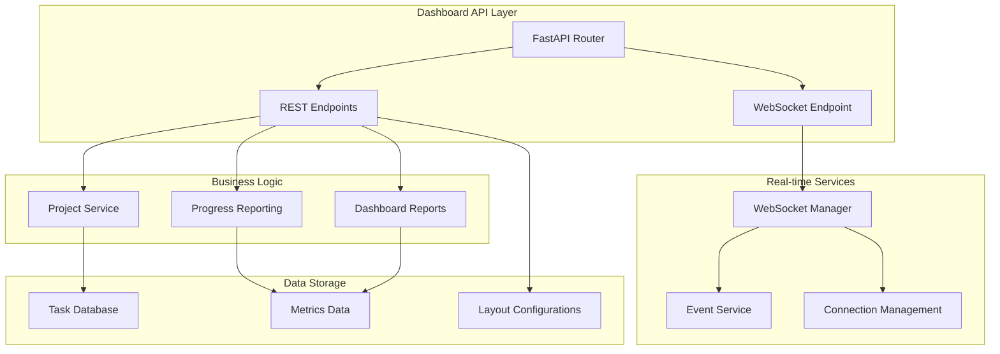
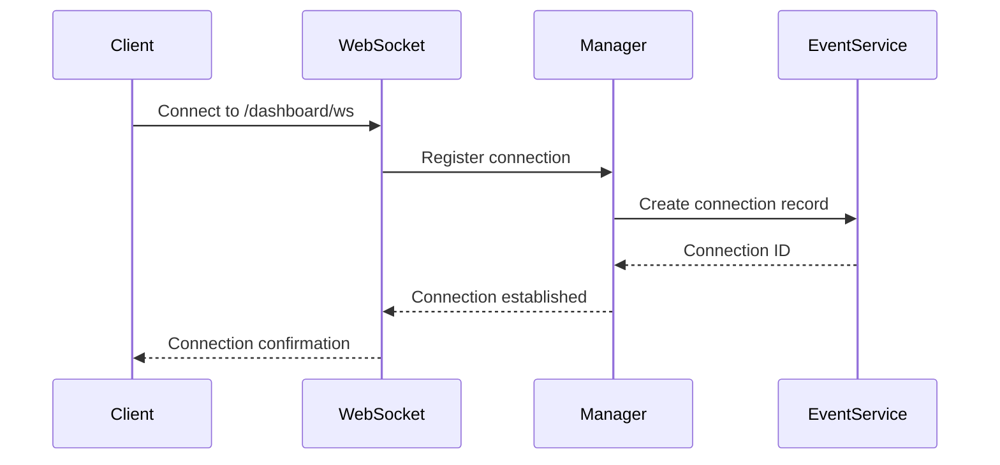
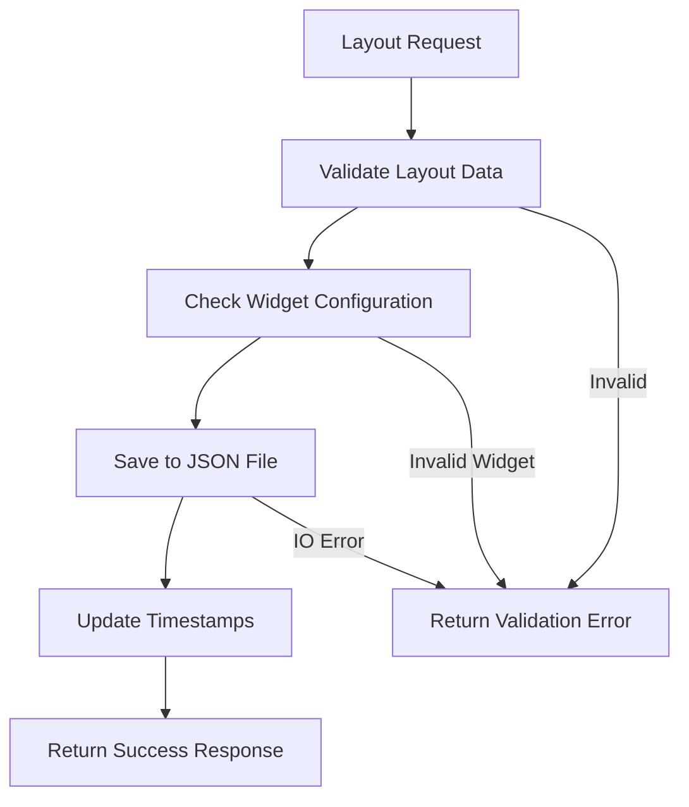

# API Module Documentation: dashboard_endpoints.py

*Last updated: 2025-08-14*

## Overview

The `dashboard_endpoints.py` module provides comprehensive dashboard-specific API endpoints for the AutoProjectManagement system. It includes real-time data streaming, metrics visualization, project health monitoring, and customizable dashboard layouts.

## Architecture Diagram

## Module Purpose and Responsibilities

| Responsibility | Description |
|----------------|-------------|
| Dashboard Data | Provides comprehensive project overview and metrics |
| Real-time Updates | WebSocket-based live data streaming |
| Layout Management | Customizable dashboard widget arrangements |
| Alert System | Real-time notifications and warnings |
| Health Monitoring | Project health assessment and scoring |

## API Endpoints Structure

### REST Endpoints

| Endpoint | Method | Description | Authentication |
|----------|--------|-------------|---------------|
| `/dashboard/overview` | GET | Comprehensive project dashboard overview | Optional |
| `/dashboard/metrics` | GET | Detailed metrics and trends data | Optional |
| `/dashboard/alerts` | GET | Active alerts and notifications | Optional |
| `/dashboard/health` | GET | Project health status assessment | Optional |
| `/dashboard/team-performance` | GET | Team performance metrics | Optional |
| `/dashboard/layout` | POST | Save dashboard layout configuration | Required |
| `/dashboard/layout` | GET | Retrieve saved layout configuration | Optional |
| `/dashboard/layouts` | GET | List available layout types | Optional |
| `/dashboard/layout/{type}` | DELETE | Delete layout configuration | Required |
| `/dashboard/widgets` | GET | List available widget types | Optional |
| `/dashboard/ws/stats` | GET | WebSocket connection statistics | Optional |

### WebSocket Endpoint

| Endpoint | Protocol | Description | Features |
|----------|----------|-------------|----------|
| `/dashboard/ws` | WebSocket | Real-time data streaming | Event subscriptions, Reconnection support, Heartbeat |

## Data Models

### DashboardOverview Model

| Field | Type | Description | Constraints |
|-------|------|-------------|------------|
| project_id | string | Unique project identifier | Required |
| total_tasks | integer | Total number of tasks | Required |
| completed_tasks | integer | Number of completed tasks | Required |
| progress_percentage | float | Progress percentage (0-100) | Required |
| health_score | float | Project health score (0-100) | Required |
| risk_level | string | Risk level assessment | low, medium, high, critical |
| last_updated | datetime | Last update timestamp | Required |
| team_performance | float | Team performance score | Required |
| quality_metrics | object | Quality assessment metrics | Required |

### DashboardMetrics Model

| Field | Type | Description |
|-------|------|-------------|
| timestamp | datetime | Metrics collection time |
| metrics | object | Current metrics values |
| trends | object | Historical trend data |

### DashboardAlert Model

| Field | Type | Description | Values |
|-------|------|-------------|--------|
| id | string | Unique alert identifier | UUID format |
| type | string | Alert category | risk, progress, quality, team |
| severity | string | Alert severity level | info, warning, error, critical |
| message | string | Descriptive alert message | |
| timestamp | datetime | Alert creation time | |
| project_id | string | Affected project ID | |
| resolved | boolean | Resolution status | |

### DashboardLayout Model

| Field | Type | Description | Constraints |
|-------|------|-------------|------------|
| layout_type | string | Layout identifier | Required |
| widgets | array | Widget configuration array | Required |
| refresh_rate | integer | UI refresh rate (ms) | 1000-60000 |
| theme | string | Visual theme | light, dark |
| created_at | datetime | Creation timestamp | |
| updated_at | datetime | Last update timestamp | |

## WebSocket Protocol

### Connection Establishment

### Message Types

| Message Type | Direction | Purpose | Fields |
|-------------|----------|---------|--------|
| connection_established | Server→Client | Connection confirmation | connection_id, timestamp |
| subscribe | Client→Server | Event subscription request | event_types, project_id |
| subscription_confirmed | Server→Client | Subscription acknowledgment | event_types, project_id |
| event | Server→Client | Real-time data update | event_type, data, event_id |
| ping | Client→Server | Connection keep-alive | |
| pong | Server→Client | Keep-alive response | timestamp |
| heartbeat | Server→Client | Connection maintenance | timestamp |
| reconnect | Client→Server | Reconnection request | last_event_id |
| reconnect_confirmed | Server→Client | Reconnection acknowledgment | last_event_id |
| get_stats | Client→Server | Statistics request | |
| stats_response | Server→Client | Statistics data | connection_stats |

### Event Types

| Event Type | Description | Data Structure |
|------------|-------------|----------------|
| progress_update | Task progress changes | Progress metrics |
| alert_created | New alert generated | Alert details |
| alert_resolved | Alert resolution | Alert ID, resolution time |
| health_change | Health score update | Health metrics |
| metric_update | Metric value change | Metric data |
| team_performance | Performance update | Performance data |

## Layout Management System

### Widget Types

| Widget ID | Description | Default Position | Configurable |
|-----------|-------------|------------------|-------------|
| health | Project health score | 0 | Yes |
| progress | Progress metrics | 1 | Yes |
| risks | Risk assessment | 2 | Yes |
| team | Team performance | 3 | Yes |
| quality | Quality metrics | 4 | Yes |
| alerts | Active alerts | 5 | Yes |

### Layout Configuration Flow

## Error Handling

### HTTP Error Responses

| Status Code | Error Type | Description | Retryable |
|-------------|------------|-------------|-----------|
| 400 | Bad Request | Invalid parameters | No |
| 404 | Not Found | Resource not found | No |
| 500 | Internal Error | Server processing error | Yes |

### WebSocket Error Handling

| Error Scenario | Recovery Action | Client Response |
|----------------|-----------------|----------------|
| Connection loss | Automatic reconnection | Reconnect with last_event_id |
| Message timeout | Heartbeat maintenance | Continue normal operation |
| Subscription error | Error logging | Continue with valid subscriptions |
| Event service down | Graceful degradation | Continue without real-time updates |

## Performance Characteristics

### Response Times

| Endpoint | Average Response | 95th Percentile | Data Size |
|----------|-----------------|-----------------|-----------|
| /overview | 50ms | 100ms | 2-5KB |
| /metrics | 75ms | 150ms | 5-10KB |
| /alerts | 40ms | 80ms | 1-3KB |
| /health | 60ms | 120ms | 3-6KB |

### WebSocket Performance

| Metric | Value | Description |
|--------|-------|-------------|
| Connections | 1000+ | Maximum concurrent connections |
| Events/sec | 500+ | Event processing capacity |
| Message Size | 1-10KB | Typical message payload |
| Latency | <100ms | End-to-end event delivery |

## Security Considerations

### Authentication Levels

| Endpoint | Authentication | Authorization |
|----------|----------------|---------------|
| Read endpoints | Optional | Project access |
| Write endpoints | Required | Admin privileges |
| WebSocket | Optional | Project filtering |

### Data Protection

| Aspect | Protection Mechanism | Description |
|--------|---------------------|-------------|
| API data | HTTPS encryption | Transport security |
| WebSocket | WSS encryption | Secure WebSocket |
| Layout files | File permissions | Restricted access |
| Metrics data | Data sanitization | Input validation |

## Integration Points

### Internal Dependencies

| Module | Integration Type | Purpose |
|--------|------------------|---------|
| api/services.py | Data access | Project status information |
| progress_reporting/ | Business logic | Progress calculations |
| realtime_service.py | Event system | Real-time notifications |

### External Integration

| System | Integration Method | Data Flow |
|--------|-------------------|-----------|
| Frontend UI | REST API + WebSocket | Real-time dashboard |
| Monitoring tools | API endpoints | Health metrics |
| Alert systems | WebSocket events | Notification delivery |

## Monitoring and Metrics

### Key Performance Indicators

| Metric | Measurement | Alert Threshold |
|--------|-------------|-----------------|
| API response time | <100ms | >500ms |
| WebSocket connections | Active count | >1000 connections |
| Event processing rate | Events/second | <100 events/sec |
| Error rate | Errors/minute | >10 errors/min |

### Health Checks

| Component | Check Method | Frequency | Timeout |
|-----------|-------------|-----------|---------|
| API endpoints | HTTP GET /health | 30s | 5s |
| WebSocket | Heartbeat | 30s | 10s |
| Event service | Connection test | 60s | 15s |

## Future Enhancements

### Phase 1: Immediate
- Advanced widget customization
- Historical data retention
- Enhanced alert rules

### Phase 2: Medium-term
- Multi-project dashboards
- Custom metric definitions
- Export functionality

### Phase 3: Long-term
- Predictive analytics
- Machine learning integration
- Advanced visualization

## Related Documentation

- API Reference: Complete endpoint specifications
- WebSocket Protocol: Detailed message format documentation
- Dashboard Guide: User interface documentation
- Integration Guide: Third-party integration instructions

---

*This documentation follows AutoProjectManagement standards*
*Maintained by the Dashboard Development Team*
