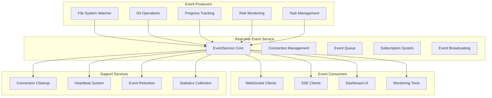
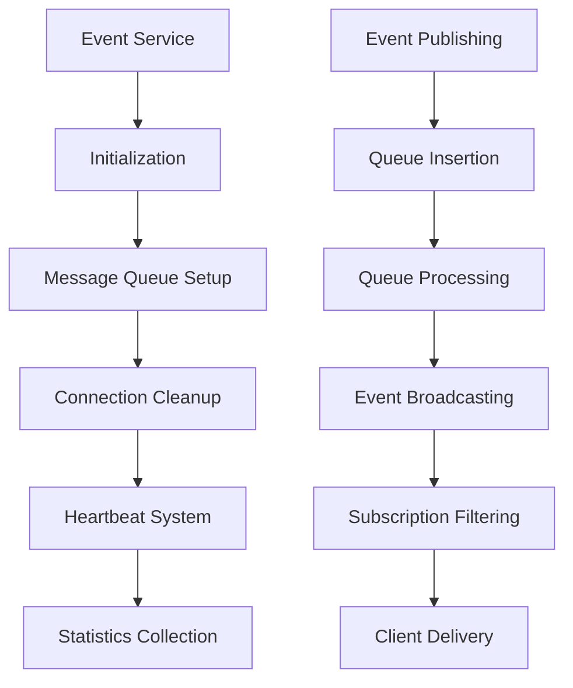
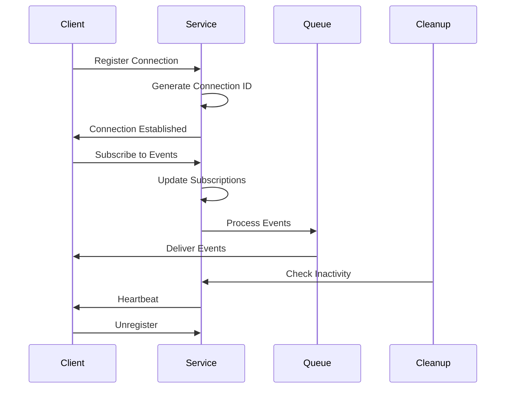
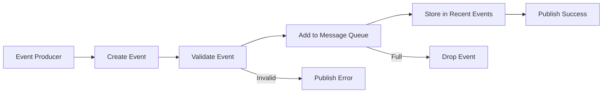
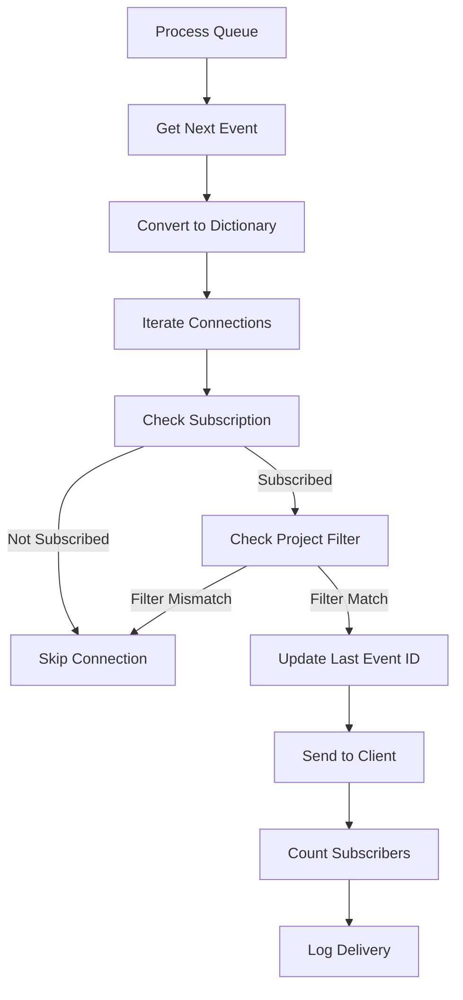

# API Module Documentation: realtime_service.py

*Last updated: 2025-08-14*

## Overview

The `realtime_service.py` module provides a centralized real-time event service for WebSocket and Server-Sent Events (SSE) communications within the AutoProjectManagement system. It manages event publishing, subscription management, connection handling, and real-time data broadcasting.

## Architecture Diagram

## Module Purpose and Responsibilities

| Responsibility | Description |
|----------------|-------------|
| Event Management | Centralized event publishing and subscription |
| Connection Handling | WebSocket and SSE connection lifecycle management |
| Real-time Broadcasting | Efficient event distribution to subscribers |
| Subscription System | Event type-based subscription management |
| Connection Cleanup | Automatic cleanup of inactive connections |
| Statistics Collection | Performance and usage metrics monitoring |

## Event Types

### System Events

| Event Type | Description | Data Structure |
|------------|-------------|----------------|
| FILE_CHANGE | File system modifications | File path, change type |
| COMMIT | Git commit operations | Commit hash, message, author |
| PROGRESS_UPDATE | Project progress changes | Progress metrics |
| RISK_ALERT | Risk assessment alerts | Risk data, severity |
| TASK_UPDATE | Task status changes | Task data, status |
| SYSTEM_STATUS | System health status | Health metrics |
| DASHBOARD_UPDATE | Dashboard data refresh | Dashboard metrics |
| HEALTH_CHECK | Connection heartbeat | Timestamp, status |

### Auto-Commit Events

| Event Type | Description | Data Structure |
|------------|-------------|----------------|
| AUTO_COMMIT_START | Auto-commit process initiation | Change count, timestamp |
| AUTO_COMMIT_RESULT | Auto-commit completion | Success status, message |
| AUTO_COMMIT_ERROR | Auto-commit failure | Error message, details |

## Data Models

### Event Model

| Field | Type | Description | Required |
|-------|------|-------------|----------|
| type | EventType | Event category | Yes |
| data | object | Event payload data | Yes |
| timestamp | float | Event creation time | Yes |
| source | string | Event source identifier | No |
| project_id | string | Related project ID | No |
| event_id | string | Unique event identifier | Yes |

### Connection Model

| Field | Type | Description |
|-------|------|-------------|
| connection_id | string | Unique connection identifier |
| connected_at | float | Connection establishment time |
| last_activity | float | Last activity timestamp |
| subscriptions | set | Subscribed event types |
| project_filter | string | Project-specific filtering |
| last_event_id | string | Last received event ID |

## Service Architecture

### Core Components

### Connection Lifecycle

## Event Processing Flow

### Publishing Events

### Broadcasting Events

## Configuration Parameters

### EventService Configuration

| Parameter | Default | Description | Constraints |
|-----------|---------|-------------|------------|
| max_queue_size | 1000 | Maximum queue capacity | >0 |
| event_retention | 100 | Recent events to retain | >0 |

### Connection Management

| Parameter | Default | Description | Purpose |
|-----------|---------|-------------|---------|
| cleanup_timeout | 300s | Inactivity timeout | Resource management |
| heartbeat_interval | 30s | Heartbeat frequency | Connection maintenance |
| queue_timeout | 1s | Queue operation timeout | Performance tuning |

## Performance Characteristics

### Capacity Limits

| Metric | Value | Description |
|--------|-------|-------------|
| Maximum Connections | 1000+ | Concurrent active connections |
| Event Queue Size | 2000 | Maximum queued events |
| Event Retention | 200 | Recent events for replay |
| Processing Rate | 500+ events/sec | Event broadcasting capacity |

### Response Times

| Operation | Average | 95th Percentile | Description |
|-----------|---------|-----------------|-------------|
| Event Publishing | <10ms | <50ms | Queue insertion time |
| Event Broadcasting | <100ms | <500ms | Delivery to subscribers |
| Connection Registration | <5ms | <20ms | New connection setup |
| Subscription Update | <2ms | <10ms | Subscription changes |

## Error Handling

### Error Scenarios

| Error Type | Cause | Recovery Action | Impact |
|------------|-------|-----------------|--------|
| Queue Full | High event volume | Event dropping | Data loss |
| Connection Error | Network issues | Connection cleanup | Client reconnection |
| Processing Error | System failure | Error logging | Service degradation |
| Subscription Error | Invalid event type | Error response | Client notification |

### Recovery Mechanisms

| Mechanism | Description | Trigger Condition |
|-----------|-------------|-------------------|
| Event Replay | Recent event retrieval | Client reconnection |
| Connection Cleanup | Inactive connection removal | Timeout expiration |
| Queue Management | Size monitoring and adjustment | High load conditions |
| Heartbeat System | Connection health checking | Periodic intervals |

## Security Considerations

### Authentication Levels

| Operation | Authentication | Authorization |
|-----------|----------------|---------------|
| Event Publishing | Internal only | Service-level |
| Connection Registration | Optional | Project access |
| Subscription Management | Connection-based | Event type permissions |
| Statistics Access | Admin required | System monitoring |

### Data Protection

| Aspect | Protection Mechanism | Description |
|--------|---------------------|-------------|
| Event Data | Transport encryption | HTTPS/WSS |
| Connection IDs | Opaque identifiers | No sensitive information |
| Project Filtering | Data segregation | Project isolation |
| Access Logging | Audit trails | Security monitoring |

## Monitoring and Metrics

### Key Performance Indicators

| Metric | Measurement | Alert Threshold |
|--------|-------------|-----------------|
| Active Connections | Count | >800 connections |
| Event Queue Size | Percentage full | >80% capacity |
| Processing Latency | Milliseconds | >500ms |
| Error Rate | Errors per minute | >10 errors/min |
| Memory Usage | Megabytes | >500MB |

### Health Checks

| Component | Check Method | Frequency | Timeout |
|-----------|-------------|-----------|---------|
| Service Status | API endpoint | 30s | 5s |
| Connection Health | Heartbeat | 30s | 10s |
| Queue Health | Size monitoring | 60s | 15s |
| Memory Health | Usage check | 120s | 30s |

## Integration Points

### Internal Dependencies

| Module | Integration Type | Data Flow |
|--------|------------------|-----------|
| dashboard_endpoints.py | WebSocket integration | Real-time updates |
| sse_endpoints.py | SSE integration | Event streaming |
| automation_services/ | Event production | System events |
| progress_reporting/ | Progress updates | Metrics events |

### External Integration

| System | Integration Method | Purpose |
|--------|-------------------|---------|
| Frontend UI | WebSocket/SSE | Real-time dashboard |
| Monitoring Tools | API endpoints | System metrics |
| Alert Systems | Event consumption | Notifications |
| Logging Systems | Event capture | Audit trails |

## Utility Functions

### Event Publishing Helpers

| Function | Purpose | Parameters |
|----------|---------|------------|
| publish_file_change_event | File system events | File path, change type |
| publish_commit_event | Git commit events | Commit hash, message, author |
| publish_progress_update | Progress metrics | Progress data |
| publish_risk_alert | Risk notifications | Risk assessment data |
| publish_task_update | Task status changes | Task information |
| publish_auto_commit_* | Auto-commit events | Process status, results |

## Future Enhancements

### Phase 1: Immediate
- Enhanced event filtering
- Advanced subscription management
- Improved error recovery

### Phase 2: Medium-term
- Distributed event processing
- Persistent event storage
- Advanced authentication

### Phase 3: Long-term
- Machine learning integration
- Predictive event routing
- Advanced analytics

## Related Documentation

- WebSocket Protocol: Real-time communication specifications
- SSE Endpoints: Server-Sent Events implementation
- Event Reference: Complete event type documentation
- Integration Guide: System integration instructions

---

*This documentation follows AutoProjectManagement standards*
*Maintained by the Real-time Services Team*
