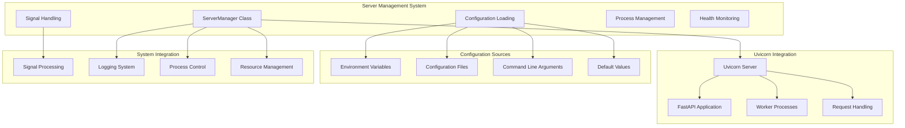
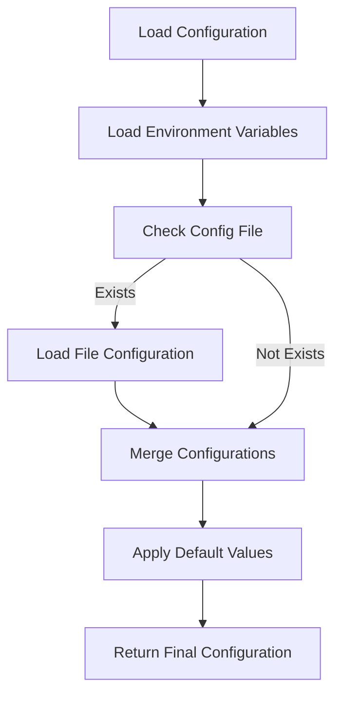
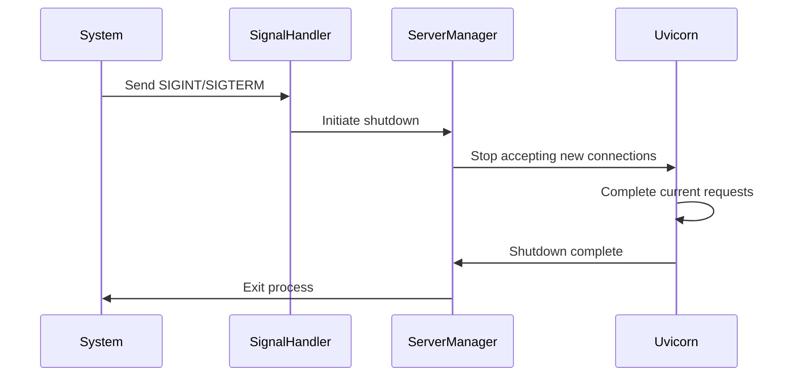

# API Module Documentation: server.py

*Last updated: 2025-08-14*

## Overview

The `server.py` module provides comprehensive server configuration and management for the AutoProjectManagement API system. It handles server lifecycle management, configuration loading, graceful shutdown, and production deployment settings.

## Architecture Diagram



## Module Purpose and Responsibilities

| Responsibility | Description |
|----------------|-------------|
| Server Lifecycle | Complete server startup and shutdown management |
| Configuration Management | Multi-source configuration loading and merging |
| Process Control | Worker process management and supervision |
| Signal Handling | Graceful shutdown and system signal processing |
| Health Monitoring | Server health status and performance tracking |
| Deployment Support | Production and development environment configuration |

## Server Configuration

### Default Configuration Values

| Parameter | Default Value | Description | Environment Variable |
|-----------|---------------|-------------|---------------------|
| Host | 127.0.0.1 | Server binding address | API_HOST |
| Port | 8000 | Server listening port | API_PORT |
| Reload | True | Auto-reload for development | API_RELOAD |
| Log Level | info | Logging verbosity level | API_LOG_LEVEL |
| Workers | 1 | Number of worker processes | API_WORKERS |
| Timeout | 30 | Request timeout in seconds | API_TIMEOUT |

### Configuration Priority Order


## ServerManager Class

### Class Properties

| Property | Type | Description | Default |
|----------|------|-------------|---------|
| host | string | Server host address | 127.0.0.1 |
| port | integer | Server port number | 8000 |
| reload | boolean | Auto-reload enabled | True |
| log_level | string | Logging level | info |
| workers | integer | Worker processes count | 1 |
| timeout | integer | Request timeout | 30 |
| running | boolean | Server status flag | False |

### Class Methods

#### start()
**Purpose**: Initialize and start the Uvicorn server with comprehensive configuration

**Process Flow:**
1. **Configuration Validation**: Verify all parameters are valid
2. **Server Initialization**: Create Uvicorn server instance
3. **Process Startup**: Begin server operation
4. **Status Monitoring**: Track server running state

#### stop()
**Purpose**: Gracefully stop the server and clean up resources

**Process Flow:**
1. **Connection Drainage**: Allow existing requests to complete
2. **Process Termination**: Stop worker processes
3. **Resource Cleanup**: Release allocated resources
4. **Status Update**: Mark server as stopped

#### get_config()
**Purpose**: Retrieve current server configuration

**Returns**: Complete configuration dictionary with all current settings

#### health_check()
**Purpose**: Perform comprehensive server health assessment

**Returns**: Health status dictionary with operational metrics

## Configuration Management

### Configuration Loading Process



### Configuration File Format

**JSON Structure:**
```json
{
  "host": "127.0.0.1",
  "port": 8000,
  "reload": true,
  "log_level": "info",
  "workers": 1,
  "timeout": 30
}
```

## Command Line Interface

### Available Options

| Option | Description | Values | Default |
|--------|-------------|--------|---------|
| --host | Server host address | IP address or hostname | 127.0.0.1 |
| --port | Server port number | 1-65535 | 8000 |
| --reload | Enable auto-reload | Boolean flag | True |
| --log-level | Logging level | debug, info, warning, error | info |
| --workers | Worker processes | Integer > 0 | 1 |
| --timeout | Request timeout | Seconds > 0 | 30 |
| --config | Configuration file | File path | None |

### Usage Examples

| Command | Description |
|---------|-------------|
| `python server.py` | Default development mode |
| `python server.py --host 0.0.0.0 --port 8000` | Bind to all interfaces |
| `python server.py --reload --log-level debug` | Development with debug logging |
| `python server.py --workers 4 --timeout 60` | Production configuration |
| `python server.py --config production.json` | Custom configuration file |

## Signal Handling

### Supported Signals

| Signal | Purpose | Action |
|--------|---------|--------|
| SIGINT | Interrupt from keyboard | Graceful shutdown |
| SIGTERM | Termination request | Graceful shutdown |
| SIGHUP | Configuration reload | Future implementation |

### Graceful Shutdown Process



## Deployment Scenarios

### Development Environment

| Setting | Value | Purpose |
|---------|-------|---------|
| Reload | True | Automatic code reloading |
| Workers | 1 | Single process for debugging |
| Log Level | debug | Detailed logging |
| Host | 127.0.0.1 | Local development |

### Production Environment

| Setting | Value | Purpose |
|---------|-------|---------|
| Reload | False | Stability over convenience |
| Workers | 4+ | Multiple processes for concurrency |
| Log Level | info | Production-appropriate logging |
| Host | 0.0.0.0 | External access |
| Timeout | 60+ | Longer request handling |

### Testing Environment

| Setting | Value | Purpose |
|---------|-------|---------|
| Reload | False | Consistent behavior |
| Workers | 2 | Balance between speed and isolation |
| Log Level | warning | Reduced log noise |
| Port | 8001+ | Avoid port conflicts |

## Performance Characteristics

### Resource Requirements

| Metric | Development | Production | Description |
|--------|-------------|------------|-------------|
| Memory | 50-100MB | 200-500MB | Per worker process |
| CPU | Low | Medium-High | Based on workload |
| Connections | 100-500 | 1000-5000 | Concurrent connections |
| Throughput | 100-500 req/s | 1000-5000 req/s | Requests per second |

### Scaling Considerations

| Factor | Impact | Recommendation |
|--------|--------|---------------|
| Worker Count | Linear performance | 2-4 workers per CPU core |
| Timeout | Connection management | 30-120 seconds based on workload |
| Memory | Process stability | Monitor and adjust worker count |
| CPU | Processing capacity | Scale horizontally with load balancer |

## Error Handling

### Startup Errors

| Error Type | Cause | Recovery |
|------------|-------|----------|
| Port Conflict | Port already in use | Change port or stop conflicting process |
| Permission Denied | Insufficient privileges | Run as admin or use higher port |
| Configuration Error | Invalid settings | Validate configuration file |
| Dependency Missing | Missing packages | Install required dependencies |

### Runtime Errors

| Error Type | Cause | Recovery |
|------------|-------|----------|
| Worker Crash | Process failure | Automatic restart (supervised) |
| Memory Exhaustion | Resource limits | Reduce workers or increase memory |
| Connection Limit | Too many connections | Adjust OS limits or optimize |

### Shutdown Errors

| Error Type | Cause | Recovery |
|------------|-------|----------|
| Hung Connections | Unresponsive clients | Force timeout enforcement |
| Resource Leaks | Improper cleanup | Manual intervention required |

## Monitoring and Logging

### Log Levels

| Level | Purpose | Information |
|-------|---------|-------------|
| debug | Development | Detailed process information |
| info | Operational | Server lifecycle events |
| warning | Issues | Recoverable problems |
| error | Failures | Critical errors requiring attention |

### Health Metrics

| Metric | Measurement | Healthy Range |
|--------|-------------|--------------|
| Uptime | Seconds | Continuous operation |
| Memory Usage | Percentage | <80% utilization |
| CPU Usage | Percentage | <70% utilization |
| Active Connections | Count | <80% of limit |
| Error Rate | Errors/minute | <5 errors/min |

## Security Considerations

### Network Security

| Aspect | Configuration | Recommendation |
|--------|-------------|---------------|
| Binding Address | Host setting | 127.0.0.1 for local, 0.0.0.0 for external |
| Port Selection | Port number | Use standard ports (80, 443) with reverse proxy |
| Firewall | Network rules | Restrict access to necessary IP ranges |

### Process Security

| Aspect | Consideration | Recommendation |
|--------|-------------|---------------|
| User Privileges | Process owner | Run as non-root user |
| File Permissions | Configuration files | Restrict read access |
| Environment Variables | Sensitive data | Use secure storage |

## Integration Points

### Internal Dependencies

| Module | Integration Type | Purpose |
|--------|------------------|---------|
| api/app.py | FastAPI application | Main application instance |
| Configuration system | Settings management | Runtime configuration |

### External Integration

| System | Integration Method | Purpose |
|--------|-------------------|---------|
| Reverse Proxy | HTTP forwarding | Load balancing, SSL termination |
| Monitoring | Health checks | System status monitoring |
| Logging | Log aggregation | Centralized log management |
| Process Supervisor | Process management | Automatic restarts |

## Future Enhancements

### Phase 1: Immediate
- Enhanced configuration validation
- Advanced health checking
- Improved logging configuration

### Phase 2: Medium-term
- Hot configuration reload
- Advanced metrics collection
- Distributed tracing support

### Phase 3: Long-term
- Kubernetes integration
- Advanced autoscaling
- AI-powered optimization

## Related Documentation

- Deployment Guide: Production deployment instructions
- Configuration Reference: Complete configuration options
- Monitoring Guide: Health check and metrics documentation
- Security Guide: Security best practices

---

*This documentation follows AutoProjectManagement standards*
*Maintained by the Infrastructure Team*
