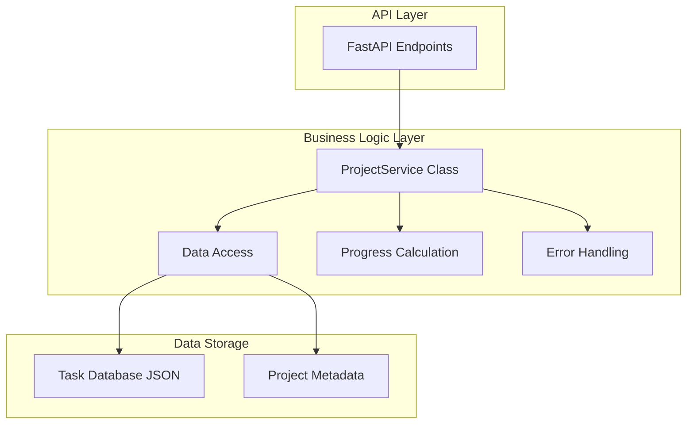
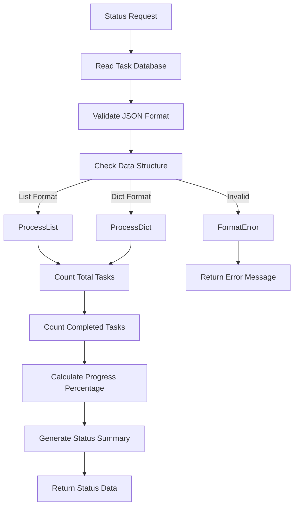

# API Module Documentation: services.py

*Last updated: 2025-08-14*

## Overview

The `services.py` module serves as the business logic layer for the AutoProjectManagement API system. It provides a clean separation between the API presentation layer and core business operations, ensuring maintainability and testability.

## Architecture Diagram



## Module Purpose and Responsibilities

| Responsibility | Description |
|----------------|-------------|
| Business Logic | Encapsulates core project management operations |
| Data Access | Handles reading from task database files |
| Progress Calculation | Computes project status and metrics |
| Error Handling | Manages exceptions and returns structured errors |
| API Integration | Provides clean interface for FastAPI endpoints |

## ProjectService Class Structure

### Class Properties

| Property | Type | Description |
|----------|------|-------------|
| db_path | Path | Root path to JSON database directory |
| inputs_path | Path | Path to input data files |
| outputs_path | Path | Path to output data files |

### Class Methods

#### get_status(project_id: str)

**Purpose**: Retrieves and calculates comprehensive status for a specific project

**Input Parameters:**
- `project_id`: Unique project identifier string

**Output:**
- Success: Dictionary with status metrics
- Not Found: None value
- Error: Dictionary with error information

**Processing Flow:**
1. **File Access**: Locates and reads task database file
2. **Data Validation**: Verifies JSON format and structure
3. **Progress Calculation**: Computes completion metrics
4. **Summary Generation**: Creates human-readable status summary
5. **Response Formatting**: Structures data for API response

#### get_project_list()

**Purpose**: Retrieves list of available projects (placeholder implementation)

**Output:**
- Dictionary indicating feature not yet implemented
- Structured format for future expansion

## Data Processing Flow

### Status Calculation Algorithm



### Progress Calculation Formula

| Metric | Formula | Description |
|--------|---------|-------------|
| Total Tasks | N | Count of all tasks in database |
| Completed Tasks | C | Count of tasks with status "Done" |
| Progress Percentage | (C / N) × 100 | Percentage of completion |
| Summary | Based on progress range | Human-readable status description |

### Summary Generation Rules

| Progress Range | Summary Message |
|----------------|----------------|
| 0% | Project not started. |
| 1-99% | Project is in progress. |
| 100% | Project completed. |

## Error Handling Strategy

### Error Types and Responses

| Error Type | Cause | Response Format |
|------------|-------|----------------|
| File Not Found | Missing task database file | Error dictionary with message |
| JSON Parse Error | Invalid JSON syntax | Error dictionary with details |
| Invalid Format | Unexpected data structure | Error dictionary with type information |
| I/O Error | File access issues | Error dictionary with system message |

### Error Response Structure

| Field | Type | Description |
|-------|------|-------------|
| error | string | Descriptive error message |
| detail | string | Additional error details (optional) |

## Data Storage Architecture

### File System Structure

```
JSonDataBase/
├── Inputs/
│   └── UserInputs/
│       └── commit_task_database.json
└── OutPuts/
```

### Supported Data Formats

#### Format 1: List Structure
- Array of task objects
- Each object contains task properties
- Simple linear structure

#### Format 2: Dictionary Structure  
- Key-value pairs with task IDs as keys
- Each value is a task object
- Allows direct task access by ID

### Task Object Properties

| Property | Type | Description | Required |
|----------|------|-------------|----------|
| id | string | Unique task identifier | Yes |
| name | string | Task description | Yes |
| status | string | Completion status | Yes |
| other fields | various | Additional task metadata | No |

## Performance Characteristics

### Computational Complexity

| Operation | Complexity | Description |
|-----------|------------|-------------|
| File Reading | O(1) | Single file access operation |
| JSON Parsing | O(n) | Linear to file size |
| Task Counting | O(n) | Linear to number of tasks |
| Progress Calculation | O(1) | Simple arithmetic operations |

### Memory Usage

| Component | Memory Impact | Description |
|-----------|---------------|-------------|
| File Content | O(n) | Entire file loaded into memory |
| Parsed JSON | O(n) | Memory proportional to data size |
| Service Instance | O(1) | Fixed overhead for class instance |

## Integration Points

### API Layer Integration

| Endpoint | Service Method | Purpose |
|----------|---------------|---------|
| GET /projects/{id}/status | get_status() | Retrieve project status |
| GET /projects | get_project_list() | List available projects |

### Future Integration Opportunities

| Module | Integration Type | Purpose |
|--------|------------------|---------|
| Database Module | Data Access | Replace file-based storage |
| Cache Module | Performance | Add response caching |
| Analytics Module | Data Processing | Advanced metrics calculation |

## Quality Attributes

### Reliability
- Comprehensive error handling for all failure scenarios
- Graceful degradation when data is unavailable
- Consistent response formats across all conditions

### Maintainability  
- Clean separation of concerns
- Well-documented method interfaces
- Minimal external dependencies

### Performance
- Efficient file I/O operations
- Optimized data processing algorithms
- Scalable for typical project sizes

### Security
- Path traversal protection through proper path handling
- No sensitive information exposure in error messages
- Input validation at API layer boundary

## Future Enhancement Roadmap

### Phase 1: Immediate Improvements
- Database integration for persistent storage
- Caching mechanism for frequent requests
- Enhanced error logging and monitoring

### Phase 2: Advanced Features
- Real-time status updates through WebSocket
- Historical progress tracking and analytics
- Team performance metrics integration

### Phase 3: Enterprise Features
- Distributed caching support
- Load balancing and scalability improvements
- Advanced security and authentication

## Related Documentation

- API Reference: Complete endpoint documentation
- Data Format Specification: Detailed JSON schema definitions
- Deployment Guide: Production configuration and optimization
- Monitoring Guide: Logging and performance monitoring

## Revision History

| Version | Date | Changes |
|---------|------|---------|
| 1.0.0 | 2024-01-01 | Initial release with core functionality |
| 1.0.1 | 2025-08-14 | Type annotations and documentation improvements |

---

*This documentation follows the AutoProjectManagement documentation standards*
*Maintained by the Architecture Review Board*
