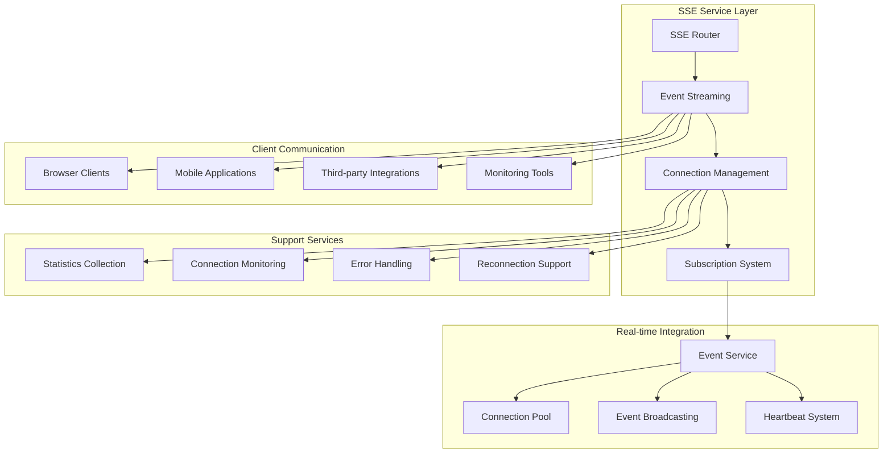
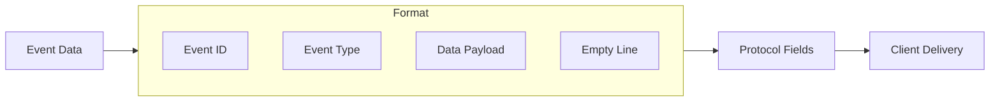
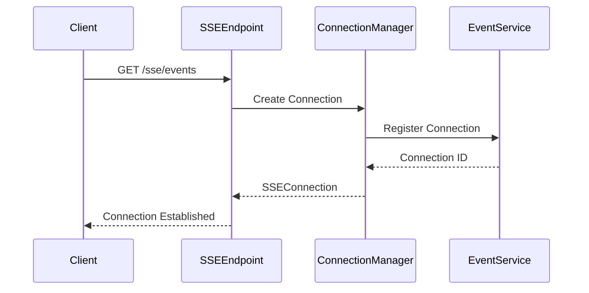
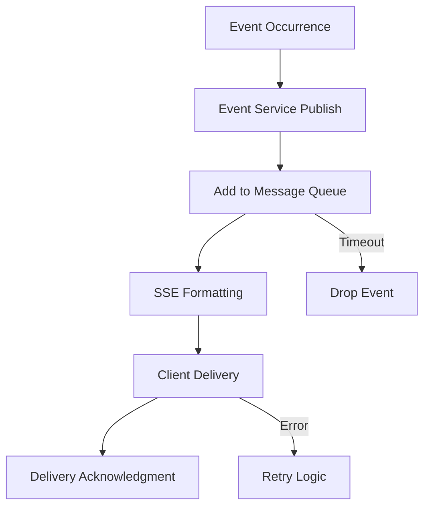
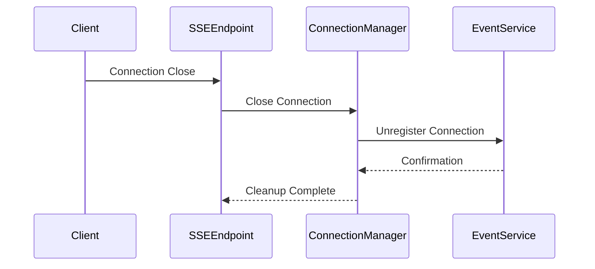
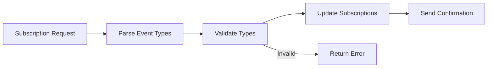

# API Module Documentation: sse_endpoints.py

*Last updated: 2025-08-14*

## Overview

The `sse_endpoints.py` module provides complete Server-Sent Events (SSE) implementation for browser-compatible real-time event streaming in the AutoProjectManagement system. It enables efficient, low-latency communication with web clients through standardized SSE protocol.

## Architecture Diagram



## Module Purpose and Responsibilities

| Responsibility | Description |
|----------------|-------------|
| SSE Protocol | Standard-compliant Server-Sent Events implementation |
| Connection Management | SSE connection lifecycle and state management |
| Event Streaming | Efficient real-time data delivery to clients |
| Subscription System | Dynamic event type subscription management |
| Browser Compatibility | Cross-browser SSE support and fallback handling |
| Reconnection Support | Automatic reconnection with event replay |

## API Endpoints Structure

### SSE Streaming Endpoint

| Endpoint | Method | Description | Media Type |
|----------|--------|-------------|------------|
| `/sse/events` | GET | Main SSE event streaming endpoint | text/event-stream |

### Management Endpoints

| Endpoint | Method | Description | Purpose |
|----------|--------|-------------|---------|
| `/sse/subscribe` | POST | Dynamic subscription management | Runtime subscription changes |
| `/sse/stats` | GET | Connection statistics | Monitoring and diagnostics |
| `/sse/connections` | GET | Active connection listing | Connection management |
| `/sse/test-event` | POST | Test event publishing | Development and testing |

## SSE Protocol Implementation

### Event Format Specification



### Protocol Field Structure

| Field | Format | Description | Required |
|-------|--------|-------------|----------|
| id | `id: <value>\n` | Unique event identifier | Optional |
| event | `event: <type>\n` | Event type/category | Optional |
| data | `data: <json>\n` | Event payload data | Required |
| retry | `retry: <ms>\n` | Reconnection timeout | Optional |

### Message Example

```
id: event-12345
event: progress_update
data: {"progress":75,"message":"Update completed"}
```

## Data Models

### SSEConnection Model

| Field | Type | Description | Purpose |
|-------|------|-------------|---------|
| connection_id | string | Unique connection identifier | Connection tracking |
| message_queue | Queue | Outgoing message queue | Message buffering |
| last_event_id | string | Last delivered event ID | Reconnection support |
| subscriptions | set | Subscribed event types | Event filtering |
| project_filter | string | Project-specific filter | Data segregation |

### SSESubscriptionRequest Model

| Field | Type | Description | Constraints |
|-------|------|-------------|------------|
| event_types | list | Event types to subscribe | Required |
| project_id | string | Project filter | Optional |
| last_event_id | string | Last received event ID | Reconnection |

## Connection Lifecycle

### Establishment Process



### Message Flow



### Termination Process



## Subscription Management

### Subscription Types

| Event Type | Description | Data Format |
|------------|-------------|-------------|
| file_change | File system modifications | File metadata |
| commit | Version control operations | Commit details |
| progress_update | Task progress changes | Progress metrics |
| risk_alert | Risk assessment events | Risk data |
| task_update | Task status updates | Task information |
| system_status | System health status | Health metrics |

### Dynamic Subscription



## Performance Characteristics

### Connection Capacity

| Metric | Value | Description |
|--------|-------|-------------|
| Maximum Connections | 1000+ | Concurrent SSE connections |
| Message Throughput | 500+ events/sec | Event processing rate |
| Memory Usage | 5-10MB per connection | Connection overhead |
| Latency | <100ms | End-to-end delivery time |

### Browser Compatibility

| Browser | SSE Support | Limitations |
|---------|-------------|-------------|
| Chrome | Full support | 6 concurrent connections |
| Firefox | Full support | 6 concurrent connections |
| Safari | Full support | 6 concurrent connections |
| Edge | Full support | 6 concurrent connections |
| IE11 | No support | Requires polyfill |

## Error Handling

### Connection Errors

| Error Type | Cause | Recovery |
|------------|-------|----------|
| Network Failure | Connection loss | Automatic reconnection |
| Browser Limit | Connection quota | Connection pooling |
| Timeout | Inactivity | Heartbeat maintenance |
| Protocol Error | Invalid format | Connection reset |

### Server Errors

| Error Type | Cause | Recovery |
|------------|-------|----------|
| Memory Pressure | High connection count | Connection cleanup |
| Event Queue Full | High event volume | Event dropping |
| Service Unavailable | Backend issues | Graceful degradation |

## Security Considerations

### Authentication & Authorization

| Aspect | Mechanism | Description |
|--------|-----------|-------------|
| Connection Auth | Optional | Bearer tokens or cookies |
| Event Filtering | Project-based | Data segregation |
| Rate Limiting | Connection-based | Request throttling |
| CORS | Cross-origin | Controlled access |

### Data Protection

| Aspect | Protection | Description |
|--------|-----------|-------------|
| Transport | HTTPS | Encryption in transit |
| Data Validation | Input sanitization | XSS prevention |
| Access Control | Project filtering | Data isolation |
| Logging | Audit trails | Security monitoring |

## Monitoring and Metrics

### Key Performance Indicators

| Metric | Measurement | Healthy Range |
|--------|-------------|--------------|
| Active Connections | Count | <800 connections |
| Message Queue Size | Events | <80% capacity |
| Error Rate | Errors/minute | <5 errors/min |
| Memory Usage | Percentage | <70% utilization |
| Latency | Milliseconds | <200ms p95 |

### Health Checks

| Check | Method | Frequency | Timeout |
|-------|--------|-----------|---------|
| Connection Health | Heartbeat | 30 seconds | 10 seconds |
| Service Health | API endpoint | 60 seconds | 15 seconds |
| Memory Health | Usage monitoring | 120 seconds | 30 seconds |

## Deployment Considerations

### Development Environment

| Setting | Value | Purpose |
|---------|-------|---------|
| Connection Limit | 100 | Development testing |
| Log Level | debug | Detailed debugging |
| Heartbeat | 30s | Connection maintenance |

### Production Environment

| Setting | Value | Purpose |
|---------|-------|---------|
| Connection Limit | 1000+ | High availability |
| Log Level | info | Production logging |
| Heartbeat | 30s | Stable connections |
| Timeout | 60s | Longer persistence |

### Scaling Strategies

| Strategy | Implementation | Benefit |
|----------|---------------|---------|
| Load Balancing | Multiple instances | Horizontal scaling |
| Connection Pooling | Shared resources | Efficient resource use |
| Event Batching | Grouped messages | Reduced overhead |
| Compression | Gzip encoding | Bandwidth optimization |

## Integration Points

### Internal Dependencies

| Module | Integration Type | Data Flow |
|--------|------------------|-----------|
| realtime_service.py | Event system | Event publishing/subscription |
| EventService | Core service | Connection management |
| API router | HTTP layer | Endpoint handling |

### External Integration

| System | Integration Method | Purpose |
|--------|-------------------|---------|
| Web Browsers | SSE protocol | Real-time updates |
| Mobile Apps | SSE clients | Mobile notifications |
| Monitoring | Statistics API | Performance tracking |
| Proxies | HTTP forwarding | Load balancing |

## Future Enhancements

### Phase 1: Immediate
- Enhanced compression support
- Advanced filtering options
- Improved error recovery

### Phase 2: Medium-term
- Persistent connections
- Advanced authentication
- Quality of Service (QoS)

### Phase 3: Long-term
- WebSocket fallback
- Advanced load balancing
- AI-powered optimization

## Related Documentation

- SSE Protocol Specification: Official W3C standard
- Browser Compatibility: Cross-browser support matrix
- Performance Guide: Scaling and optimization
- Security Guide: Authentication and protection

---

*This documentation follows AutoProjectManagement standards*
*Maintained by the Real-time Services Team*
