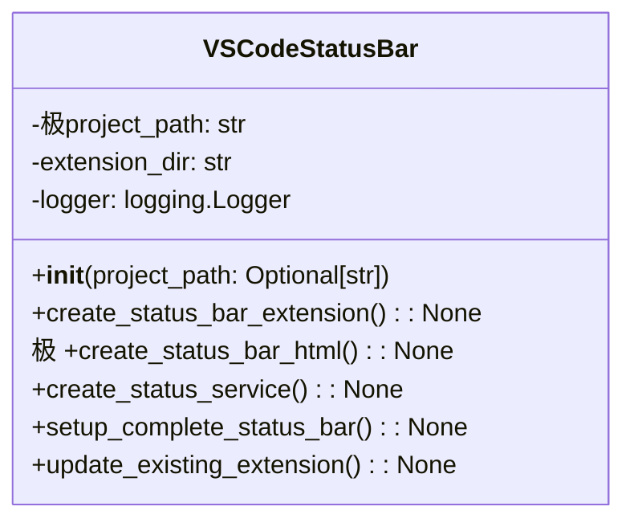

# مستندات ماژول VS Code Status Bar

## بررسی کلی
ماژول `vscode_extension_status_bar.py` با Visual Studio Code یکپارچه می‌شود تا به‌روزرسانی‌های وضعیت مدیریت پروژه بلادرنگ را در نوار وضعیت فراهم کند. این ماژول به کاربران امکان می‌دهد تا وضعیت سیستم AutoProjectManagement را مستقیماً از رابط VS Code نظارت کنند.

## معماری

### ساختار کلاس


## عملکرد تفصیلی

### کلاس VSCodeStatusBar

#### مقداردهی اولیه
**متد**: `__init__(project_path: Optional[str] = None)`

کلاس VSCodeStatusBar را با مسیر پروژه مقداردهی اولیه می‌کند و لاگ‌گیری را راه‌اندازی می‌کند.

**پارامترها**:
- `project_path`: مسیر اختیاری به دایرکتوری پروژه.

#### ایجاد افزونه نوار وضعیت
**متد**: `极create_status_bar_extension() -> None`

یک افزونه VS Code با پشتیبانی نوار وضعیت ایجاد می‌کند، شامل:
- عملکرد JavaScript برای مدیریت نوار وضعیت.
- دستورات برای راه‌اندازی، توقف، تازه‌سازی وضعیت و نمایش جزئیات پروژه.

#### ایجاد HTML نوار وضعیت
**متد**: `create_status_bar_html() -> None`

یک فایل HTML برای رابط وب ایجاد می‌کند که وضعیت مدیریت پروژه را نمایش می‌دهد، شامل:
- به‌روزرسانی‌های وضعیت
- نوارهای پیشرفت
- زمان‌مهرهای آخرین به‌روزرسانی

#### ایجاد سرویس وضعیت
**متد**: `create_status_service() -> None`

یک سرویس Python ایجاد می‌کند که به‌روزرسانی‌های وضعیت بلادرنگ برای افزونه VS Code و رابط وب فراهم می‌کند.

#### راه‌اندازی نوار وضعیت کامل
**متد**: `setup_complete_status极bar() -> None`

فرآیند راه‌اندازی کامل برای سیستم نوار وضعیت را هماهنگ می‌کند، شامل:
- ایجاد افزونه VS Code
- ایجاد رابط وب
- ایجاد سرویس وضعیت

#### به‌روزرسانی افزونه موجود
**متد**: `update_existing_extension() -> None`

افزونه VS Code موجود را برای شامل کردن دستورات جدید برای عملکرد نوار وضعیت به‌روزرسانی می‌کند.

## مثال‌های استفاده

### راه‌اندازی پایه نوار وضعیت
```python
from autoprojectmanagement.vscode_extension_status_bar import VSCodeStatusBar

# مقداردهی اولیه VSCodeStatusBar
status_bar = VSCodeStatusBar()

# راه‌اندازی سیستم نوار وضعیت کامل
status_bar.setup_complete_status_bar()
```

### استفاده از خط فرمان
```bash
# اجرای اسکریپت راه‌اندازی برای ایجاد یکپارچه‌سازی نوار وضعیت
python -m autoprojectmanagement.vscode_extension_status_bar
```

## نقاط یکپارچه‌سازی

### افزونه VS Code
ماژول با سیستم افزونه VS Code یکپارچه می‌شود، به کاربران امکان می‌دهد تا:
- وضعیت پروژه را به صورت بلادرنگ نظارت کنند
- به دستورات برای مدیریت پروژه مستقیماً از نوار وضعیت دسترسی داشته باشند

### سرویس وضعیت
سرویس وضعیت عملکرد بک‌اند لازم برای بازیابی و به‌روزرسانی اطلاعات وضعیت پروژه فراهم می‌کند.

## مدیریت خطا
- پیام‌های خطای واضح برای عملیات ناموفق فراهم می‌کند.
- فایل‌ها یا دایرکتوری‌های از دست رفته را به صورت گرانولار مدیریت می‌کند.
- وجود مسیر پروژه را اعتبارسنجی می‌کند.

## ملاحظات امنیتی
- هیچ داده حساسی در خروجی دستور افشا نمی‌شود.
- فقط عملیات فایل محلی.
- مجوزهای مناسب فایل برای اسکریپت‌ها.

## ویژگی‌های عملکرد
- **اجرای دستور**: پاسخ زیر ثانیه برای اکثر عملیات.
- **استفاده حافظه**: ردپای حداقل برای عملیات نوار وضعیت.
- **استفاده شبکه**: فقط عملیات محلی.

## مثال خروجی
هنگامی که نوار وضعیت راه‌اندازی می‌شود، خروجی زیر انتظار می‌رود:
```
یکپارچه‌سازی نوار وضعیت تکمیل شد!
1. VS Code را دوباره بارگذاری کنید تا نوار وضعیت را ببینید
2. از دستورات برای مدیریت وضعیت پروژه استفاده کنید
```

## نقاط توسعه
- **دستورات سفارشی**: دستورات اضافی را می‌توان به نوار وضعیت اضافه کرد.
- **سفارشی‌سازی HTML**: رابط وب را می‌توان برای نیازهای خاص تغییر داد.
- **بهبود سرویس**: سرویس وضعیت را می‌توان برای شامل کردن اطلاعات تفصیلی‌تر گسترش داد.
