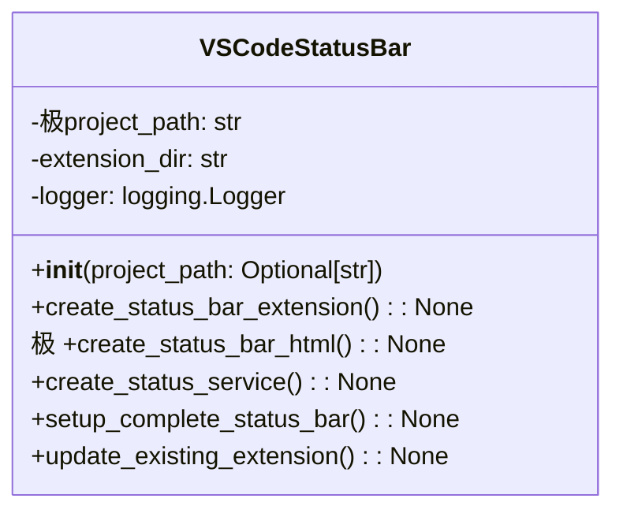

# مستندات ماژول VS Code Status Bar

## بررسی کلی
ماژول `vscode_extension_status_bar.py` با Visual Studio Code یکپارچه می‌شود تا به‌روزرسانی‌های وضعیت مدیریت پروژه بلادرنگ را در نوار وضعیت فراهم کند. این ماژول به کاربران امکان می‌دهد تا وضعیت سیستم AutoProjectManagement را مستقیماً از رابط VS Code نظارت کنند.

## معماری

### ساختار کلاس

## عملکرد تفصیلی

### کلاس VSCodeStatusBar

#### مقداردهی اولیه
**متد**: `__init__(project_path: Optional[str] = None)`

کلاس VSCodeStatusBar را با مسیر پروژه مقداردهی اولیه می‌کند و لاگ‌گیری را راه‌اندازی می‌کند.

**پارامترها**:
- `project_path`: مسیر اختیاری به دایرکتوری پروژه.

#### ایجاد افزونه نوار وضعیت
**متد**: `极create_status_bar_extension() -> None`

یک افزونه VS Code با پشتیبانی نوار وضعیت ایجاد می‌کند، شامل:
- عملکرد JavaScript برای مدیریت نوار وضعیت.
- دستورات برای راه‌اندازی، توقف، تازه‌سازی وضعیت و نمایش جزئیات پروژه.

#### ایجاد HTML نوار وضعیت
**متد**: `create_status_bar_html() -> None`

یک فایل HTML برای رابط وب ایجاد می‌کند که وضعیت مدیریت پروژه را نمایش می‌دهد، شامل:
- به‌روزرسانی‌های وضعیت
- نوارهای پیشرفت
- زمان‌مهرهای آخرین به‌روزرسانی

#### ایجاد سرویس وضعیت
**متد**: `create_status_service() -> None`

یک سرویس Python ایجاد می‌کند که به‌روزرسانی‌های وضعیت بلادرنگ برای افزونه VS Code و رابط وب فراهم می‌کند.

#### راه‌اندازی نوار وضعیت کامل
**متد**: `setup_complete_status极bar() -> None`

فرآیند راه‌اندازی کامل برای سیستم نوار وضعیت را هماهنگ می‌کند، شامل:
- ایجاد افزونه VS Code
