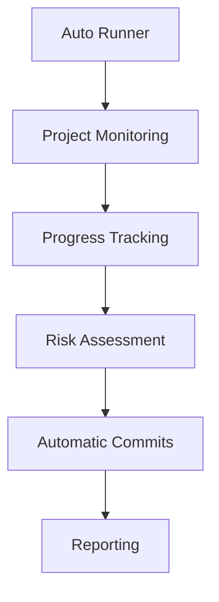

# Core Application Documentation

## Overview
Core Application modules provide the fundamental functionality for the AutoProjectManagement system, including automatic project management, command-line interfaces, and system orchestration.

## Modules
### 1. Auto Runner
The `auto_runner.py` module serves as the main orchestrator for automatic project management activities.

**Key Features:**
- Continuous project monitoring
- Automatic git commits
- Progress tracking and reporting
- Risk assessment and mitigation
- Resource allocation optimization

**Documentation:** [auto_runner.md](./auto_runner.md)

### 2. CLI Dashboard
The `cli_dashboard.py` module provides command-line interface dashboard functionality.

**Key Features:**
- Interactive command-line interface
- Real-time project status display
- Progress visualization
- Resource allocation monitoring

### 3. CLI Docker
The `cli_docker.py` module handles Docker container management through command-line interface.

**Key Features:**
- Docker container orchestration
- Container status monitoring
- Docker compose integration
- Container logging and debugging

### 4. Main CLI
The `cli.py` module provides the main command-line interface for the AutoProjectManagement system.

**Key Features:**
- Command parsing and execution
- User interaction handling
- System configuration management
- Help and documentation display

### 5. Demo Persistence
The `demo_persistence.py` module handles data persistence for demonstration purposes.

**Key Features:**
- Data storage and retrieval
- Demonstration data management
- Persistence layer abstraction
- Data backup and recovery

### 6. Docker Setup
The `docker_setup.py` module manages Docker environment setup and configuration.

**Key Features:**
- Docker environment initialization
- Container configuration
- Network setup
- Volume management

### 7. Setup Auto Environment
The `setup_auto_environment.py` module automates the setup of the AutoProjectManagement environment.

**Key Features:**
- Environment configuration
- Dependency installation
- System initialization
- Configuration validation

### 8. VS Code Extension Status Bar
The `vscode_extension_status_bar.py` module provides status bar functionality for VS Code extensions.

**Key Features:**
- Real-time status display
- Extension integration
- User interface elements
- Status updates and notifications

### 9. VS Code Extension
The `vscode_extension.py` module provides the main VS Code extension functionality.

**Key Features:**
- VS Code integration
- Extension lifecycle management
- User interface components
- Editor integration

## Architecture
### System Orchestration


### Command Line Interface


## Usage
### Auto Runner Usage
```python
from autoprojectmanagement.auto_runner import AutoRunner

runner = AutoRunner('/path/to/project')
runner.start()
```

### CLI Usage
```bash
python -m autoprojectmanagement.cli --help
```

## Error Handling
Core Application modules include comprehensive error handling for:
- File system access issues
- Network connectivity problems
- Configuration errors
- External tool integration failures

## Configuration
Modules can be configured through:
- Environment variables
- Configuration files
- Command line arguments
- Programmatic settings

## Benefits
- **Automation**: Reduces manual intervention in project management
- **Integration**: Works seamlessly with various tools and platforms
- **Reliability**: Provides consistent performance and error handling
- **Scalability**: Supports growing project needs and complexity

## Integration
Core Application modules integrate with:
- Git version control system
- Docker container platform
- VS Code development environment
- External APIs and services

## Conclusion
Core Application modules form the foundation of the AutoProjectManagement system, providing essential functionality for automated project management, command-line interaction, and system integration.

---
*Last updated: 2025-08-14*
