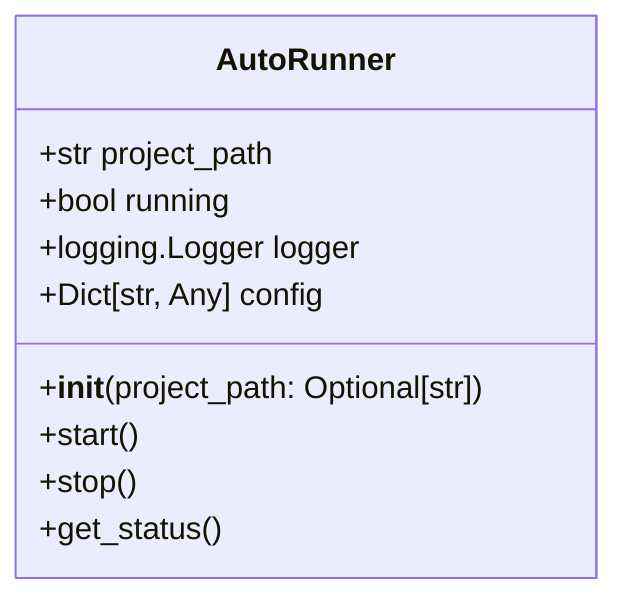
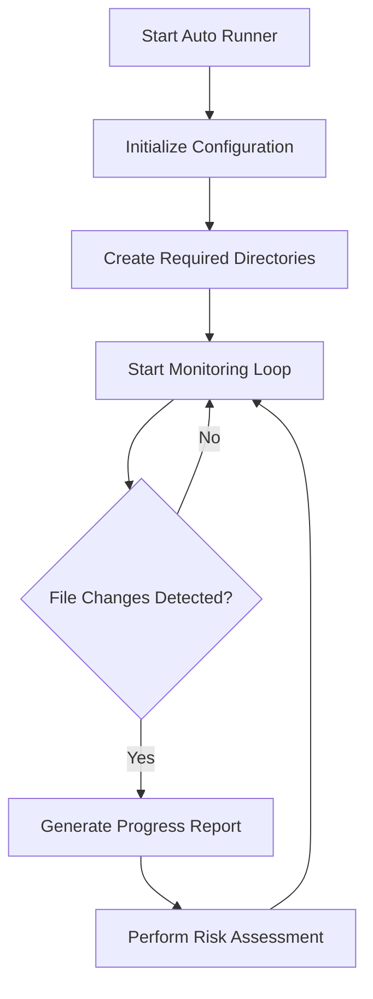

# Auto Runner Documentation

## Overview
The `auto_runner.py` module serves as the main orchestrator for the AutoProjectManagement system, providing continuous monitoring, automatic commits, progress tracking, and risk assessment without requiring manual user intervention.

## Class: AutoRunner
### Purpose
The `AutoRunner` class manages all automatic project management activities, including file monitoring, progress tracking, risk assessment, and automated reporting.

### Attributes
- **project_path**: Absolute path to the project directory
- **running**: Current running state of the system
- **logger**: Configured logger instance
- **config**: Runtime configuration loaded from config files
- **last_check_time**: Timestamp of last file system check
- **last_commit_time**: Timestamp of last automatic commit
- **last_report_time**: Timestamp of last report generation

### Methods
- **__init__(self, project_path: Optional[str] = None)**: Initializes the AutoRunner with comprehensive setup.
- **_setup_logging(self) -> logging.Logger**: Sets up comprehensive logging for the AutoRunner.
- **_load_configuration(self) -> None**: Loads configuration from files and environment variables.
- **_create_required_directories(self) -> None**: Creates all required directories for the system.
- **start(self) -> None**: Starts the automatic project management system.
- **stop(self) -> None**: Stops the automatic project management system gracefully.
- **get_status(self) -> Dict[str, Any]**: Gets comprehensive current status of the automatic management system.
- **_main_loop(self) -> None**: Main execution loop for automatic project management.
- **_check_file_changes(self) -> None**: Checks for changes in the project files.
- **_generate_progress_report(self) -> None**: Generates comprehensive progress report.
- **_perform_risk_assessment(self) -> None**: Performs risk assessment for the project.

## Key Features
- **Continuous Monitoring**: Monitors project files for changes and updates.
- **Automatic Commits**: Commits changes to the repository based on defined thresholds.
- **Progress Tracking**: Tracks project progress and generates reports.
- **Risk Assessment**: Evaluates project risks and suggests mitigation strategies.

## Diagrams
### UML Class Diagram


### BPMN Diagram


## Error Handling
The AutoRunner includes error handling for:
- File system access issues
- Network connectivity problems
- Configuration errors
- Logging failures

## Configuration
The system uses environment variables and configuration files to manage settings:
- **AUTO_CHECK_INTERVAL**: How often to check for changes (default: 300s)
- **AUTO_COMMIT_THRESHOLD**: Minimum changes for auto-commit (default: 5)
- **AUTO_REPORT_INTERVAL**: How often to generate reports (default: 3600s)

## Usage
### Command Line Usage
```bash
python -m autoprojectmanagement.auto_runner --path /path/to/project
```

### Programmatic Usage
```python
from autoprojectmanagement.auto_runner import AutoRunner

runner = AutoRunner('/path/to/project')
runner.start()
```

## Benefits
- **Automation**: Reduces manual intervention in project management
- **Efficiency**: Streamlines project monitoring and reporting
- **Integration**: Works seamlessly with Git for version control
- **Reliability**: Provides consistent project management without user input

## Conclusion
The Auto Runner is a critical component of the AutoProjectManagement system, enabling automated project management activities that enhance productivity and ensure project success.

---
*Last updated: 2025-08-14*
