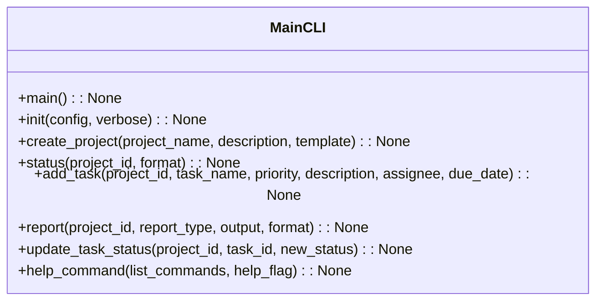
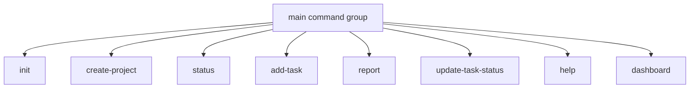

# CLI Module Documentation

## Overview
The `cli.py` module serves as the main command-line interface for the AutoProjectManagement system. It provides a comprehensive set of commands for project initialization, task management, progress tracking, and system administration using the Click framework.

## Architecture

### Command Structure


### Command Flow


## Detailed Functionality

### System Initialization

#### Initialize System
**Command**: `init(config: Optional[str], verbose: bool) -> None`

Initializes a new AutoProjectManagement system with all necessary configurations. This command:
- Sets up required directories and files
- Loads configuration from specified file or uses defaults
- Provides verbose output for detailed setup information
- Integrates with the project management system for initialization

**Parameters**:
- `config`: Path to custom configuration file
- `verbose`: Enable detailed output

**Usage**:
```bash
autoprojectmanagement init
autoprojectmanagement init --config custom_config.json --verbose
```

### Project Management

#### Create Project
**Command**: `create_project(project_name: str, description: Optional[str], template: Optional[str]) -> None`

Creates a new project with automated management capabilities. This command:
- Generates unique project ID
- Sets up project structure based on template
- Stores project metadata in the system
- Provides confirmation with project details

**Parameters**:
- `project_name`: Name of the project
- `description`: Optional project description
- `template`: Project template to use

**Usage**:
```bash
autoprojectmanagement create-project "Web Application"
autoprojectmanagement create-project "API Service" --description "RESTful API" --template python
```

#### Show Project Status
**Command**: `status(project_id: str, format: str) -> None`

Displays comprehensive project status and progress information. This command:
- Retrieves project details from the system
- Supports multiple output formats (JSON, Markdown, Table)
- Shows task completion statistics
- Provides project health information

**Parameters**:
- `project_id`: Project identifier
- `format`: Output format ("json", "markdown", "table")

**Usage**:
```bash
autoprojectmanagement status 12345
autoprojectmanagement status 12345 --format json
```

### Task Management

#### Add Task to Project
