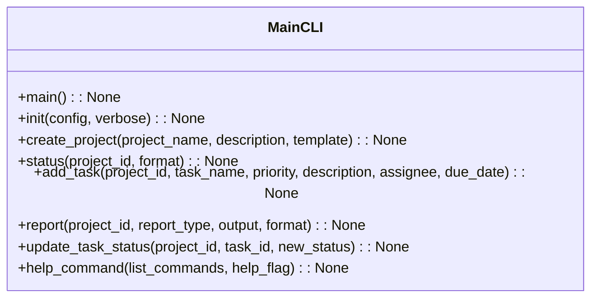
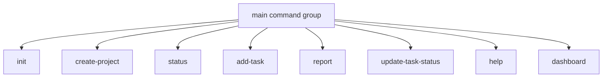

# CLI Module Documentation

## Overview
The `cli.py` module serves as the main command-line interface for the AutoProjectManagement system. It provides a comprehensive set of commands for project initialization, task management, progress tracking, and system administration using the Click framework.

## Architecture

### Command Structure


### Command Flow


## Detailed Functionality

### System Initialization

#### Initialize System
**Command**: `init(config: Optional[str], verbose: bool) -> None`

Initializes a new AutoProjectManagement system with all necessary configurations. This command:
- Sets up required directories and files
- Loads configuration from specified file or uses defaults
- Provides verbose output for detailed setup information
- Integrates with the project management system for initialization

**Parameters**:
- `config`: Path to custom configuration file
- `verbose`: Enable detailed output

**Usage**:
```bash
autoprojectmanagement init
autoprojectmanagement init --config custom_config.json --verbose
```

### Project Management

#### Create Project
**Command**: `create_project(project_name: str, description: Optional[str], template: Optional[str]) -> None`

Creates a new project with automated management capabilities. This command:
- Generates unique project ID
- Sets up project structure based on template
- Stores project metadata in the system
- Provides confirmation with project details

**Parameters**:
- `project_name`: Name of the project
- `description`: Optional project description
- `template`: Project template to use

**Usage**:
```bash
autoprojectmanagement create-project "Web Application"
autoprojectmanagement create-project "API Service" --description "RESTful API" --template python
```

#### Show Project Status
**Command**: `status(project_id: str, format: str) -> None`

Displays comprehensive project status and progress information. This command:
- Retrieves project details from the system
- Supports multiple output formats (JSON, Markdown, Table)
- Shows task completion statistics
- Provides project health information

**Parameters**:
- `project_id`: Project identifier
- `format`: Output format ("json", "markdown", "table")

**Usage**:
```bash
autoprojectmanagement status 12345
autoprojectmanagement status 12345 --format json
```

### Task Management

#### Add Task to Project
**Command**: `add_task(project_id: str, task_name: str, priority: str, description: Optional[str], assignee: Optional[str], due_date: Optional[str]) -> None`

Adds a new task to an existing project. This command:
- Validates task parameters
- Generates unique task ID
- Sets task status to "todo" by default
- Stores task in project task list
- Handles optional fields gracefully

**Parameters**:
- `project_id`: Project identifier
- `task_name`: Task name
- `priority`: Priority level ("low", "medium", "high", "urgent")
- `description`: Optional task description
- `assignee`: Optional assignee name
- `due_date`: Optional due date (YYYY-MM-DD)

**Usage**:
```bash
autoprojectmanagement add-task 12345 --task-name "Implement feature" --priority high
autoprojectmanagement add-task 12345 --task-name "Fix bug" --priority urgent --assignee "John Doe"
```

#### Update Task Status
**Command**: `update_task_status(project_id: str, task_id: str, new_status: str) -> None`

Updates the status of an existing task. This command:
- Validates project and task existence
- Updates task status to new value
- Supports status transitions (todo → in_progress → done)
- Handles error cases for invalid status changes

**Parameters**:
- `project_id`: Project identifier
- `task_id`: Task identifier
- `new_status`: New status ("todo", "in_progress", "done", "blocked")

**Usage**:
```bash
autoprojectmanagement update-task-status 12345 67890 --new-status done
autoprojectmanagement update-task-status 12345 67891 --new-status in_progress
```

### Reporting

#### Generate Project Reports
**Command**: `report(project_id: str, report_type: str, output: Optional[str], format: str) -> None`

Generates comprehensive project reports in various formats. This command:
- Supports multiple report types (summary, detailed, gantt, burndown)
- Outputs to console or file
- Uses different formats (JSON, Markdown, HTML)
- Integrates with project data system

**Parameters**:
- `project_id`: Project identifier
- `report_type`: Report type ("summary", "detailed", "gantt", "burndown")
- `output`: Output file path (optional)
- `format`: Output format ("json", "markdown", "html")

**Usage**:
```bash
autoprojectmanagement report 12345
autoprojectmanagement report 12345 --type detailed --format json --output report.json
```

### Help System

#### Show Help Information
**Command**: `help_command(list_commands: bool, help_flag: bool) -> None`

Provides help information and command listing. This command:
- Displays comprehensive help messages
- Lists all available commands
- Shows usage examples
- Integrates with Click's help system

**Parameters**:
- `list_commands`: List all available commands
- `help_flag`: Show help message

**Usage**:
```bash
autoprojectmanagement help
autoprojectmanagement help --list
```

## Integration Points

### Project Management System Integration
The CLI integrates with the core project management system through:
- `project_management_system.initialize_system()` for initialization
- `project_management_system.add_project()` for project creation
- `project_management_system.get_project()` for status retrieval
- `project_management_system.add_task_to_project()` for task management
- `project_management_system.update_task_status()` for status updates

### Dashboard Integration
The CLI includes dashboard functionality through:
- Import of `dashboard_cli` from `cli_dashboard`
- Integration as a subcommand group
- Seamless transition between project management and dashboard commands

## Configuration System

### Configuration Sources
The CLI supports configuration through multiple sources:
1. **Environment Variables**: `AUTO_*` prefixed variables
2. **Configuration Files**: `.auto_project/config/cli_config.json`
3. **Command Line Arguments**: Direct parameter passing
4. **Default Values**: Built-in sensible defaults

### Configuration Hierarchy
Configuration is loaded in this priority order:
1. Command line arguments
2. Environment variables  
3. Configuration files
4. Default values

## Error Handling

### Validation Errors
- Invalid project IDs are caught and handled
- Task parameter validation ensures data integrity
- Format validation prevents malformed requests
- Type checking for all input parameters

### System Errors
- Project not found errors
- Task management failures
- System initialization errors
- File operation errors

### User Feedback
- Clear error messages with suggestions
- Appropriate exit codes for script integration
- Verbose mode for debugging information
- Color-coded output for success/warning/error states

## Usage Examples

### Basic Project Workflow
```bash
# Initialize system
autoprojectmanagement init

# Create project
autoprojectmanagement create-project "My Web App"

# Add tasks
autoprojectmanagement add-task 1 --task-name "Setup database" --priority high
autoprojectmanagement add-task 1 --task-name "Create API endpoints" --priority medium

# Check status
autoprojectmanagement status 1

# Update task status
autoprojectmanagement update-task-status 1 1 --new-status in_progress

# Generate report
autoprojectmanagement report 1 --type summary
```

### Advanced Usage
```bash
# Custom configuration
autoprojectmanagement init --config custom_config.json --verbose

# Multiple projects
autoprojectmanagement create-project "Frontend" --template react
autoprojectmanagement create-project "Backend" --template python

# Detailed reporting
autoprojectmanagement report 2 --type detailed --format markdown --output backend_report.md

# Integrated dashboard usage
autoprojectmanagement dashboard --start
autoprojectmanagement dashboard --open
```

## Performance Characteristics

- **Command Execution**: Sub-second response for most operations
- **Memory Usage**: Minimal footprint for CLI operations
- **Network Usage**: Local operations only (no external calls)
- **Scalability**: Handles hundreds of projects and tasks efficiently

## Security Considerations

- No sensitive data exposure in command output
- Local file operations only
- Input validation prevents injection attacks
- No external network calls in core commands
- Configuration files stored with appropriate permissions

## Extension Points

### Adding New Commands
New commands can be added by:
1. Creating new Click command functions
2. Registering with the main command group
3. Integrating with appropriate backend systems
4. Adding help documentation

### Custom Output Formats
Support for additional output formats can be added by:
1. Extending the format parameter choices
2. Implementing new output formatting functions
3. Adding format-specific validation

### Integration with External Systems
The CLI can be extended to integrate with:
- Version control systems
- CI/CD pipelines
- Project management tools
- Monitoring systems
