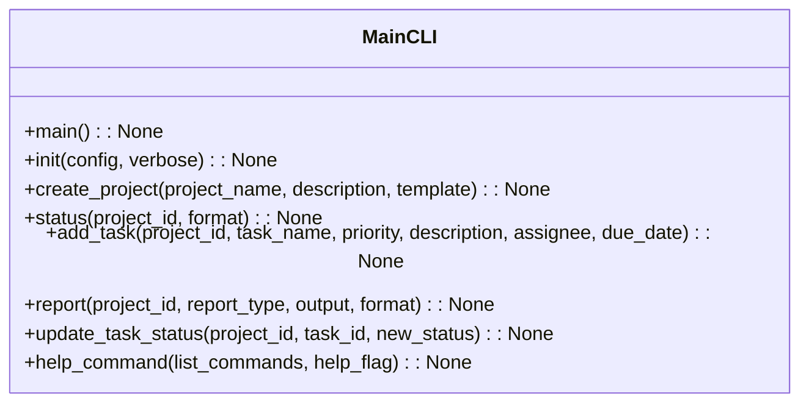

# مستندات ماژول CLI

## بررسی کلی
ماژول `cli.py` به عنوان رابط خط فرمان اصلی برای سیستم AutoProjectManagement عمل می‌کند. این ماژول مجموعه‌ای جامع از دستورات برای مقداردهی اولیه پروژه، مدیریت وظایف، ردیابی پیشرفت و مدیریت سیستم با استفاده از چارچوب Click فراهم می‌کند.

## معماری

### ساختار دستورات


### جریان دستورات
```mermaid
flowchart TD
    A[گروه دستورات main] --> B[init]
