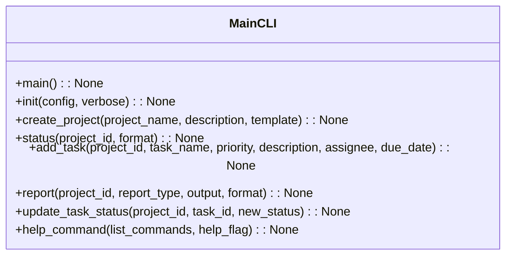
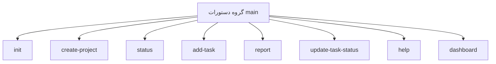

# مستندات ماژول CLI

## بررسی کلی
ماژول `cli.py` به عنوان رابط خط فرمان اصلی برای سیستم AutoProjectManagement عمل می‌کند. این ماژول مجموعه‌ای جامع از دستورات برای مقداردهی اولیه پروژه، مدیریت وظایف، ردیابی پیشرفت و مدیریت سیستم با استفاده از چارچوب Click فراهم می‌کند.

## معماری

### ساختار دستورات


### جریان دستورات


## عملکرد تفصیلی

### مقداردهی اولیه سیستم

#### مقداردهی اولیه سیستم
**دستور**: `init(config: Optional[str], verbose: bool) -> None`

یک سیستم AutoProjectManagement جدید را با تمام پیکربندی‌های لازم مقداردهی اولیه می‌کند. این دستور:
- دایرکتوری‌ها و فایل‌های مورد نیاز را راه‌اندازی می‌کند
- پیکربندی را از فایل مشخص شده بارگذاری می‌کند یا از پیش‌فرض‌ها استفاده می‌کند
- خروجی تفصیلی برای اطلاعات راه‌اندازی فراهم می‌کند
- با سیستم مدیریت پروژه برای مقداردهی اولیه یکپارچه می‌شود

**پارامترها**:
- `config`: مسیر فایل پیکربندی سفارشی
- `verbose`: فعال کردن خروجی تفصیلی

**استفاده**:
```bash
autoprojectmanagement init
autoprojectmanagement init --config custom_config.json --verbose
```

### مدیریت پروژه

#### ایجاد پروژه
**دستور**: `create_project(project_name: str, description: Optional[str], template: Optional[str]) -> None`

یک پروژه جدید با قابلیت‌های مدیریت خودکار ایجاد می‌کند. این دستور:
- شناسه پروژه منحصر به فرد تولید می‌کند
- ساختار پروژه را بر اساس قالب راه‌اندازی می‌کند
- ابرداده پروژه را در سیستم ذخیره می‌کند
- تأیید با جزئیات پروژه فراهم می‌کند

**پارامترها**:
- `project_name`: نام پروژه
- `description`: توضیحات اختیاری پروژه
- `template`: قالب پروژه برای استفاده

**استفاده**:
```bash
autoprojectmanagement create-project "Web Application"
autoprojectmanagement create-project "API Service" --description "RESTful API" --template python
```

#### نمایش وضعیت پروژه
**دستور**: `status(project_id: str, format: str) -> None`

اطلاعات وضعیت و پیشرفت جامع پروژه را نمایش می‌دهد. این دستور:
- جزئیات پروژه را از سیستم بازیابی می‌کند
- از چندین فرمت خروجی پشتیبانی می‌کند (JSON, Markdown, Table)
- آمار تکمیل وظایف را نشان می‌دهد
- اطلاعات سلامت پروژه را فراهم می‌کند

**پارامترها**:
- `project_id`: شناسه پروژه
- `format`: فرمت خروجی ("json", "markdown", "table")

**استفاده**:
```bash
autoprojectmanagement status 12345
autoprojectmanagement status 12345 --format json
```

### مدیریت وظایف

#### افزودن وظیفه به پروژه
**دستور**: `add_task(project_id: str, task_name: str, priority: str, description: Optional[str], assignee: Optional[str], due_date: Optional[str]) -> None`

یک وظیفه جدید به یک پروژه موجود اضافه می‌کند. این دستور:
- پارامترهای وظیفه را اعتبارسنجی می‌کند
- شناسه وظیفه منحصر به فرد تولید می‌کند
- وضعیت وظیفه را به طور پیش‌فرض روی "todo" تنظیم می‌کند
- وظیفه را در لیست وظایف پروژه ذخیره می‌کند
- فیلدهای اختیاری را به صورت گرانولار مدیریت می‌کند

**پارامترها**:
- `project_id`: شناسه پروژه
- `task_name`: نام وظیفه
- `priority`: سطح اولویت ("low", "medium", "high", "urgent")
- `description`: توضیحات اختیاری وظیفه
- `assignee`: نام اختصاص‌دهنده اختیاری
- `due_date`: تاریخ سررسید اختیاری (YYYY-MM-DD)

**استفاده**:
```bash
autoprojectmanagement add-task 12345 --task-name "Implement feature" --priority high
autoprojectmanagement add-task 12345 --task-name "Fix bug" --priority urgent --assignee "John Doe"
```

#### به‌روزرسانی وضعیت وظیفه
**دستور**: `update_task_status(project_id: str, task_id: str, new_status: str) -> None`

وضعیت یک وظیفه موجود را به‌روزرسانی می‌کند. این دستور:
- وجود پروژه و وظیفه را اعتبارسنجی می‌کند
- وضعیت وظیفه را به مقدار جدید به‌روزرسانی می‌کند
- از انتقال وضعیت پشتیبانی می‌کند (todo → in_progress → done)
- موارد خطا برای تغییرات وضعیت نامعتبر را مدیریت می‌کند

**پارامترها**:
- `project_id`: شناسه پروژه
- `task_id`: شناسه وظیفه
- `new_status`: وضعیت جدید ("todo", "in_progress", "done", "blocked")

**استفاده**:
```bash
autoprojectmanagement update-task-status 12345 67890 --new-status done
autoprojectmanagement update-task-status 12345 67891 --new-status in_progress
```

### گزارش‌دهی

#### تولید گزارش‌های پروژه
**دستور**: `report(project_id: str, report_type: str, output: Optional[str], format: str) -> None`

گزارش‌های جامع پروژه را در فرمت‌های مختلف تولید می‌کند. این دستور:
- از چندین نوع گزارش پشتیبانی می‌کند (خلاصه, تفصیلی, گانت, burndown)
- به کنسول یا فایل خروجی می‌دهد
- از فرمت‌های مختلف استفاده می‌کند (JSON, Markdown, HTML)
- با سیستم داده پروژه یکپارچه می‌شود

**پارامترها**:
- `project_id`: شناسه پروژه
- `report_type`: نوع گزارش ("summary", "detailed", "gantt", "burndown")
- `output`: مسیر فایل خروجی (اختیاری)
- `format`: فرمت خروجی ("json", "markdown", "html")

**استفاده**:
```bash
autoprojectmanagement report 12345
autoprojectmanagement report 12345 --type detailed --format json --output report.json
```

### سیستم راهنما

#### نمایش اطلاعات راهنما
**دستور**: `help_command(list_commands: bool, help_flag: bool) -> None`

اطلاعات راهنما و لیست دستورات را فراهم می‌کند. این دستور:
- پیام‌های راهنمای جامع نمایش می‌دهد
- تمام دستورات موجود را لیست می‌کند
- مثال‌های استفاده نشان می‌دهد
- با سیستم راهنمای Click یکپارچه می‌شود

**پارامترها**:
- `list_commands`: لیست تمام دستورات موجود
- `help_flag`: نمایش پیام راهنما

**استفاده**:
```bash
autoprojectmanagement help
autoprojectmanagement help --list
```

## نقاط یکپارچه‌سازی

### یکپارچه‌سازی با سیستم مدیریت پروژه
CLI با سیستم مدیریت پروژه اصلی از طریق موارد زیر یکپارچه می‌شود:
- `project_management_system.initialize_system()` برای مقداردهی اولیه
- `project_management_system.add_project()` برای ایجاد پروژه
- `project_management_system.get_project()` برای بازیابی وضعیت
- `project_management_system.add_task_to_project()` برای مدیریت وظایف
- `project_management_system.update_task_status()` برای به‌روزرسانی وضعیت

### یکپارچه‌سازی داشبورد
CLI شامل عملکرد داشبورد از طریق موارد زیر است:
- وارد کردن `dashboard_cli` از `cli_dashboard`
- یکپارچه‌سازی به عنوان گروه زیردستورات
- انتقال یکپارچه بین دستورات مدیریت پروژه و داشبورد

## سیستم پیکربندی

### منابع پیکربندی
CLI از پیکربندی از طریق چندین منبع پشتیبانی می‌کند:
1. **متغیرهای محیطی**: متغیرهای پیشونددار `AUTO_*`
