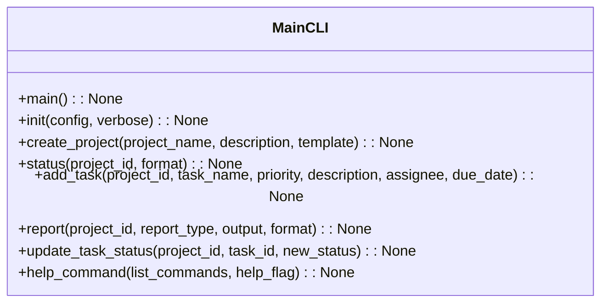
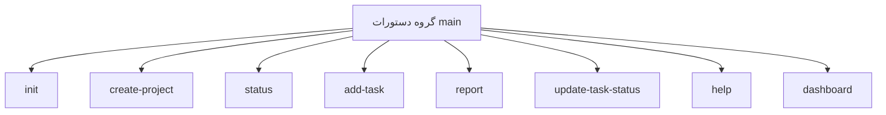

# مستندات ماژول CLI

## بررسی کلی
ماژول `cli.py` به عنوان رابط خط فرمان اصلی برای سیستم AutoProjectManagement عمل می‌کند. این ماژول مجموعه‌ای جامع از دستورات برای مقداردهی اولیه پروژه، مدیریت وظایف، ردیابی پیشرفت و مدیریت سیستم با استفاده از چارچوب Click فراهم می‌کند.

## معماری

### ساختار دستورات


### جریان دستورات


## عملکرد تفصیلی

### مقداردهی اولیه سیستم

#### مقداردهی اولیه سیستم
**دستور**: `init(config: Optional[str], verbose: bool) -> None`

یک سیستم AutoProjectManagement جدید را با تمام پیکربندی‌های لازم مقداردهی اولیه می‌کند. این دستور:
- دایرکتوری‌ها و فایل‌های مورد نیاز را راه‌اندازی می‌کند
- پیکربندی را از فایل مشخص شده بارگذاری می‌کند یا از پیش‌فرض‌ها استفاده می‌کند
- خروجی تفصیلی برای اطلاعات راه‌اندازی فراهم می‌کند
- با سیستم مدیریت پروژه برای مقداردهی اولیه یکپارچه می‌شود

**پارامترها**:
- `config`: مسیر فایل پیکربندی سفارشی
- `verbose`: فعال کردن خروجی تفصیلی

**استفاده**:
```bash
autoprojectmanagement init
autoprojectmanagement init --config custom_config.json --verbose
```

### مدیریت پروژه

#### ایجاد پروژه
**دستور**: `create_project(project_name: str, description: Optional[str], template: Optional[str]) -> None`

یک پروژه جدید با قابلیت‌های مدیریت خودکار ایجاد می‌کند. این دستور:
- شناسه پروژه منحصر به فرد تولید می‌کند
- ساختار پروژه را بر اساس قالب راه‌اندازی می‌کند
