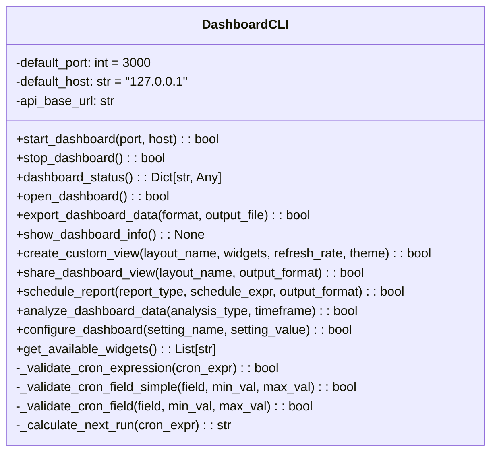
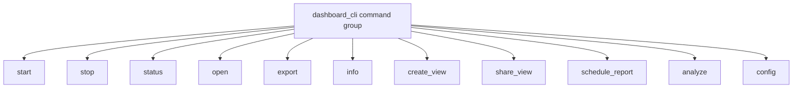

# CLI Dashboard Module Documentation

## Overview
The `cli_dashboard.py` module provides a comprehensive command-line interface for managing the AutoProjectManagement dashboard system. This module enables users to start, stop, monitor, and configure the dashboard through intuitive CLI commands built with the Click framework.

## Architecture

### Class Structure

### Command Structure

## Detailed Functionality

### Dashboard Server Management

#### Start Dashboard Server
**Method**: `start_dashboard(port: Optional[int] = None, host: Optional[str] = None) -> bool`

Starts the dashboard server with specified port and host configuration. This method:
- Validates port and host parameters
- Initializes the FastAPI server (simulated in current implementation)
- Provides real-time progress feedback using Rich progress bars
- Handles graceful shutdown on keyboard interrupt

**Parameters**:
- `port`: Port number (default: 3000)
- `host`: Host address (default: "127.0.0.1")

**Returns**: Boolean indicating success

#### Stop Dashboard Server
**Method**: `stop_dashboard() -> bool`

Gracefully stops the running dashboard server. This method:
- Sends shutdown signals to the server
- Provides confirmation of successful shutdown
- Handles any cleanup operations

**Returns**: Boolean indicating success

### Dashboard Monitoring

#### Get Dashboard Status
**Method**: `dashboard_status() -> Dict[str, Any]`

Retrieves comprehensive status information about the dashboard server. This method:
- Checks server health via API endpoints
- Returns detailed status information including:
  - Server status (running/stopped/error)
  - Health check results
  - Connection information
  - Error details if applicable

**Returns**: Dictionary containing status information

#### Show Dashboard Information
**Method**: `show_dashboard_info() -> None`

Displays formatted dashboard information using Rich tables. This method:
- Retrieves current status
- Formats information in a user-friendly table
- Includes host, port, URL, and health information
- Handles error cases gracefully

### Browser Integration

#### Open Dashboard in Browser
**Method**: `open_dashboard() -> bool`

Opens the dashboard in the default web browser. This method:
- Checks if server is running before attempting to open
- Constructs the correct dashboard URL
- Uses system's default browser
- Provides error handling for browser opening failures

**Returns**: Boolean indicating success

### Data Export and Sharing

#### Export Dashboard Data
**Method**: `export_dashboard_data(format: str = "json", output_file: Optional[str] = None) -> bool`

Exports dashboard data to various file formats. This method:
- Supports multiple export formats: JSON, CSV, Markdown
- Fetches data from multiple API endpoints:
  - Dashboard overview
  - Metrics data
  - Alert information
- Handles file creation and formatting
- Provides timestamp-based default filenames

**Parameters**:
- `format`: Export format ("json", "csv", "markdown")
- `output_file`: Custom output file path

**Returns**: Boolean indicating success

#### Share Dashboard View
**Method**: `share_dashboard_view(layout_name: str, output_format: str = "json") -> bool`

Generates shareable export files for dashboard views. This method:
- Retrieves layout configuration from API
- Creates export files in specified format
- Uses timestamp-based filenames for versioning
- Supports JSON and Markdown formats

**Parameters**:
- `layout_name`: Name of the layout to share
- `output_format`: Export format ("json", "markdown")

**Returns**: Boolean indicating success

### Custom Views and Layouts

#### Create Custom View
**Method**: `create_custom_view(layout_name: str, widgets: Optional[List[str]] = None, refresh_rate: Optional[int] = None, theme: Optional[str] = None) -> bool`

Creates custom dashboard views with specific configurations. This method:
- Provides interactive widget selection if not specified
- Validates all input parameters
- Creates layout configuration
- Saves configuration via API
- Handles both programmatic and interactive usage

