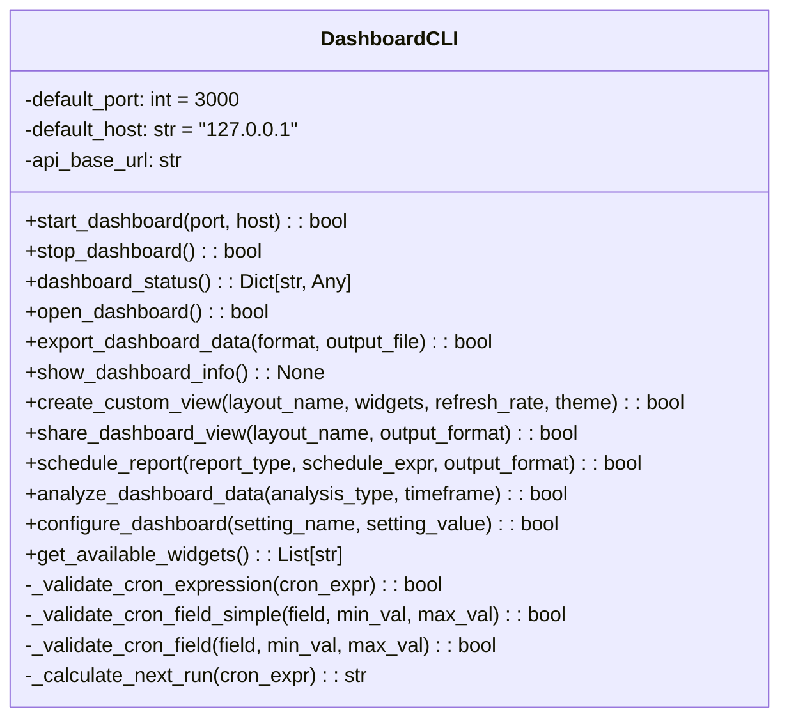
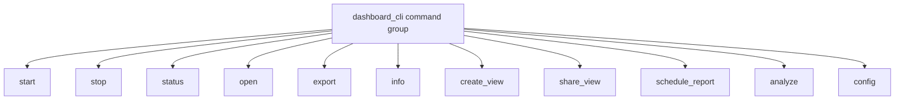

# CLI Dashboard Module Documentation

## Overview
The `cli_dashboard.py` module provides a comprehensive command-line interface for managing the AutoProjectManagement dashboard system. This module enables users to start, stop, monitor, and configure the dashboard through intuitive CLI commands built with the Click framework.

## Architecture

### Class Structure


### Command Structure


## Detailed Functionality

### Dashboard Server Management

#### Start Dashboard Server
**Method**: `start_dashboard(port: Optional[int] = None, host: Optional[str] = None) -> bool`

Starts the dashboard server with specified port and host configuration. This method:
- Validates port and host parameters
- Initializes the FastAPI server (simulated in current implementation)
- Provides real-time progress feedback using Rich progress bars
- Handles graceful shutdown on keyboard interrupt

**Parameters**:
- `port`: Port number (default: 3000)
- `host`: Host address (default: "127.0.0.1")

**Returns**: Boolean indicating success

#### Stop Dashboard Server
**Method**: `stop_dashboard() -> bool`

Gracefully stops the running dashboard server. This method:
- Sends shutdown signals to the server
- Provides confirmation of successful shutdown
- Handles any cleanup operations

**Returns**: Boolean indicating success

### Dashboard Monitoring

#### Get Dashboard Status
**Method**: `dashboard_status() -> Dict[str, Any]`

Retrieves comprehensive status information about the dashboard server. This method:
- Checks server health via API endpoints
- Returns detailed status information including:
  - Server status (running/stopped/error)
  - Health check results
  - Connection information
  - Error details if applicable

**Returns**: Dictionary containing status information

#### Show Dashboard Information
**Method**: `show_dashboard_info() -> None`

Displays formatted dashboard information using Rich tables. This method:
- Retrieves current status
- Formats information in a user-friendly table
- Includes host, port, URL, and health information
- Handles error cases gracefully

### Browser Integration

#### Open Dashboard in Browser
**Method**: `open_dashboard() -> bool`

Opens the dashboard in the default web browser. This method:
- Checks if server is running before attempting to open
- Constructs the correct dashboard URL
- Uses system's default browser
- Provides error handling for browser opening failures

**Returns**: Boolean indicating success

### Data Export and Sharing

#### Export Dashboard Data
**Method**: `export_dashboard_data(format: str = "json", output_file: Optional[str] = None) -> bool`

Exports dashboard data to various file formats. This method:
- Supports multiple export formats: JSON, CSV, Markdown
- Fetches data from multiple API endpoints:
  - Dashboard overview
  - Metrics data
  - Alert information
- Handles file creation and formatting
- Provides timestamp-based default filenames

**Parameters**:
- `format`: Export format ("json", "csv", "markdown")
- `output_file`: Custom output file path

**Returns**: Boolean indicating success

#### Share Dashboard View
**Method**: `share_dashboard_view(layout_name: str, output_format: str = "json") -> bool`

Generates shareable export files for dashboard views. This method:
- Retrieves layout configuration from API
- Creates export files in specified format
- Uses timestamp-based filenames for versioning
- Supports JSON and Markdown formats

**Parameters**:
- `layout_name`: Name of the layout to share
- `output_format`: Export format ("json", "markdown")

**Returns**: Boolean indicating success

### Custom Views and Layouts

#### Create Custom View
**Method**: `create_custom_view(layout_name: str, widgets: Optional[List[str]] = None, refresh_rate: Optional[int] = None, theme: Optional[str] = None) -> bool`

Creates custom dashboard views with specific configurations. This method:
- Provides interactive widget selection if not specified
- Validates all input parameters
- Creates layout configuration
- Saves configuration via API
- Handles both programmatic and interactive usage

**Parameters**:
- `layout_name`: Name for the custom layout
- `widgets`: List of widget IDs to include
- `refresh_rate`: Refresh rate in milliseconds
- `theme`: Theme name ("light" or "dark")

**Returns**: Boolean indicating success

### Automated Reporting

#### Schedule Automated Reports
**Method**: `schedule_report(report_type: str, schedule_expr: str, output_format: str = "markdown") -> bool`

Schedules automated dashboard reports using cron expressions. This method:
- Validates cron expression format
- Calculates next run time
- Saves schedule configuration to JSON file
- Supports multiple report types and formats
- Uses croniter library for scheduling calculations

**Parameters**:
- `report_type`: Type of report ("overview", "metrics", "health", "performance")
- `schedule_expr`: Cron expression for scheduling
- `output_format`: Output format ("markdown", "json")

**Returns**: Boolean indicating success

#### Analyze Dashboard Data
**Method**: `analyze_dashboard_data(analysis_type: str = "overview", timeframe: str = "24h") -> bool`

Performs data analysis and generates insights reports. This method:
- Fetches data from appropriate API endpoints
- Generates comprehensive analysis reports
- Supports multiple analysis types and timeframes
- Creates timestamped report files

**Parameters**:
- `analysis_type`: Type of analysis ("overview", "metrics", "health", "performance")
- `timeframe`: Analysis timeframe (e.g., "24h")

**Returns**: Boolean indicating success

### Configuration Management

#### Configure Dashboard Settings
**Method**: `configure_dashboard(setting_name: Optional[str] = None, setting_value: Optional[str] = None) -> bool`

Manages dashboard configuration settings. This method:
- Supports interactive configuration if no parameters provided
- Validates setting values against constraints
- Saves configuration to JSON file
- Handles various setting types (boolean, integer, string with choices)

**Parameters**:
- `setting_name`: Setting to configure
- `setting_value`: Value to set

**Returns**: Boolean indicating success

### Utility Methods

#### Get Available Widgets
**Method**: `get_available_widgets() -> List[str]`

Retrieves list of available widgets from API. This method:
- Fetches widget list from dashboard API
- Provides fallback list if API unavailable
- Returns list of widget identifiers

**Returns**: List of available widget names

#### Cron Expression Validation
**Methods**: 
- `_validate_cron_expression(cron_expr: str) -> bool`
- `_validate_cron_field_simple(field: str, min_val: int, max_val: int) -> bool`
- `_validate_cron_field(field: str, min_val: int, max_val: int) -> bool`

Validates cron expression format and field values. These methods:
- Support various cron expression formats (*, ranges, steps, lists)
- Validate field values against minimum/maximum constraints
- Handle complex cron patterns correctly

#### Calculate Next Run Time
**Method**: `_calculate_next_run(cron_expr: str) -> str`

Calculates next execution time from cron expression. This method:
- Uses croniter library for accurate calculations
- Provides fallback for missing croniter dependency
- Returns formatted timestamp string

## CLI Commands

### Command Structure
The module provides a Click command group with the following subcommands:

| Command | Description | Options |
|---------|-------------|---------|
| `start` | Start dashboard server | `--port`, `--host` |
| `stop` | Stop dashboard server | - |
| `status` | Show server status | - |
| `open` | Open in browser | - |
| `export` | Export data | `--format`, `--output` |
| `info` | Show detailed info | - |
| `create_view` | Create custom view | `--name`, `--widgets`, `--refresh-rate`, `--theme` |
| `share_view` | Share view | `--name`, `--format` |
| `schedule_report` | Schedule reports | `--type`, `--schedule`, `--format` |
| `analyze` | Analyze data | `--type`, `--timeframe` |
| `config` | Configure settings | `--setting`, `--value` |

## Usage Examples

### Basic Usage
```bash
# Start dashboard server
autoprojectmanagement dashboard --start --port 3000

# Open dashboard in browser
autoprojectmanagement dashboard --open

# Check status
autoprojectmanagement dashboard --status

# Export data
autoprojectmanagement dashboard --export --format json
```

### Advanced Usage
```bash
# Create custom view
autoprojectmanagement dashboard create-view --name "MyView" --widgets "health,progress" --refresh-rate 5000

# Schedule automated reports
autoprojectmanagement dashboard schedule-report --type overview --schedule "0 9 * * *"

# Configure settings
autoprojectmanagement dashboard config --setting refresh_rate --value 5000
```

## Error Handling

The module includes comprehensive error handling for:
- Network connectivity issues
- API endpoint failures
- Invalid user input
- File system operations
- Configuration validation errors

All methods return appropriate error messages and exit codes for integration with other tools.

## Dependencies

- **Click**: Command-line interface creation
- **Rich**: Terminal formatting and progress bars
- **Requests**: HTTP API communication
- **Croniter**: Cron expression parsing (optional)

## Configuration Files

- `JSonDataBase/OutPuts/dashboard_config.json`: Dashboard settings
- `JSonDataBase/OutPuts/dashboard_schedules.json`: Report schedules

## Performance Characteristics

- **Startup Time**: ~2 seconds (simulated)
- **API Response Time**: Dependent on backend performance
- **Memory Usage**: Minimal for CLI operations
- **Network Usage**: HTTP requests to dashboard API

## Security Considerations

- Uses localhost by default for security
- No authentication required for local dashboard
- Configuration files stored locally
- No sensitive data exposure in CLI output
