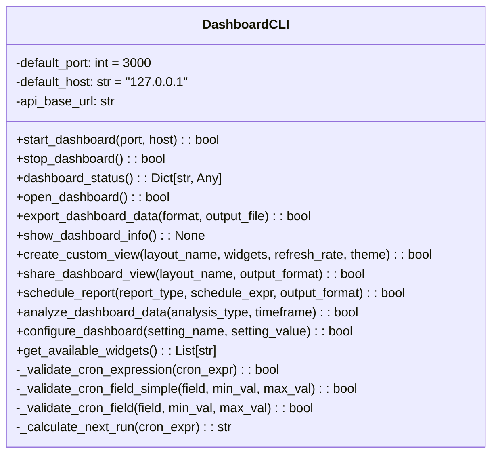
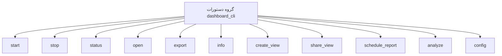

# مستندات ماژول CLI Dashboard

## بررسی کلی
ماژول `cli_dashboard.py` یک رابط خط فرمان جامع برای مدیریت سیستم داشبورد AutoProjectManagement فراهم می‌کند. این ماژول به کاربران امکان می‌دهد تا داشبورد را از طریق دستورات CLI شهودی که با چارچوب Click ساخته شده‌اند، راه‌اندازی، متوقف، نظارت و پیکربندی کنند.

## معماری

### ساختار کلاس

### ساختار دستورات

## عملکرد تفصیلی

### مدیریت سرور داشبورد

#### راه‌اندازی سرور داشبورد
**متد**: `start_dashboard(port: Optional[int] = None, host: Optional[str] = None) -> bool`

سرور داشبورد را با پیکربندی پورت و هاست مشخص راه‌اندازی می‌کند. این متد:
- پارامترهای پورت و هاست را اعتبارسنجی می‌کند
- سرور FastAPI را مقداردهی اولیه می‌کند (در پیاده‌سازی فعلی شبیه‌سازی شده)
- بازخورد پیشرفت بلادرنگ با استفاده از نوارهای پیشرفت Rich فراهم می‌کند
- خاموشی گرانولار در هنگام وقفه صفحه کلید را مدیریت می‌کند

**پارامترها**:
- `port`: شماره پورت (پیش‌فرض: 3000)
- `host`: آدرس هاست (پیش‌فرض: "127.0.0.1")

**برمی‌گرداند**: بولین نشان‌دهنده موفقیت

#### توقف سرور داشبورد
**متد**: `stop_dashboard() -> bool`

سرور داشبورد در حال اجرا را به صورت گرانولار متوقف می‌کند. این متد:
- سیگنال‌های خاموشی را به سرور ارسال می‌کند
- تأیید خاموشی موفق را فراهم می‌کند
- هرگونه عملیات پاکسازی را مدیریت می‌کند

**برمی‌گرداند**: بولین نشان‌دهنده موفقیت

### نظارت داشبورد

#### دریافت وضعیت داشبورد
**متد**: `dashboard_status() -> Dict[str, Any]`

اطلاعات وضعیت جامع درباره سرور داشبورد را بازیابی می‌کند. این متد:
