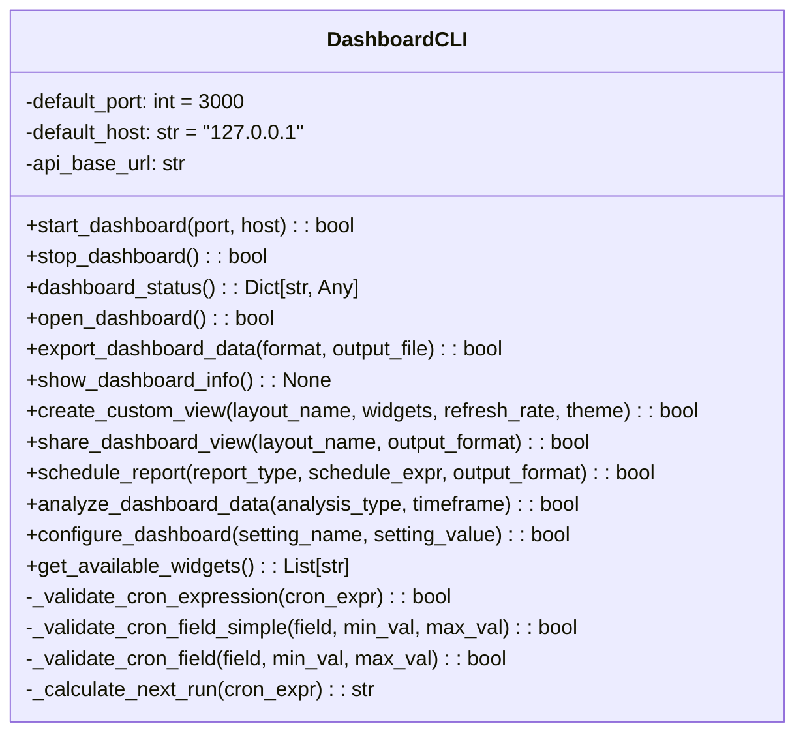
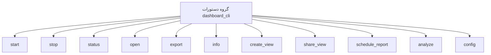

# مستندات ماژول CLI Dashboard

## بررسی کلی
ماژول `cli_dashboard.py` یک رابط خط فرمان جامع برای مدیریت سیستم داشبورد AutoProjectManagement فراهم می‌کند. این ماژول به کاربران امکان می‌دهد تا داشبورد را از طریق دستورات CLI شهودی که با چارچوب Click ساخته شده‌اند، راه‌اندازی، متوقف، نظارت و پیکربندی کنند.

## معماری

### ساختار کلاس


### ساختار دستورات


## عملکرد تفصیلی

### مدیریت سرور داشبورد

#### راه‌اندازی سرور داشبورد
**متد**: `start_dashboard(port: Optional[int] = None, host: Optional[str] = None) -> bool`

سرور داشبورد را با پیکربندی پورت و هاست مشخص راه‌اندازی می‌کند. این متد:
- پارامترهای پورت و هاست را اعتبارسنجی می‌کند
- سرور FastAPI را مقداردهی اولیه می‌کند (در پیاده‌سازی فعلی شبیه‌سازی شده)
- بازخورد پیشرفت بلادرنگ با استفاده از نوارهای پیشرفت Rich فراهم می‌کند
- خاموشی گرانولار در هنگام وقفه صفحه کلید را مدیریت می‌کند

**پارامترها**:
- `port`: شماره پورت (پیش‌فرض: 3000)
- `host`: آدرس هاست (پیش‌فرض: "127.0.0.1")

**برمی‌گرداند**: بولین نشان‌دهنده موفقیت

#### توقف سرور داشبورد
**متد**: `stop_dashboard() -> bool`

سرور داشبورد در حال اجرا را به صورت گرانولار متوقف می‌کند. این متد:
- سیگنال‌های خاموشی را به سرور ارسال می‌کند
- تأیید خاموشی موفق را فراهم می‌کند
- هرگونه عملیات پاکسازی را مدیریت می‌کند

**برمی‌گرداند**: بولین نشان‌دهنده موفقیت

### نظارت داشبورد

#### دریافت وضعیت داشبورد
**متد**: `dashboard_status() -> Dict[str, Any]`

اطلاعات وضعیت جامع درباره سرور داشبورد را بازیابی می‌کند. این متد:
- سلامت سرور را از طریق نقاط پایانی API بررسی می‌کند
- اطلاعات وضعیت تفصیلی شامل موارد زیر را برمی‌گرداند:
  - وضعیت سرور (در حال اجرا/متوقف/خطا)
  - نتایج بررسی سلامت
  - اطلاعات اتصال
  - جزئیات خطا در صورت وجود

**برمی‌گرداند**: دیکشنری حاوی اطلاعات وضعیت

#### نمایش اطلاعات داشبورد
**متد**: `show_dashboard_info() -> None`

اطلاعات داشبورد قالب‌بندی شده را با استفاده از جداول Rich نمایش می‌دهد. این متد:
- وضعیت فعلی را بازیابی می‌کند
- اطلاعات را در یک جدول کاربرپسند قالب‌بندی می‌کند
- اطلاعات هاست، پورت، URL و سلامت را شامل می‌شود
- موارد خطا را به صورت گرانولار مدیریت می‌کند

### یکپارچه‌سازی مرورگر

#### باز کردن داشبورد در مرورگر
**متد**: `open_dashboard() -> bool`

داشبورد را در مرورگر وب پیش‌فرض باز می‌کند. این متد:
- بررسی می‌کند که سرور در حال اجرا باشد قبل از تلاش برای باز کردن
- URL صحیح داشبورد را می‌سازد
- از مرورگر پیش‌فرض سیستم استفاده می‌کند
- مدیریت خطا برای شکست‌های باز کردن مرورگر فراهم می‌کند

**برمی‌گرداند**: بولین نشان‌دهنده موفقیت

### صادرات و اشتراک‌گذاری داده

#### صادرات داده‌های داشبورد
**متد**: `export_dashboard_data(format: str = "json", output_file: Optional[str] = None) -> bool`

داده‌های داشبورد را به فرمت‌های فایل مختلف صادر می‌کند. این متد:
- از چندین فرمت صادرات پشتیبانی می‌کند: JSON, CSV, Markdown
- داده را از چندین نقطه پایانی API بازیابی می‌کند:
  - نمای کلی داشبورد
  - داده‌های متریک
  - اطلاعات هشدار
- ایجاد فایل و قالب‌بندی را مدیریت می‌کند
- نام‌های فایل پیش‌فرض مبتنی بر زمان‌مهر فراهم می‌کند

**پارامترها**:
- `format`: فرمت صادرات ("json", "csv", "markdown")
- `output_file`: مسیر فایل خروجی سفارشی

**برمی‌گرداند**: بولین نشان‌دهنده موفقیت

#### اشتراک‌گذاری نمای داشبورد
**متد**: `share_dashboard_view(layout_name: str, output_format: str = "json") -> bool`

فایل‌های صادراتی قابل اشتراک برای نمای‌های داشبورد تولید می‌کند. این متد:
- پیکربندی طرح‌بندی را از API بازیابی می‌کند
- فایل‌های صادراتی را در فرمت مشخص شده ایجاد می‌کند
- از نام‌های فایل مبتنی بر زمان‌مهر برای نسخه‌گذاری استفاده می‌کند
- از فرمت‌های JSON و Markdown پشتیبانی می‌کند

**پارامترها**:
- `layout_name`: نام طرح‌بندی برای اشتراک‌گذاری
- `output_format`: فرمت صادرات ("json", "markdown")

**برمی‌گرداند**: بولین نشان‌دهنده موفقیت

### نمای‌ها و طرح‌بندی‌های سفارشی

#### ایجاد نمای سفارشی
**متد**: `create_custom_view(layout_name: str, widgets: Optional[List[str]] = None, refresh_rate: Optional[int] = None, theme: Optional[str] = None) -> bool`

نمای‌های داشبورد سفارشی با پیکربندی‌های خاص ایجاد می‌کند. این متد:
- انتخاب ویجت تعاملی را در صورت عدم مشخص شدن فراهم می‌کند
- تمام پارامترهای ورودی را اعتبارسنجی می‌کند
- پیکربندی طرح‌بندی ایجاد می‌کند
- پیکربندی را از طریق API ذخیره می‌کند
- استفاده برنامه‌نویسی و تعاملی را مدیریت می‌کند

**پارامترها**:
- `layout_name`: نام برای طرح‌بندی سفارشی
- `widgets`: لیست شناسه‌های ویجت برای شامل شدن
- `refresh_rate`: نرخ تازه‌سازی در میلی‌ثانیه
- `theme`: نام تم ("light" یا "dark")

**برمی‌گرداند**: بولین نشان‌دهنده موفقیت

### گزارش‌دهی خودکار

#### زمان‌بندی گزارش‌های خودکار
**متد**: `schedule_report(report_type: str, schedule_expr: str, output_format: str = "markdown") -> bool`

گزارش‌های داشبورد خودکار را با استفاده از عبارات cron زمان‌بندی می‌کند. این متد:
- فرمت عبارت cron را اعتبارسنجی می‌کند
- زمان اجرای بعدی را محاسبه می‌کند
- پیکربندی زمان‌بندی را در فایل JSON ذخیره می‌کند
- از چندین نوع گزارش و فرمت پشتیبانی می‌کند
- از کتابخانه croniter برای محاسبات زمان‌بندی استفاده می‌کند

**پارامترها**:
- `report_type`: نوع گزارش ("overview", "metrics", "health", "performance")
- `schedule_expr`: عبارت cron برای زمان‌بندی
- `output_format`: فرمت خروجی ("markdown", "json")

**برمی‌گرداند**: بولین نشان‌دهنده موفقیت

#### تحلیل داده‌های داشبورد
**متد**: `analyze_dashboard_data(analysis_type: str = "overview", timeframe: str = "24h") -> bool`

تحلیل داده انجام می‌دهد و گزارش‌های بینش تولید می‌کند. این متد:
- داده را از نقاط پایانی API مناسب بازیابی می‌کند
- گزارش‌های تحلیل جامع تولید می‌کند
- از چندین نوع تحلیل و بازه زمانی پشتیبانی می‌کند
- فایل‌های گزارش زمان‌مهر شده ایجاد می‌کند

**پارامترها**:
- `analysis_type`: نوع تحلیل ("overview", "metrics", "health", "performance")
- `timeframe`: بازه زمانی تحلیل (مثلاً "24h")

**برمی‌گرداند**: بولین نشان‌دهنده موفقیت

### مدیریت پیکربندی

#### پیکربندی تنظیمات داشبورد
**متد**: `configure_dashboard(setting_name: Optional[str] = None, setting_value: Optional[str] = None) -> bool`

تنظیمات پیکربندی داشبورد را مدیریت می‌کند. این متد:
- پیکربندی تعاملی را در صورت عدم ارائه پارامترها پشتیبانی می‌کند
- مقادیر تنظیمات را در برابر محدودیت‌ها اعتبارسنجی می‌کند
- پیکربندی را در فایل JSON ذخیره می‌کند
- انواع مختلف تنظیمات (بولین، عدد صحیح، رشته با انتخاب‌ها) را مدیریت می‌کند

**پارامترها**:
- `setting_name`: تنظیم برای پیکربندی
- `setting_value`: مقدار برای تنظیم

**برمی‌گرداند**: بولین نشان‌دهنده موفقیت

### متدهای کمکی

#### دریافت ویجت‌های موجود
**متد**: `get_available_widgets() -> List[str]`

لیست ویجت‌های موجود را از API بازیابی می‌کند. این متد:
- لیست ویجت را از API داشبورد بازیابی می‌کند
- لیست جایگزین در صورت عدم دسترسی API فراهم می‌کند
- لیست شناسه‌های ویجت را برمی‌گرداند

**برمی‌گرداند**: لیست نام‌های ویجت موجود

#### اعتبارسنجی عبارت Cron
**متدها**: 
- `_validate_cron_expression(cron_expr: str) -> bool`
- `_validate_cron_field_simple(field: str, min_val: int, max_val: int) -> bool`
- `_validate_cron_field(field: str, min_val: int, max_val: int) -> bool`

فرمت عبارت cron و مقادیر فیلد را اعتبارسنجی می‌کنند. این متدها:
- از فرمت‌های مختلف عبارت cron پشتیبانی می‌کنند (*, محدوده‌ها, مراحل, لیست‌ها)
- مقادیر فیلد را در برابر محدودیت‌های حداقل/حداکثر اعتبارسنجی می‌کنند
- الگوهای cron پیچیده را به درستی مدیریت می‌کنند

#### محاسبه زمان اجرای بعدی
**متد**: `_calculate_next_run(cron_expr: str) -> str`

زمان اجرای بعدی را از عبارت cron محاسبه می‌کند. این متد:
- از کتابخانه croniter برای محاسبات دقیق استفاده می‌کند
- جایگزین برای وابستگی croniter از دست رفته فراهم می‌کند
- رشته زمان‌مهر قالب‌بندی شده برمی‌گرداند

## دستورات CLI

### ساختار دستورات
ماژول یک گروه دستورات Click با زیردستورات زیر فراهم می‌کند:

| دستور | توضیحات | گزینه‌ها |
|-------|---------|---------|
| `start` | راه‌اندازی سرور داشبورد | `--port`, `--host` |
| `stop` | توقف سرور داشبورد | - |
| `status` | نمایش وضعیت سرور | - |
| `open` | باز کردن در مرورگر | - |
| `export` | صادرات داده | `--format`, `--output` |
| `info` | نمایش اطلاعات تفصیلی | - |
| `create_view` | ایجاد نمای سفارشی | `--name`, `--widgets`, `--refresh-rate`, `--theme` |
| `share_view` | اشتراک‌گذاری نمای | `--name`, `--format` |
| `schedule_report` | زمان‌بندی گزارش‌ها | `--type`, `--schedule`, `--format` |
| `analyze` | تحلیل داده | `--type`, `--timeframe` |
| `config` | پیکربندی تنظیمات | `--setting`, `--value` |

## مثال‌های استفاده

### استفاده پایه
```bash
# راه‌اندازی سرور داشبورد
autoprojectmanagement dashboard --start --port 3000

# باز کردن داشبورد در مرورگر
autoprojectmanagement dashboard --open

# بررسی وضعیت
autoprojectmanagement dashboard --status

# صادرات داده
autoprojectmanagement dashboard --export --format json
```

### استفاده پیشرفته
```bash
# ایجاد نمای سفارشی
