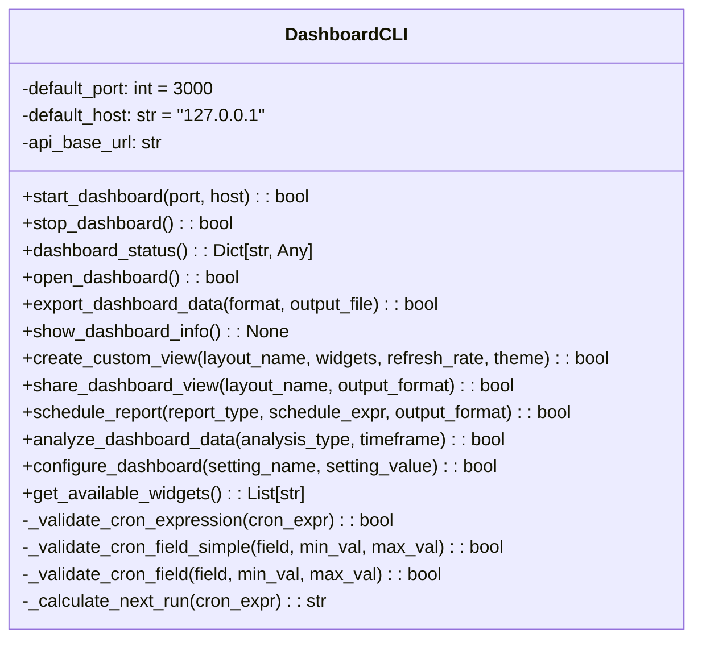
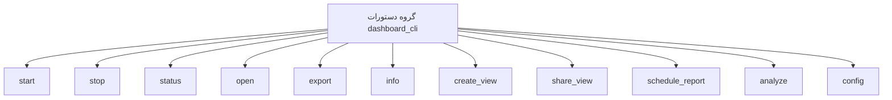

# مستندات ماژول CLI Dashboard

## بررسی کلی
ماژول `cli_dashboard.py` یک رابط خط فرمان جامع برای مدیریت سیستم داشبورد AutoProjectManagement فراهم می‌کند. این ماژول به کاربران امکان می‌دهد تا داشبورد را از طریق دستورات CLI شهودی که با چارچوب Click ساخته شده‌اند، راه‌اندازی، متوقف، نظارت و پیکربندی کنند.

## معماری

### ساختار کلاس

### ساختار دستورات

## عملکرد تفصیلی

### مدیریت سرور داشبورد

#### راه‌اندازی سرور داشبورد
**متد**: `start_dashboard(port: Optional[int] = None, host: Optional[str] = None) -> bool`

سرور داشبورد را با پیکربندی پورت و هاست مشخص راه‌اندازی می‌کند. این متد:
- پارامترهای پورت و هاست را اعتبارسنجی می‌کند
- سرور FastAPI را مقداردهی اولیه می‌کند (در پیاده‌سازی فعلی شبیه‌سازی شده)
- بازخورد پیشرفت بلادرنگ با استفاده از نوارهای پیشرفت Rich فراهم می‌کند
- خاموشی گرانولار در هنگام وقفه صفحه کلید را مدیریت می‌کند

**پارامترها**:
- `port`: شماره پورت (پیش‌فرض: 3000)
- `host`: آدرس هاست (پیش‌فرض: "127.0.0.1")

**برمی‌گرداند**: بولین نشان‌دهنده موفقیت

#### توقف سرور داشبورد
**متد**: `stop_dashboard() -> bool`

سرور داشبورد در حال اجرا را به صورت گرانولار متوقف می‌کند. این متد:
- سیگنال‌های خاموشی را به سرور ارسال می‌کند
- تأیید خاموشی موفق را فراهم می‌کند
- هرگونه عملیات پاکسازی را مدیریت می‌کند

**برمی‌گرداند**: بولین نشان‌دهنده موفقیت

### نظارت داشبورد

#### دریافت وضعیت داشبورد
**متد**: `dashboard_status() -> Dict[str, Any]`

اطلاعات وضعیت جامع درباره سرور داشبورد را بازیابی می‌کند. این متد:
- سلامت سرور را از طریق نقاط پایانی API بررسی می‌کند
- اطلاعات وضعیت تفصیلی شامل موارد زیر را برمی‌گرداند:
  - وضعیت سرور (در حال اجرا/متوقف/خطا)
  - نتایج بررسی سلامت
  - اطلاعات اتصال
  - جزئیات خطا در صورت وجود

**برمی‌گرداند**: دیکشنری حاوی اطلاعات وضعیت

#### نمایش اطلاعات داشبورد
**متد**: `show_dashboard_info() -> None`

اطلاعات داشبورد قالب‌بندی شده را با استفاده از جداول Rich نمایش می‌دهد. این متد:
- وضعیت فعلی را بازیابی می‌کند
- اطلاعات را در یک جدول کاربرپسند قالب‌بندی می‌کند
- اطلاعات هاست، پورت، URL و سلامت را شامل می‌شود
- موارد خطا را به صورت گرانولار مدیریت می‌کند

### یکپارچه‌سازی مرورگر

#### باز کردن داشبورد در مرورگر
**متد**: `open_dashboard() -> bool`

داشبورد را در مرورگر وب پیش‌فرض باز می‌کند. این متد:
- بررسی می‌کند که سرور در حال اجرا باشد قبل از تلاش برای باز کردن
- URL صحیح داشبورد را می‌سازد
- از مرورگر پیش‌فرض سیستم استفاده می‌کند
- مدیریت خطا برای شکست‌های باز کردن مرورگر فراهم می‌کند

**برمی‌گرداند**: بولین نشان‌دهنده موفقیت

### صادرات و اشتراک‌گذاری داده

#### صادرات داده‌های داشبورد
**متد**: `export_dashboard_data(format: str = "json", output_file: Optional[str] = None) -> bool`

داده‌های داشبورد را به فرمت‌های فایل مختلف صادر می‌کند. این متد:
- از چندین فرمت صادرات پشتیبانی می‌کند: JSON, CSV, Markdown
- داده را از چندین نقطه پایانی API بازیابی می‌کند:
  - نمای کلی داشبورد
  - داده‌های متریک
  - اطلاعات هشدار
- ایجاد فایل و قالب‌بندی را مدیریت می‌کند
- نام‌های فایل پیش‌فرض مبتنی بر زمان‌مهر فراهم می‌کند

**پارامترها**:
- `format`: فرمت صادرات ("json", "csv", "markdown")
- `output_file`: مسیر فایل خروجی سفارشی

**برمی‌گرداند**: بولین نشان‌دهنده موفقیت

#### اشتراک‌گذاری نمای داشبورد
**متد**: `share_dashboard_view(layout_name: str, output_format: str = "json") -> bool`

فایل‌های صادراتی قابل اشتراک برای نمای‌های داشبورد تولید می‌کند. این متد:
- پیکربندی طرح‌بندی را از API بازیابی می‌کند
- فایل‌های صادراتی را در فرمت مشخص شده ایجاد می‌کند
- از نام‌های فایل مبتنی بر زمان‌مهر برای نسخه‌گذاری استفاده می‌کند
- از فرمت‌های JSON و Markdown پشتیبانی می‌کند

**پارامترها**:
- `layout_name`: نام طرح‌بندی برای اشتراک‌گذاری
- `output_format`: فرمت صادرات ("json", "markdown")

**برمی‌گرداند**: بولین نشان‌دهنده موفقیت

### نمای‌ها و طرح‌بندی‌های سفارشی

#### ایجاد نمای سفارشی
**متد**: `create_custom_view(layout_name: str, widgets: Optional[List[str]] = None, refresh_rate: Optional[int] = None, theme: Optional[str] = None) -> bool`

